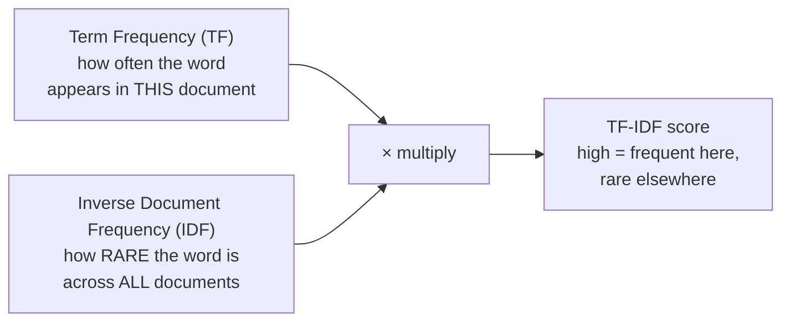

On the frequencies page we hit an uncomfortable wall: the most frequent words
are almost always the least informative. "the" tops every chart and tells you
nothing about what a document is *about*. We patched that by removing
stopwords, a blunt, all-or-nothing fix that deletes a fixed list of words and
hopes for the best. There is a more graceful idea, one of the most important in
all of classic text analysis: instead of *deleting* common words, **weight every
word by how distinctive it is.** That idea is **TF-IDF**.

<Figure
  slug="nlp-tf-idf-cutout"
  alt="A balance beam on a platform where a common repeated tile sits light and a rare distinctive tile weighs the pan down"
/>

## The intuition before the formula

Picture a small library of documents and ask which words best *characterize* one
particular document. A word is a good characterizer when it satisfies two
conditions at once:

1. It appears **often in this document**, it is clearly relevant here.
2. It appears in **few other documents**, it is distinctive, not generic.

A word that scores high on both is exactly what you would highlight if asked
"what makes this document different from the rest?" TF-IDF is just those two
conditions multiplied together.

**Term frequency** rewards a word for being common in the document at hand.
**Inverse document frequency** is the clever half: it *penalizes* a word for
showing up everywhere. "the" appears in every document, so its IDF is tiny and
its TF-IDF collapses toward zero, no stoplist required. A word like "comet",
appearing in one astronomy article and nowhere else, gets a large IDF and a high
score. The math discovers, on its own, that "the" is noise and "comet" is signal.

<Callout type="info" title="A true story: where IDF came from">
The "inverse document frequency" idea was introduced by the British
computer scientist **Karen Spärck Jones** in a 1972 paper on
"term specificity". Her insight, that a term's value for retrieval should
rise as the term gets rarer across a collection, became the weighting at the
heart of TF-IDF and classic information retrieval, and it still underpins
search engines decades later. It is a lovely example of a simple, durable idea
outliving the technology it was first built for.
</Callout>

## Step 1: term frequency

Term frequency is the count of a word in a document, usually divided by the
document's length so that long and short documents are comparable. Dividing by
length turns a raw count into a *proportion*, "what fraction of this document is
the word 'data'?"

<CodeBlock
  adapter="python"
  files={[
    {
      filename: "main.py",
      starterCode: `from collections import Counter

doc = "data drives decisions and data tells stories".split()

counts = Counter(doc)
length = len(doc)

print("Document length:", length)
for word in ["data", "stories", "and"]:
    tf = counts[word] / length
    print(f"  TF({word:9}) = {counts[word]}/{length} = {tf:.3f}")
`,
    },
  ]}
/>

"data" appears twice in seven words, so its term frequency is `2/7 ≈ 0.286`,
the highest in the document. So far this is just normalized counting, and on its
own it still over-rewards common words. The magic is in the second factor.

## Step 2: inverse document frequency

IDF measures rarity *across the whole corpus*. The recipe: count how many
documents contain the word (its **document frequency**), and take the log of the
total number of documents divided by that. The logarithm keeps the numbers from
exploding and is part of the standard definition.

$$\text{idf}(w) = \log\left(\frac{N}{\text{df}(w)}\right)$$

where `N` is the number of documents and `df(w)` is how many of them contain `w`.
The key behavior to internalize: a word in **all** `N` documents gets
`log(N/N) = log(1) = 0`, wiping it out, while a word in just **one** document
gets the largest IDF.

<CodeBlock
  adapter="python"
  files={[
    {
      filename: "main.py",
      starterCode: `import math

corpus = [
    "the cat sat on the mat".split(),
    "the dog ran in the park".split(),
    "the comet streaked across the sky".split(),
]
N = len(corpus)

def doc_freq(word):
    return sum(1 for doc in corpus if word in doc)

for word in ["the", "cat", "comet"]:
    df = doc_freq(word)
    idf = math.log(N / df)
    print(f"  IDF({word:6}) df={df}/{N}  ->  log({N}/{df}) = {idf:.3f}")
`,
    },
  ]}
/>

Read the output as a verdict on each word. "the" is in all three documents, so
its IDF is exactly `0`, it has been silenced automatically. "cat" and "comet"
each appear in only one document, so they earn the full IDF and will dominate the
final scores. We never wrote a stoplist; rarity did the filtering for us.

The same rule over a corpus of a thousand documents rather than three. Note
where the curve is steep: the gap between a word in 1 document and one in 10
is bigger than the gap between 100 and 1,000.

<Chart slug="idf-curve" />

<Callout type="warn" title="Why the logarithm, and the zero-division guard">
Without the `log`, a word seen in 1 of 10000 documents would get an IDF of
10000 and swamp everything else; the log compresses that to a sane `≈9.2`.
Two practical notes: a word that appears in *no* document would divide by zero,
so real implementations add **smoothing** (e.g., `log(N / (1 + df))` or
`log(N / df) + 1`); and different libraries use slightly different formulas.
The *shape*, common words near zero, rare words high, is what matters and is
the same across all variants.
</Callout>

## Step 3: putting them together

TF-IDF for a word in a document is simply `TF × IDF`. A high score means the word
is frequent *here* and rare *elsewhere*, the definition of a distinctive,
topic-revealing word. Let us compute the full table for our tiny corpus and watch
"the" vanish while the content words light up.

<CodeBlock
  adapter="python"
  files={[
    {
      filename: "main.py",
      starterCode: `import math
from collections import Counter

corpus = [
    "the cat sat on the mat".split(),
    "the dog ran in the park".split(),
    "the comet streaked across the sky".split(),
]
N = len(corpus)
vocab = sorted({w for doc in corpus for w in doc})

def idf(word):
    df = sum(1 for doc in corpus if word in doc)
    return math.log(N / df)

def tfidf(word, doc):
    tf = Counter(doc)[word] / len(doc)
    return tf * idf(word)

# Score every word in the FIRST document.
doc0 = corpus[0]
scores = {w: round(tfidf(w, doc0), 3) for w in set(doc0)}

print("Document:", " ".join(doc0))
for word, score in sorted(scores.items(), key=lambda kv: -kv[1]):
    print(f"  {word:6} {score}")
`,
    },
  ]}
/>

Look at the ranking. "cat", "sat", and "mat", the words unique to this document,
sit at the top. "the", despite being the *most frequent* word in the document,
scores **exactly zero**, because it appears everywhere and its IDF is zero. This
is TF-IDF's whole promise in one table: it surfaces what makes a document
distinctive, automatically, without you maintaining a list of words to ignore.

<Callout type="tip" title="TF-IDF is the bridge from counting to search">
Classic search engines rank results partly by TF-IDF: a page where your query
words are frequent *and* distinctive scores higher than one where they are
buried among common words. The same scores feed keyword extraction (the
top-scoring words are a document's keywords) and are a stronger feature than raw
counts when you turn text into vectors for a classifier. It is the natural
upgrade to the bag-of-words model you just built.
</Callout>

<MultipleChoice
  markdown={`In a corpus of 1000 documents, the word "the" appears in all 1000 and the word
"photosynthesis" appears in just 5. Using $\\text{idf}(w) = \\log(N/\\text{df}(w))$,
what happens to their IDF values, and why does that help?

- [o] "the" gets IDF = log(1000/1000) = 0 and "photosynthesis" gets IDF = log(1000/5) ≈ 5.3, so ubiquitous words are suppressed and rare, distinctive words are amplified
  > A word in every document has IDF zero and contributes nothing to any TF-IDF score, while a word in only a few documents gets a large IDF. This automatically down-weights stopword-like words and up-weights topical ones, no stoplist needed.
- IDF is undefined whenever a word appears in more than one document
  > IDF is well-defined for any word that appears in at least one document; it only risks division by zero when df is zero, which smoothing handles.
- Both get the same IDF, because IDF ignores how many documents a word is in
  > IDF depends directly on document frequency: "the" with df=1000 and "photosynthesis" with df=5 get very different values, which is the entire point of the measure.
- "photosynthesis" gets a lower IDF than "the" because it is rarer
  > The relationship is inverse: rarer words get *higher* IDF, not lower. "photosynthesis" (df=5) gets a much larger IDF than "the" (df=1000).

Rare words earn high IDF and common words earn near-zero IDF, that asymmetry is what makes TF-IDF work.`}
/>

## Your turn: compute TF-IDF by hand

<ChallengeCard
  adapter="python"
  title="Build TF-IDF from a tiny corpus"
  category="tf-idf · term frequency · inverse document frequency"
  estimatedTime="~8 min"
  instructions={`A corpus is provided as \`CORPUS\`, a list of documents, each already a list
of lowercase tokens. Implement three functions, using \`math.log\` (natural log)
and \`collections.Counter\` (both imported for you):

1. \`tf(word, doc)\`, the term frequency: the count of \`word\` in \`doc\` divided
   by the length of \`doc\`. For an empty document, return \`0.0\`.
2. \`idf(word)\`, the inverse document frequency over \`CORPUS\`:
   \`log(N / df)\`, where \`N\` is the number of documents and \`df\` is how many
   documents contain \`word\`. You may assume \`word\` appears in at least one
   document.
3. \`tfidf(word, doc)\`, return \`tf(word, doc) * idf(word)\`.

For example, with the provided corpus, \`idf("the")\` is \`0.0\` (it is in every
document) and \`tfidf("the", CORPUS[0])\` is therefore also \`0.0\`.`}
  files={[
    {
      filename: "main.py",
      initCode: `import math
from collections import Counter

CORPUS = [
    "the cat sat on the mat".split(),
    "the dog ran in the park".split(),
    "the comet streaked across the sky".split(),
]
N = len(CORPUS)`,
      starterCode: `def tf(word, doc):
    # count of word in doc, divided by len(doc); 0.0 if doc is empty
    return 0.0

def idf(word):
    # log(N / number_of_docs_containing_word)
    return 0.0

def tfidf(word, doc):
    # tf(word, doc) * idf(word)
    return 0.0

print("idf('the')      =", idf("the"))
print("idf('cat')      =", round(idf("cat"), 3))
print("tfidf('cat',d0) =", round(tfidf("cat", CORPUS[0]), 3))
`,
      solutionCode: `def tf(word, doc):
    if not doc:
        return 0.0
    return Counter(doc)[word] / len(doc)

def idf(word):
    df = sum(1 for d in CORPUS if word in d)
    return math.log(N / df)

def tfidf(word, doc):
    return tf(word, doc) * idf(word)

print("idf('the')      =", idf("the"))
print("idf('cat')      =", round(idf("cat"), 3))
print("tfidf('cat',d0) =", round(tfidf("cat", CORPUS[0]), 3))
`,
    },
  ]}
  tests={[
    {
      id: "tf_basic",
      name: "TF is count over length",
      description: "'the' appears twice in a 6-word doc -> 2/6",
      code: `import math
assert math.isclose(tf("the", CORPUS[0]), 2 / 6), "Got: " + repr(tf("the", CORPUS[0]))`,
    },
    {
      id: "tf_empty",
      name: "TF of an empty document is 0.0",
      description: "Guard against dividing by zero",
      code: `assert tf("x", []) == 0.0, "Empty doc should give 0.0"`,
    },
    {
      id: "idf_ubiquitous",
      name: "A word in every document has IDF 0",
      description: "'the' is in all 3 docs -> log(3/3) = 0",
      code: `import math
assert math.isclose(idf("the"), 0.0), "Got: " + repr(idf("the"))`,
    },
    {
      id: "idf_rare",
      name: "A word in one document has the full IDF",
      description: "'cat' is in 1 of 3 docs -> log(3/1)",
      code: `import math
assert math.isclose(idf("cat"), math.log(3 / 1)), "Got: " + repr(idf("cat"))`,
    },
    {
      id: "tfidf_zero_for_stopword",
      name: "TF-IDF of a ubiquitous word is 0",
      description: "'the' scores zero despite being frequent",
      code: `assert tfidf("the", CORPUS[0]) == 0.0, "Got: " + repr(tfidf("the", CORPUS[0]))`,
    },
  ]}
/>

## Check your understanding

<MultipleChoice
  markdown={`What does the **TF** (term frequency) part of TF-IDF measure?

- [o] How often the word appears within a single document (usually as a fraction of that document's length)
  > TF is local to one document: the count of the word, typically divided by the document length so documents of different sizes are comparable. It rewards a word for being prominent *here*.
- Whether the word is a stopword
  > TF does not classify words as stopwords; it just counts occurrences. The stopword-suppressing behavior comes from IDF, not TF.
- The logarithm of the total corpus size
  > The logarithm of a corpus-level ratio belongs to IDF; TF is a simple within-document frequency with no corpus-wide log.
- How many documents in the corpus contain the word
  > That is document frequency, which feeds into IDF, not TF. Term frequency is about a single document, not the whole corpus.

TF is a within-document measure of how prominent a word is in that one document.`}
/>

<MultipleChoice
  markdown={`Why is TF-IDF often described as a more graceful alternative to maintaining a
stopword list?

- Because it translates every document into the same language
  > TF-IDF performs no translation; it weights words within their original language by frequency and rarity.
- [o] Because IDF automatically drives the weight of words that appear in every document toward zero, so ubiquitous "stopword-like" words are suppressed without anyone hand-maintaining a list
  > A word in all documents gets IDF zero and vanishes from the scores on its own. The corpus decides what is generic, so you avoid the brittleness and domain-blindness of a fixed stoplist.
- Because it guarantees every document has the same most-important word
  > TF-IDF surfaces *different* distinctive words per document; that is precisely its value. It does not force a shared top word.
- Because it removes the need to tokenize the text first
  > TF-IDF still requires tokenized text, it operates on word counts. It does not replace tokenization; it replaces the stoplist step.

The corpus itself, through IDF, decides which words are generic, no hand-maintained list required.`}
/>

<MultipleChoice
  markdown={`A word appears 10 times in a 100-word document, and that document is one of 50
in the corpus. The word appears in 50 of the 50 documents. Roughly what is its
TF-IDF (using $\\text{idf} = \\log(N/\\text{df})$), and what does that imply?

- About 0.1, because TF is 10/100
  > TF alone is 0.1, but TF-IDF multiplies TF by IDF. Since the word is in every document, its IDF is zero, which drags the product to zero regardless of TF.
- Very high, because the word appears 10 times
  > Raw frequency does not determine TF-IDF on its own; a word in every document is multiplied by an IDF of zero, so its score is zero despite the high count.
- [o] About 0, because the word is in all 50 documents so its IDF is log(50/50) = 0, and TF-IDF = TF × 0 = 0
  > No matter how frequent a word is within a document, if it appears in every document its IDF is zero and its TF-IDF is zero. High raw frequency does not rescue a word that is everywhere.
- Undefined, because you cannot divide 50 by 50
  > 50/50 = 1 is perfectly defined, and log(1) = 0; there is no division-by-zero problem here.

A ubiquitous word scores zero under TF-IDF even when its raw count is high, the IDF factor controls the verdict.`}
/>

You have now seen the standard upgrade to raw counts: weight each word by how
telling it is. With clean tokens, deliberate preprocessing, bag-of-words
features, and TF-IDF weighting all in hand, you are ready for the capstone,
assembling these ideas into a small but complete, fully explainable
**rule-based sentiment classifier**.
