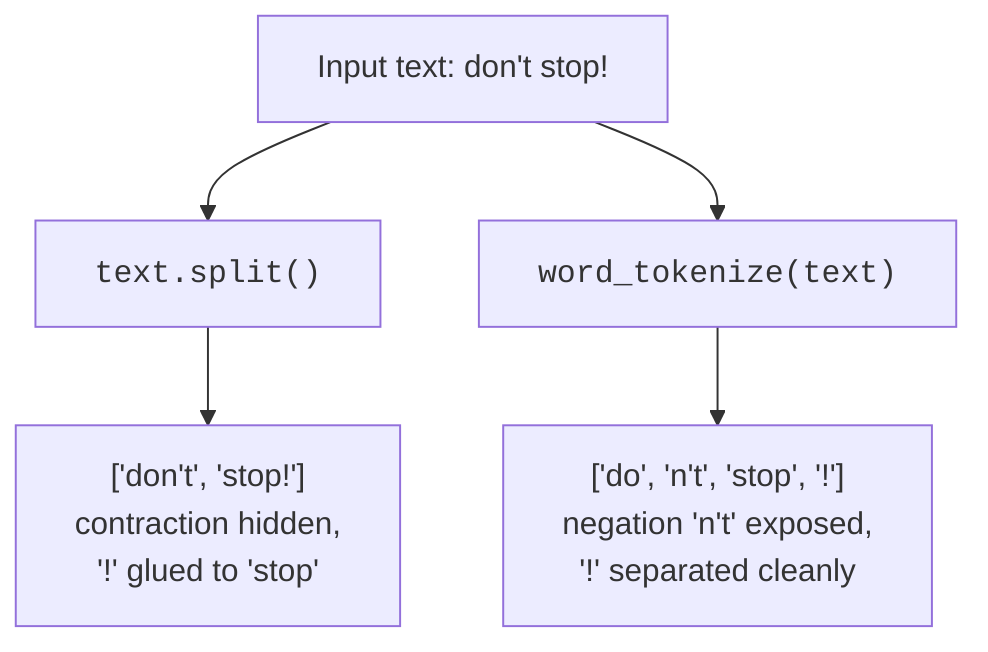
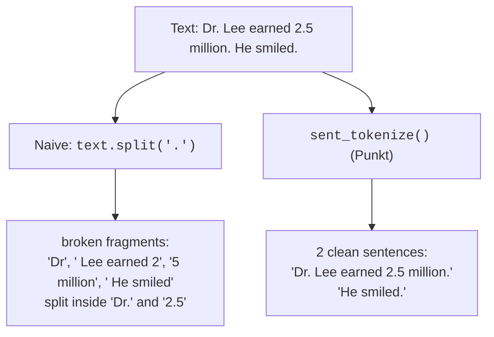

Tokenization is the very first transformation in almost every pipeline, and
it is the one beginners most often underestimate. A **token** is a single
meaningful unit of text, usually a word, but also a number, a punctuation
mark, or a symbol. **Tokenization** is the process of cutting a raw string
into that list of tokens. It sounds trivial. It is not.

The reason it is not trivial is everything we saw on the first page:
contractions hide words, punctuation glues itself to words, and a period
means three different things. A good tokenizer encodes a surprising amount of
linguistic knowledge to get the cuts right.

<Figure
  slug="nlp-tokenization-cutout"
  alt="A long ribbon of text feeding into a precision cutter that releases evenly separated blank tiles onto a track"
/>

<Callout type="warn" title="The misconception to unlearn first">
"Tokenization is just `string.split()`." This is the single most common
misunderstanding in beginner NLP. Splitting on whitespace is a crude
approximation that fails the moment punctuation or contractions appear, and
they always appear. Real tokenization makes *linguistically informed* cuts:
it knows that the comma in "butter," is not part of the word, and that "n't"
in "don't" is a separate, meaningful unit.
</Callout>

## Word tokenization: where `.split()` breaks

Let us put the naive approach and a real tokenizer side by side on one tiny,
nasty input.

`split()` produced two items, both subtly broken: the negation inside "don't"
is invisible, and "stop!" would never match the word "stop". The tokenizer
produced four clean units, and crucially it pulled "n't" out as its own token,
which matters enormously for tasks like sentiment analysis, where negation
flips meaning.

See it run for real. The setup section above the editor loads the tokenizer
for you.

<CodeBlock
  adapter="python"
  files={[
    {
      filename: "main.py",
      initCode: `# ── NLTK setup (read-only) ─────────────────────────────────────────────
# Installs NLTK and loads the data this page needs. nltk.download() isn't
# available in this environment, so we fetch the data archives directly
# and unpack them into NLTK's data directory.
import io, os, zipfile
import micropip
await micropip.install("nltk")
import nltk
from pyodide.http import pyfetch

_GH = "https://raw.githubusercontent.com/nltk/nltk_data/gh-pages/packages"
if "/nltk_data" not in nltk.data.path:
    nltk.data.path.insert(0, "/nltk_data")

async def _load_nltk(category, package):
    dest = os.path.join("/nltk_data", category)
    os.makedirs(dest, exist_ok=True)
    if os.path.exists(os.path.join(dest, package)):
        return
    resp = await pyfetch(_GH + "/" + category + "/" + package + ".zip")
    if resp.status != 200:
        raise RuntimeError("Could not download " + category + "/" + package)
    with zipfile.ZipFile(io.BytesIO(await resp.bytes())) as zf:
        zf.extractall(dest)

await _load_nltk("tokenizers", "punkt_tab")
from nltk.tokenize import word_tokenize, sent_tokenize`,
      starterCode: `text = "I don't think Mr. Lee's plan will work, but we'll see!"

print("split():        ", text.split())
print("word_tokenize():", word_tokenize(text))
`,
    },
  ]}
/>

Study the differences token by token:

- `"don't"` becomes `['do', "n't"]`, the negation is now a separate token.
- `"Lee's"` becomes `['Lee', "'s"]`, the possessive is split off.
- `"we'll"` becomes `['we', "'ll"]`, the future-tense marker is exposed.
- `","` and `"!"` become their own tokens instead of clinging to words.

None of that happens with `split()`. The tokenizer is applying rules learned
from how English is actually written.

<Callout type="info" title="How does it know? (a peek, not a deep dive)">
NLTK's default word tokenizer is based on the **Penn Treebank** conventions,
a fixed set of regular-expression rules built from a large hand-annotated
corpus of English. The rules say things like "split a leading or trailing
quote", "separate `n't`, `'re`, `'ll`, `'s`", and "keep decimal numbers
together". You do not need to memorize the rules. The lesson is that
tokenization is *encoded linguistic knowledge*, which is exactly why a
one-line `split()` cannot replace it.
</Callout>

<MultipleChoice
  markdown={`After \`word_tokenize("don't")\`, the result is \`['do', "n't"]\`. Why is
splitting the contraction this way valuable for something like sentiment
analysis?

- [o] It exposes the negation \`"n't"\` as its own token, so a later step can detect that the sentence is being negated
  > Negation flips sentiment ("good" vs. "not good"). If "don't" stays glued, a program never sees the negation. Splitting it out gives downstream steps a fighting chance to handle it correctly.
- It removes the word entirely, which is what we want
  > Removing negations is exactly the wrong goal for sentiment analysis; preserving "n't" as a visible token is what makes negation detectable downstream.
- It converts the word into a number
  > Tokenization produces string tokens, not numeric IDs; converting text to numbers is a separate step (feature extraction or embedding) that comes much later.
- It makes the text shorter and therefore faster to process
  > Splitting "don't" into two tokens actually makes the list longer, not shorter; the value is linguistic, not computational.

Surfacing hidden function words like negation is one of the quiet superpowers of real tokenization.`}
/>

## Sentence tokenization: where splitting on "." breaks

The mirror-image problem appears one level up. To split a paragraph into
sentences, your instinct might be `text.split(".")`. That fails immediately,
because a period is wildly overloaded: it ends sentences, but it also
abbreviates "Dr." and "U.S.A.", and it marks the decimal in "2.5".

<Figure
  slug="nlp-tokenization-inline-cutout"
  alt="A paper ribbon running into a small guillotine that cuts it into separate word tiles, the tiles dropping into a tray in order"
  caption="Tokenising cuts text into the units everything afterwards works with."
/>

NLTK's sentence tokenizer, **Punkt**, is smarter. It carries a list of known
abbreviations and a model of how sentences typically end, so it does not
mistake the period in "Dr." or "2.5" for a sentence boundary. Watch it work.

<CodeBlock
  adapter="python"
  files={[
    {
      filename: "main.py",
      initCode: `# ── NLTK setup (read-only) ─────────────────────────────────────────────
import io, os, zipfile
import micropip
await micropip.install("nltk")
import nltk
from pyodide.http import pyfetch

_GH = "https://raw.githubusercontent.com/nltk/nltk_data/gh-pages/packages"
if "/nltk_data" not in nltk.data.path:
    nltk.data.path.insert(0, "/nltk_data")

async def _load_nltk(category, package):
    dest = os.path.join("/nltk_data", category)
    os.makedirs(dest, exist_ok=True)
    if os.path.exists(os.path.join(dest, package)):
        return
    resp = await pyfetch(_GH + "/" + category + "/" + package + ".zip")
    if resp.status != 200:
        raise RuntimeError("Could not download " + category + "/" + package)
    with zipfile.ZipFile(io.BytesIO(await resp.bytes())) as zf:
        zf.extractall(dest)

await _load_nltk("tokenizers", "punkt_tab")
from nltk.tokenize import sent_tokenize`,
      starterCode: `text = "Dr. Lee earned 2.5 million. He smiled. Wasn't that great?"

# Naive: split on every period.
naive = text.split(".")
print("Naive split('.') ->", len(naive), "pieces")
for piece in naive:
    print("   ", repr(piece))

print()

# Punkt: real sentence tokenization.
sentences = sent_tokenize(text)
print("sent_tokenize() ->", len(sentences), "sentences")
for s in sentences:
    print("   ", repr(s))
`,
    },
  ]}
/>

The naive split shattered "Dr." and "2.5" into nonsense and missed that "?"
also ends a sentence. Punkt returned exactly three clean sentences. This is
why sentence tokenization is its own step with its own tool, not a string
method.

<Callout type="tip" title="The usual order: sentences first, then words">
When a task cares about sentence boundaries (summarization, sentence-level
sentiment, or anything that processes one sentence at a time), the common
pattern is to call `sent_tokenize()` first, then `word_tokenize()` on each
sentence. When you only need a flat bag of words (counting, search indexing),
you can skip straight to `word_tokenize()` on the whole text. Choose based on
whether sentence structure matters to what you are doing.
</Callout>

## When the "right" tokens depend on your domain

There is rarely one universally correct tokenization, it depends on what the
text *is*. Consider social media: in the tweet "Loving #NLP @ the
conference 😀", do you want "#NLP" kept whole as a hashtag, or split into "#"
and "NLP"? Do you want the emoji preserved as a token? The default
`word_tokenize()` will not treat hashtags or emoji specially; NLTK ships a
`TweetTokenizer` that does.

<CodeBlock
  adapter="python"
  files={[
    {
      filename: "main.py",
      initCode: `# ── NLTK setup (read-only) ─────────────────────────────────────────────
import io, os, zipfile
import micropip
await micropip.install("nltk")
import nltk
from pyodide.http import pyfetch

_GH = "https://raw.githubusercontent.com/nltk/nltk_data/gh-pages/packages"
if "/nltk_data" not in nltk.data.path:
    nltk.data.path.insert(0, "/nltk_data")

async def _load_nltk(category, package):
    dest = os.path.join("/nltk_data", category)
    os.makedirs(dest, exist_ok=True)
    if os.path.exists(os.path.join(dest, package)):
        return
    resp = await pyfetch(_GH + "/" + category + "/" + package + ".zip")
    if resp.status != 200:
        raise RuntimeError("Could not download " + category + "/" + package)
    with zipfile.ZipFile(io.BytesIO(await resp.bytes())) as zf:
        zf.extractall(dest)

await _load_nltk("tokenizers", "punkt_tab")
from nltk.tokenize import word_tokenize, TweetTokenizer`,
      starterCode: `tweet = "Loving #NLP @dataslope, this is sooo cool!!! :)"

print("Default word_tokenize:")
print("  ", word_tokenize(tweet))

print("TweetTokenizer:")
tt = TweetTokenizer()
print("  ", tt.tokenize(tweet))
`,
    },
  ]}
/>

Notice how the default tokenizer breaks "#NLP" into "#" and "NLP" and may
split the emoticon, while `TweetTokenizer` keeps the hashtag, handle, and
`:)` intact. Neither is "wrong", they serve different goals. The takeaway:
*the correct tokenization is the one that preserves the units your task cares
about.* This is your first encounter with the recurring theme that pipeline
choices are task-dependent.

<MultipleChoice
  markdown={`Why does \`text.split(".")\` fail as a sentence splitter on the text
"Dr. Lee earned 2.5 million."?

- The sentence has no periods in it
  > The text "Dr. Lee earned 2.5 million." clearly contains periods, the problem is that it has too many, and \`split(".")\` cannot tell which one ends the sentence.
- \`split()\` can only divide a string into two pieces
  > \`split()\` can divide a string into many pieces; with no argument it splits on every whitespace occurrence, and with a delimiter like \`"."\` it splits on every instance of that character.
- Periods are invisible characters that \`split()\` cannot see
  > Periods are perfectly visible to \`split()\`; in fact, \`text.split(".")\` splits on every period it finds, which is exactly the problem, it splits too eagerly, not too little.
- [o] The period is overloaded, it appears in abbreviations ("Dr.") and decimals ("2.5") as well as at sentence ends, so splitting on every period cuts in the wrong places
  > A sentence tokenizer must distinguish a period that ends a sentence from one that abbreviates a title or marks a decimal. \`split(".")\` treats them all the same and shatters "Dr." and "2.5".

Punkt exists precisely to tell sentence-ending periods apart from the other kinds.`}
/>

## Where tokenization shows up in the real world

- **Search engines** tokenize your query and every indexed document so that
  the words can be matched. If "running" and "running," tokenized
  differently, your search would silently miss results. Consistent
  tokenization on both sides is what makes search work at all.
- **Spam filters and classifiers** count tokens; bad tokenization means
  counting "free!" and "free" as different words, weakening the signal.
- **Machine translation and assistants** tokenize input before doing
  anything else; the quality ceiling of the whole system is partly set here.
- **Code and log analysis** needs custom tokenizers, because the "words" of a
  log line or a programming language are not English words.

<Figure
  slug="nlp-tokenization-word-tokenization-where-inline-cutout"
  alt="A ribbon cut by a simple blade at every gap, one cut falling badly through a joined word"
  caption="Splitting on spaces alone cuts in the wrong places more often than you expect."
/>

In all of these, tokenization is invisible when it works and catastrophic
when it does not, a classic piece of infrastructure.

## Your turn: tokenize a tricky paragraph

<ChallengeCard
  adapter="python"
  title="Count sentences and expose a contraction"
  category="tokenization · sent_tokenize · word_tokenize"
  estimatedTime="~6 min"
  instructions={`A short paragraph is provided in the variable \`text\`. Using the tokenizers
loaded for you:

1. Create \`sentences\` by sentence-tokenizing \`text\` with \`sent_tokenize()\`.
2. Create \`tokens\` by word-tokenizing \`text\` with \`word_tokenize()\`.

The paragraph contains the abbreviation "Dr.", the decimal "98.6", and the
contraction "didn't". A correct sentence tokenizer must **not** break on the
period inside "Dr." or "98.6", and a correct word tokenizer must split
"didn't" so that the negation token \`"n't"\` appears in \`tokens\`.`}
  files={[
    {
      filename: "main.py",
      initCode: `# ── NLTK setup (read-only) ─────────────────────────────────────────────
import io, os, zipfile
import micropip
await micropip.install("nltk")
import nltk
from pyodide.http import pyfetch

_GH = "https://raw.githubusercontent.com/nltk/nltk_data/gh-pages/packages"
if "/nltk_data" not in nltk.data.path:
    nltk.data.path.insert(0, "/nltk_data")

async def _load_nltk(category, package):
    dest = os.path.join("/nltk_data", category)
    os.makedirs(dest, exist_ok=True)
    if os.path.exists(os.path.join(dest, package)):
        return
    resp = await pyfetch(_GH + "/" + category + "/" + package + ".zip")
    if resp.status != 200:
        raise RuntimeError("Could not download " + category + "/" + package)
    with zipfile.ZipFile(io.BytesIO(await resp.bytes())) as zf:
        zf.extractall(dest)

await _load_nltk("tokenizers", "punkt_tab")
from nltk.tokenize import sent_tokenize, word_tokenize`,
      starterCode: `text = "Dr. Adams measured 98.6 degrees. The patient didn't complain."

sentences = None  # sent_tokenize the text
tokens = None  # word_tokenize the text

print("sentences:", sentences)
print("tokens:   ", tokens)
`,
      solutionCode: `text = "Dr. Adams measured 98.6 degrees. The patient didn't complain."

sentences = sent_tokenize(text)
tokens = word_tokenize(text)

print("sentences:", sentences)
print("tokens:   ", tokens)
`,
    },
  ]}
  tests={[
    {
      id: "two_sentences",
      name: "Finds exactly 2 sentences",
      description: "'Dr.' and '98.6' must not be treated as sentence ends",
      code: `assert isinstance(sentences, list), "sentences should be a list"
assert len(sentences) == 2, "Expected 2 sentences, got " + str(len(sentences)) + ": " + repr(sentences)`,
    },
    {
      id: "tokens_list",
      name: "tokens is a list",
      description: "word_tokenize returns a list of tokens",
      code: `assert isinstance(tokens, list), "tokens should be a list"`,
    },
    {
      id: "negation_exposed",
      name: "Contraction split exposes the negation",
      description: "'didn't' should produce the token \"n't\"",
      code: `assert "n't" in tokens, "Expected the negation token \\"n't\\" in tokens; got " + repr(tokens)`,
    },
    {
      id: "punct_separated",
      name: "Sentence-ending period is its own token",
      description: "word_tokenize separates punctuation from words",
      code: `assert "." in tokens, "Expected '.' as a separate token; got " + repr(tokens)`,
    },
  ]}
/>

## Check your understanding

<MultipleChoice
  markdown={`What is a **token**, in the NLP sense?

- [o] A single meaningful unit of text, typically a word, but also a number, punctuation mark, or symbol, produced by tokenization
  > Tokens are the atomic units a pipeline works with. Most are words, but punctuation marks, numbers, and symbols are tokens too. Tokenization is the step that decides where one token ends and the next begins.
- A single character of text
  > Individual characters are not tokens in the NLP sense; tokenization groups characters into meaningful units like words, numbers, and punctuation marks.
- Always exactly one English word
  > A token can be a number, a punctuation mark, or a symbol, not just a dictionary word; tokenization creates any meaningful unit the pipeline needs to work with.
- The numeric ID a database assigns to a row
  > A database row ID is a concept from relational databases and has no role in NLP tokenization; tokens are textual units, not numeric identifiers.

Tokens are units of text, and they are not limited to dictionary words.`}
/>

<MultipleChoice
  markdown={`Which task most clearly calls for **sentence** tokenization (not just word
tokenization)?

- Lowercasing every word in a document
  > Lowercasing is a normalization step applied to individual tokens; it requires only word tokenization and has nothing to do with sentence boundaries.
- [o] Summarizing a document by selecting its most important *sentences*
  > Summarization that picks whole sentences obviously needs sentence boundaries first. Pure word-counting and search indexing operate on a flat bag of words and do not require knowing where sentences begin and end.
- Building a search index of all the words in a corpus
  > A search index is built from individual words, so word tokenization is enough; sentence boundaries are irrelevant to matching query terms against indexed words.
- Counting how many times the word "data" appears in a document
  > Word-frequency counting operates on individual tokens and does not require knowing where sentences start or end; word tokenization alone is sufficient.

If your unit of analysis is the sentence, you need a sentence tokenizer; if it is the word, you may not.`}
/>

<MultipleChoice
  markdown={`A teammate tokenizes a set of tweets with the default \`word_tokenize()\` and is
surprised that "#MachineLearning" is split into "#" and "MachineLearning",
losing the hashtag. What is the best fix?

- [o] Use a tokenizer suited to the domain, such as NLTK's \`TweetTokenizer\`, which keeps hashtags, mentions, and emoticons intact
  > There is no single correct tokenization, it depends on which units matter. For social media, a tweet-aware tokenizer preserves hashtags and handles emoji, which the general-purpose tokenizer is not designed to do.
- Give up on tokenizing tweets; it is impossible
  > Tokenizing social media text is entirely possible, the challenge is choosing a tokenizer designed for that domain rather than assuming no solution exists.
- Switch from Python to a different programming language
  > The programming language is not the issue; NLTK itself ships \`TweetTokenizer\` in Python, so switching languages would not address the tokenization mismatch.
- Manually delete every "#" before tokenizing
  > Deleting "#" characters discards the hashtag signal entirely, losing information the task may care about; the correct fix is a tokenizer that treats "#NLP" as a single meaningful unit.

Matching the tokenizer to the text is part of designing the pipeline well.`}
/>

<MultipleChoice
  markdown={`Why is "tokenization is just \`string.split()\`" a harmful misconception?

- [o] \`split()\` only cuts on whitespace, so it leaves punctuation attached to words and never separates contractions, corrupting every count, match, and comparison built on the tokens
  > Whitespace splitting ignores all linguistic structure. "good." and "good" become different tokens, "don't" hides its negation, and downstream steps inherit all of these errors. Real tokenization makes informed cuts that \`split()\` cannot.
- There is no difference; they are the same thing
  > The difference is real and consequential: \`split()\` produces tokens with punctuation attached and contractions glued together, while a proper tokenizer separates them into the correct linguistic units.
- \`split()\` changes the language of the text
  > \`split()\` simply divides a string by a delimiter and does not translate or alter the language of the tokens in any way.
- \`split()\` is actually slower than tokenization
  > \`split()\` is a built-in string method and is very fast; speed is not the problem, the problem is that it produces linguistically incorrect tokens.

Everything downstream depends on good tokens, which is why this misconception is so costly.`}
/>

You now have clean tokens. But "The", "the", and "THE" are still three
different strings to a computer, and "running" still looks unrelated to
"runs". The next two pages fix that, starting with **normalization**.
