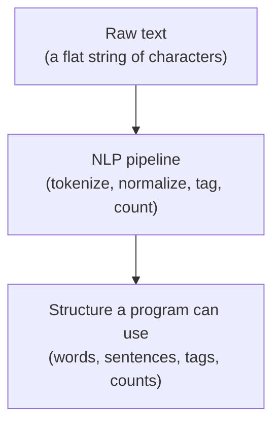
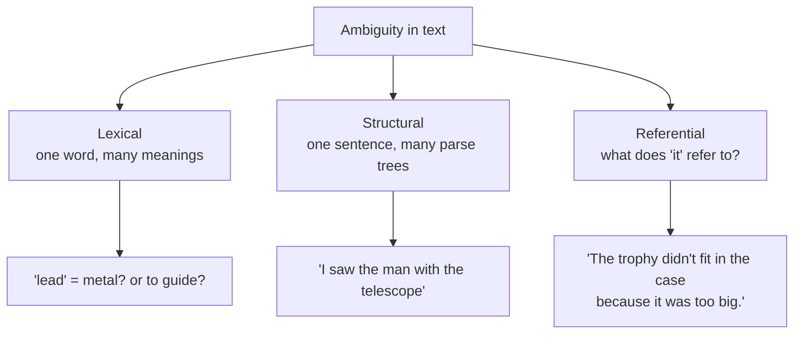
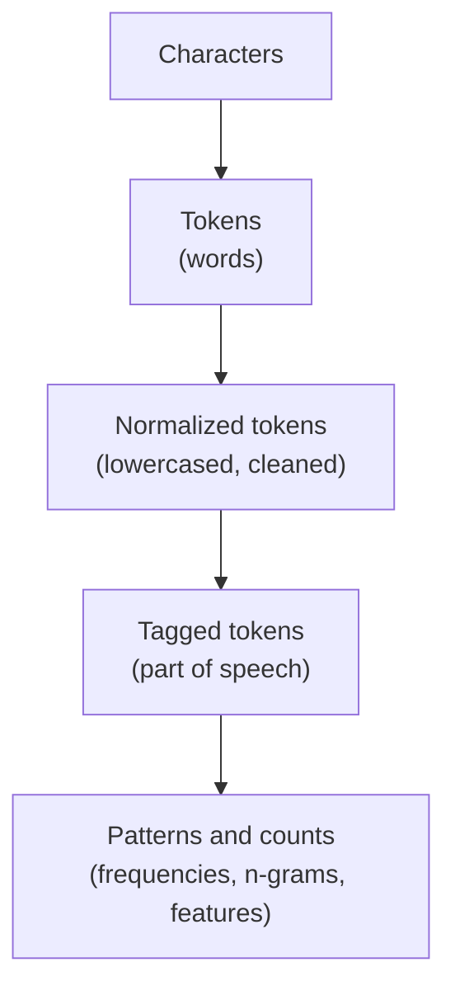

Imagine you hand a computer this sentence and ask, innocently, "how many
words is that?"

> "I can't believe Dr. Smith's startup raised \$2.5M, it's unreal!"

You already sense the trouble. Is "can't" one word or two ("can" + "not")?
Does the period after "Dr" end a sentence? Is "\$2.5M" a word? Is the em dash
a word? A human reads this in a second and understands it perfectly. A
computer sees a flat string of characters with no idea where words begin,
which marks matter, or what any of it *means*. Natural Language Processing
(NLP) is the field that closes that gap.

<Figure
  slug="nlp-what-is-nlp-cutout"
  alt="A tangled ribbon of loose blank word tiles on one platform beside the same tiles arranged into a tidy structured lattice"
/>

## The core problem: text is unstructured

Most data a program handles is **structured**: a number is a number, a date
has a year-month-day, a database column has a known type. Text is
**unstructured**. It is just a sequence of characters, and all of its
meaning, the words, the sentences, the grammar, the intent, is implied
rather than labeled. Before a program can do anything useful with text, that
implicit structure has to be made explicit.

That is the one-sentence mission of this entire course: **turn unstructured
text into structure a program can compute with.** Everything else,
tokenization, normalization, tagging, is a specific technique for adding a
specific kind of structure.

<Callout type="info" title="A working definition">
**Natural Language Processing is the set of techniques for getting computers
to work with human language**, to break it into pieces, measure it, compare
it, and extract meaning from it. "Natural" language (English, Spanish,
Japanese) is contrasted with the "formal" languages computers were designed
for, like Python or SQL, which are unambiguous by construction.
</Callout>

## Why this is hard: ambiguity everywhere

Formal languages are designed so that every statement has exactly one
meaning. Human language is the opposite: it is riddled with **ambiguity**,
and humans resolve it so effortlessly with context that we rarely notice it
is there. A computer has no such instincts. It is worth seeing the main
kinds of ambiguity explicitly, because nearly every NLP technique exists to
fight one of them.

**Lexical ambiguity** is when a single word has multiple meanings. "Lead"
can be a heavy metal or the act of guiding. "Bank" can be a riverside or a
place for money. The word is identical; only context decides.

**Structural (syntactic) ambiguity** is when the same words can be grouped
into different grammatical structures. "I saw the man with the telescope",
did you use a telescope to see him, or did you see a man who was holding one?
Both readings use the exact same words in the exact same order.

**Referential ambiguity** is when it is unclear what a word points to. "The
trophy didn't fit in the case because it was too big." What was too big, the
trophy or the case? A human knows instantly (the trophy). A computer has no
built-in notion of which object would plausibly be "too big."

<Callout type="tip" title="The mental shift">
Stop thinking of text as words and start thinking of it as *characters with
hidden structure you must reconstruct.* The hidden structure is where the
words are, where the sentences end, which word is the verb, and what refers
to what. NLP is the work of reconstructing that structure, one layer at a
time.
</Callout>

## Text is also irregular and noisy

Beyond ambiguity, real text is just *messy* in ways that break naive
programs:

- **Contractions** hide words: "don't" contains "do" + "not"; "we'll"
  contains "we" + "will".
- **Punctuation** is overloaded: a period ends a sentence *and* abbreviates
  "Dr." *and* marks a decimal in "2.5".
- **Casing** is inconsistent: "Apple" the company vs. "apple" the fruit, or
  a word capitalized only because it starts a sentence.
- **Morphology**: "run", "runs", "running", and "ran" are four spellings of
  one underlying idea.
- **Multi-word units**: "New York", "machine learning", and "hot dog" are
  each one concept written as several words.

Every one of these is a reason a later page exists. Contractions and
punctuation motivate *tokenization*. Casing motivates *case folding*.
Morphology motivates *stemming and lemmatization*. Keep this list in mind,
we are going to dismantle it problem by problem.

## A first look: why `.split()` is not enough

Your instinct, as a Python programmer, is probably to reach for
`text.split()` to break a sentence into words. It is a reasonable first
guess, and seeing exactly where it fails is the perfect motivation for what
comes next. Run this and read the output carefully.

<CodeBlock
  adapter="python"
  files={[
    {
      filename: "main.py",
      starterCode: `sentence = "I can't believe it's not butter, Mr. Jones!"

# The naive approach: split on whitespace.
naive = sentence.split()
print("split() gives:", naive)
print("word count:", len(naive))
`,
    },
  ]}
/>

Look at what `.split()` produced. "can't" stayed glued together, so the
hidden "not" is invisible. "butter," carries a comma stuck to it, so the word
"butter" and the word "butter," would be counted as two different words.
"Jones!" has an exclamation mark fused on. The naive split has no idea that
punctuation is separate from words.

Now watch a real tokenizer handle the same sentence. Do not worry about the
setup, it is loaded for you in the read-only section above the editor.

<CodeBlock
  adapter="python"
  files={[
    {
      filename: "main.py",
      initCode: `# ── NLTK setup (read-only) ─────────────────────────────────────────────
# Installs NLTK and loads the data this page needs. nltk.download() isn't
# available in this environment, so we fetch the data archives directly
# and unpack them into NLTK's data directory.
import io, os, zipfile
import micropip
await micropip.install("nltk")
import nltk
from pyodide.http import pyfetch

_GH = "https://raw.githubusercontent.com/nltk/nltk_data/gh-pages/packages"
if "/nltk_data" not in nltk.data.path:
    nltk.data.path.insert(0, "/nltk_data")

async def _load_nltk(category, package):
    dest = os.path.join("/nltk_data", category)
    os.makedirs(dest, exist_ok=True)
    if os.path.exists(os.path.join(dest, package)):
        return
    resp = await pyfetch(_GH + "/" + category + "/" + package + ".zip")
    if resp.status != 200:
        raise RuntimeError("Could not download " + category + "/" + package)
    with zipfile.ZipFile(io.BytesIO(await resp.bytes())) as zf:
        zf.extractall(dest)

await _load_nltk("tokenizers", "punkt_tab")
from nltk.tokenize import word_tokenize`,
      starterCode: `sentence = "I can't believe it's not butter, Mr. Jones!"

tokens = word_tokenize(sentence)
print("word_tokenize gives:", tokens)
print("token count:", len(tokens))
`,
    },
  ]}
/>

The tokenizer split "can't" into `ca` + `n't`, exposing the negation. It
peeled the comma off "butter" and the exclamation mark off "Jones". It even
left "Mr." intact rather than treating that period as a word. We will study
exactly how it does this on the [tokenization page](./tokenization), for now,
the point is simply that **breaking text into words is a real problem, not a
one-liner.**

<MultipleChoice
  markdown={`Why does \`sentence.split()\` give a misleading word list for the sentence above?

- [o] It only splits on whitespace, so punctuation stays attached to words and contractions are never separated
  > \`split()\` knows nothing about language. It cuts on spaces, leaving "butter," and "Jones!" with punctuation fused on and "can't" unsplit, which distorts both the word list and any counts based on it.
- It automatically lowercases the text, changing the words
  > \`split()\` does not alter case; every substring is returned exactly as it appears in the original string.
- It removes all the vowels from each word
  > \`split()\` performs no such transformation; it returns substrings as-is, vowels intact.
- It splits every character into its own item
  > \`split()\` cuts on whitespace and returns whole whitespace-delimited chunks, not individual characters; character-level splitting would require \`list(sentence)\`.

The whole job of a tokenizer is to make linguistically sensible cuts that \`split()\` cannot.`}
/>

## So what does an NLP system actually do?

It almost never tackles "understand this text" in one giant leap. Instead it
adds structure in **layers**, each layer building on the last. A typical
analysis pipeline looks like this:

Each arrow is a technique you will learn. By the end you will be able to walk
a paragraph all the way from the left of that diagram to the right, and,
just as importantly, explain *why* each arrow is there and when you would
skip it.

<Callout type="warn" title="A common misconception: NLP means AI that 'understands'">
It is tempting to imagine NLP as a system that reads text and *understands*
it the way you do. The classic techniques in this course do nothing of the
kind. They count, match, and transform, mechanically and without
comprehension. A frequency counter does not know what a word *means*; it
knows how often it appears. This is not a limitation to apologize for: an
enormous amount of useful work (search, spam filtering, topic detection) is
done by systems that never "understand" a thing. Knowing the difference
between *processing* text and *understanding* it will keep your expectations
honest.
</Callout>

## Rules versus learning (a brief orientation)

There are two broad strategies for handling language, and this course leans
firmly toward the first.

**Rule-based / algorithmic** approaches encode human knowledge directly: a
list of stopwords, a set of suffix-stripping rules for stemming, a dictionary
of positive and negative words for sentiment. They are transparent, you can
read exactly why they did what they did, and they need no training data.

**Learning-based** approaches (machine learning, and the deep-learning models
behind modern assistants) infer their behavior from large quantities of
example text instead of hand-written rules. They are powerful but opaque, and
they assume you already understand the structure of text.

|                 | Rule-based / classic NLP (this course)   | Learning-based NLP (later study)        |
| --------------- | ---------------------------------------- | --------------------------------------- |
| **Built from**  | Human-written rules and word lists       | Lots of labeled example text            |
| **Produces**    | A transparent, inspectable result        | A trained model                         |
| **You get**     | Read exactly why it did what it did       | Power, at the cost of opacity           |

We focus on classic, rule-based and count-based NLP because it is where the
durable intuition lives. Once you understand *why* text needs tokenizing,
normalizing, and tagging, the modern learning-based tools become far easier
to pick up, they still rely on most of these same ideas under the hood.

## Where NLP shows up in the real world

The techniques in this course are not academic curiosities. They quietly
power tools you use every day:

- **Search engines** tokenize and normalize both your query and billions of
  documents so that searching "running" can also find "runs" and "ran".
- **Spam filters** count suspicious words and phrases to score an email.
- **Autocomplete and predictive text** lean on n-grams, the probability of
  the next word given the last one or two.
- **Voice assistants** convert messy spoken input into tokens before doing
  anything else.
- **Sentiment dashboards** scan product reviews or social posts for positive
  and negative language.
- **Plagiarism and duplicate detection** compare normalized word sets and
  n-grams between documents.

In every case, the first thing that happens, before any cleverness, is the
unglamorous work of turning raw text into clean, comparable units. That is
what you are about to learn to do well.

## Check your understanding

<MultipleChoice
  markdown={`A program reads the word "bank" and cannot decide whether it means a
financial institution or the side of a river. This is an example of which
kind of ambiguity?

- Structural ambiguity
  > Structural (syntactic) ambiguity is about how words group into a sentence's grammar, not about a single word having multiple meanings.
- [o] Lexical ambiguity
  > Lexical ambiguity is when a single word form has more than one possible meaning. "Bank", "lead", and "bat" are classic examples; only surrounding context resolves them.
- There is no ambiguity here
  > "Bank" is a classic example of a word with multiple unrelated meanings; the ambiguity is real and is precisely why context-aware NLP is necessary.
- Referential ambiguity
  > Referential ambiguity is about what a word like "it" or "they" points to, not about a single word's dictionary meaning.

One word, multiple dictionary meanings, that is lexical ambiguity by definition.`}
/>

<MultipleChoice
  markdown={`Which statement best captures what classic NLP techniques (like the ones in
this course) actually do?

- They translate all text into mathematical equations that are always exactly correct
  > NLP techniques produce approximations (counts, patterns, heuristics), not exact mathematical proofs; and NLP is applied to human language, not formal equations.
- They only work on programming languages, not human languages
  > Natural language, English, French, Mandarin, is exactly what NLP is designed for; "natural" in the name contrasts it from formal languages like Python.
- They make the computer genuinely understand the meaning of text the way a human does
  > Classic NLP techniques count, match, and transform text mechanically; the course explicitly warns against conflating processing with comprehension.
- [o] They mechanically transform, match, and count text to expose structure, without any real comprehension
  > Classic NLP is transformation and counting: splitting, normalizing, tagging, tallying. It is enormously useful precisely because so many tasks don't require true understanding.

Useful does not require understanding, a spam filter scores words without knowing what any of them mean.`}
/>

<MultipleChoice
  markdown={`"I saw the man with the telescope" can mean either *I used a telescope to see
him* or *I saw a man who had a telescope*. What kind of ambiguity is this?

- [o] Structural (syntactic) ambiguity
  > The same words in the same order support two different grammatical structures, two ways of grouping the phrases, which is exactly structural ambiguity.
- Lexical ambiguity
  > No single word is ambiguous here; the trouble is how the phrase "with the telescope" attaches to the rest of the sentence.
- Referential ambiguity
  > Referential ambiguity would be about an unclear pronoun like "it" or "they"; this sentence has none.
- Morphological ambiguity
  > Morphological ambiguity concerns a single word's form (e.g., "wound" as past tense of "wind" vs. an injury noun); here no word is individually ambiguous, the whole phrase parses two ways.

Same words, same order, two valid parse trees, that is structural ambiguity.`}
/>

<MultipleChoice
  markdown={`Why is "turn unstructured text into structure" a fair one-line summary of
NLP's core problem?

- Because computers cannot store text at all
  > Computers store text perfectly well as character encodings; the problem is that stored text has no explicit labels for word boundaries, grammar, or meaning.
- [o] Because raw text is just a sequence of characters with all its meaning implied, and programs need that implied structure (words, sentences, tags) made explicit before they can compute with it
  > Structured data carries its meaning in labeled fields; text hides everything inside a flat string. NLP's foundational job is to recover and make explicit the words, boundaries, and grammar that a program can then use.
- Because text always needs to be translated into another language first
  > NLP can work on text in its original language; translation is a downstream task, not a prerequisite for processing.
- Because text files are larger than other kinds of data
  > File size has no bearing on whether text is structured or unstructured; the challenge is that meaning is implicit, not that the data is large.

The recurring theme of the whole course: add explicit structure to implicitly-structured text.`}
/>

<MultipleChoice
  markdown={`A teammate proposes counting the words in customer reviews using
\`review.split()\` and tallying the results. What is the most important risk?

- \`split()\` deletes the reviews from memory
  > \`split()\` returns a new list and leaves the original string untouched; it does not modify or delete anything.
- \`split()\` only works on numbers
  > \`str.split()\` is a string method that operates on text, not numbers; this is a factually incorrect claim about Python.
- Splitting is far too slow to run on text
  > \`str.split()\` is fast and imposes negligible overhead; the problem is correctness, not speed.
- [o] Punctuation stays attached to words and contractions stay glued, so "great!", "great", and "great." are counted as three different words and counts are distorted
  > \`split()\` only cuts on whitespace. Without real tokenization, the same word with different trailing punctuation becomes multiple distinct entries, corrupting every count built on top.

This is precisely why tokenization, not whitespace splitting, is step one of a real pipeline.`}
/>

In the next section we will zoom out and look at the **whole pipeline** as a
single picture, the standard sequence of steps that text flows through,
before we dive into each step in detail.
