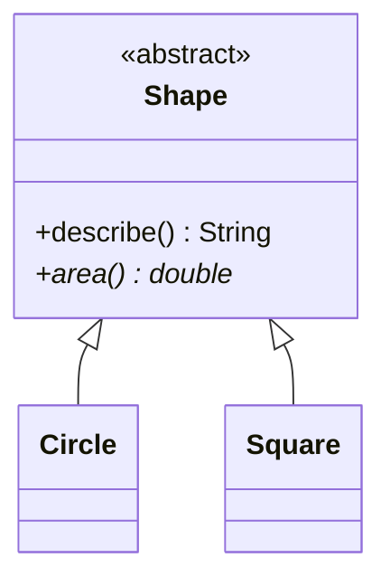
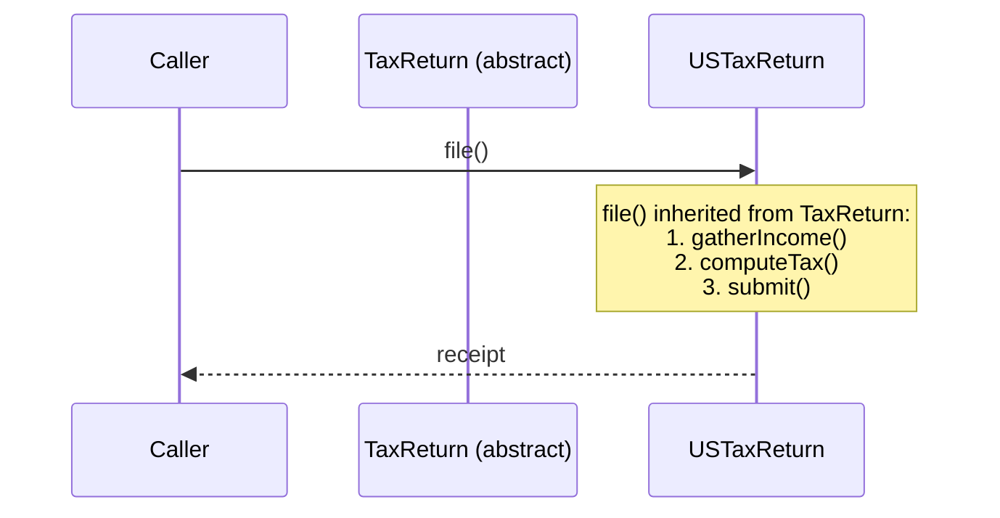

Sometimes the class you want to write is *almost* complete, but one
or two parts have to be filled in by each subclass differently. The
`Shape` class in the previous page is a good example: it has a
`describe()` method that works for everyone, but `area()` is
meaningless for "shape in general." Each subclass has to fill it in.

Java models this with the keyword **`abstract`**. An *abstract
class* is a class that may have:

- Normal fields and concrete methods (just like any class).
- *Abstract methods*, methods declared without a body, leaving
  subclasses to provide the implementation.

You cannot construct an abstract class directly with `new`. You can
only construct concrete subclasses of it.

<Figure
  slug="oopj-abstract-classes-cutout"
  alt="A partly built frame on a platform with most panels fitted and one empty socket left open, two finished variants standing beside it"
/>

## A first abstract class

The `*` on `area()` and the `<<abstract>>` stereotype mark them as
abstract. Concrete subclasses must implement `area()`.

<Figure
  slug="oopj-abstract-classes-first-abstract-class-inline-cutout"
  alt="A partly finished cabinet with one panel left as an open socket, unable to stand on its own"
  caption="An abstract class leaves one part open, so it cannot stand on its own."
/>

<CodeBlock
  adapter="java"
  entryFilename="Main.java"
  files={[
    {
      filename: "Main.java",
      starterCode: `public class Main {
  public static void main(String[] args) {
    Shape[] shapes = {new Circle(1), new Square(4)};
    for (Shape s : shapes) {
      System.out.println(s.describe());
    }
    // Shape s = new Shape();  // would fail: Shape is abstract
  }
}
`,
    },
    {
      filename: "Shape.java",
      starterCode: `public abstract class Shape {
  // Concrete behavior shared by every shape:
  public String describe() {
    return getClass().getSimpleName() + " with area " + area();
  }

  // Abstract: every concrete shape must implement this.
  public abstract double area();
}
`,
    },
    {
      filename: "Circle.java",
      starterCode: `public class Circle extends Shape {
  private final double radius;
  public Circle(double radius) { this.radius = radius; }

  @Override
  public double area() {
    return Math.PI * radius * radius;
  }
}
`,
    },
    {
      filename: "Square.java",
      starterCode: `public class Square extends Shape {
  private final double side;
  public Square(double side) { this.side = side; }

  @Override
  public double area() {
    return side * side;
  }
}
`,
    },
  ]}
/>

The `describe` method in `Shape` calls `area()`. At the time `Shape`
is written, *nobody knows* what `area()` will return, that depends
entirely on which concrete subclass is plugged in. This is exactly
what makes abstract classes powerful: the parent provides the
*skeleton*, the child fills in the *steps*.

<Callout type="info" title={`Why "abstract"?`}>
The class is "abstract" in the same sense that "vehicle" is abstract
in everyday language. You can't point at a vehicle that is just *a
vehicle*, every vehicle you encounter is some concrete kind:
a bicycle, a car, a tram. "Vehicle" is a useful category, but it has
no realisation of its own.
</Callout>

## The Template Method idea

A classic use of abstract classes is the **Template Method** pattern
(one of the GoF originals). The parent class defines the *overall
shape* of an algorithm in a concrete method and leaves the variable
steps as `abstract`.

<Figure
  slug="oopj-abstract-classes-template-method-idea-inline-cutout"
  alt="A fixed frame with three fitted steps and one open slot, two different parts able to fill that slot"
  caption="The parent fixes the shape of the algorithm and leaves one step to fill in."
/>

<CodeBlock
  adapter="java"
  entryFilename="Main.java"
  files={[
    {
      filename: "Main.java",
      starterCode: `public class Main {
  public static void main(String[] args) {
    TaxReturn us = new USTaxReturn(120_000);
    TaxReturn uk = new UKTaxReturn(120_000);

    System.out.println(us.file());
    System.out.println(uk.file());
  }
}
`,
    },
    {
      filename: "TaxReturn.java",
      starterCode: `public abstract class TaxReturn {
  protected final double income;

  protected TaxReturn(double income) { this.income = income; }

  // The template method, defines the overall shape:
  public final String file() {
    gatherIncome();
    double tax = computeTax();
    return submit(tax);
  }

  // Concrete shared step:
  protected void gatherIncome() {
    // pretend we look up forms
  }

  // Step that varies per country:
  protected abstract double computeTax();

  // Step that varies per country:
  protected abstract String submit(double tax);
}
`,
    },
    {
      filename: "USTaxReturn.java",
      starterCode: `public class USTaxReturn extends TaxReturn {
  public USTaxReturn(double income) { super(income); }

  @Override
  protected double computeTax() {
    return income * 0.24;
  }

  @Override
  protected String submit(double tax) {
    return "IRS receipt: tax owed $" + tax;
  }
}
`,
    },
    {
      filename: "UKTaxReturn.java",
      starterCode: `public class UKTaxReturn extends TaxReturn {
  public UKTaxReturn(double income) { super(income); }

  @Override
  protected double computeTax() {
    return income * 0.20;
  }

  @Override
  protected String submit(double tax) {
    return "HMRC receipt: tax owed £" + tax;
  }
}
`,
    },
  ]}
/>

Notice the `final` on `file()`, subclasses cannot override the
*shape* of the algorithm. They can only fill in the marked
extension points. That is the spirit of Template Method: a tightly
controlled invitation to vary.

## Abstract class vs. concrete class

| Concrete class | Abstract class |
| --- | --- |
| Has no `abstract` methods | Has at least one `abstract` method, *or* is itself declared `abstract` |
| Can be instantiated with `new` | Cannot be instantiated; you must subclass |
| Implements every member it declares | Leaves at least one method to subclasses |
| Decision: "I know how to do everything" | Decision: "I describe the shape; subclasses fill in the variable parts" |

## When *not* to use an abstract class

The next page is about **interfaces**, which solve a similar problem
(describing a shape) from a different angle. The short version:

- Use an **abstract class** when there is genuine shared *state*
  and/or shared *implementation* across the subclasses that you want
  to reuse.
- Use an **interface** when you want to describe *only* a set of
  capabilities and have many unrelated classes implement them.

<Figure
  slug="oopj-abstract-classes-inline-cutout"
  alt="A partly finished cabinet with one panel left as an empty opening, and two completed cabinets beside it that each fill that opening differently"
  caption="Each concrete subclass fills the opening its own way."
/>

Many modern object-oriented designs use interfaces by default and reach for
abstract classes only when there's real shared code to factor out.

## Practice

<ChallengeCard
  adapter="java"
  title="Notification template"
  instructions={`Build a tiny notification framework.

- \`Notification\` is an *abstract class*:
  - Constructor takes a \`String recipient\`.
  - A concrete final method \`send()\` returns the string \`"To " + recipient + ": " + body()\`.
  - An *abstract* protected method \`body()\` that returns the message body.
- \`EmailNotification\` extends \`Notification\`. Its constructor also takes a \`String subject\`. \`body()\` returns \`"Subject: " + subject\`.
- \`SmsNotification\` extends \`Notification\`. Its constructor also takes a \`String text\`. \`body()\` returns the \`text\` as-is.

Expected output:

\`\`\`text
To ada@oop.dev: Subject: Welcome!
To +1-555-0100: Your code is 1234
\`\`\``}
  entryFilename="Main.java"
  files={[
    {
      filename: "Main.java",
      starterCode: `public class Main {
  public static void main(String[] args) {
    Notification a = new EmailNotification("ada@oop.dev", "Welcome!");
    Notification b = new SmsNotification("+1-555-0100", "Your code is 1234");
    System.out.println(a.send());
    System.out.println(b.send());
  }
}
`,
    },
    {
      filename: "Notification.java",
      starterCode: `public abstract class Notification {
  // TODO: recipient field, constructor, final send(), abstract body()
}
`,
      solutionCode: `public abstract class Notification {
  private final String recipient;

  protected Notification(String recipient) { this.recipient = recipient; }

  public final String send() { return "To " + recipient + ": " + body(); }

  protected abstract String body();
}
`,
    },
    {
      filename: "EmailNotification.java",
      starterCode: `public class EmailNotification extends Notification {
  // TODO
}
`,
      solutionCode: `public class EmailNotification extends Notification {
  private final String subject;
  public EmailNotification(String recipient, String subject) {
    super(recipient);
    this.subject = subject;
  }
  @Override
  protected String body() {
    return "Subject: " + subject;
  }
}
`,
    },
    {
      filename: "SmsNotification.java",
      starterCode: `public class SmsNotification extends Notification {
  // TODO
}
`,
      solutionCode: `public class SmsNotification extends Notification {
  private final String text;
  public SmsNotification(String recipient, String text) {
    super(recipient);
    this.text = text;
  }
  @Override
  protected String body() {
    return text;
  }
}
`,
    },
  ]}
  tests={[
    {
      id: "notification-template",
      name: "Subclasses fill in body(); template defines send()",
      expect: {
        stdoutLines: [
          "To ada@oop.dev: Subject: Welcome!",
          "To +1-555-0100: Your code is 1234",
        ],
        stdoutLinesExact: true,
      },
    },
  ]}
/>

## Test your understanding

<MultipleChoice
  markdown={`Which is **true** about an abstract class in Java?

- It can only have static methods
  > That would be a utility class.
- [o] It can have both concrete and abstract methods, and cannot be instantiated with \`new\` directly
  > Abstract classes are partial blueprints, useful when you want to share both code and a contract.
- It cannot have any concrete methods
  > It can have both concrete and abstract methods.
- It is the same as an interface
  > Interfaces and abstract classes are related but different (next page).`}
/>

<MultipleChoice
  markdown={`Why does the Template Method pattern often mark its top-level method \`final\`?

- Because the JVM forbids overriding abstract methods
  > It doesn't, that's exactly what you *must* do.
- [o] To prevent subclasses from changing the overall shape of the algorithm; they may only fill in the marked steps
  > The base class controls the *order* of work; subclasses choose only what each step does.
- To make it run faster
  > Performance isn't the motivation.
- To make the class implicitly abstract
  > \`final\` and \`abstract\` are essentially opposite intents.`}
/>

<MultipleChoice
  markdown={`When should you prefer an abstract class over an interface?

- Whenever you have more than three methods
  > Method count is irrelevant.
- When you want many unrelated classes to share a tiny contract
  > That's a job for an interface.
- [o] When you have genuine shared *state* and *concrete code* that all subclasses would otherwise duplicate
  > Abstract classes earn their keep when there is real shared implementation to factor out.
- When you don't want to use \`@Override\`
  > Both abstract classes and interfaces interact with \`@Override\`.`}
/>
