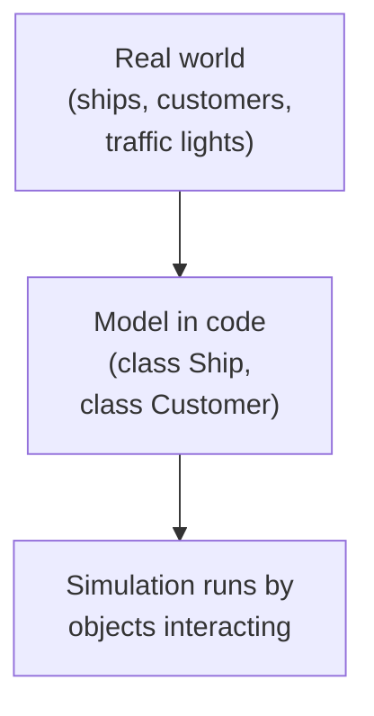
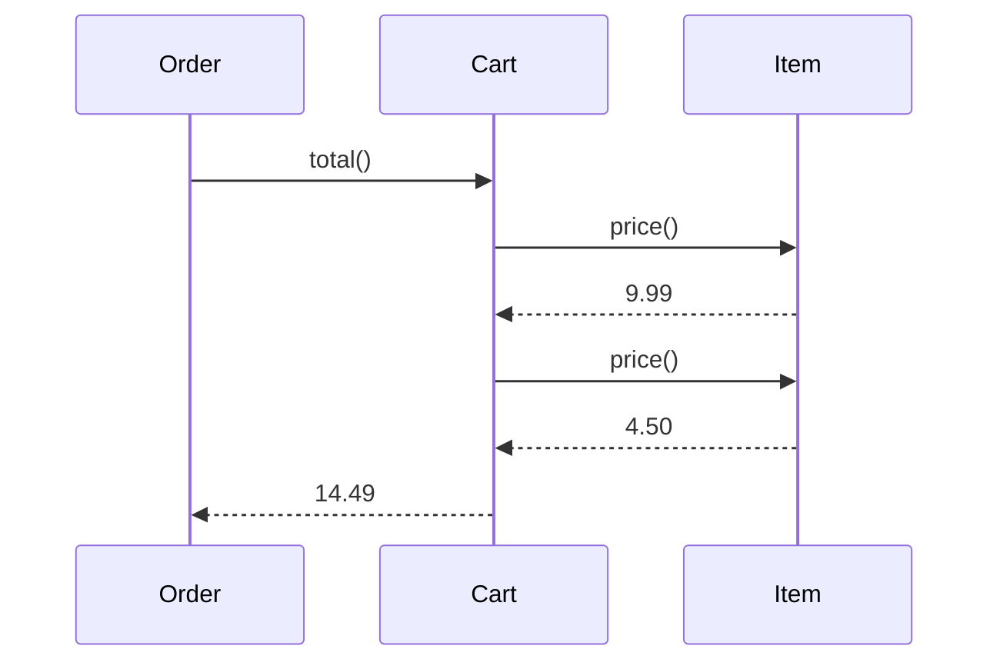
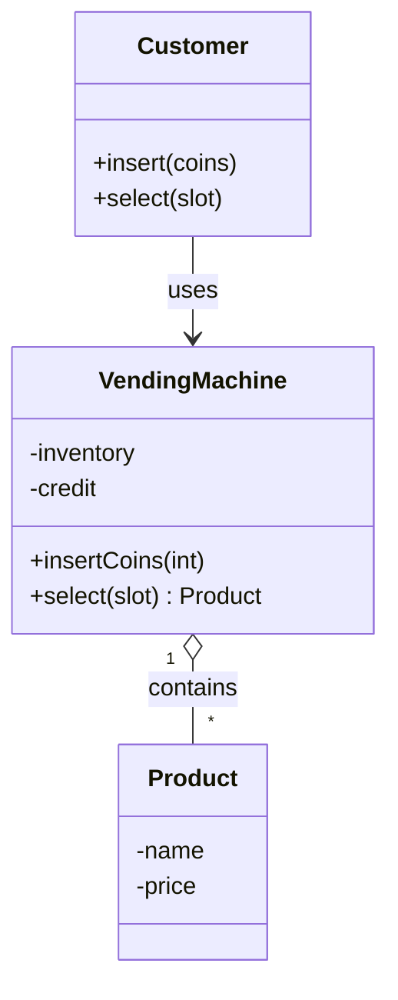

The software crisis demanded a new way of organizing code. The answer
arrived in pieces, from a few people in a few labs, between roughly
**1962 and 1980**. By the end of that period, most of the ideas you
will spend this course learning had already been invented, they just
weren't yet mainstream.

This page is the story of how object-oriented programming was born.

<Figure
  slug="oopj-birth-of-oop-cutout"
  alt="Three small self-contained capsule machines on a platform passing rounded message tokens between them along curved arrows"
/>

## Simula: classes for simulating the world (1962–1967)

In Oslo, Norway, two researchers, **Ole-Johan Dahl** and **Kristen
Nygaard**, were trying to write simulations of complex real-world
systems: ships in a harbor, customers in a queue, traffic at an
intersection. They quickly noticed that the *cleanest* way to write
such a program was to make the code mirror the world.

<Figure
  slug="oopj-birth-of-oop-simula-cutout"
  alt="Two figures at a desk beside a model harbour of small ships and cranes, each one a separate solid piece"
  caption="Oslo, 1962 to 1967: simulating a harbour is easier when each ship is its own object."
/>

A ship in the simulation should be a *thing in the code* with its own
position, speed, and cargo. A customer should be a *thing* with their
own arrival time and patience. Operations on those things, `arrive()`,
`depart()`, `loadCargo()`, should belong to the thing they act on.

Out of that practical need came **Simula 67**, the first language to
include what we now call **classes** and **objects**, along with
**inheritance** and **virtual methods**. Long before anyone was
philosophizing about software design, Simula was already organized
this way because it was the obviously-correct way to write
simulations. The field eventually recognized what Dahl and Nygaard
had done: in 2001 they shared the **Turing Award**, computing's
Nobel Prize, for inventing the concepts on which this entire course
is built.

<Callout type="info" title="Why this matters">
Simula's central insight is the one we will return to in every chapter
of this course: **the structure of your program should mirror the
structure of the problem.** If the world has ships, your program
should have a `Ship` class. If a ship has cargo, your `Ship` class
should *own* its cargo. The closer that mirroring, the easier the
program is to understand and change.
</Callout>

## Smalltalk and Alan Kay: "everything is an object" (1972–1980)

At Xerox PARC in California, **Alan Kay** and his colleagues
**Dan Ingalls** and **Adele Goldberg** took Simula's idea and pushed
it to its limit. They built **Smalltalk**, a language and an entire
graphical environment in which **everything is an object** and the
*only* thing programs do is **send messages** between objects.

In Smalltalk, even a number like `3` is an object. When you write
`3 + 4`, you are *sending the message* `+ 4` to the object `3`. The
object decides how to respond. This may sound abstract, but it is
exactly the mental model we will use for Java in this course.

The metaphor behind it came from outside computing. Kay had studied
molecular biology before computer science, and he described imagining
objects as **biological cells**: each cell is sealed inside its
membrane, carries its own machinery, and interacts with other cells
only by passing chemical messages across that membrane. No cell
reaches inside another. Scale that picture up, trillions of simple,
encapsulated units producing a functioning organism, and you have
Kay's vision of how software should be built. (Kay received the
Turing Award in 2003 for this body of work.)

Kay later said he regretted the name *object-oriented programming*.
He felt the important word was **messaging**, not *objects*. The
objects are containers; the *interesting behavior is in the messages
they send to each other*.

A program is a *conversation* between objects. Each one knows how to
answer some questions and how to perform some actions. Nobody else
reaches inside.

Let's see that conversation in Java. You will recognize the shape of
the sequence diagram in the actual code.

<CodeBlock
  adapter="java"
  entryFilename="Main.java"
  files={[
    {
      filename: "Main.java",
      starterCode: `public class Main {
  public static void main(String[] args) {
    Cart cart = new Cart();
    cart.add(new Item("Notebook", 9.99));
    cart.add(new Item("Pen", 4.50));

    Order order = new Order(cart);
    System.out.println("Order total: $" + order.totalString());
  }
}
`,
    },
    {
      filename: "Item.java",
      starterCode: `public class Item {
  private final String name;
  private final double price;

  public Item(String name, double price) {
    this.name = name;
    this.price = price;
  }

  public double price() { return price; }
  public String name() { return name; }
}
`,
    },
    {
      filename: "Cart.java",
      starterCode: `import java.util.ArrayList;
import java.util.List;

public class Cart {
  private final List<Item> items = new ArrayList<>();

  public void add(Item it) { items.add(it); }

  public double total() {
    double sum = 0;
    for (Item it : items)
      sum += it.price(); // sending price() to each Item
    return sum;
  }
}
`,
    },
    {
      filename: "Order.java",
      starterCode: `public class Order {
  private final Cart cart;

  public Order(Cart cart) { this.cart = cart; }

  public String totalString() {
    return String.format("%.2f", cart.total()); // sending total() to the Cart
  }
}
`,
    },
  ]}
/>

The `Order` does not reach inside the `Cart` to add up prices. It
**asks** the cart for its total. The cart does not reach into each
`Item` to read its price field. It **asks** each item for its price.
Each object owns its own data and answers questions about it.

This is the most important idea in the whole course. If you internalize
nothing else, internalize this: **objects talk to each other by
sending messages; they do not reach into each other.**

## A vocabulary that survived

By the late 1970s, the OOP community had settled on a vocabulary that
is still in daily use today. You will meet each of these in detail
later, but here is a one-line preview of each.

| Word | Meaning |
| --- | --- |
| **Object** | A bundle of state (data) and behavior (methods) that has identity |
| **Class** | The blueprint from which objects are created |
| **Message** | A request to an object to do something or answer a question |
| **Method** | The code an object runs when it receives a message |
| **Encapsulation** | Hiding internal state so the world can interact only through messages |
| **Inheritance** | Defining a new class as a refinement of an existing one |
| **Polymorphism** | Different objects responding to the same message in their own way |
| **Abstraction** | Working with what a thing *does*, not what it *is* internally |

## A small modeling exercise

Before moving on, try to *think in objects* for a moment. Read this
description, then look at the diagram and code that follow.

> A vending machine has a tray of products. A customer inserts coins
> and selects a product. If they paid enough, the machine dispenses
> the product and gives change.

What are the *things*? What does each *know*? What does each *do*?

Three classes, each with a clear job. The customer does not reach into
the machine's inventory. The machine does not reach into a coin's
internals. Every interaction is a *message*.

<CodeBlock
  adapter="java"
  entryFilename="Main.java"
  files={[
    {
      filename: "Main.java",
      starterCode: `public class Main {
  public static void main(String[] args) {
    VendingMachine vm = new VendingMachine();
    vm.stock(new Product("Cola", 150));
    vm.stock(new Product("Chips", 200));

    vm.insertCoins(100);
    vm.insertCoins(100);
    Product got = vm.select("Chips");
    System.out.println("You got: " + (got == null ? "nothing" : got.name()));
    System.out.println("Change : " + vm.takeChange() + " cents");
  }
}
`,
    },
    {
      filename: "Product.java",
      starterCode: `public class Product {
  private final String name;
  private final int priceCents;

  public Product(String name, int priceCents) {
    this.name = name;
    this.priceCents = priceCents;
  }

  public String name() { return name; }
  public int priceCents() { return priceCents; }
}
`,
    },
    {
      filename: "VendingMachine.java",
      starterCode: `import java.util.ArrayList;
import java.util.List;

public class VendingMachine {
  private final List<Product> inventory = new ArrayList<>();
  private int credit = 0;

  public void stock(Product p) { inventory.add(p); }
  public void insertCoins(int cents) { credit += cents; }

  public Product select(String name) {
    for (int i = 0; i < inventory.size(); i++) {
      Product p = inventory.get(i);
      if (p.name().equals(name) && credit >= p.priceCents()) {
        credit -= p.priceCents();
        inventory.remove(i);
        return p;
      }
    }
    return null;
  }

  public int takeChange() {
    int c = credit;
    credit = 0;
    return c;
  }
}
`,
    },
  ]}
/>

Notice that:

- `VendingMachine` owns its `inventory` and `credit`. Nothing outside
  it can change those fields directly.
- The *only* way to interact with the machine is by sending one of
  its messages: `stock`, `insertCoins`, `select`, `takeChange`.
- `Product` is its own object. Even the machine asks `p.name()` and
  `p.priceCents()` instead of poking at the product's fields.

That is OOP. The rest of this course is just elaboration.

## Test your understanding

<MultipleChoice
  markdown={`Who designed Smalltalk and championed the idea that "everything is an object" and "messages are the most important thing"?

- Linus Torvalds
  > Torvalds created Linux and Git, not Smalltalk.
- John Backus
  > Backus led the FORTRAN team; FORTRAN is procedural.
- Dennis Ritchie
  > Ritchie co-created C, which is procedural, not Smalltalk.
- [o] Alan Kay (with Dan Ingalls and Adele Goldberg at Xerox PARC)
  > Kay's team built Smalltalk and articulated the messaging-first view of OOP.`}
/>

<MultipleChoice
  markdown={`Simula 67 was originally designed for which purpose?

- Replacing assembly language for microcontrollers
  > Embedded programming was not Simula's target domain.
- Writing the world's first operating system
  > Operating systems existed before Simula and were written in other languages.
- Compiling Lisp programs faster
  > Lisp's compilation has nothing to do with Simula's design goals.
- [o] Writing simulations of real-world systems (ships, queues, traffic)
  > Simulating things in the real world is exactly why Dahl and Nygaard introduced classes and objects.`}
/>

<MultipleChoice
  markdown={`What does it mean to say that, in OOP, objects communicate via *messages*?

- Messages replace all uses of variables
  > Variables still exist; messages are how behavior is invoked across objects.
- [o] One object requests another to perform a behavior by calling one of its methods, and the receiver decides how to respond
  > A method call is the message; the receiving object chooses how to handle it.
- Objects literally send TCP packets to one another
  > Networking is not implied. The "message" is a programming concept.
- Objects share a global mailbox where they leave notes
  > There is no shared mailbox in basic OOP.`}
/>
