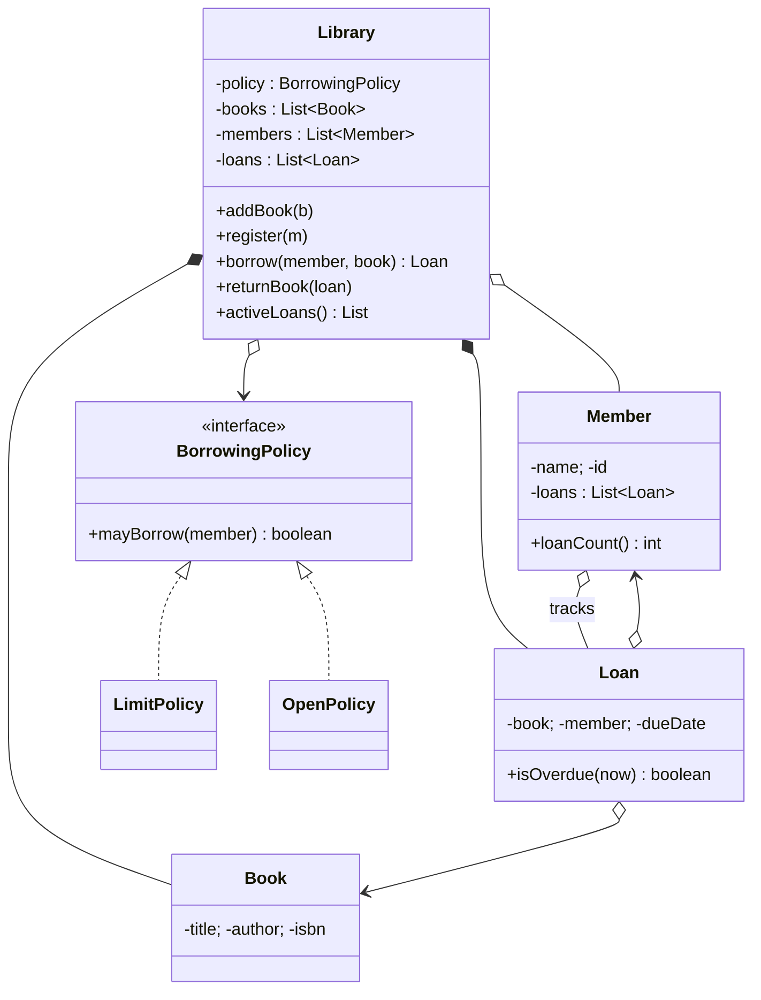
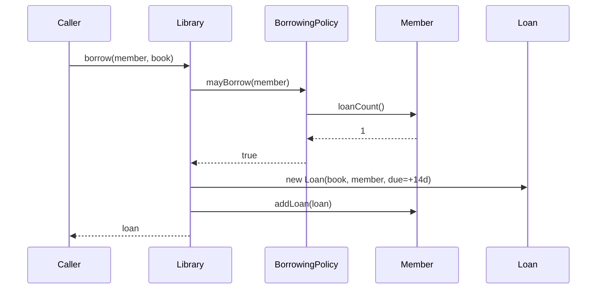

This capstone applies every idea from the course to one system: a
small **library management system**. Read the description, work
through the modeling steps with us, then write the missing pieces.

<Figure
  slug="oopj-capstone-library-cutout"
  alt="The Dataslope marmot mascot behind a small library desk, a cutaway building beside it showing book shelves and a loan ledger as connected modules"
/>

## The story

> A library has a catalog of *books*. People can become *members* of
> the library. Members may *borrow* books for a limited time. The
> library tracks every *loan* and can list which books are currently
> out and to whom. Different libraries enforce different *borrowing
> policies* (e.g. how many books one person may hold at once).

That paragraph contains everything we need.

## Step 1, find the objects

Underline the nouns. The candidates are:

- `Library`, coordinates everything
- `Book`, a thing on a shelf
- `Member`, a person registered with the library
- `Loan`, *a fact*: this book is out to this member, until this date
- `BorrowingPolicy`, *a rule*: who may borrow how much

Loans and policies are subtle and easy to miss. They're not nouns in
the strictest sense, but they're **first-class concepts in the
domain**, so they deserve their own classes. (If you reduced them to
fields on `Book` or methods on `Library`, the design would get
muddier.)

<Figure
  slug="oopj-capstone-library-system-step-1-find-objects-inline-cutout"
  alt="Nouns lifted out of a written brief as separate cards, two of them pulled from between the lines rather than off them"
  caption="The nouns in the brief are the first draft of your classes, and two of them are implied."
/>

## Step 2, assign responsibilities

Using the cards format from *Responsibility-Driven Design*:

| Class | Responsibilities | Collaborators |
| --- | --- | --- |
| `Book` | Know its title, author, and ISBN |, |
| `Member` | Know its name and id; know its current loans; count them | `Loan` |
| `Loan` | Know the borrowed book, the member, and the due date; know if overdue | `Book`, `Member` |
| `BorrowingPolicy` | Decide if a given member may borrow another book | `Member` |
| `Library` | Hold the catalog and members; create and track loans; enforce the policy | all of the above |

## Step 3, sketch the relationships

Two interesting design choices in that diagram:

1. **`BorrowingPolicy` is an interface.** Different libraries can
   plug in different rules without touching `Library`. This is
   programming to an interface (and the Strategy pattern again).
2. **`Loan` is a first-class object** that *aggregates* a book and a
   member. The `Member` also keeps a list of its own loans,
   bidirectional access, but `Loan` itself owns the due date and
   the "is overdue?" decision.

<Figure
  slug="oopj-capstone-library-system-step-3-sketch-relationships-inline-cutout"
  alt="Three plain boxes joined by cords, one of the cords carrying a small dated tag of its own"
  caption="The loan owns the due date, because it belongs to the pairing rather than to either side."
/>

## Step 4, message flow for borrowing

The conversation that happens when a member asks to borrow a book:

`Library` does *not* implement the policy itself. It asks. The
policy in turn asks the member how many loans they have. Nobody
reaches into anyone's fields.

## Step 5, build it

Most of the code is provided. You will finish two pieces:

1. `Loan.isOverdue(int nowDay)`, return whether the current day is
   strictly *after* the loan's due day.
2. `LimitPolicy.mayBorrow(Member m)`, return whether the member's
   current loan count is *strictly less than* the limit.

Read `Library.borrow(...)` carefully, it's the orchestration in
miniature.

<CodeBlock
  adapter="java"
  entryFilename="Main.java"
  files={[
    {
      filename: "Main.java",
      starterCode: `import java.util.Arrays;

public class Main {
  public static void main(String[] args) {
    Library lib = new Library(new LimitPolicy(2));

    Book b1 = new Book("Design Patterns", "GoF", "ISBN-1");
    Book b2 = new Book("Refactoring", "Fowler", "ISBN-2");
    Book b3 = new Book("OOSC", "Meyer", "ISBN-3");
    for (Book b : Arrays.asList(b1, b2, b3))
      lib.addBook(b);

    Member ada = new Member("Ada", 1);
    Member bob = new Member("Bob", 2);
    lib.register(ada);
    lib.register(bob);

    Loan l1 = lib.borrow(ada, b1, /*today*/ 1, /*loanDays*/ 14);
    Loan l2 = lib.borrow(ada, b2, /*today*/ 1, /*loanDays*/ 14);
    Loan l3 =
        lib.borrow(ada, b3, /*today*/ 1, /*loanDays*/ 14); // should be refused

    System.out.println("l1 issued? " + (l1 != null));
    System.out.println("l2 issued? " + (l2 != null));
    System.out.println("l3 issued? " + (l3 != null));

    System.out.println("active loans: " + lib.activeLoans().size());
    System.out.println("l1 overdue on day 10? " + l1.isOverdue(10));
    System.out.println("l1 overdue on day 20? " + l1.isOverdue(20));

    lib.returnBook(l1);
    System.out.println("after return, active: " + lib.activeLoans().size());

    Loan l4 = lib.borrow(ada, b3, /*today*/ 5, /*loanDays*/ 14);
    System.out.println("l4 issued? " + (l4 != null));
  }
}
`,
    },
    {
      filename: "Book.java",
      starterCode: `public class Book {
  private final String title;
  private final String author;
  private final String isbn;
  public Book(String title, String author, String isbn) {
    this.title = title;
    this.author = author;
    this.isbn = isbn;
  }
  public String title() { return title; }
  public String author() { return author; }
  public String isbn() { return isbn; }
}
`,
    },
    {
      filename: "Member.java",
      starterCode: `import java.util.ArrayList;
import java.util.List;

public class Member {
  private final String name;
  private final int id;
  private final List<Loan> loans = new ArrayList<>();

  public Member(String name, int id) {
    this.name = name;
    this.id = id;
  }

  public String name() { return name; }
  public int id() { return id; }

  public int loanCount() { return loans.size(); }
  public void addLoan(Loan loan) { loans.add(loan); }
  public void removeLoan(Loan loan) { loans.remove(loan); }
}
`,
    },
    {
      filename: "Loan.java",
      starterCode: `public class Loan {
  private final Book book;
  private final Member member;
  private final int dueDay; // simplified day counter

  public Loan(Book book, Member member, int dueDay) {
    this.book = book;
    this.member = member;
    this.dueDay = dueDay;
  }

  public Book book() { return book; }
  public Member member() { return member; }
  public int dueDay() { return dueDay; }

  public boolean isOverdue(int nowDay) {
    // TODO: return true iff nowDay is strictly after dueDay.
    return false;
  }
}
`,
      solutionCode: `public class Loan {
  private final Book book;
  private final Member member;
  private final int dueDay;

  public Loan(Book book, Member member, int dueDay) {
    this.book = book;
    this.member = member;
    this.dueDay = dueDay;
  }

  public Book book() { return book; }
  public Member member() { return member; }
  public int dueDay() { return dueDay; }

  public boolean isOverdue(int nowDay) { return nowDay > dueDay; }
}
`,
    },
    {
      filename: "BorrowingPolicy.java",
      starterCode: `public interface BorrowingPolicy {
  boolean mayBorrow(Member member);
}
`,
    },
    {
      filename: "LimitPolicy.java",
      starterCode: `public class LimitPolicy implements BorrowingPolicy {
  private final int max;
  public LimitPolicy(int max) { this.max = max; }

  @Override
  public boolean mayBorrow(Member member) {
    // TODO: return true iff member.loanCount() < max.
    return true;
  }
}
`,
      solutionCode: `public class LimitPolicy implements BorrowingPolicy {
  private final int max;
  public LimitPolicy(int max) { this.max = max; }

  @Override
  public boolean mayBorrow(Member member) {
    return member.loanCount() < max;
  }
}
`,
    },
    {
      filename: "OpenPolicy.java",
      starterCode: `public class OpenPolicy implements BorrowingPolicy {
  @Override
  public boolean mayBorrow(Member member) {
    return true;
  }
}
`,
    },
    {
      filename: "Library.java",
      starterCode: `import java.util.ArrayList;
import java.util.List;

public class Library {
  private final BorrowingPolicy policy;
  private final List<Book> books = new ArrayList<>();
  private final List<Member> members = new ArrayList<>();
  private final List<Loan> active = new ArrayList<>();

  public Library(BorrowingPolicy policy) { this.policy = policy; }

  public void addBook(Book b) { books.add(b); }
  public void register(Member m) { members.add(m); }

  public Loan borrow(Member m, Book b, int today, int loanDays) {
    if (!books.contains(b))
      return null;
    if (!policy.mayBorrow(m))
      return null;
    Loan loan = new Loan(b, m, today + loanDays);
    active.add(loan);
    m.addLoan(loan);
    books.remove(b); // book is off the shelf now
    return loan;
  }

  public void returnBook(Loan loan) {
    if (!active.remove(loan))
      return;
    loan.member().removeLoan(loan);
    books.add(loan.book());
  }

  public List<Loan> activeLoans() { return active; }
}
`,
    },
  ]}
  tests={[
    {
      id: "capstone-library",
      name: "Borrowing, policy enforcement, return, and overdue all work",
      expect: {
        stdoutLines: [
          "l1 issued? true",
          "l2 issued? true",
          "l3 issued? false",
          "active loans: 2",
          "l1 overdue on day 10? false",
          "l1 overdue on day 20? true",
          "after return, active: 1",
          "l4 issued? true",
        ],
        stdoutLinesExact: true,
      },
    },
  ]}
/>

## Step 6, read your own design

If you completed the exercise, take a moment to look at what you
just built. Notice that:

- Every class has a **small, focused responsibility**. None of them
  exceeded 30 or 40 lines.
- `Library` is the *orchestrator*. It owns very little business
  logic; it sends messages.
- `BorrowingPolicy` is a **plug-in**. Replacing `LimitPolicy(2)` in
  `Main` with `new OpenPolicy()` changes the library's behavior
  without changing a single line of `Library`.
- `Loan` is a **first-class object**. The "is overdue?" decision
  lives where the data lives.
- Nothing reaches into anyone else's fields. Every interaction is a
  message.

<Figure
  slug="oopj-capstone-library-system-step-6-read-own-inline-cutout"
  alt="A finished cabinet with its plan pinned open beside it, every drawer in the cabinet answering to a shape on the plan"
  caption="A design is finished when the objects on the page answer to the plan you sketched first."
/>

That is what a *pure-OOP* model looks like. The exact same shape
scales to a real library system with thousands of books and
hundreds of members, simply by changing the storage of `books`,
`members`, and `active` from in-memory lists to a database, and
because that storage is hidden behind `Library`'s methods, no other
class would notice.

## Stretch ideas (optional)

If you want to keep going, try any of these:

- Add a `Reservation` class: a member can reserve a book that's
  currently checked out and be next in line when it returns.
- Add a `WeekendPolicy` that *doubles* the allowed loan count on
  weekends, demonstrating polymorphic policy composition.
- Replace the `int today/loanDays` with a `java.time.LocalDate` and
  pass an injected `Clock` into `Library`. This is a real-world
  pattern for testability.
- Introduce a `Catalog` class that owns the book list and an `Audit`
  class that records every borrow and return, splitting
  `Library`'s remaining work along its natural seams.

Each of those is a textbook responsibility-driven extension.

## Test your understanding

<MultipleChoice
  markdown={`Why is \`BorrowingPolicy\` declared as an interface in this design?

- Because Java requires every \`Library\` to use one
  > Java requires nothing of the sort.
- Because Java forbids classes from holding boolean methods
  > It doesn't.
- To save memory
  > Interfaces and concrete classes use comparable amounts of memory.
- [o] So that different libraries can plug in different policies without modifying \`Library\`
  > This is "program to an interface" and the Strategy pattern.`}
/>

<MultipleChoice
  markdown={`Why does the \`Loan\` class own the \`isOverdue(...)\` method instead of \`Library\` owning it?

- [o] The relevant data (the due date) lives on \`Loan\`, so the *behavior* belongs there too, that's "tell, don't ask"
  > Behavior follows data; this avoids feature envy.
- To make \`Loan\` extend \`Library\`
  > There is no inheritance between them in this design.
- \`Library\` is too small to hold any methods
  > Library has plenty of methods.
- Java forbids \`Library\` from having boolean methods
  > It doesn't.`}
/>

<MultipleChoice
  markdown={`If we wanted to add a "weekend libraries allow more loans" rule, the cleanest change in this design is:

- Modify \`LimitPolicy\` to know about weekends
  > That muddles two policies and breaks the single-responsibility idea.
- Add a giant \`if\` in \`Library.borrow\` that checks the day of the week
  > That defeats the whole purpose of having a policy abstraction.
- [o] Write a new class \`WeekendPolicy implements BorrowingPolicy\` and pass it into \`Library\`'s constructor, \`Library\` itself does not change
  > This is the open-closed principle and polymorphism in action.
- Add a new field to \`Member\`
  > The change is about a rule, not about member state.`}
/>
