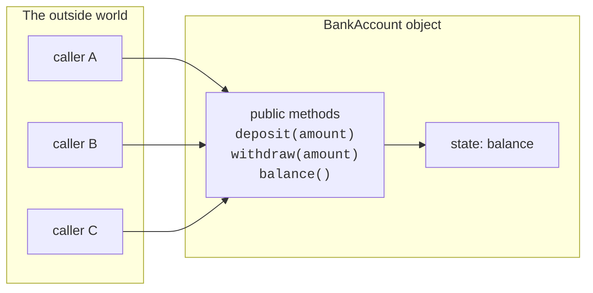
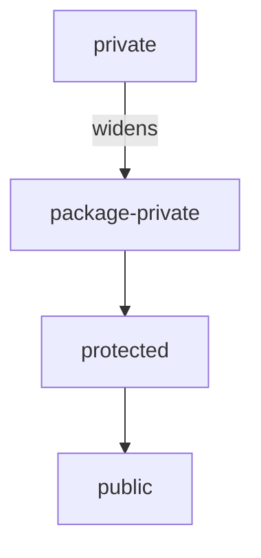
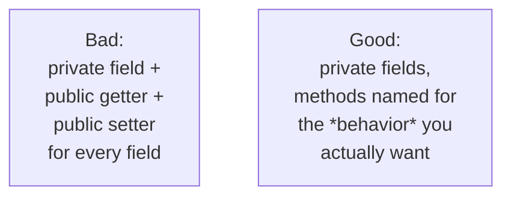

**Encapsulation** is the practice of *hiding an object's internal
state* and only allowing the world to interact with it through a
small, deliberate set of methods. It is the first and most important
discipline of OOP. Everything else in this course, inheritance,
polymorphism, composition, design patterns, only pays off if your
objects are well-encapsulated.

The word itself is a metaphor. A capsule has a shell that protects
what is inside. From the outside you can swallow the capsule, but you
cannot reach the powder directly. An object is the same: it has a
shell of methods, and the data inside is none of your business.

<Figure
  slug="oopj-encapsulation-cutout"
  alt="A smooth sealed capsule on a platform with three small labelled buttons on its shell, its inner contents visible only through a narrow window"
/>

## Why hide state at all?

Recall the procedural pain from *The Software Crisis*: when any
function can write to any data, bugs become impossible to localize
and rules become impossible to enforce. Encapsulation is the direct
fix.

<Figure
  slug="oopj-encapsulation-hide-state-at-inline-cutout"
  alt="A cabinet with a solid back, hands able to reach it only through two front handles"
  caption="The state is sealed in; the only way to it is through the methods."
/>

All access to the balance goes through the methods. Inside `deposit()`
and `withdraw()`, the class can enforce its rules, no negative deposits,
no overdrafts, once, in one place.

## The two failure modes

Look at this *anti-example* and notice every way it can go wrong.

<CodeBlock
  adapter="java"
  files={[
    {
      filename: "main.java",
      starterCode: `public class Main {
  public static void main(String[] args) {
    OpenAccount a = new OpenAccount();
    a.balance = 100;
    a.balance = -1_000_000; // Nobody stopped us.
    a.balance += 50;        // Outsiders are doing the math.
    System.out.println(a.balance);
  }
}

class OpenAccount {
  public double balance; // public field, total exposure
}
`,
    },
  ]}
/>

There are two problems here, and they are different:

1. **No invariants are enforced.** Negative balances are illegal in
   our domain, but `OpenAccount` doesn't say so. Every caller has to
   remember the rule.
2. **The internal representation is part of the public API.** If
   tomorrow we decide to store the balance in *cents* (as an `int`)
   instead of *dollars* (as a `double`), *every caller* breaks.

Encapsulation fixes both at once.

<CodeBlock
  adapter="java"
  files={[
    {
      filename: "main.java",
      starterCode: `public class Main {
  public static void main(String[] args) {
    BankAccount a = new BankAccount();
    a.deposit(100);
    a.deposit(50);
    boolean ok = a.withdraw(1_000_000);
    System.out.println("withdraw allowed? " + ok);
    System.out.println("balance: " + a.balance());
  }
}

class BankAccount {
  private double balance; // hidden, outsiders cannot touch it

  public void deposit(double amount) {
    if (amount <= 0)
      throw new IllegalArgumentException("deposit must be positive");
    balance += amount;
  }

  public boolean withdraw(double amount) {
    if (amount <= 0)
      throw new IllegalArgumentException("withdraw must be positive");
    if (amount > balance)
      return false; // refuse rather than go negative
    balance -= amount;
    return true;
  }

  public double balance() { return balance; }
}
`,
    },
  ]}
/>

Now the rule "balance is never negative" is *guaranteed by the
class*. There is no path through the public API that can break it.
And the internal representation (`double balance`) can change without
breaking a single caller, because callers never see it.

## Access modifiers in Java

Java has four access levels that control where a member can be seen
from. You will spend 95% of your time using `private` and `public`,
but it is worth knowing all four.

| Modifier | Visible from |
| --- | --- |
| `private` | Same class only |
| *(no modifier)* | Same package only (called *package-private*) |
| `protected` | Same package, **and** subclasses anywhere |
| `public` | Anywhere |

The default discipline is: **make everything as private as you can,
and widen only when a real need appears.** A field should be `private`
unless you have a specific reason. A helper method that is only called
from inside the class should be `private`. Constructors are often
`public` but can be `private` if you want to force construction
through a factory method.

## Getters, setters, and the temptation to over-expose

A **getter** is a method that lets the outside world read a value
(`public double balance()`). A **setter** is a method that lets the
outside world write a value (`public void setBalance(double)`).

A common beginner mistake is to write a getter and a setter for
*every single field*, and call that "encapsulation." It isn't. It
mostly just makes your fields public with extra typing.

A `BankAccount` should not have `setBalance(double)`. That throws
away the whole point. It should have `deposit()` and `withdraw()`,
methods named after *what the world is actually allowed to do.* The
right question to ask when designing a class is **"what should
callers be able to do?"**, not **"what fields does it have?"**.

<Callout type="info" title="`final` fields lean on encapsulation">
`private final` is a very common combination: the field is invisible
to outsiders, and once the constructor sets it, the *class itself*
cannot change it either. This makes the object's identity-defining
data effectively immutable, which removes whole classes of bug.
</Callout>

## A bigger encapsulation example

Let's encapsulate a slightly richer object: a `Thermostat` with an
allowed temperature range and a current setting. Outsiders can
*request* a new setting, but the thermostat enforces its own limits.

<Figure
  slug="oopj-encapsulation-inline-cutout"
  alt="A sealed cabinet with its working parts hidden inside and two clean handles on its face, a figure using only the handles"
  caption="Outsiders use the handles, and the object keeps its own rules."
/>

<CodeBlock
  adapter="java"
  entryFilename="Main.java"
  files={[
    {
      filename: "Main.java",
      starterCode: `public class Main {
  public static void main(String[] args) {
    Thermostat t = new Thermostat(60, 80, 68);
    System.out.println(t.describe());

    t.setTarget(75);
    System.out.println(t.describe());

    t.setTarget(120); // out of range, clamped
    System.out.println(t.describe());

    t.setTarget(-10); // out of range, clamped
    System.out.println(t.describe());
  }
}
`,
    },
    {
      filename: "Thermostat.java",
      starterCode: `public class Thermostat {
  private final int minF;
  private final int maxF;
  private int target; // not final, changes over time

  public Thermostat(int minF, int maxF, int initialTarget) {
    if (minF >= maxF)
      throw new IllegalArgumentException("minF must be < maxF");
    this.minF = minF;
    this.maxF = maxF;
    this.target = clamp(initialTarget);
  }

  public void setTarget(int desired) { this.target = clamp(desired); }

  public int target() { return target; }

  public String describe() {
    return "Thermostat[" + minF + ".." + maxF + "F, target=" + target + "F]";
  }

  // private helper: enforces the invariant in ONE place
  private int clamp(int value) {
    if (value < minF)
      return minF;
    if (value > maxF)
      return maxF;
    return value;
  }
}
`,
    },
  ]}
/>

Three things to notice:

1. `Thermostat` has *no* setter that lets the caller bypass `clamp`.
   The only way to change `target` is through `setTarget`, which
   always clamps.
2. `clamp` is `private` because it is internal plumbing. Callers
   don't need it and shouldn't see it.
3. `minF` and `maxF` are `final`. The thermostat's *range* is part
   of its identity and never changes after construction.

That is a fully encapsulated object. From the outside it looks tiny;
inside it protects a clear invariant.

## Practice: encapsulate this!

<ChallengeCard
  adapter="java"
  title="Encapsulate a Wallet"
  instructions={`Implement a \`Wallet\` class.

Requirements:

- A \`private\` field \`cents\` that starts at \`0\`.
- \`add(int cents)\` increases the balance. It must throw \`IllegalArgumentException\` if \`cents <= 0\`.
- \`spend(int cents)\` returns \`true\` and decreases the balance if there is enough; otherwise it returns \`false\` and does *not* change the balance. It must also throw \`IllegalArgumentException\` if \`cents <= 0\`.
- \`balance()\` returns the current balance.

\`Main.java\` runs a fixed scenario and is expected to print exactly:

\`\`\`
spend1=true
spend2=false
balance=20
\`\`\``}
  entryFilename="Main.java"
  files={[
    {
      filename: "Main.java",
      starterCode: `public class Main {
  public static void main(String[] args) {
    Wallet w = new Wallet();
    w.add(100);
    boolean s1 = w.spend(80);
    boolean s2 = w.spend(999);
    System.out.println("spend1=" + s1);
    System.out.println("spend2=" + s2);
    System.out.println("balance=" + w.balance());
  }
}
`,
    },
    {
      filename: "Wallet.java",
      starterCode: `public class Wallet {
  // TODO: implement the Wallet class
}
`,
      solutionCode: `public class Wallet {
  private int cents = 0;

  public void add(int amount) {
    if (amount <= 0)
      throw new IllegalArgumentException("must be positive");
    cents += amount;
  }

  public boolean spend(int amount) {
    if (amount <= 0)
      throw new IllegalArgumentException("must be positive");
    if (amount > cents)
      return false;
    cents -= amount;
    return true;
  }

  public int balance() { return cents; }
}
`,
    },
  ]}
  tests={[
    {
      id: "wallet",
      name: "Behaves correctly under the test scenario",
      expect: {
        stdoutLines: ["spend1=true", "spend2=false", "balance=20"],
        stdoutLinesExact: true,
      },
    },
  ]}
/>

## Test your understanding

<MultipleChoice
  markdown={`Why is it a bad idea to make a field \`public\`?

- Public fields cannot be read
  > They can be read and written from anywhere, that's the problem.
- [o] Any code anywhere can modify the field, so the class cannot enforce its own invariants
  > Encapsulation exists precisely so the *class* owns the rules about its data.
- The compiler refuses to compile a class with public fields
  > It compiles fine; the issue is design.
- Public fields take up more memory
  > Access modifiers do not change storage size.`}
/>

<MultipleChoice
  markdown={`Which is the *best* sign that a class is well-encapsulated?

- It has a getter and setter for every field
  > That is often a sign of *bad* encapsulation, the API mirrors the storage instead of the behavior.
- It uses the keyword \`final\` somewhere
  > \`final\` helps but is not the central criterion.
- Its constructors throw exceptions on invalid input
  > Helpful, but only part of the picture.
- [o] Its public methods are named for behaviors callers actually need, and its fields are \`private\`
  > Encapsulation is about exposing *behavior*, not storage.`}
/>

<MultipleChoice
  markdown={`In the \`Thermostat\` example, why is \`clamp\` declared \`private\`?

- [o] Because it is internal plumbing that callers never need to see, and hiding it keeps the public API small and intentional
  > Keeping helpers private prevents accidental coupling to internal details.
- Because \`private\` methods run faster
  > Performance is not why.
- Because \`public\` methods cannot call \`private\` ones
  > Public methods *can* call private methods of the same class, that is normal.
- Because Java requires helper methods to be private
  > It does not.`}
/>
