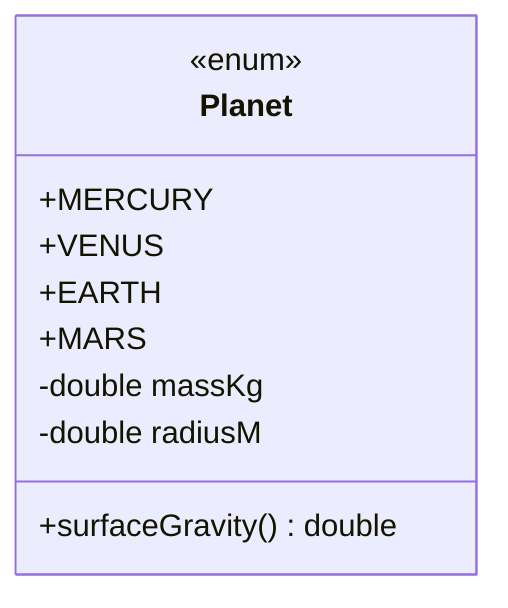

Lots of values in our programs come from **small, fixed sets**: days
of the week, traffic-light colors, payment methods, user roles,
HTTP methods. You could represent each by an `int` or a `String`,
and at first that even feels natural, but you would be throwing
away type safety and inviting a class of avoidable bugs.

Java's **`enum`** is the right tool. It is a class whose instances
are defined once, in the class itself, and *cannot be created
anywhere else*. That makes enums one of the most pleasant features
in Java to use.

<Figure
  slug="oopj-enums-cutout"
  alt="A sealed dial with exactly four fixed detent positions on a platform, no other setting reachable"
/>

## The problem enums solve

| Representation | What you get |
| --- | --- |
| A `String`, `"red"` / `"amber"` / `"green"` (or `"Red"`, `"RED"`, `"gren"`!) | Typos, invalid values, no autocomplete |
| An `int`, `0` / `1` / `2` | Magic numbers, no meaning, out-of-range values |
| An `enum`, `RED`, `AMBER`, `GREEN` | Type-safe, self-documenting, exhaustive |

<CodeBlock
  adapter="java"
  files={[
    {
      filename: "main.java",
      starterCode: `public class Main {
  public static void main(String[] args) {
    respond("red"); // What if you typo "Red"?
    respond("amber");
    respond("orange"); // not a real state, no warning!
  }

  static void respond(String light) {
    if (light.equals("red"))
      System.out.println("STOP");
    else if (light.equals("amber"))
      System.out.println("SLOW");
    else if (light.equals("green"))
      System.out.println("GO");
    else
      System.out.println("???");
  }
}
`,
    },
  ]}
/>

The `String` version compiles fine even for nonsense values. The
compiler cannot help you. Let's see the same idea with an enum.

<CodeBlock
  adapter="java"
  files={[
    {
      filename: "main.java",
      starterCode: `public class Main {
  public static void main(String[] args) {
    respond(Light.RED);
    respond(Light.AMBER);
    respond(Light.GREEN);
    // respond(Light.ORANGE);  // <- would not compile; no such value
  }

  static void respond(Light light) {
    switch (light) {
    case RED:
      System.out.println("STOP");
      break;
    case AMBER:
      System.out.println("SLOW");
      break;
    case GREEN:
      System.out.println("GO");
      break;
    }
  }
}

enum Light { RED, AMBER, GREEN }
`,
    },
  ]}
/>

Three concrete benefits in that small change:

1. **Type safety.** `respond(Light)` cannot be called with an
   arbitrary string. The compiler enforces that you pass a real
   `Light`.
2. **Exhaustiveness aid.** When you add `FLASHING` to `Light`, the
   compiler can warn you (in IDEs) that the `switch` no longer
   handles every case.
3. **Self-documenting.** `Light.RED` is impossible to misread.

## Enums are objects too

Java enums are not just integer codes with names. **Each enum
constant is a full object**, and the enum *type* is a class. That
means each constant can carry its own state and define its own
behavior. The example below, planets that each know their own
surface gravity, is a small classic: it comes from the official
Java tutorial, written when enums arrived in Java 5 to show that
this feature was something far richer than C's integer enums.

<Figure
  slug="oopj-enums-inline-cutout"
  alt="A dial with exactly four detents and no positions between them, its pointer resting firmly in one, and four blocks set out in a row beside it, one answering each detent"
/>

<CodeBlock
  adapter="java"
  files={[
    {
      filename: "main.java",
      starterCode: `public class Main {
  public static void main(String[] args) {
    for (Planet p : Planet.values()) {
      System.out.printf("%-8s g = %.2f m/s^2%n", p, p.surfaceGravity());
    }
  }
}

enum Planet {
  MERCURY(3.303e+23, 2.4397e6),
  VENUS(4.869e+24, 6.0518e6),
  EARTH(5.976e+24, 6.37814e6),
  MARS(6.421e+23, 3.3972e6);

  private static final double G = 6.67300E-11;
  private final double massKg;
  private final double radiusM;

  Planet(double massKg,
         double radiusM) { // enum constructor: package-private by default
    this.massKg = massKg;
    this.radiusM = radiusM;
  }

  public double surfaceGravity() { return G * massKg / (radiusM * radiusM); }
}
`,
    },
  ]}
/>

A few things to notice:

- The constants `MERCURY, VENUS, EARTH, MARS` are listed first,
  followed by a semicolon, *then* the rest of the class body.
- Enums have private final fields and a constructor, just like
  ordinary classes. You cannot call the constructor yourself,
  Java calls it once for each declared constant.
- Methods like `surfaceGravity()` work like any other instance
  method. Each enum constant gets to compute its own answer.

## Enums with per-constant behavior

For more variation, each enum constant can *override* methods to
behave differently. This is the closest thing in Java to "an
interface implemented by a fixed list of objects."

<Figure
  slug="oopj-enums-problem-enums-solve-inline-cutout"
  alt="A dial with exactly four detents beside a free-spinning dial with none"
/>

<CodeBlock
  adapter="java"
  files={[
    {
      filename: "main.java",
      starterCode: `public class Main {
  public static void main(String[] args) {
    for (Operation op : Operation.values()) {
      System.out.println("10 " + op.symbol() + " 3 = " + op.apply(10, 3));
    }
  }
}

enum Operation {
  PLUS("+") {
    public int apply(int a, int b) { return a + b; }
  },
  MINUS("-") {
    public int apply(int a, int b) { return a - b; }
  },
  TIMES("*") {
    public int apply(int a, int b) { return a * b; }
  },
  DIVIDE("/") {
    public int apply(int a, int b) { return a / b; }
  };

  private final String symbol;
  Operation(String symbol) { this.symbol = symbol; }

  public String symbol() { return symbol; }
  public abstract int apply(int a, int b); // each constant must implement
}
`,
    },
  ]}
/>

Each enum constant is implementing the `abstract apply` method in
its own way. The set of operations is fixed; the *behavior* of each
is encapsulated with the constant. This is a clean, very-OOP
alternative to a giant `switch` over a `String` operator.

## Common useful methods that enums get for free

| Method | What it does |
| --- | --- |
| `values()` | Returns an array of all constants, in declaration order |
| `valueOf(String)` | Returns the constant with the given name (throws if missing) |
| `name()` | Returns the constant's name as a `String` |
| `ordinal()` | Returns the constant's position (0-based), useful, but use sparingly |

Concretely, for the `Light` enum:

| Call | Result |
| --- | --- |
| `Light.values()` | `[RED, AMBER, GREEN]` |
| `Light.valueOf("AMBER")` | `AMBER` |
| `Light.RED.name()` | `"RED"` |
| `Light.GREEN.ordinal()` | `2` |

## A small modeling example: payment methods

Even a slightly more interesting business concept fits beautifully in
an enum:

<CodeBlock
  adapter="java"
  entryFilename="Main.java"
  files={[
    {
      filename: "Main.java",
      starterCode: `public class Main {
  public static void main(String[] args) {
    double subtotal = 200.00;
    for (PaymentMethod m : PaymentMethod.values()) {
      double charged = m.surchargedTotal(subtotal);
      System.out.printf("%-12s -> %.2f%n", m.label(), charged);
    }
  }
}
`,
    },
    {
      filename: "PaymentMethod.java",
      starterCode: `public enum PaymentMethod {
  CASH("Cash", 0.00),
  DEBIT_CARD("Debit card", 0.01),
  CREDIT_CARD("Credit card", 0.025),
  CRYPTO("Crypto wallet", 0.005);

  private final String label;
  private final double feeRate;

  PaymentMethod(String label, double feeRate) {
    this.label = label;
    this.feeRate = feeRate;
  }

  public String label() { return label; }

  public double surchargedTotal(double subtotal) {
    return subtotal * (1.0 + feeRate);
  }
}
`,
    },
  ]}
/>

## Practice

<ChallengeCard
  adapter="java"
  title="Day of the week, with a weekend test"
  instructions={`Define an enum \`Day\` with values \`MONDAY, TUESDAY, WEDNESDAY, THURSDAY, FRIDAY, SATURDAY, SUNDAY\` and an instance method \`isWeekend()\` returning \`true\` only for \`SATURDAY\` and \`SUNDAY\`.

The provided \`Main\` prints each day along with whether it is a weekend. Expected output:

\`\`\`
MONDAY weekend? false
TUESDAY weekend? false
WEDNESDAY weekend? false
THURSDAY weekend? false
FRIDAY weekend? false
SATURDAY weekend? true
SUNDAY weekend? true
\`\`\``}
  entryFilename="Main.java"
  files={[
    {
      filename: "Main.java",
      starterCode: `public class Main {
  public static void main(String[] args) {
    for (Day d : Day.values()) {
      System.out.println(d + " weekend? " + d.isWeekend());
    }
  }
}
`,
    },
    {
      filename: "Day.java",
      starterCode: `public enum Day {
  // TODO: list the seven days, then define isWeekend()
}
`,
      solutionCode: `public enum Day {
  MONDAY,
  TUESDAY,
  WEDNESDAY,
  THURSDAY,
  FRIDAY,
  SATURDAY,
  SUNDAY;

  public boolean isWeekend() { return this == SATURDAY || this == SUNDAY; }
}
`,
    },
  ]}
  tests={[
    {
      id: "day-weekend",
      name: "Identifies weekends correctly",
      expect: {
        stdoutLines: [
          "MONDAY weekend? false",
          "TUESDAY weekend? false",
          "WEDNESDAY weekend? false",
          "THURSDAY weekend? false",
          "FRIDAY weekend? false",
          "SATURDAY weekend? true",
          "SUNDAY weekend? true",
        ],
        stdoutLinesExact: true,
      },
    },
  ]}
/>

## Test your understanding

<MultipleChoice
  markdown={`Which is the strongest reason to prefer an enum over a \`String\` for a fixed set of values like traffic-light colors?

- [o] The compiler can guarantee at compile time that only valid values are passed; typos and made-up values are rejected
  > Type safety is the headline win.
- Strings cannot be \`switch\`-ed on
  > They can, since Java 7.
- Enums use less memory than strings
  > Memory difference is negligible and not the point.
- Enums automatically log their values to disk
  > They do nothing of the sort.`}
/>

<MultipleChoice
  markdown={`Which of these is **true** about Java enums?

- Each enum constant is just an integer with a label
  > Each constant is a full object.
- [o] Each enum constant is an object, and the enum type may have its own fields, constructor, and methods
  > Enums are essentially classes with a closed list of instances.
- You can create new enum instances with \`new\` at runtime
  > You cannot. Enum instances are fixed at declaration.
- Enums cannot have fields or methods
  > They can, they are a kind of class.`}
/>

<MultipleChoice
  markdown={`What does \`Operation.values()\` return?

- A single random constant
  > No randomness involved.
- The number of constants in the enum
  > That would be \`Operation.values().length\`.
- A \`Set\` of constants
  > It returns an array, not a set.
- [o] An array containing every declared constant, in the order they were declared
  > This is the standard way to iterate over an enum's constants.`}
/>
