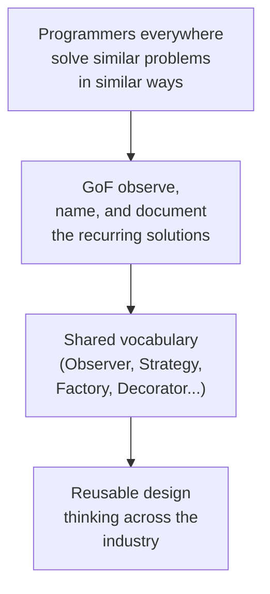
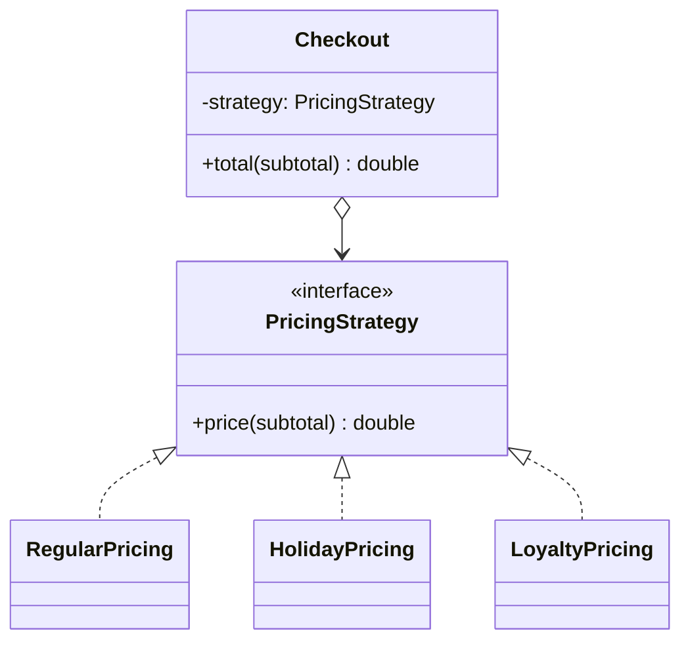
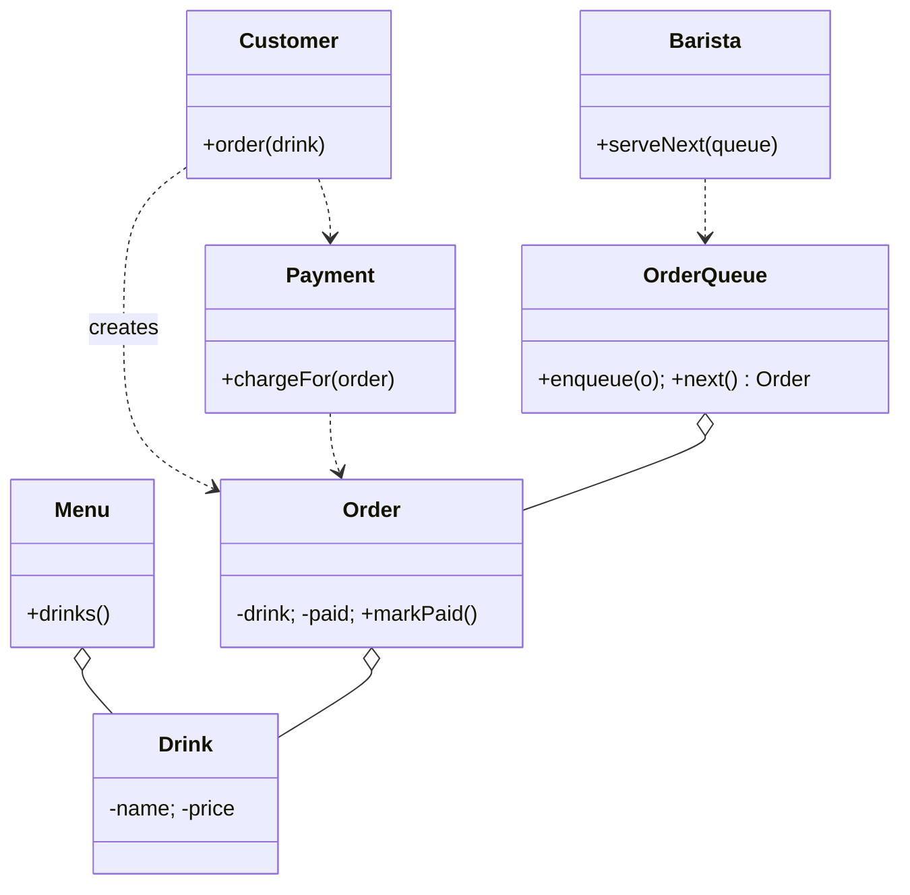

By the late 1980s, object-oriented languages were everywhere, C++,
Smalltalk, Objective-C, Eiffel, and object-oriented programmers were
making a curious discovery. Across companies, across industries,
across countries, they kept *solving the same design problems*. And
they kept solving them in *the same handful of ways*.

A button on a screen, a thermostat in a house, and a row in a
spreadsheet all needed the same trick: when one thing changes, tell
everything that cares. Game engines, GUIs, and chat systems all
needed a way to spawn the right kind of object at runtime without
hard-coding which one. Compilers and report generators and shell
parsers all needed a way to walk a tree of structured data and *do
something* at each node.

Programmers gave these recurring solutions informal names, *observer*,
*factory*, *visitor*, and traded them in conference talks and
hallways like folklore.

<Figure
  slug="oopj-gang-of-four-cutout"
  alt="A shelf of four bound volumes on a platform with repeating identical structural motifs lifting out of them into the air"
/>

## The book that gave the folklore a voice

In **1994**, four authors, **Erich Gamma, Richard Helm, Ralph
Johnson, and John Vlissides**, published a book called
***Design Patterns: Elements of Reusable Object-Oriented Software***.
They became known, with affection, as the **Gang of Four**, or
**GoF**, a tongue-in-cheek nickname borrowed from the infamous
Chinese political faction, pinned on them because nobody wanted to
keep saying all four surnames.

The book did not invent the patterns. It *cataloged* them: 23 of them,
each with a name, a problem, a solution structure, and the trade-offs
involved. For the first time, two programmers could say "let's use
**Strategy** here" and *both know what the other meant*, even if
they'd never met. The catalog struck a nerve: it became one of the
best-selling computer science books ever published and has never been
out of print since.

The authors themselves kept shaping how you program today. Erich
Gamma went on to co-write **JUnit** with Kent Beck, the testing
framework that spawned imitations in nearly every language, then led
the development of the **Eclipse** IDE's Java tooling, and later
moved to Microsoft to lead the team that built **Visual Studio
Code**. If you have ever run a unit test or opened VS Code, you have
used software by a Gang of Four member.

<Callout type="info" title="A note on the patterns themselves">
This is **not** a design-patterns course. We will not teach you all 23
patterns. The GoF book matters here because of *what it did to how
programmers think*, not because you need to memorize Memento and
Mediator. Almost every modern OOP language, library, and framework
borrows its vocabulary from this book.
</Callout>

## Why patterns mattered for *reusability*

The GoF subtitle was *Elements of Reusable Object-Oriented Software*.
That word, **reusable**, is the point. The whole book is organized
around a small number of design principles that make software easier
to reuse and to change:

1. **Program to an interface, not an implementation.** Depend on
   *what an object does*, not on *which class it is*.
2. **Favor object composition over class inheritance.** Build new
   behavior by plugging objects together, not by extending tall class
   trees.
3. **Encapsulate the things that vary.** Find the part of your design
   most likely to change, and put it behind a stable interface.

These three sentences are arguably the most important thing the book
left behind. Tape them to your monitor.

## A tiny taste: Strategy

To make the GoF style concrete, here is one of the simplest patterns
in the book: **Strategy**. The problem: you have several
interchangeable ways to do something (sort, compress, price, render),
and you want to swap them at runtime without `if`/`switch` chains.

The solution: define an interface for "the thing that varies," and
let each algorithm be a class that implements it.

<CodeBlock
  adapter="java"
  entryFilename="Main.java"
  files={[
    {
      filename: "Main.java",
      starterCode: `public class Main {
  public static void main(String[] args) {
    double subtotal = 100.0;

    Checkout regular = new Checkout(new RegularPricing());
    Checkout holiday = new Checkout(new HolidayPricing(0.20));
    Checkout loyalty = new Checkout(new LoyaltyPricing(15));

    System.out.println("Regular: $" + regular.total(subtotal));
    System.out.println("Holiday: $" + holiday.total(subtotal));
    System.out.println("Loyalty: $" + loyalty.total(subtotal));
  }
}
`,
    },
    {
      filename: "PricingStrategy.java",
      starterCode: `public interface PricingStrategy {
  double price(double subtotal);
}
`,
    },
    {
      filename: "RegularPricing.java",
      starterCode: `public class RegularPricing implements PricingStrategy {
  public double price(double subtotal) { return subtotal; }
}
`,
    },
    {
      filename: "HolidayPricing.java",
      starterCode: `public class HolidayPricing implements PricingStrategy {
  private final double discount; // e.g. 0.20 = 20% off
  public HolidayPricing(double discount) { this.discount = discount; }
  public double price(double subtotal) { return subtotal * (1.0 - discount); }
}
`,
    },
    {
      filename: "LoyaltyPricing.java",
      starterCode: `public class LoyaltyPricing implements PricingStrategy {
  private final double flatOff;
  public LoyaltyPricing(double flatOff) { this.flatOff = flatOff; }
  public double price(double subtotal) {
    return Math.max(0.0, subtotal - flatOff);
  }
}
`,
    },
    {
      filename: "Checkout.java",
      starterCode: `public class Checkout {
  private final PricingStrategy strategy;
  public Checkout(PricingStrategy strategy) { this.strategy = strategy; }
  public double total(double subtotal) { return strategy.price(subtotal); }
}
`,
    },
  ]}
/>

Compare what just happened against an equivalent procedural function
that takes a `String mode` parameter and switches on it. With the
strategy version:

- `Checkout` does not care how many pricing schemes exist.
- A new pricing scheme is added by *creating a new class*, not by
  editing the existing ones.
- Each pricing scheme is its own testable unit.

You are programming to an interface (`PricingStrategy`), favoring
composition (a `Checkout` *has a* strategy), and encapsulating the
part that varies (the pricing algorithm). All three GoF principles in
one tiny example.

## What "reusable" really means

A common misconception is that "reusable" means "I can copy this code
into another project." That is the weakest form of reuse, sometimes
called **copy-paste reuse**, and it doesn't scale.

What the GoF and the OOP tradition mean by *reusable* is bigger:

| Level of reuse | What you reuse |
| --- | --- |
| **Code reuse** | A class or method you call from many places |
| **Library reuse** | A package of classes used across many projects |
| **Design reuse** | A *shape* (a pattern) you can apply to brand-new problems |
| **Architecture reuse** | A *style* of organizing whole systems (e.g., layered, event-driven) |

OOP, at its best, supports all four. The lower two come essentially
for free from classes and packages. The upper two are where the GoF
made the biggest difference: they gave us names for the shapes.

## A small responsibility puzzle

Without writing any code, look at this paragraph and decide which
*objects* might exist and which *responsibilities* each might own.

> A coffee shop has a menu of drinks. A barista takes an order from a
> customer, the customer pays, and the order is placed on a queue
> until the barista has time to make it.

There are at least these candidates: `Menu`, `Drink`, `Customer`,
`Barista`, `Order`, `OrderQueue`, `Payment`. Each one knows *some*
things and does *some* things. Resist the temptation to put all the
logic on `Barista` just because the barista does most of the visible
work, give the `OrderQueue` its own behaviors, give `Order` its own
"is this paid?" logic, and so on.

You are not graded on the exact diagram. You are practicing
**responsibility-driven design**, the GoF mindset: each object owns
the smallest, most cohesive slice of behavior that makes sense.

We will return to this exercise more formally later in the course.

## Test your understanding

<MultipleChoice
  markdown={`Who are the *Gang of Four*?

- Four early Smalltalk designers at Xerox PARC
  > That team includes Kay, Ingalls, and Goldberg, but is not the Gang of Four.
- [o] Erich Gamma, Richard Helm, Ralph Johnson, and John Vlissides, authors of *Design Patterns* (1994)
  > They are the four authors of the book that named and cataloged the classic OOP design patterns.
- Four students who founded a software consultancy in the 1970s
  > No, the term refers specifically to the authors of *Design Patterns*.
- Four engineers credited with creating the Java language
  > Java was led by James Gosling at Sun Microsystems, that team is not the GoF.`}
/>

<MultipleChoice
  markdown={`Which design principle is most strongly associated with the GoF book?

- "Always inherit from a base class instead of composing"
  > The GoF actually argue the opposite.
- [o] "Favor object composition over class inheritance"
  > This is one of the book's most famous and frequently cited principles.
- "Avoid interfaces, they add too much indirection"
  > GoF heavily favor programming to interfaces.
- "Make every method static so it is easier to call"
  > Static-heavy designs run *against* OOP, which is about objects with state and behavior.`}
/>

<MultipleChoice
  markdown={`In the Strategy example, why is adding a new pricing scheme (say, *StudentPricing*) cleaner than adding a new \`case\` to a big \`switch\`?

- Because the JVM cannot compile \`switch\` statements
  > It can.
- Because a new class always runs faster than a \`switch\`
  > Performance is not the point here; clarity and change-safety are.
- [o] Because the new scheme is added by *creating a new class*, leaving the existing \`Checkout\` and other pricing classes untouched and re-testable
  > This is the open–closed idea in practice: open for extension, closed for modification.
- Because \`switch\` is not allowed in object-oriented languages
  > It is fully allowed; the issue is design quality at scale.`}
/>
