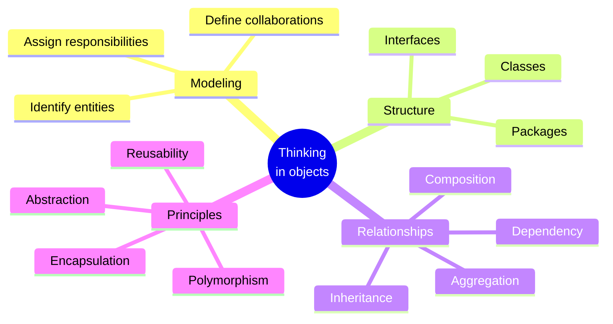

Welcome to **Object-Oriented Programming Blueprint with Java**, a course
about *thinking in objects*. It is designed for students of computer
science who are meeting object-oriented programming for the first time
and who want to understand *why* it exists, not just how to type its
syntax.

Java is the vehicle, not the destination. We use it because it forces
you to be explicit: every value is part of a class, every responsibility
lives somewhere on purpose, and every relationship between objects has
a name. By the end of the course you should be able to look at a
real-world problem, a library, a hospital ward, a vending machine, a
ride-share system, and **decompose it into a small society of
collaborating objects**.

<Figure
  slug="a-risograph-of-a-blueprint"
  alt="A risograph-style architectural blueprint, a class is the plan you build objects from"
  priority
/>

## Try it right now

This whole course runs in your browser, every page has live,
editable Java. Here is the simplest possible object: a `Lamp` that
can be turned on and off. Press **Run** (the first run takes a moment
while the JVM boots in your browser), then change `"desk"` to
`"bedside"`, or add a fourth call like `desk.turnOn();`, and run it
again.

<CodeBlock
  adapter="java"
  files={[
    {
      filename: "main.java",
      starterCode: `public class Main {
  public static void main(String[] args) {
    Lamp desk = new Lamp("desk");
    System.out.println(desk.describe());
    desk.turnOn();
    System.out.println(desk.describe());
    desk.turnOff();
    System.out.println(desk.describe());
  }
}

class Lamp {
  private final String name;
  private boolean isOn;

  public Lamp(String name) {
    this.name = name;
    this.isOn = false;
  }

  public void turnOn() { this.isOn = true; }
  public void turnOff() { this.isOn = false; }

  public String describe() {
    return name + " lamp is " + (isOn ? "ON" : "off");
  }
}
`,
    },
  ]}
/>

Notice that the lamp keeps its own state (`isOn`) and exposes
*behavior* (`turnOn`, `turnOff`, `describe`) rather than letting
outside code touch its fields. That is the seed of every idea in this
course.

<svg
  viewBox="0 0 640 220"
  role="img"
  aria-label="A blueprint card with a faint grid holds a plan of three colored object nodes joined by thin solid lines, one future node still a dashed outline, while a yellow pencil rests at the corner, designing software as a society of collaborating objects"
  style={{ display: "block", width: "100%", maxWidth: "640px", height: "auto", margin: "2.5rem auto" }}
>
  <g style={{ color: "var(--ds-blue-500)" }} fill="currentColor">
    <rect x="60" y="32" width="520" height="158" rx="14" fillOpacity="0.08" />
  </g>
  <g stroke="var(--ds-blue-500)" strokeWidth="1.5" strokeOpacity="0.12">
    <line x1="76" y1="76" x2="564" y2="76" />
    <line x1="76" y1="120" x2="564" y2="120" />
    <line x1="76" y1="164" x2="564" y2="164" />
    <line x1="180" y1="44" x2="180" y2="178" />
    <line x1="300" y1="44" x2="300" y2="178" />
    <line x1="420" y1="44" x2="420" y2="178" />
  </g>
  <g stroke="var(--ds-gray-400)" strokeWidth="2">
    <line x1="150" y1="95" x2="265" y2="70" />
    <line x1="265" y1="70" x2="350" y2="140" />
    <line x1="150" y1="95" x2="350" y2="140" />
    <line x1="265" y1="70" x2="455" y2="90" />
  </g>
  <g style={{ color: "var(--ds-blue-500)" }} fill="currentColor">
    <circle cx="150" cy="95" r="13" />
  </g>
  <g style={{ color: "var(--ds-green-500)" }} fill="currentColor">
    <circle cx="265" cy="70" r="13" />
  </g>
  <g style={{ color: "var(--ds-yellow-500)" }} fill="currentColor">
    <circle cx="350" cy="140" r="13" />
  </g>
  <circle cx="455" cy="90" r="13" fill="none" stroke="var(--ds-gray-400)" strokeWidth="2.5" strokeDasharray="5 5" />
  <g transform="rotate(-20 540 172)">
    <rect x="492" y="164" width="12" height="16" rx="3" fill="var(--ds-blue-500)" />
    <rect x="504" y="164" width="64" height="16" rx="2" fill="var(--ds-yellow-500)" />
    <polygon points="568,164 568,180 586,172" fill="var(--ds-gray-400)" />
  </g>
</svg>

## What this course is about

You will spend most of your time on:

- **Core OOP thinking**, what an object is, what it means for objects to *send messages*, and how a system emerges from their interactions
- **Object modeling**, turning vague descriptions ("a school has students") into precise classes, interfaces, and relationships
- **Encapsulation and abstraction**, hiding what callers should not see; exposing what they need
- **Relationships**, composition, aggregation, dependency, inheritance, and the trade-offs between them
- **Responsibility-driven design**, deciding *which* object should know *what* and *do* what
- **Software architecture fundamentals**, packages, layering, and how OOP keeps large codebases maintainable

This course intentionally does **not** spend much time on web frameworks,
build tools, dependency injection containers, ORMs, or production
operations. Those skills are valuable, but they distract from the more
important, and more durable, skill of being able to design a clean
object model in the first place.

## How to use this site

Every page mixes prose with three kinds of interactive widget:

1. **Executable Java code blocks.** Each block is compiled by `javac`
   and run on the JVM inside your browser via **CheerpJ**. The first
   run in a session is slow because the JVM has to boot; subsequent
   runs are fast.
2. **Multi-file challenge cards.** A real object model lives in many
   files: classes, interfaces, abstract classes, enums. You will see
   workspaces with several `.java` files side by side and fill in the
   missing parts.
3. **Multiple-choice questions.** Short single-answer checks at the
   end of most pages, with a per-choice explanation so a wrong answer
   still teaches you something.

<Callout type="info" title="Each code block is independent">
A variable, class, or method defined in one `<CodeBlock>` is **not**
visible in the next. This keeps every example self-contained. For a
persistent multi-file workspace, open the
[Java Playground](/playground/java) in a new tab.
</Callout>

## Course outline

### Origins of OOP
A short story: the **software crisis** of the 1960s and 70s, the
**birth of OOP** in Simula and Smalltalk, and how the **Gang of Four**
popularized reusable design thinking. This is the *why*.

### Java and objects
Your first Java class, then a look at what *really* happens in memory
when you write `new Dog()`, the JVM's heap, references on the stack,
and what `null` means.

### Core OOP
Encapsulation, constructors, methods as messages, static vs. instance,
enums, and utility classes. The everyday vocabulary of object design.

### Relationships between objects
Composition, aggregation, dependency, inheritance, abstract classes,
interfaces, and polymorphism. How small objects compose into bigger
systems.

### Design thinking
Responsibility-driven design and how to organize a codebase into
packages and layers without losing your mind.

### Capstone
A guided modeling exercise: design a small **library management
system** end-to-end, exercising every idea in the course.
