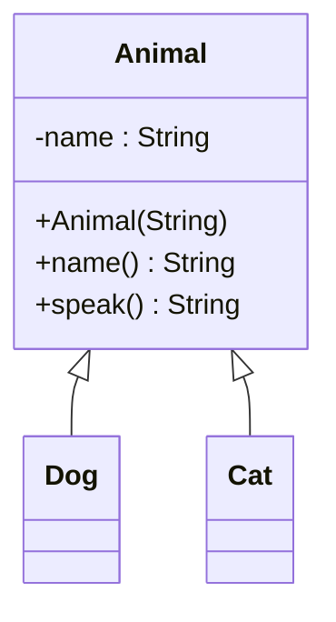
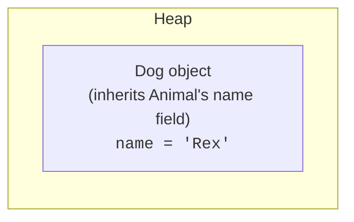
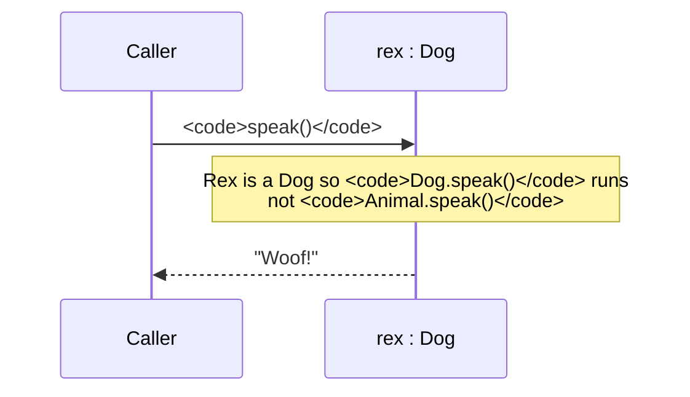
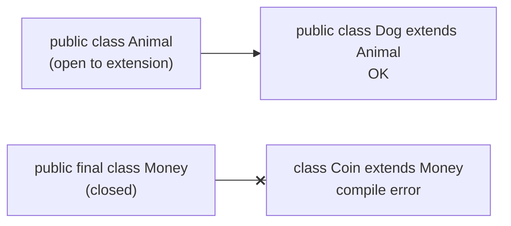
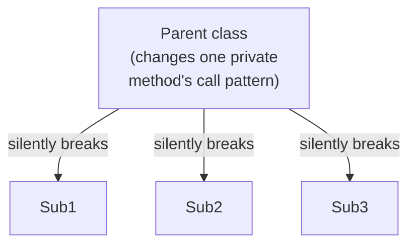

**Inheritance** is the relationship that says one class *is a kind
of* another. A `Dog` *is a* `Mammal`. A `SavingsAccount` *is a*
`BankAccount`. A `Square` *is a* `Rectangle`, well, *maybe*, we'll
come back to that.

Inheritance is the most famous OOP feature and also the most
overused. This page will teach you how it works in Java and *when* it
is the right tool, not just how to type `extends`.

<Figure
  slug="oopj-inheritance-cutout"
  alt="A large parent machine on an upper tier with two smaller machines below built from the same shapes, each adding one extra part"
/>

## A first family

Inheritance is also one word in the header, and it means something
different from `implements`: the subclass gets the parent's code, not
just its shape.

<SyntaxBreakdown
  parts={[
    { text: "class Dog", label: "the subclass" },
    { text: "extends", label: "inherits fields and methods" },
    { text: "Animal", label: "the one parent Java allows" },
  ]}
/>

The hollow arrow `<|--` in UML means **inheritance**, *Dog
is-an Animal*. In Java, the keyword is `extends`.

<Figure
  slug="oopj-inheritance-first-family-inline-cutout"
  alt="One base cabinet with two cabinets behind it built on the same frame"
  caption="Subclasses share the base frame and each add something of their own."
/>

<CodeBlock
  adapter="java"
  entryFilename="Main.java"
  files={[
    {
      filename: "Main.java",
      starterCode: `public class Main {
  public static void main(String[] args) {
    Animal a = new Animal("Generic");
    Dog d = new Dog("Rex");
    Cat c = new Cat("Mochi");

    System.out.println(a.name() + ": " + a.speak());
    System.out.println(d.name() + ": " + d.speak());
    System.out.println(c.name() + ": " + c.speak());
  }
}
`,
    },
    {
      filename: "Animal.java",
      starterCode: `public class Animal {
  private final String name;

  public Animal(String name) { this.name = name; }

  public String name() { return name; }
  public String speak() { return "(some sound)"; }
}
`,
    },
    {
      filename: "Dog.java",
      starterCode: `public class Dog extends Animal {
  public Dog(String name) {
    super(name); // call Animal's constructor
  }
  @Override public String speak() { // override the inherited behavior
    return "Woof!";
  }
}
`,
    },
    {
      filename: "Cat.java",
      starterCode: `public class Cat extends Animal {
  public Cat(String name) { super(name); }
  @Override
  public String speak() {
    return "Meow!";
  }
}
`,
    },
  ]}
/>

Three new pieces of Java vocabulary appear:

| Word | What it does |
| --- | --- |
| `extends` | Declares "this class inherits from..." |
| `super(...)` | Inside a subclass constructor: calls the parent constructor |
| `@Override` | Annotation that says "I'm replacing an inherited method" (the compiler checks this) |

A subclass automatically inherits all `public` and `protected`
members from its parent. It can *add* new fields and methods, and it
can *override* inherited methods to change their behavior.

## What `super` actually does

When you build a `Dog`, you build an `Animal` first, then add the
`Dog`-specific bits on top. In memory, every `Dog` instance includes
*the state of an `Animal`*.

`super(name)` in the `Dog` constructor is what runs the `Animal`
constructor on the `Dog`-being-built to set up `name()`. It must be
the *first statement* in the subclass constructor.

If you omit `super(...)`, Java silently inserts `super()`, a call to
the parent's *no-arg* constructor. If the parent doesn't have a
no-arg constructor, that silent insertion fails and you must call
the right one explicitly.

## Overriding: replacing inherited behavior

When a subclass declares a method with the *same signature* as one
inherited from the parent, the subclass version *replaces* the
parent's version for instances of the subclass.

The `@Override` annotation isn't strictly required, but it's free
help: if you misspell the method name or get the parameter types
wrong, the compiler refuses to compile. *Always* write it.

## Calling the parent's version from the override

Sometimes the subclass wants to **add** to the parent's behavior
rather than completely replace it. You can call the parent's version
explicitly with `super.methodName(...)`.

<CodeBlock
  adapter="java"
  entryFilename="Main.java"
  files={[
    {
      filename: "Main.java",
      starterCode: `public class Main {
  public static void main(String[] args) {
    Employee e = new Employee("Ada", 5_000);
    Manager m = new Manager("Bob", 5_000, 2_000);
    System.out.println("Ada earns " + e.monthlyPay());
    System.out.println("Bob earns " + m.monthlyPay());
  }
}
`,
    },
    {
      filename: "Employee.java",
      starterCode: `public class Employee {
  private final String name;
  private final double baseSalary;

  public Employee(String name, double baseSalary) {
    this.name = name;
    this.baseSalary = baseSalary;
  }

  public String name() { return name; }

  public double monthlyPay() { return baseSalary; }
}
`,
    },
    {
      filename: "Manager.java",
      starterCode: `public class Manager extends Employee {
  private final double bonus;

  public Manager(String name, double baseSalary, double bonus) {
    super(name, baseSalary);
    this.bonus = bonus;
  }

  @Override
  public double monthlyPay() {
    return super.monthlyPay() + bonus; // extends, doesn't replace
  }
}
`,
    },
  ]}
/>

`Manager.monthlyPay()` reuses everything `Employee` knows about pay
and adds a bonus on top. If the salary formula in `Employee` changes
(say, to add overtime), `Manager` automatically benefits.

## `final` classes and methods: closing the door

You can opt *out* of being extended:

- `final class Foo { ... }`, no class may `extends Foo`.
- `final` on a method, subclasses may not override it.

`final` is a useful design tool. Java's `String` is `final`, for
good reason; if anyone could subclass `String` and break its rules,
the entire JVM's security model would collapse.

## The trap: inheritance is *strong* coupling

The reason the GoF say *"favor composition over inheritance"* is not
that inheritance is bad. It's that inheritance is *very strong*. A
subclass depends on its parent's internal design. If the parent
changes how it stores its data or which methods it calls internally,
subclasses can break in surprising ways. This is sometimes called the
**fragile base class problem**.

<Figure
  slug="oopj-inheritance-inline-cutout"
  alt="A base cabinet with three cabinets standing behind it, each keeping the base's frame and adding one part of its own"
  caption="A subclass depends on its parent's internals, which is why the coupling is strong."
/>

Use inheritance when you genuinely have an **is-a** relationship and
the parent class was *designed for extension*. For everything else,
reach for composition first.

A famous cautionary example: a `Square` *is a* `Rectangle`
mathematically, but if you make `Square extends Rectangle`, you
quickly discover that setting a square's width to a value different
from its height violates the square's invariant. The "is-a"
relationship in mathematics does not always translate cleanly into
behavioral substitutability in software.

The principle hiding in that example has a name. In a 1987 keynote,
**Barbara Liskov**, who would go on to win the 2008 Turing Award for
her work on data abstraction, articulated what we now call the
**Liskov Substitution Principle**: anywhere a program expects the
parent type, an instance of the child type must work *correctly*, not
just compile. The square/rectangle puzzle is the canonical
demonstration that "is-a" in English is a weaker test than "is
substitutable for" in code. When you are unsure whether to inherit,
ask Liskov's question, not the grammarian's.

## Practice

<ChallengeCard
  adapter="java"
  title="Shape hierarchy with a subclass override"
  instructions={`Build a small \`Shape\` hierarchy:

- \`Shape\` has a method \`area()\` that returns \`0.0\` and a method \`describe()\` that returns \`"Shape with area " + area()\`.
- \`Circle\` extends \`Shape\` with a private final \`double radius\` and overrides \`area()\` to return \`Math.PI * radius * radius\`.
- \`Square\` extends \`Shape\` with a private final \`double side\` and overrides \`area()\` to return \`side * side\`.

The provided \`Main\` builds a small list of shapes and prints each one. Expected output (the radius-1 area uses Java's \`Math.PI\`):

\`\`\`text
Shape with area 0.0
Shape with area 3.141592653589793
Shape with area 16.0
\`\`\``}
  entryFilename="Main.java"
  files={[
    {
      filename: "Main.java",
      starterCode: `import java.util.Arrays;
import java.util.List;

public class Main {
  public static void main(String[] args) {
    List<Shape> shapes =
        Arrays.asList(new Shape(), new Circle(1.0), new Square(4.0));
    for (Shape s : shapes) {
      System.out.println(s.describe());
    }
  }
}
`,
    },
    {
      filename: "Shape.java",
      starterCode: `public class Shape {
  public double area() { return 0.0; }
  public String describe() { return "Shape with area " + area(); }
}
`,
    },
    {
      filename: "Circle.java",
      starterCode: `public class Circle extends Shape {
  // TODO
}
`,
      solutionCode: `public class Circle extends Shape {
  private final double radius;
  public Circle(double radius) { this.radius = radius; }
  @Override
  public double area() {
    return Math.PI * radius * radius;
  }
}
`,
    },
    {
      filename: "Square.java",
      starterCode: `public class Square extends Shape {
  // TODO
}
`,
      solutionCode: `public class Square extends Shape {
  private final double side;
  public Square(double side) { this.side = side; }
  @Override
  public double area() {
    return side * side;
  }
}
`,
    },
  ]}
  tests={[
    {
      id: "shape-override",
      name: "Subclasses override area() correctly",
      expect: {
        stdoutLines: [
          "Shape with area 0.0",
          "Shape with area 3.141592653589793",
          "Shape with area 16.0",
        ],
        stdoutLinesExact: true,
      },
    },
  ]}
/>

## Test your understanding

<MultipleChoice
  markdown={`What does \`super(name)\` do inside a subclass constructor?

- [o] Invokes the parent class's constructor with the given arguments to initialize the parent part of the new object
  > It must be the first statement of the subclass constructor.
- Calls a static method on the parent class
  > It calls the parent's *constructor*, not a static method.
- Marks the constructor as overriding
  > Constructors aren't overridden; \`@Override\` is for methods.
- Creates an entirely separate parent object
  > No second object is created, the subclass instance *is* also an instance of the parent.`}
/>

<MultipleChoice
  markdown={`Why is the \`@Override\` annotation a good habit?

- It is required for the override to take effect at runtime
  > It is not required for the override to work; the compiler does still call the subclass version without it.
- [o] It asks the compiler to verify that you really are overriding an inherited method, catching typos and signature mismatches at compile time
  > It's a cheap, valuable form of static checking.
- It tells the JVM to skip the parent method entirely
  > That is what overriding does in general, regardless of the annotation.
- It improves runtime performance of the method
  > It has no effect on performance.`}
/>

<MultipleChoice
  markdown={`Which is the *best* reason to choose inheritance over composition?

- The other class has many methods
  > Method count is not a design criterion.
- [o] The new class is genuinely a *kind of* the other class, and the parent was designed for extension
  > True "is-a" relationships with extension-ready base classes are where inheritance shines.
- You want to reuse code from another class
  > Composition can do that too, and usually more safely.
- You want to avoid creating new files
  > File hygiene is not a design criterion.`}
/>
