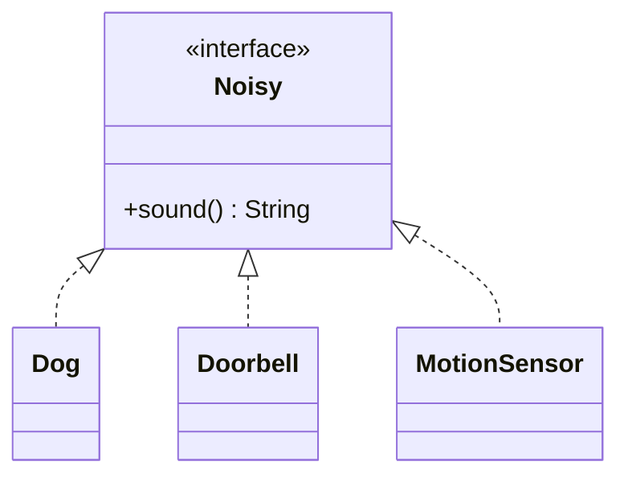
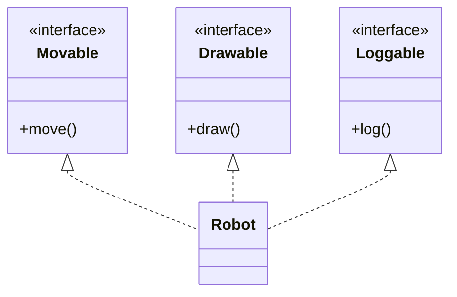
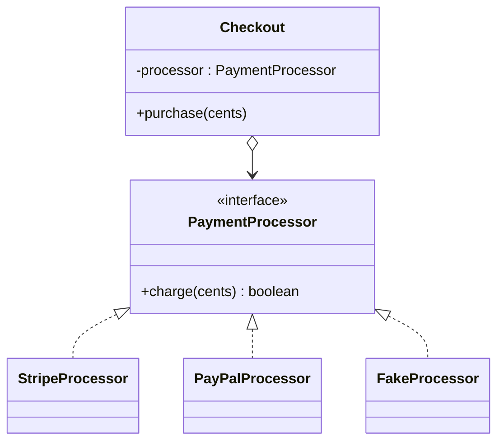

An **interface** in Java is a *contract*. It says "any class that
implements me promises to provide these methods." It tells you
nothing about state, nothing about inheritance, and nothing about
implementation. It is the most flexible building block in OOP.

If a class is "what an object *is*," an interface is "what an object
*can do*." A `Cat`, a `Doorbell`, and a `MotionSensor` are completely
unrelated kinds of things, but all three could implement an
interface called `Noisy` because all three can make a sound.

<Figure
  slug="oopj-interfaces-cutout"
  alt="A single socket plate on a platform with three completely unrelated shapes each fitting the same plug profile"
/>

## A first interface

The dashed line `<|..` in UML means "implements an interface" (as
opposed to `<|--` for "extends a class"). In Java, the keywords are
`interface` and `implements`.

<CodeBlock
  adapter="java"
  entryFilename="Main.java"
  files={[
    {
      filename: "Main.java",
      starterCode: `public class Main {
  public static void main(String[] args) {
    Noisy[] things = {new Dog(), new Doorbell(), new MotionSensor()};
    for (Noisy n : things) {
      System.out.println(n.sound());
    }
  }
}
`,
    },
    {
      filename: "Noisy.java",
      starterCode: `public interface Noisy {
  String sound();
}
`,
    },
    {
      filename: "Dog.java",
      starterCode: `public class Dog implements Noisy {
  @Override
  public String sound() {
    return "Woof!";
  }
}
`,
    },
    {
      filename: "Doorbell.java",
      starterCode: `public class Doorbell implements Noisy {
  @Override
  public String sound() {
    return "Ding-dong";
  }
}
`,
    },
    {
      filename: "MotionSensor.java",
      starterCode: `public class MotionSensor implements Noisy {
  @Override
  public String sound() {
    return "BEEP! BEEP!";
  }
}
`,
    },
  ]}
/>

Notice the loop in `Main`. It does not know, and does not care,
which class each element is. It only knows that each one is a
`Noisy`, and therefore can be sent the message `sound()`.

That ability to **treat different classes uniformly through a shared
interface** is the secret weapon of OOP. It's what lets your code be
*open to new collaborators* without being rewritten.

## Interfaces vs. abstract classes

Both interfaces and abstract classes let you write code against a
shape. They differ in a few crucial ways.

<Figure
  slug="oopj-interfaces-inline-cutout"
  alt="A wall socket of one standard shape with three very different appliances all carrying that same plug"
  caption="One standard shape, and any class can be built to fit it."
/>

| | Interface | Abstract class |
| --- | --- | --- |
| Extends/implements | A class can `implements` *many* interfaces | A class can `extends` only *one* class |
| State | No instance fields (`public static final` constants only) | Can have instance fields |
| Constructor | None | Yes, called via `super(...)` |
| Best for | A capability or role that may cut across class hierarchies | A partial implementation with shared state |

The single most important sentence on this page: **a Java class can
implement as many interfaces as it wants, but extend at most one
class.** Interfaces are how Java avoids the worst pitfalls of
multiple inheritance while still letting an object play several
roles.

`Robot` is at once a `Movable`, a `Drawable`, and a `Loggable`. Any
function that needs *any one of* those capabilities can accept a
`Robot`.

## Programming to an interface, not an implementation

Recall the GoF principle:

> *Program to an interface, not an implementation.*

The practical form: when you declare a variable, parameter, or
return type, prefer the interface type over a specific class.

<Figure
  slug="oopj-interfaces-first-interface-inline-cutout"
  alt="A standard plate with two handles held up beside a machine with a matching opening"
  caption="Declare the interface type and any implementation will fit the slot."
/>

<CodeBlock
  adapter="java"
  files={[
    {
      filename: "main.java",
      starterCode: `import java.util.*;

public class Main {
  public static void main(String[] args) {
    // BAD: locks the caller to ArrayList
    ArrayList<String> bad = new ArrayList<>();
    bad.add("one");

    // GOOD: the variable is a List; the implementation could be swapped freely
    List<String> good = new ArrayList<>();
    good.add("two");

    // The same method works for any List implementation:
    report(good);
    report(new LinkedList<>(Arrays.asList("three", "four")));
  }

  static void report(List<String> items) {
    System.out.println(items.size() + " items: " + items);
  }
}
`,
    },
  ]}
/>

`report(List<String>)` works for `ArrayList`, `LinkedList`, an
immutable list, or any future `List` implementation that doesn't
exist yet. The method signature has no opinion. *That* is what
"programming to an interface" buys you.

## Default methods: a small modern wrinkle

Since Java 8, an interface may include `default` methods, methods
*with* a body that implementers inherit unless they override it.
Default methods are useful when you want to add a method to an
interface without breaking every existing implementer.

<CodeBlock
  adapter="java"
  entryFilename="Main.java"
  files={[
    {
      filename: "Main.java",
      starterCode: `public class Main {
  public static void main(String[] args) {
    Greeter polite = new Polite();
    Greeter casual = new Casual();
    System.out.println(polite.greet("Ada"));
    System.out.println(casual.greet("Ada"));
    System.out.println(polite.farewell("Ada")); // uses the default
    System.out.println(casual.farewell("Ada")); // overridden
  }
}
`,
    },
    {
      filename: "Greeter.java",
      starterCode: `public interface Greeter {
  String greet(String name);

  // Implementers get this for free, but may override:
  default String farewell(String name) { return "Goodbye, " + name + "."; }
}
`,
    },
    {
      filename: "Polite.java",
      starterCode: `public class Polite implements Greeter {
  @Override
  public String greet(String name) {
    return "Good day, " + name + ".";
  }
  // farewell() inherited from the interface
}
`,
    },
    {
      filename: "Casual.java",
      starterCode: `public class Casual implements Greeter {
  @Override
  public String greet(String name) {
    return "Hey " + name + "!";
  }
  @Override
  public String farewell(String name) {
    return "Cya, " + name + "!";
  }
}
`,
    },
  ]}
/>

Default methods do *not* turn an interface into a class. There is
still no state. But they let interfaces grow more gracefully over
time.

## A small modeling example: payment processors

Imagine a checkout system that supports several payment processors
(Stripe, PayPal, a test fake). Each is a totally different
implementation, but the checkout doesn't care, it just wants
something that can `charge(amount)`.

<CodeBlock
  adapter="java"
  entryFilename="Main.java"
  files={[
    {
      filename: "Main.java",
      starterCode: `public class Main {
  public static void main(String[] args) {
    Checkout c1 = new Checkout(new StripeProcessor());
    Checkout c2 = new Checkout(new FakeProcessor());

    c1.purchase(2599);
    c2.purchase(199);
  }
}
`,
    },
    {
      filename: "PaymentProcessor.java",
      starterCode: `public interface PaymentProcessor {
  boolean charge(int cents);
}
`,
    },
    {
      filename: "StripeProcessor.java",
      starterCode: `public class StripeProcessor implements PaymentProcessor {
  @Override
  public boolean charge(int cents) {
    System.out.println("[stripe] charged " + cents + " cents");
    return true;
  }
}
`,
    },
    {
      filename: "FakeProcessor.java",
      starterCode: `public class FakeProcessor implements PaymentProcessor {
  @Override
  public boolean charge(int cents) {
    System.out.println("[fake] pretended to charge " + cents + " cents");
    return true;
  }
}
`,
    },
    {
      filename: "Checkout.java",
      starterCode: `public class Checkout {
  private final PaymentProcessor processor;
  public Checkout(PaymentProcessor processor) { this.processor = processor; }
  public void purchase(int cents) {
    boolean ok = processor.charge(cents);
    System.out.println("purchase ok? " + ok);
  }
}
`,
    },
  ]}
/>

`Checkout` programs against the interface `PaymentProcessor`. Adding
a new payment provider tomorrow means writing one new class, no
changes to `Checkout`. That is the design payoff of interfaces.

## Practice

<ChallengeCard
  adapter="java"
  title="Sortable, in three different ways"
  instructions={`Build a tiny example of programming to an interface.

- \`Comparable2<T>\` is an interface declaring \`int compareWith(T other)\`. Negative means "I am less than other", 0 means equal, positive means "I am greater".
- \`Length\` is a class wrapping a \`double\` value. Implement \`Comparable2<Length>\` by comparing values numerically.
- \`Name\` is a class wrapping a \`String\` value. Implement \`Comparable2<Name>\` by comparing strings alphabetically (use \`String.compareTo\`).
- The provided \`Main\` runs a tiny scenario and is expected to print exactly:

\`\`\`
length: -1
length: 0
length: 1
name: -1
name: 0
name: 1
\`\`\`

(The expected values come from \`Integer.signum\` of the comparison results.)`}
  entryFilename="Main.java"
  files={[
    {
      filename: "Main.java",
      starterCode: `public class Main {
  public static void main(String[] args) {
    Length a = new Length(1.0);
    Length b = new Length(2.0);
    Length c = new Length(1.0);
    Length d = new Length(0.5);
    System.out.println("length: " + Integer.signum(a.compareWith(b)));
    System.out.println("length: " + Integer.signum(a.compareWith(c)));
    System.out.println("length: " + Integer.signum(a.compareWith(d)));

    Name p = new Name("alpha");
    Name q = new Name("beta");
    Name r = new Name("alpha");
    Name s = new Name("a");
    System.out.println("name: " + Integer.signum(p.compareWith(q)));
    System.out.println("name: " + Integer.signum(p.compareWith(r)));
    System.out.println("name: " + Integer.signum(p.compareWith(s)));
  }
}
`,
    },
    {
      filename: "Comparable2.java",
      starterCode: `public interface Comparable2<T> {
  int compareWith(T other);
}
`,
    },
    {
      filename: "Length.java",
      starterCode: `public class Length implements Comparable2<Length> {
  private final double value;
  public Length(double value) { this.value = value; }

  // TODO: implement compareWith
  @Override
  public int compareWith(Length other) {
    return 0;
  }
}
`,
      solutionCode: `public class Length implements Comparable2<Length> {
  private final double value;
  public Length(double value) { this.value = value; }

  @Override
  public int compareWith(Length other) {
    return Double.compare(this.value, other.value);
  }
}
`,
    },
    {
      filename: "Name.java",
      starterCode: `public class Name implements Comparable2<Name> {
  private final String value;
  public Name(String value) { this.value = value; }

  // TODO: implement compareWith
  @Override
  public int compareWith(Name other) {
    return 0;
  }
}
`,
      solutionCode: `public class Name implements Comparable2<Name> {
  private final String value;
  public Name(String value) { this.value = value; }

  @Override
  public int compareWith(Name other) {
    return this.value.compareTo(other.value);
  }
}
`,
    },
  ]}
  tests={[
    {
      id: "compare2",
      name: "Both classes implement the contract sensibly",
      expect: {
        stdoutLines: [
          "length: -1",
          "length: 0",
          "length: 1",
          "name: -1",
          "name: 0",
          "name: 1",
        ],
        stdoutLinesExact: true,
      },
    },
  ]}
/>

## Test your understanding

<MultipleChoice
  markdown={`In Java, a single class may...

- Implement many interfaces and extend many classes
  > Java does not allow multiple class inheritance.
- [o] Implement *many* interfaces but extend *at most one* class
  > This is one of Java's defining design decisions.
- Implement many classes and extend many interfaces
  > The wording is reversed and both halves are inaccurate.
- Implement at most one interface and extend at most one class
  > The first half is wrong.`}
/>

<MultipleChoice
  markdown={`What does "program to an interface, not an implementation" mean in practice?

- Always write \`interface\` for every class
  > Not every class needs an interface; the principle is about *types in signatures*.
- [o] When declaring variables, parameters, and return types, prefer the more general interface type so callers aren't locked to a specific implementation
  > This is how interfaces unlock loose coupling.
- Never use concrete classes
  > Concrete classes are required to actually have an instance, somebody must implement the interface.
- Use only abstract classes
  > That's a separate idea and not the same principle.`}
/>

<MultipleChoice
  markdown={`What is the main difference between an interface and an abstract class in Java?

- An interface can extend many other interfaces; an abstract class cannot extend anything
  > Abstract classes can extend a class and implement interfaces.
- They are exactly the same since Java 8 added default methods
  > Default methods narrow the gap a little, but they remain distinct concepts.
- [o] An interface has no instance state; an abstract class may have fields, a constructor, and concrete methods
  > Interfaces describe capabilities; abstract classes can also carry shared state.
- An interface can have a constructor; an abstract class cannot
  > Reversed.`}
/>
