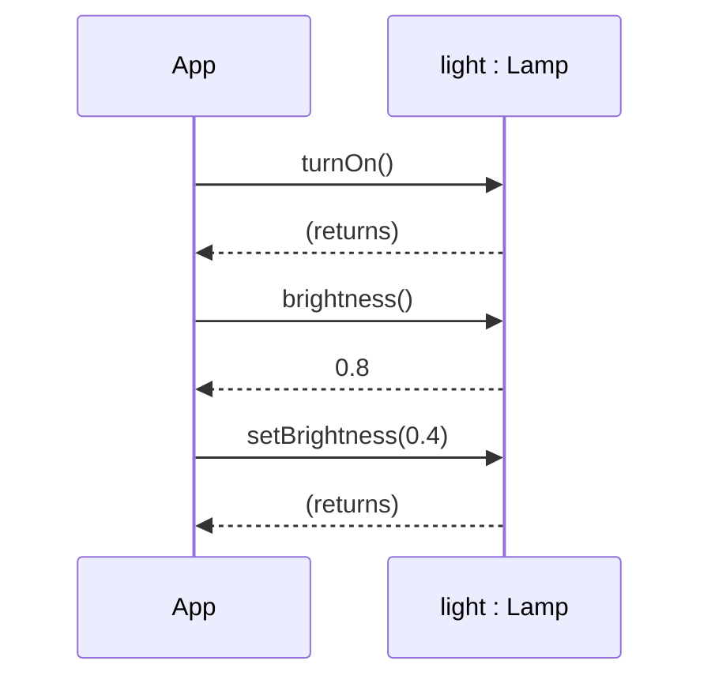
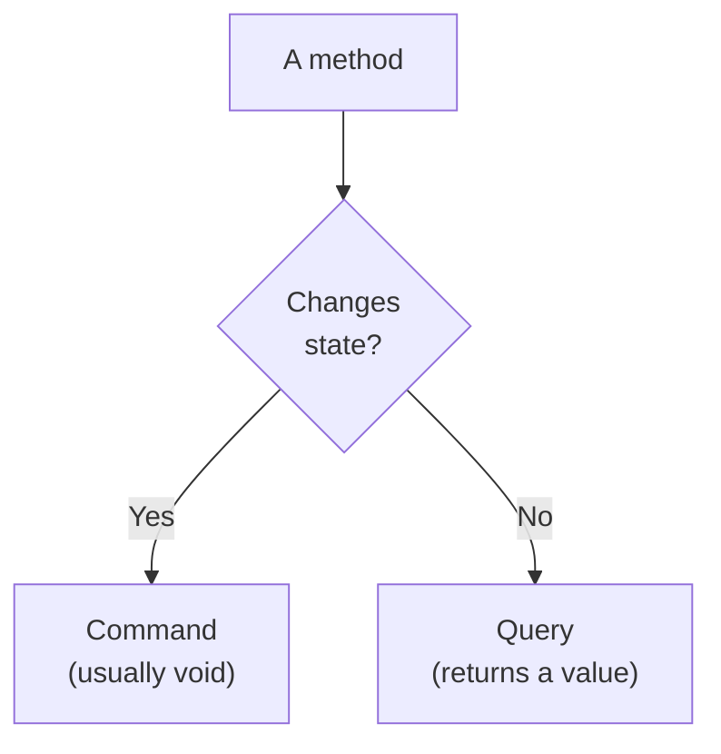
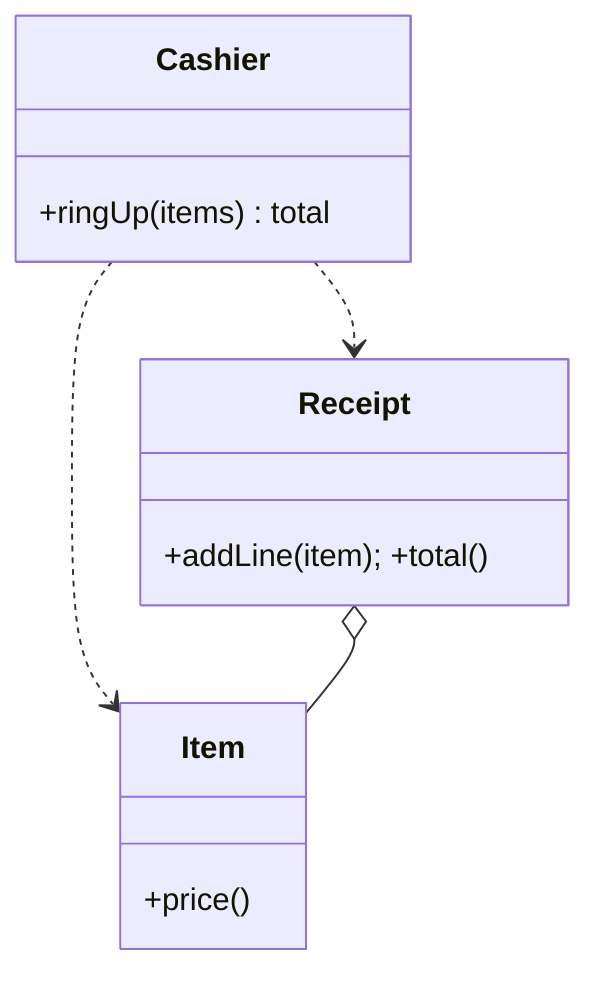

We have used the word **message** loosely so far. This page nails it
down. In an object-oriented program, calling `dog.bark()` is more
than just "running a function", it is *asking the dog to bark, and
letting the dog decide how*. That framing changes how you design
software.

<svg
  viewBox="0 0 640 200"
  role="img"
  aria-label="A yellow envelope rides a solid gray arrow from a blue caller card to a green receiver card, and a small green chip travels back along a thinner arrow below, a method call as a message sent and a value returned"
  style={{ display: "block", width: "100%", maxWidth: "640px", height: "auto", margin: "2.5rem auto" }}
>
  <g style={{ color: "var(--ds-blue-500)" }} fill="currentColor">
    <rect x="80" y="60" width="110" height="90" rx="14" fillOpacity="0.15" />
    <circle cx="135" cy="105" r="16" />
  </g>
  <g style={{ color: "var(--ds-green-500)" }} fill="currentColor">
    <rect x="450" y="60" width="110" height="90" rx="14" fillOpacity="0.15" />
    <circle cx="505" cy="105" r="16" />
  </g>
  <g fill="var(--ds-gray-400)">
    <rect x="206" y="80.5" width="196" height="3" rx="1.5" />
    <polygon points="400,76.5 411,82 400,87.5" />
  </g>
  <g style={{ color: "var(--ds-yellow-500)" }} fill="currentColor">
    <rect x="278" y="40" width="56" height="34" rx="6" />
  </g>
  <polyline points="282,44 306,62 330,44" fill="none" stroke="var(--ds-white)" strokeWidth="2.5" strokeLinecap="round" />
  <g fill="var(--ds-gray-400)">
    <rect x="238" y="136" width="186" height="3" rx="1.5" />
    <polygon points="240,132 240,143 229,137.5" />
  </g>
  <g style={{ color: "var(--ds-green-500)" }} fill="currentColor">
    <rect x="316" y="118" width="32" height="11" rx="5.5" />
  </g>
</svg>

## A method call is a message sent to a receiver

Every Java method call on an object follows the same shape:

```text
receiver . message ( arguments )
```

- The **receiver** is the object the method is called on.
- The **message** is the method name.
- The **arguments** are the extra information you give the receiver
  to do its job.

The receiver decides *how* to respond. The caller doesn't need to
know, and shouldn't care, what the receiver does internally to
fulfill the request.



This is not just terminology. *Thinking* of method calls as messages
between objects is what lets you design systems whose pieces can be
swapped, refactored, or replaced, because each receiver is free to
implement the message in its own way.

<CodeBlock
  adapter="java"
  files={[
    {
      filename: "main.java",
      starterCode: `public class Main {
  public static void main(String[] args) {
    Lamp desk = new Lamp();
    desk.turnOn();
    desk.setBrightness(0.8);
    System.out.println(desk.describe());

    desk.setBrightness(2.0); // out of range, lamp clamps
    System.out.println(desk.describe());
  }
}

class Lamp {
  private boolean on;
  private double brightness; // 0.0 .. 1.0

  public void turnOn() { on = true; }
  public void turnOff() { on = false; }

  public void setBrightness(double b) {
    if (b < 0)
      b = 0;
    if (b > 1)
      b = 1;
    brightness = b;
  }

  public double brightness() { return brightness; }

  public String describe() {
    return on ? "Lamp on at " + (int)(brightness * 100) + "%" : "Lamp off";
  }
}
`,
    },
  ]}
/>

The caller in `main` does not know that `Lamp` clamps the brightness
to `[0, 1]`. The caller only knows: "I sent the message
`setBrightness(2.0)`, and afterwards `describe()` says `100%`."
The lamp owns its response.

## The signature of a method

A method's **signature** is its name plus the *types* (and order) of
its parameters. The return type is *not* part of the signature.

| Method | Signature |
| --- | --- |
| `void turnOn()` | `turnOn()` |
| `void setBrightness(double b)` | `setBrightness(double)` |
| `String describe()` | `describe()` |

Two methods in the same class may share a name **only** if their
signatures differ, different number of parameters, different
parameter types, or different parameter order. This is **method
overloading**.

<CodeBlock
  adapter="java"
  files={[
    {
      filename: "main.java",
      starterCode: `public class Main {
  public static void main(String[] args) {
    Printer p = new Printer();
    p.print("hello");   // matches print(String)
    p.print(42);        // matches print(int)
    p.print("page", 3); // matches print(String,int)
  }
}

class Printer {
  public void print(String s) { System.out.println("S: " + s); }
  public void print(int n) { System.out.println("N: " + n); }
  public void print(String s, int n) {
    System.out.println("P: " + s + " x " + n);
  }
}
`,
    },
  ]}
/>

Overloading should be used sparingly. If two overloads do *different
things*, give them different names. If they do *the same thing for
different argument shapes* (the `Printer` above is borderline), it can
be cleaner.

## Commands vs. queries

A small, classic distinction that helps you design methods:

- A **command** changes the object's state. It usually returns
  `void`. Example: `lamp.turnOn()`, `account.deposit(50)`.
- A **query** answers a question and does *not* change the object's
  state. Example: `lamp.brightness()`, `account.balance()`.



A method that does *both*, modifies state *and* returns a meaningful
value, is sometimes useful (think `boolean spend(int)` from the
Wallet exercise) but is the most error-prone shape. Keep it rare and
keep the name honest (`tryWithdraw`, `popOrNull`).

## Methods can call other methods on the *same* object

A method body can use `this.someMethod()` (or just `someMethod()`)
to delegate to another method on the same object. This is how you
build complex behavior out of small, well-named parts.

<CodeBlock
  adapter="java"
  files={[
    {
      filename: "main.java",
      starterCode: `public class Main {
  public static void main(String[] args) {
    Stopwatch s = new Stopwatch();
    s.start();
    for (long i = 0; i < 1_000_000; i++) { /* burn a little time */
    }
    s.stop();
    System.out.println(s.summary());
  }
}

class Stopwatch {
  private long startNs;
  private long stopNs;
  private boolean running;

  public void start() {
    this.running = true;
    this.startNs = System.nanoTime();
  }
  public void stop() {
    this.stopNs = System.nanoTime();
    this.running = false;
  }

  public long elapsedNs() {
    // a private helper, but works just as well from this method
    return stopNs - startNs;
  }

  public String summary() {
    return "Elapsed: " + this.elapsedNs() + " ns (running=" + running + ")";
  }
}
`,
    },
  ]}
/>

`summary()` doesn't recompute the elapsed time itself, it sends the
message `elapsedNs()` to `this`. If the formula ever changes, you
change it in one place.

## Methods can call methods on *other* objects

This is where OOP really comes alive: an object's method can fulfill
its responsibility by *sending messages to other objects*. The
example below, three classes, one diagram, is the pattern you will
use thousands of times.



<CodeBlock
  adapter="java"
  entryFilename="Main.java"
  files={[
    {
      filename: "Main.java",
      starterCode: `import java.util.Arrays;
import java.util.List;

public class Main {
  public static void main(String[] args) {
    List<Item> cart =
        Arrays.asList(new Item("Apple", 120), new Item("Bread", 300),
                      new Item("Cheese", 550));

    Cashier c = new Cashier();
    Receipt r = c.ringUp(cart);
    System.out.println(r.format());
  }
}
`,
    },
    {
      filename: "Item.java",
      starterCode: `public class Item {
  private final String name;
  private final int priceCents;
  public Item(String name, int priceCents) {
    this.name = name;
    this.priceCents = priceCents;
  }
  public String name() { return name; }
  public int price() { return priceCents; }
}
`,
    },
    {
      filename: "Receipt.java",
      starterCode: `import java.util.ArrayList;
import java.util.List;

public class Receipt {
  private final List<String> lines = new ArrayList<>();
  private int total = 0;

  public void addLine(Item item) {
    lines.add(String.format("  %-8s %4d", item.name(), item.price()));
    total += item.price();
  }

  public int total() { return total; }

  public String format() {
    StringBuilder sb = new StringBuilder();
    for (String l : lines)
      sb.append(l).append('\\n');
    sb.append("  ----------\\n");
    sb.append(String.format("  TOTAL    %4d", total));
    return sb.toString();
  }
}
`,
    },
    {
      filename: "Cashier.java",
      starterCode: `import java.util.List;

public class Cashier {
  public Receipt ringUp(List<Item> items) {
    Receipt r = new Receipt();
    for (Item it : items) {
      r.addLine(it); // sending addLine() to the Receipt
    }
    return r;
  }
}
`,
    },
  ]}
/>

Notice the *flow of messages*:

1. `Main` sends `ringUp(cart)` to `Cashier`.
2. `Cashier` sends `addLine(it)` to `Receipt` once per item.
3. `Receipt` sends `name()` and `price()` to each `Item`.

No object reaches into another object's fields. The whole
computation is a small conversation. Each participant has a small,
clear job.

## Practice

<ChallengeCard
  adapter="java"
  title="Greeter overloads"
  instructions={`Implement a \`Greeter\` class with three overloaded methods called \`greet\`:

- \`greet()\` returns \`"Hello!"\`
- \`greet(String name)\` returns \`"Hello, " + name + "!"\`
- \`greet(String name, String lang)\` returns a language-specific greeting:
  - For \`lang.equals("en")\` returns \`"Hello, " + name + "!"\`
  - For \`lang.equals("es")\` returns \`"Hola, " + name + "!"\`
  - For \`lang.equals("ja")\` returns \`"こんにちは, " + name + "!"\`
  - For any other value of \`lang\`, fall back to \`greet(name)\`.

Expected output:

\`\`\`
Hello!
Hello, Ada!
Hola, Bob!
こんにちは, Kenji!
Hello, Eve!
\`\`\``}
  entryFilename="Main.java"
  files={[
    {
      filename: "Main.java",
      starterCode: `public class Main {
  public static void main(String[] args) {
    Greeter g = new Greeter();
    System.out.println(g.greet());
    System.out.println(g.greet("Ada"));
    System.out.println(g.greet("Bob", "es"));
    System.out.println(g.greet("Kenji", "ja"));
    System.out.println(g.greet("Eve", "fr")); // fallback
  }
}
`,
    },
    {
      filename: "Greeter.java",
      starterCode: `public class Greeter {
  // TODO: three overloaded greet methods
}
`,
      solutionCode: `public class Greeter {
  public String greet() { return "Hello!"; }
  public String greet(String name) { return "Hello, " + name + "!"; }
  public String greet(String name, String lang) {
    if ("en".equals(lang))
      return "Hello, " + name + "!";
    if ("es".equals(lang))
      return "Hola, " + name + "!";
    if ("ja".equals(lang))
      return "こんにちは, " + name + "!";
    return greet(name); // sending a message to this
  }
}
`,
    },
  ]}
  tests={[
    {
      id: "greeter",
      name: "All overloads produce the expected greetings",
      expect: {
        stdoutLines: [
          "Hello!",
          "Hello, Ada!",
          "Hola, Bob!",
          "こんにちは, Kenji!",
          "Hello, Eve!",
        ],
        stdoutLinesExact: true,
      },
    },
  ]}
/>

## Test your understanding

<MultipleChoice
  markdown={`In the call \`receipt.addLine(item)\`, which part is the *receiver*?

- \`addLine\`
  > That is the message (method name).
- \`item\`
  > That is the argument.
- [o] \`receipt\`
  > The receiver is the object the message is sent to.
- The return value
  > The return value is the *response*, not the receiver.`}
/>

<MultipleChoice
  markdown={`Which pair of methods is a valid example of *method overloading*?

- \`int compute()\` and \`double compute()\`
  > Return type alone does not differentiate overloads. This won't compile.
- [o] \`void print(String s)\` and \`void print(int n)\`
  > Different parameter types yield different signatures.
- \`public void run()\` and \`private void run()\`
  > Access modifiers don't differentiate overloads either.
- \`void log(String s)\` and \`void log(String s)\`
  > Identical signatures, duplicate method, won't compile.`}
/>

<MultipleChoice
  markdown={`In OOP, what is the practical advantage of thinking of method calls as *messages sent to a receiver* rather than just "function calls"?

- The JVM dispatches messages faster than function calls
  > It's the same dispatch underneath.
- It makes the program use less memory
  > Memory use is unrelated.
- [o] It reminds you that the *receiver* decides how to respond, so you focus on what each object should do rather than how callers should reach into it
  > The "messaging" mindset is what produces well-encapsulated, swappable objects.
- It removes the need for return values
  > Methods can still return values.`}
/>
