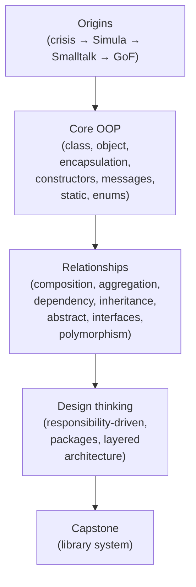
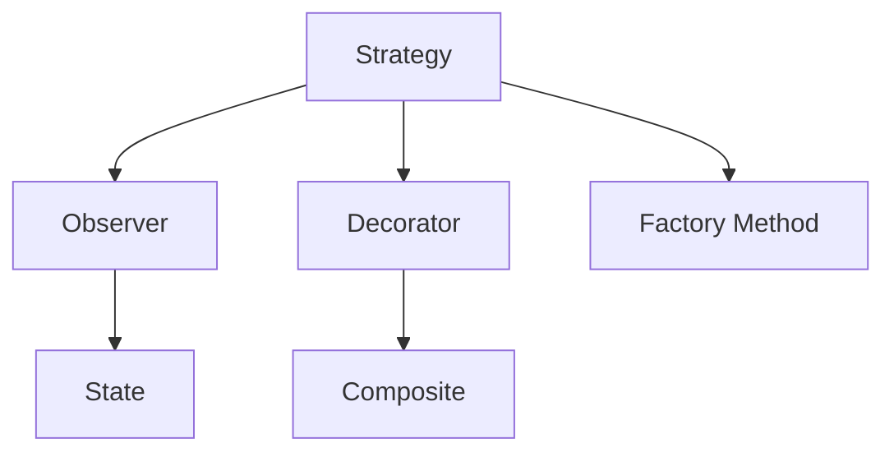

If you made it through the capstone, you have something most
self-taught programmers never get: a coherent *mental model* of
object-oriented thinking. Not a list of syntax tricks, but a habit of
asking "what are the objects? what does each one know? what does
each one do?" That habit will pay off in every codebase you read for
the rest of your life.

This page is a short map of where to go next.

<svg
  viewBox="0 0 640 230"
  role="img"
  aria-label="Three solid isometric cubes — blue, green, then yellow — climb upward along thin connector lines toward a dashed outline where the next cube will sit, the course's ideas stacked and pointing onward"
  style={{ display: "block", width: "100%", maxWidth: "640px", height: "auto", margin: "2.5rem auto" }}
>
  <g stroke="var(--ds-gray-300)" strokeWidth="2" strokeLinecap="round">
    <line x1="185" y1="150" x2="255" y2="118" />
    <line x1="345" y1="118" x2="415" y2="86" />
    <line x1="505" y1="86" x2="530" y2="58" />
  </g>
  <g style={{ color: "var(--ds-blue-500)" }} fill="currentColor">
    <polygon points="140,124 185,150 140,176 95,150" />
    <polygon points="95,150 140,176 140,210 95,184" fillOpacity="0.65" />
    <polygon points="185,150 140,176 140,210 185,184" fillOpacity="0.4" />
  </g>
  <g style={{ color: "var(--ds-green-500)" }} fill="currentColor">
    <polygon points="300,92 345,118 300,144 255,118" />
    <polygon points="255,118 300,144 300,178 255,152" fillOpacity="0.65" />
    <polygon points="345,118 300,144 300,178 345,152" fillOpacity="0.4" />
  </g>
  <g style={{ color: "var(--ds-yellow-500)" }} fill="currentColor">
    <polygon points="460,60 505,86 460,112 415,86" />
    <polygon points="415,86 460,112 460,146 415,120" fillOpacity="0.65" />
    <polygon points="505,86 460,112 460,146 505,120" fillOpacity="0.4" />
  </g>
  <polygon points="575,32 620,58 575,84 530,58" fill="none" stroke="var(--ds-gray-400)" strokeWidth="2" strokeDasharray="6 5" />
</svg>

## What you actually learned

Look back over what we covered:

If you can describe each box in your own words, you have the
foundation. The rest of this page is about deepening it.

## Five ideas worth re-reading

These are the few ideas from this course that, if internalized, will
change how you write software forever. They are worth posting on
your wall.

1. **Tell, don't ask.** Send objects commands; don't pull out their
   data to do things yourself.
2. **Encapsulate the things that vary.** Find the part most likely
   to change and put it behind a stable interface.
3. **Favor composition over inheritance.** Build big objects out of
   small parts, not out of tall family trees.
4. **Program to an interface, not an implementation.** Depend on
   *what* an object does, not *which* class it is.
5. **Each object should have a small, coherent set of
   responsibilities.** If you can't summarize a class in one
   sentence, it's probably doing too much.

## Patterns and principles to study next

You learned *one* of the 23 GoF patterns (Strategy). Two or three
more will pay back the time it takes to learn them. In order of
beginner-friendliness:

- **Observer** — for "when this changes, tell everyone who cares"
  (event systems, UI updates).
- **Decorator** — for adding behavior to an object at runtime by
  wrapping it.
- **Factory Method** — for letting subclasses decide *what kind of
  object to create*.
- **State** — for objects whose behavior depends on a mode they're
  in.
- **Composite** — for tree-shaped data (folders, GUI widgets,
  expression trees).

Beyond the GoF, look up the **SOLID** principles. They are five
guidelines (single responsibility, open–closed, Liskov substitution,
interface segregation, dependency inversion) that operationalize a
lot of what this course taught.

## Books to read in order

If you read three books in your first year after this course, read
these:

1. **Head First Design Patterns** (Freeman & Robson) — a friendly,
   visual introduction to the most important GoF patterns. The
   easiest jump from this course.
2. **Refactoring** (Martin Fowler, 2nd ed.) — names the smells and
   the maneuvers for cleaning up object-oriented code. Half of the
   "tell, don't ask"-style intuitions in this course come from this
   book.
3. **Object-Oriented Software Construction** (Bertrand Meyer) — a
   serious, opinionated, classic statement of the discipline.
   Slower going than the other two, but worth it once you're ready.

Honorable mentions: *Design Patterns* by the GoF themselves (the
1994 source), *Domain-Driven Design* by Eric Evans (for serious
domain modeling), and *Growing Object-Oriented Software, Guided by
Tests* by Freeman & Pryce (for test-driven OOP).

## Habits that compound

Skill in OOP is not made of facts. It's made of small habits you
repeat thousands of times. The ones below seem trivial in isolation
and are, in aggregate, the difference between a competent and a
great object-oriented programmer.

| Habit | Why it matters |
| --- | --- |
| Before writing a class, write its CRC card on paper | Forces you to name responsibilities, not just fields |
| Make every field `private`. Widen on demand | Encapsulation by default |
| Use `final` aggressively (on fields, parameters, classes) | Removes a whole class of bugs |
| Always write `@Override` | The compiler will catch typos for free |
| When you reach for an `if (x instanceof Y)`, pause | Often a missing polymorphic method |
| Read a class out loud as one sentence | If you can't, it's doing too much |
| Draw a UML sketch *before* writing more than two classes | The diagram clarifies which arrows you actually need |

## A small parting exercise

We won't grade this, but it's the best way to consolidate what you
know.

Pick something concrete in your everyday life — a vending machine, a
playlist app, a coffee subscription service, an elevator system, a
chess game, a simple game of poker — and on paper:

1. List the **nouns** (candidate classes).
2. Write a **CRC card** for each: responsibilities and
   collaborators.
3. Draw a **UML class diagram** with the relationships you'd use
   (composition, aggregation, dependency, inheritance, interfaces).
4. Draw **one sequence diagram** of an important interaction.
5. Then — and only then — open your editor.

If you do that once a month for a year, you'll have done more
deliberate OOP modeling than most professional developers do in
their first five years.

## A last word

OOP is a *thinking discipline* dressed in language features. Java
gave us a vocabulary — class, interface, abstract, override, final.
Smalltalk and Simula gave us the idea that objects send messages.
The Gang of Four gave us the names of recurring shapes. The
software crisis gave us the *reason* any of this was invented.

The world is full of complex systems. Software is one of them. OOP
is the most popular and most successful tool we've found for
*modeling* complexity as collaborating objects with clear
responsibilities. That is what you have practiced.

Now go build something with it.

<Callout type="success" title="Thank you">
You finished the course. Open an issue, share what you built, or
just go write a CRC card for the next thing you make. Good luck,
and have fun.
</Callout>
