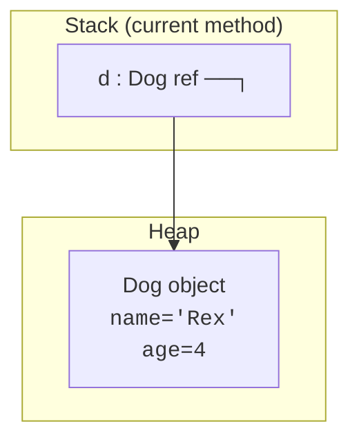
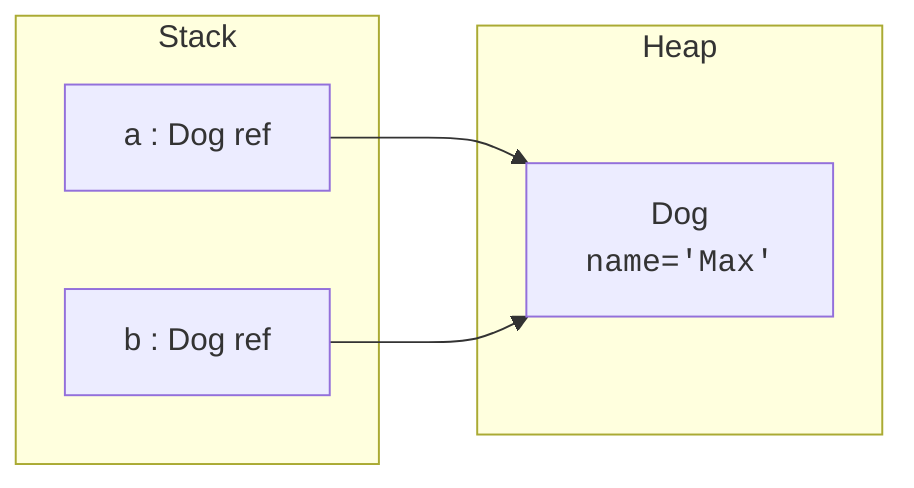
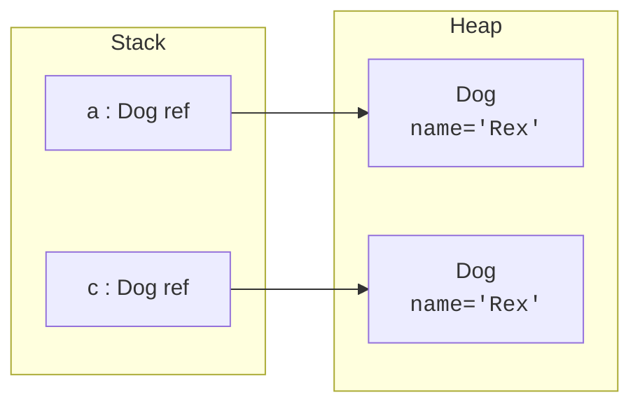
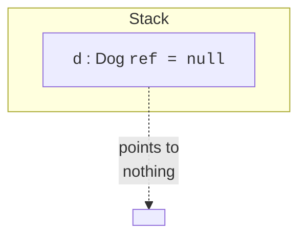
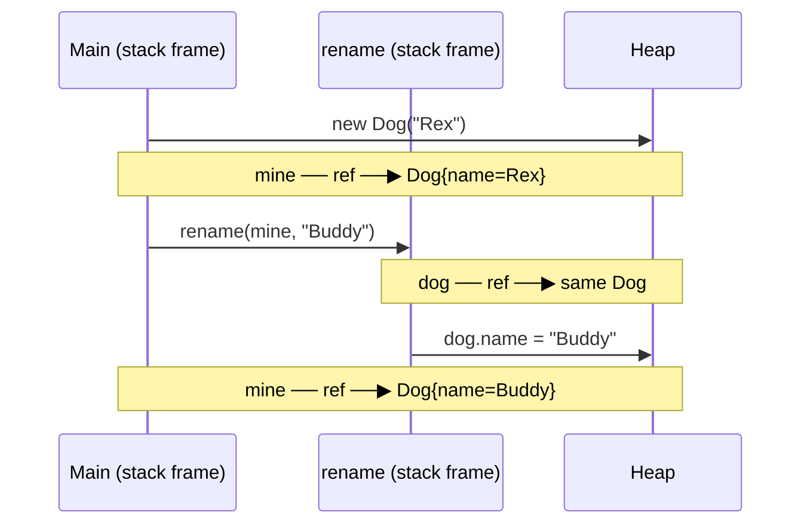
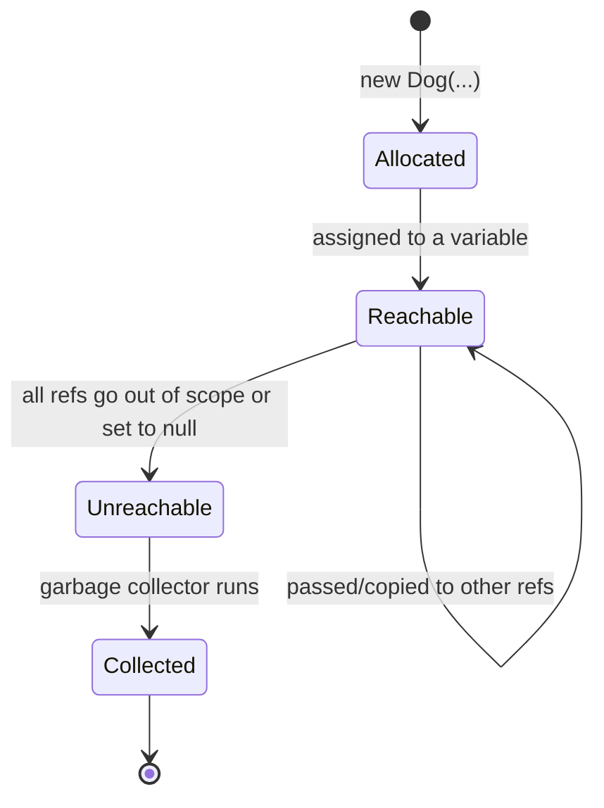
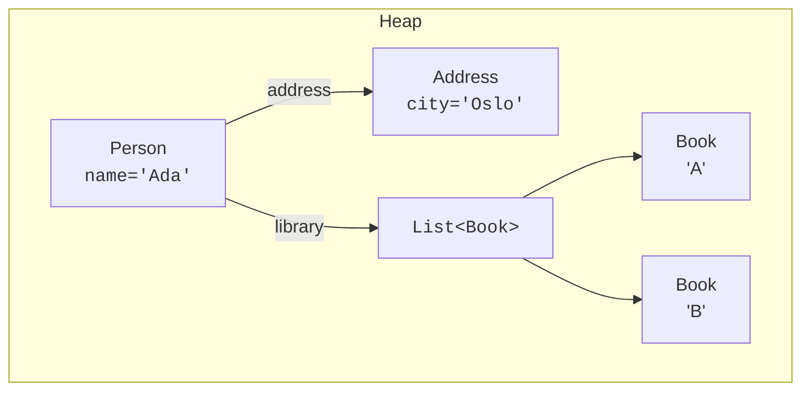

You can write a lot of Java without thinking about memory. But ten
minutes of looking at how the JVM actually represents objects will
clear up more confusions than any number of pages of prose. We will
not go deep, just deep enough to make `null`, "two variables
referring to the same object," and "objects passed to methods" feel
obvious.

<Figure
  slug="oopj-objects-in-memory-cutout"
  alt="A tall narrow stack of thin plates beside a wide open heap field of scattered objects, thin arrows running from plates to objects"
/>

## The two regions: stack and heap

When a JVM program runs, it uses (among other things) two regions of
memory:

| Region | What lives there | Lifetime |
| --- | --- | --- |
| **Stack** | Local variables, method parameters, the *references* to objects | The current method call |
| **Heap** | The actual objects created by `new` | Until no references remain (then garbage-collected) |

Primitive values like `int` and `boolean` live directly on the stack
as part of a local variable. **Object** values are different. When you
write `Dog d = new Dog(...)`, two things happen:

1. The JVM allocates a `Dog` object on the **heap**.
2. The local variable `d` on the **stack** holds a *reference* (an
   address) pointing to that heap object.

The variable `d` is **not** the dog. The variable is a small label on
the stack that says "the dog you want is at this address on the heap."

## Two variables can point to the same object

This is where most beginners get a surprise. If you copy an object
variable into another variable, you copy *the reference*, not the
object itself. Both variables now point at the *same* heap object.

<CodeBlock
  adapter="java"
  files={[
    {
      filename: "main.java",
      starterCode: `public class Main {
  public static void main(String[] args) {
    Dog a = new Dog("Rex");
    Dog b = a; // b is another label pointing at the SAME Dog

    b.rename("Max");                          // mutate through b ...
    System.out.println("a.name = " + a.name); // ... a sees it too
    System.out.println("b.name = " + b.name);
    System.out.println("a == b ? " + (a == b)); // reference equality
  }
}

class Dog {
  String name;
  Dog(String name) { this.name = name; }
  void rename(String newName) { this.name = newName; }
}
`,
    },
  ]}
/>

The `==` operator on object types checks **reference identity**: do
both variables point to the *same* heap object? It does *not* check
whether the contents are equal. (For content equality you call
`.equals(...)`, which we'll meet later.)

## A *new* object is a different object, even with the same contents

<CodeBlock
  adapter="java"
  files={[
    {
      filename: "main.java",
      starterCode: `public class Main {
  public static void main(String[] args) {
    Dog a = new Dog("Rex");
    Dog c = new Dog("Rex"); // brand new object, same name

    System.out.println("a == c ? " + (a == c));
    System.out.println("Same name? " + a.name.equals(c.name));
  }
}

class Dog {
  String name;
  Dog(String name) { this.name = name; }
}
`,
    },
  ]}
/>

Two `Dog` objects, two heap allocations, two distinct identities. `a ==
c` is `false` even though both dogs are named "Rex." Identity matters
in OOP: an object is not just a bag of data, it is *a specific thing*.

## `null`: a reference that points to nothing

What if a reference variable doesn't yet point to any object?
Java gives it the special value `null`. A reference variable is
either an arrow into the heap, or it is `null`.

Trying to send a message to `null` produces a
`NullPointerException`, the JVM's way of saying "you asked nothing
to do something."

<CodeBlock
  adapter="java"
  files={[
    {
      filename: "main.java",
      starterCode: `public class Main {
  public static void main(String[] args) {
    Dog d = null;
    System.out.println("Before: d = " + d);

    // Uncommenting this line would crash with NullPointerException:
    // System.out.println(d.bark());

    d = new Dog();
    System.out.println("After:  d = " + d);
    System.out.println(d.bark());
  }
}

class Dog {
  public String bark() { return "Woof!"; }
  public String toString() {
    return "Dog@" + Integer.toHexString(System.identityHashCode(this));
  }
}
`,
    },
  ]}
/>

<Callout type="warn" title="Avoid null when you can">
`null` is convenient but dangerous. Its own inventor agrees: Tony
Hoare, who added the null reference to the ALGOL W language in 1965
"simply because it was so easy to implement," publicly called it his
**billion-dollar mistake** in 2009, estimating that the crashes and
vulnerabilities it enabled have cost the industry at least that much.
Modern Java code tries hard to *avoid* `null` for "no value here",
preferring constructors that never produce a half-built object,
default values, and `java.util.Optional`. We will see those
techniques later.
</Callout>

## Passing objects to methods: still references

When you pass an object to a method, you pass *the reference*. The
method receives a *new local variable* (on its own stack frame) that
points at the *same* heap object as the caller's variable. Changes the
method makes to the object's fields are therefore visible to the
caller.

<CodeBlock
  adapter="java"
  files={[
    {
      filename: "main.java",
      starterCode: `public class Main {
  static void rename(Dog dog, String newName) {
    dog.name = newName; // mutates the shared heap object
  }

  public static void main(String[] args) {
    Dog mine = new Dog("Rex");
    rename(mine, "Buddy");
    System.out.println(mine.name);
  }
}

class Dog {
  String name;
  Dog(String name) { this.name = name; }
}
`,
    },
  ]}
/>

But re-assigning the parameter to a *new* object does **not** affect
the caller, because the parameter is its own local variable.

<CodeBlock
  adapter="java"
  files={[
    {
      filename: "main.java",
      starterCode: `public class Main {
  static void replace(Dog dog) {
    dog = new Dog("Other"); // only the local var changes
  }

  public static void main(String[] args) {
    Dog mine = new Dog("Rex");
    replace(mine);
    System.out.println(mine.name); // still "Rex"
  }
}

class Dog {
  String name;
  Dog(String name) { this.name = name; }
}
`,
    },
  ]}
/>

That subtle difference, mutating the pointed-to object vs.
reassigning the local reference, is the source of a *lot* of bugs in
beginner Java code. Look at every method that takes an object and
ask: "Does this method mutate the object, or just look at it?" The
answer affects everything.

## Object lifecycle: from `new` to garbage collection

You never manually free a Java object. The JVM's **garbage collector**
notices when an object has no remaining references and reclaims its
memory. This is one of Java's defining design choices. It removes a
huge class of bugs (use-after-free, double-free, memory leaks from
forgotten `free` calls) at the cost of a small amount of background
work at runtime.

## A picture of an object graph

Real programs build *graphs* of objects on the heap: a `Person` that
references an `Address`, which is itself an object; a `Library` that
references many `Book` objects; an `Order` that references a `Customer`
and a list of `LineItem`s. The whole point of OOP is that the heap
ends up looking like a small map of your problem domain.

When you draw a diagram like this for the program you are writing,
you are not "doing math", you are *seeing the system*. We will draw
many of them.

## Test your understanding

<MultipleChoice
  markdown={`Given \`Dog a = new Dog("Rex"); Dog b = a;\`, how many \`Dog\` objects exist on the heap?

- Zero
  > \`new Dog(...)\` allocated one.
- [o] One, both \`a\` and \`b\` are references to the same object
  > Assigning one reference to another copies the reference, not the underlying object.
- Two, Java duplicates on assignment
  > Java never silently duplicates objects.
- It depends on the garbage collector
  > Allocation count is determined by your code, not the GC.`}
/>

<MultipleChoice
  markdown={`What is a \`NullPointerException\`?

- An error from running out of heap memory
  > That is an \`OutOfMemoryError\`.
- [o] An error from invoking a method or accessing a field on a reference whose value is \`null\`
  > Dereferencing \`null\` is the cause.
- An error from overflowing the call stack
  > That is a \`StackOverflowError\`.
- An error from dividing by zero
  > That is an \`ArithmeticException\`.`}
/>

<MultipleChoice
  markdown={`If a method parameter \`Dog dog\` is *reassigned* inside the method (\`dog = new Dog(...)\`), what happens to the caller's variable?

- The caller's variable also points to the new object
  > Java passes references *by value*; reassigning the parameter does not affect the caller's variable.
- The original object is freed immediately
  > The GC decides when, not the language.
- [o] The caller's variable still points at the original object, only the local parameter changed
  > The parameter is a separate local variable holding its own copy of the reference.
- The program throws a \`NullPointerException\`
  > No exception; reassignment is legal.`}
/>
