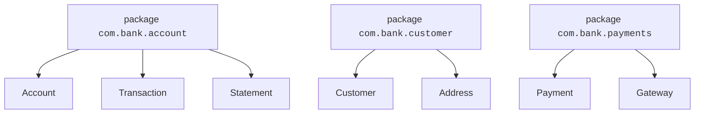
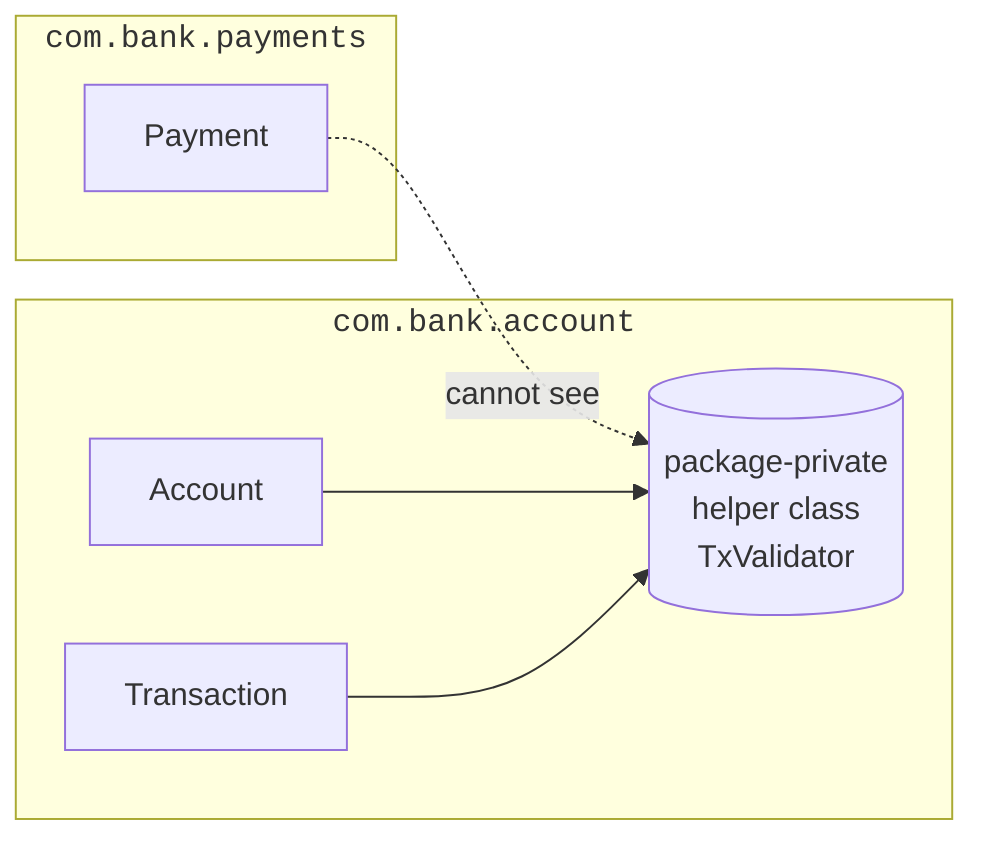
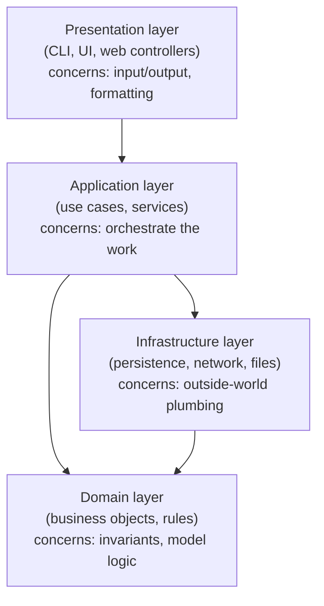
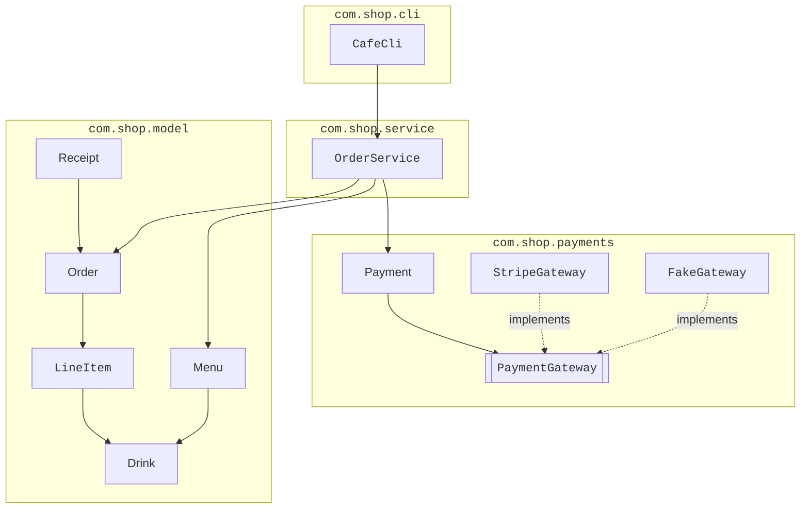
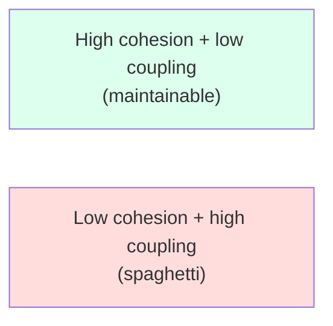

A real Java program has dozens or hundreds of classes. Without
organization, that becomes a wall of files no human can navigate.
**Packages** are Java's tool for grouping related classes into named
units. **Layered architecture** is a broader pattern for grouping
packages into a sensible whole.

This page is about scaling OOP from "ten files" to "a thousand
files" — *without* losing the qualities that make OOP worth using.

<svg
  viewBox="0 0 640 230"
  role="img"
  aria-label="Three wide translucent layers, each holding its own cluster of class shapes, with thin arrows flowing strictly downward — packages grouped into a layered architecture"
  style={{ display: "block", width: "100%", maxWidth: "640px", height: "auto", margin: "2.5rem auto" }}
>
  <g style={{ color: "var(--ds-blue-500)" }} fill="currentColor">
    <rect x="110" y="28" width="420" height="48" rx="12" fillOpacity="0.12" />
    <circle cx="170" cy="52" r="8" fillOpacity="0.7" />
    <circle cx="218" cy="52" r="8" fillOpacity="0.7" />
    <circle cx="266" cy="52" r="8" fillOpacity="0.7" />
  </g>
  <g style={{ color: "var(--ds-green-500)" }} fill="currentColor">
    <rect x="110" y="104" width="420" height="48" rx="12" fillOpacity="0.12" />
    <rect x="296" y="116" width="16" height="16" rx="4" fillOpacity="0.7" />
    <rect x="340" y="116" width="16" height="16" rx="4" fillOpacity="0.7" />
    <rect x="384" y="116" width="16" height="16" rx="4" fillOpacity="0.7" />
  </g>
  <g style={{ color: "var(--ds-yellow-500)" }} fill="currentColor">
    <rect x="110" y="180" width="420" height="48" rx="12" fillOpacity="0.14" />
    <circle cx="414" cy="204" r="8" fillOpacity="0.75" />
    <circle cx="462" cy="204" r="8" fillOpacity="0.75" />
    <circle cx="510" cy="204" r="8" fillOpacity="0.75" />
  </g>
  <g fill="currentColor" opacity="0.4">
    <rect x="318" y="80" width="4" height="18" rx="2" />
    <polygon points="312,96 328,96 320,106" />
    <rect x="318" y="156" width="4" height="18" rx="2" />
    <polygon points="312,172 328,172 320,182" />
  </g>
</svg>

<Callout type="info" title="Note about the playgrounds on this page">
The CheerpJ-based Java code blocks in this course don't model
packages literally — they put all files in one flat workspace. So
the examples below describe packages in the way a *real* multi-file
Java project would lay them out, but you can still run the code in
the playground without typing the `package` keyword. We will use
`package` lines in the diagrams and prose, and a comment in each
file in the code blocks shows where it would live.
</Callout>

## What a package is

A Java package is a *namespace* — a labeled folder of related
classes. The package name is part of a class's *fully qualified
name*. The class `java.util.ArrayList` lives in the package
`java.util`. Class names only need to be unique within a package.



The folder layout on disk mirrors the package:

```text
src/
└── com/
    └── bank/
        ├── account/
        │   ├── Account.java
        │   ├── Transaction.java
        │   └── Statement.java
        ├── customer/
        │   ├── Customer.java
        │   └── Address.java
        └── payments/
            ├── Payment.java
            └── Gateway.java
```

## Picking package names

Java packages are conventionally named in **lowercase**, with words
separated by dots, starting with a reverse-domain prefix to avoid
clashes:

| Project | Common prefix |
| --- | --- |
| Your university CS class | `edu.your-school.netid` |
| Personal project | `dev.you.project` |
| Company | `com.company.product` |

Inside that prefix, name packages by *what they're about* — `account`,
`customer`, `payments` — not by what kind of class they contain
(avoid `utils`, `helpers`, `objects`).

## Visibility, revisited

Recall the four Java access modifiers. Packages give two of them
their meaning:

| Modifier | Visible from |
| --- | --- |
| `private` | The declaring class only |
| *(no modifier)* — *package-private* | Other classes in the **same package** |
| `protected` | Same package, **and** subclasses anywhere |
| `public` | Anywhere |

The default — *package-private* — is more useful than beginners
realize. It lets the classes within a package share helpers without
exposing them to the whole program. Reach for `public` only when a
class is part of your package's *external API*.



`TxValidator` is package-private. Within `com.bank.account` it's
freely available; from outside, it's invisible. That isolation is
*real* encapsulation — at the package level.

## Layered architecture

A *layer* is a horizontal slice of a system that has a single kind
of responsibility. A typical small Java app has three or four
layers:



The cardinal rule: **dependencies point inward**. The UI may depend
on application services. Application services may depend on the
domain model. The domain model — the actual business objects, the
heart of the system — should depend on *nothing else in your code*.

This is sometimes called a **hexagonal** or **clean** architecture.
The headline benefit: you can swap the UI (CLI to web to mobile)
without touching the domain, and swap the database (in-memory to
SQL to cloud) without touching either.

| Layer | Sample classes | Sample packages |
| --- | --- | --- |
| Presentation | `MenuPrinter`, `OrderForm`, `LibraryCli` | `com.lib.cli` |
| Application | `LibraryService`, `BorrowUseCase` | `com.lib.service` |
| Domain | `Book`, `Member`, `Loan`, `Catalog` | `com.lib.model` |
| Infrastructure | `BookFileRepository`, `JdbcLoanRepository` | `com.lib.persistence` |

## A small but realistic layout

Imagine the order system from the previous page, organized for
growth. Each file's first line would be a `package` declaration.



A few principles to notice:

1. **Model has no outgoing arrows** to other packages here. It is
   the most stable, most reusable code in the system.
2. **Service** is the orchestrator. It assembles work from the
   model and from infrastructure (payments).
3. **CLI** is replaceable. Swapping it for a web layer means
   writing a new `com.shop.web` package; nothing else changes.
4. **Payments has an interface** (`PaymentGateway`) and concrete
   implementations. The service depends on the interface, not on
   `Stripe`.

## Single file vs. multi-package projects

How do you know when to split a class into a new package?

| Sign | Likely action |
| --- | --- |
| Two unrelated subjects in the same package | Split into two packages |
| A class is only used within its package | Make it package-private |
| Classes within a package import very little from outside | A good sign — high *cohesion* |
| Every package imports from every other | A bad sign — low cohesion, high *coupling* |

The goal is **high cohesion within packages** (classes in a package
belong together) and **low coupling between packages** (packages
don't reach into each other unnecessarily).



## Imports

When a class in one package needs a class from another, it imports
it:

```java
package com.shop.service;

import com.shop.model.Order;
import com.shop.model.Menu;
import com.shop.payments.Payment;

public class OrderService {
    private final Menu menu;
    private final Payment payment;
    // ...
}
```

Classes in the *same* package are visible to each other without an
import. The `java.lang` package (which contains `String`, `Integer`,
`System`, etc.) is also imported implicitly into every Java file.

## A tiny "many-classes" example, flat for the playground

Even though the playground keeps everything flat, we can still
*design* with packages and layers in mind. Here is a small,
deliberately under-decorated example: a domain model (`Book`,
`Catalog`), an application service (`LibraryService`), and a
"CLI"-style presentation (`Main`). Notice that `LibraryService` never
prints anything — it just orchestrates. Printing is a presentation
concern.

<CodeBlock
  adapter="java"
  entryFilename="Main.java"
  files={[
    {
      filename: "Main.java",
      starterCode: `// presentation layer (would live in com.lib.cli)
public class Main {
  public static void main(String[] args) {
    Catalog catalog = new Catalog();
    catalog.add(new Book("Refactoring", "Fowler"));
    catalog.add(new Book("OOSC", "Meyer"));

    LibraryService svc = new LibraryService(catalog);
    for (String line : svc.allTitles()) {
      System.out.println("- " + line);
    }
    System.out.println("Find 'OOSC': " + svc.findByTitle("OOSC"));
  }
}
`,
    },
    {
      filename: "Book.java",
      starterCode: `// domain layer (would live in com.lib.model)
public class Book {
  private final String title;
  private final String author;
  public Book(String title, String author) {
    this.title = title;
    this.author = author;
  }
  public String title() { return title; }
  public String author() { return author; }
  @Override
  public String toString() {
    return title + " — " + author;
  }
}
`,
    },
    {
      filename: "Catalog.java",
      starterCode: `// domain layer (would live in com.lib.model)
import java.util.ArrayList;
import java.util.List;

public class Catalog {
  private final List<Book> books = new ArrayList<>();
  public void add(Book b) { books.add(b); }
  public List<Book> all() { return books; }
  public Book findByTitle(String t) {
    for (Book b : books)
      if (b.title().equals(t))
        return b;
    return null;
  }
}
`,
    },
    {
      filename: "LibraryService.java",
      starterCode: `// application layer (would live in com.lib.service)
import java.util.ArrayList;
import java.util.List;

public class LibraryService {
  private final Catalog catalog;
  public LibraryService(Catalog catalog) { this.catalog = catalog; }

  public List<String> allTitles() {
    List<String> out = new ArrayList<>();
    for (Book b : catalog.all())
      out.add(b.toString());
    return out;
  }

  public String findByTitle(String t) {
    Book b = catalog.findByTitle(t);
    return b == null ? "not found" : b.toString();
  }
}
`,
    },
  ]}
/>

Even at this size, you can see the shape of a real project: the
*domain* knows about books, the *service* orchestrates queries, and
the *presentation* is the only thing that calls `System.out`. Add
a database tomorrow → write a new `Catalog` implementation in an
"infrastructure" package. Add a web UI → write a new presentation
package. The domain doesn't move.

## Test your understanding

<MultipleChoice
  markdown={`Which is the most useful default discipline for choosing access modifiers?

- Make every class \`public\` so nothing is hidden by accident
  > That's the opposite of useful — it locks you into a public API everywhere.
- Make every member \`protected\` because it's "in the middle"
  > Protected is more permissive than you usually want.
- [o] Make everything as restrictive as possible (\`private\` by default, package-private when needed) and widen only when there's a real reason
  > Narrow visibility keeps refactoring safe.
- Always use \`package-private\` for everything
  > Sometimes you genuinely need \`public\` (the API) or \`private\` (internals).`}
/>

<MultipleChoice
  markdown={`In a layered architecture, which way should dependencies point?

- From the domain inward to the database
  > Domain shouldn't depend on infrastructure.
- Domain should depend on the presentation layer
  > Definitely not; the domain is the most independent piece.
- [o] From the outer layers (presentation, infrastructure) toward the inner core (application, domain) — the domain depends on nothing else of yours
  > This is the "dependencies point inward" rule that keeps the core swappable.
- All layers should depend on every other layer equally
  > That recreates the spaghetti you're trying to avoid.`}
/>

<MultipleChoice
  markdown={`What is the goal expressed by "high cohesion, low coupling"?

- Maximize the number of imports across packages
  > That maximizes coupling — the opposite.
- Combine all classes into one giant package so nothing has to import anything
  > That maximizes coupling and destroys cohesion.
- [o] Classes within a package should belong together; packages should depend on each other as little as possible
  > This is the classic measure of a healthy modular design.
- Use the keyword \`public\` on as many members as possible
  > Visibility breadth and cohesion are unrelated.`}
/>
