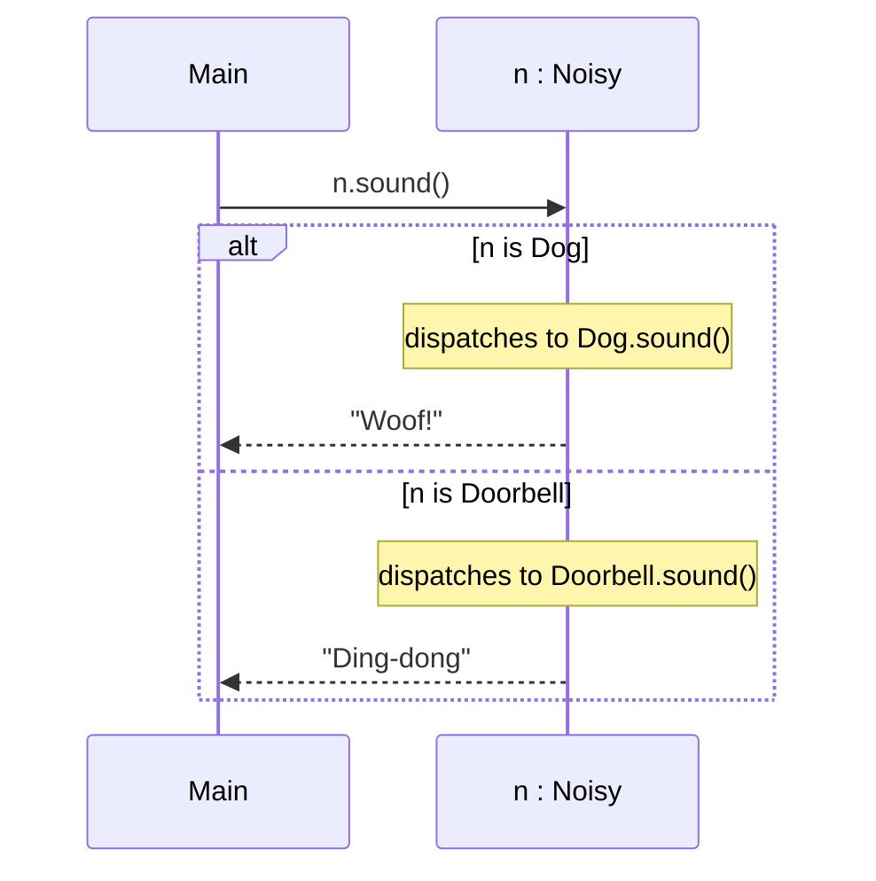
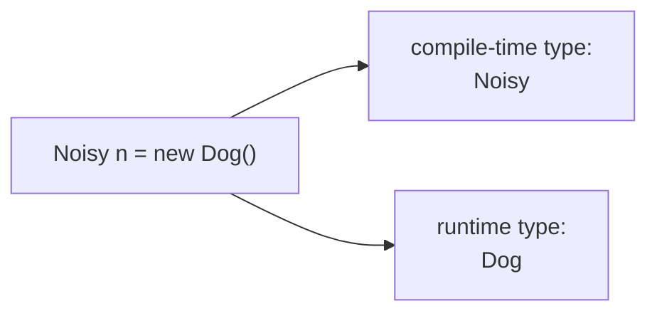
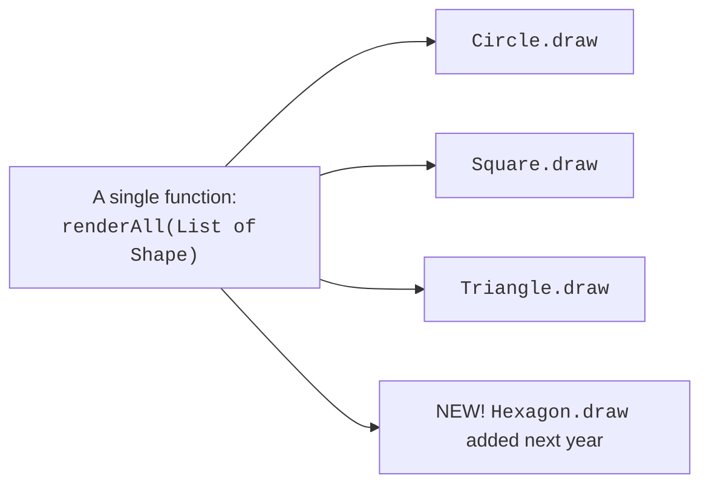
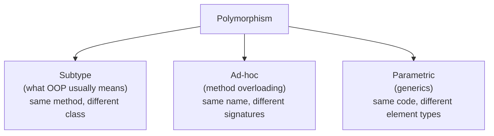
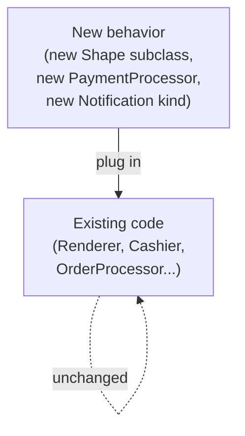

The Greek roots of **polymorphism** literally mean "many shapes." In
OOP, the word means: *the same message, sent through the same
variable type, can produce different behavior at runtime depending
on what kind of object is actually receiving it.*

This is what makes the lines you wrote on the previous two pages so
powerful. When `Main` loops over a list of `Noisy` and sends each
one `sound()`, the JVM dispatches to the *actual class* of each
object, not the variable's declared type.



<Figure
  slug="oopj-polymorphism-cutout"
  alt="One identical message token entering three differently shaped machines and each producing a visibly different output shape"
/>

## Two-level thinking: compile-time vs. runtime types

Every reference variable in Java has *two* types associated with it
at any moment:

- **Compile-time type** (also called *static type* or *declared
  type*): the type written in the variable declaration. The compiler
  uses it to decide which method names are even allowed.
- **Runtime type** (also called *dynamic type* or *actual class*):
  the class of the object the variable currently points to. The JVM
  uses it to decide which override of a method to actually run.

<Figure
  slug="oopj-polymorphism-inline-cutout"
  alt="One lever being pulled on the left, and three different machines to the right each answering it in their own way"
/>



<CodeBlock
  adapter="java"
  files={[
    {
      filename: "main.java",
      starterCode: `public class Main {
  public static void main(String[] args) {
    Animal a = new Dog();          // compile-time type Animal, runtime type Dog
    System.out.println(a.speak()); // -> "Woof!" (Dog's override)

    Animal a2 = new Cat(); // compile-time type Animal, runtime type Cat
    System.out.println(a2.speak());
  }
}

class Animal {
  public String speak() { return "(generic)"; }
}
class Dog extends Animal {
  @Override
  public String speak() {
    return "Woof!";
  }
}
class Cat extends Animal {
  @Override
  public String speak() {
    return "Meow!";
  }
}
`,
    },
  ]}
/>

The compiler only allows `a.speak()` because `Animal` has a method
called `speak()`. The JVM, at runtime, sees that `a` actually points
to a `Dog` and runs `Dog.speak()`. This is sometimes called **dynamic
dispatch** or **virtual dispatch**, and in Java *all instance
methods* work this way by default.

## Why polymorphism is the payoff of OOP

Polymorphism is what makes the previous chapters worth the effort.
Encapsulation, inheritance, and interfaces all build up to this
moment: a function that processes any number of *different* concrete
types as long as they share the right interface.



That last node, **the new shape added next year**, is the whole
point. You can ship `renderAll` today, and someone can plug in a
brand new `Hexagon` tomorrow, and your function doesn't change.

<CodeBlock
  adapter="java"
  entryFilename="Main.java"
  files={[
    {
      filename: "Main.java",
      starterCode: `import java.util.Arrays;
import java.util.List;

public class Main {
  public static void main(String[] args) {
    List<Shape> shapes =
        Arrays.asList(new Circle(2), new Square(3), new Triangle(4, 5));
    Renderer r = new Renderer();
    r.drawAll(shapes);
  }
}
`,
    },
    {
      filename: "Shape.java",
      starterCode: `public interface Shape {
  String draw();
}
`,
    },
    {
      filename: "Circle.java",
      starterCode: `public class Circle implements Shape {
  private final double r;
  public Circle(double r) { this.r = r; }
  @Override
  public String draw() {
    return "(O) circle r=" + r;
  }
}
`,
    },
    {
      filename: "Square.java",
      starterCode: `public class Square implements Shape {
  private final double s;
  public Square(double s) { this.s = s; }
  @Override
  public String draw() {
    return "[ ] square s=" + s;
  }
}
`,
    },
    {
      filename: "Triangle.java",
      starterCode: `public class Triangle implements Shape {
  private final double base, height;
  public Triangle(double base, double height) {
    this.base = base;
    this.height = height;
  }
  @Override
  public String draw() {
    return "/\\\\ triangle base=" + base + " height=" + height;
  }
}
`,
    },
    {
      filename: "Renderer.java",
      starterCode: `import java.util.List;

public class Renderer {
  public void drawAll(List<Shape> shapes) {
    for (Shape s : shapes) {
      System.out.println(s.draw()); // polymorphic call
    }
  }
}
`,
    },
  ]}
/>

`Renderer.drawAll` knows nothing about circles, squares, or
triangles. It depends only on `Shape`. The diversity is real, each
shape has its own internal state and computes its own representation,
but the *interaction* with `Renderer` is uniform.

## Subtype polymorphism vs. ad-hoc polymorphism

There are several flavors of polymorphism. In a beginner OOP course
the one to know is **subtype polymorphism**, which is what we just
saw: a variable of a parent type can hold any subtype, and calls
dispatch to the actual subtype.



You met **overloading** earlier in *Methods and Messages*. You will
meet generics in passing throughout this course. All three are
"polymorphism" in their broad sense, but when designers say "the
power of polymorphism" they almost always mean *subtype
polymorphism*.

## Upcasting and downcasting

Going from a subtype to a supertype is automatic and always safe,
it's called **upcasting**:

```java
Dog d = new Dog("Rex");
Animal a = d;   // upcast, no syntax needed, every Dog is an Animal
```

Going the other way, claiming a parent-typed reference is actually a
particular subtype, is called **downcasting**. It requires a cast
expression and may fail at runtime if you're wrong.

<CodeBlock
  adapter="java"
  files={[
    {
      filename: "main.java",
      starterCode: `public class Main {
  public static void main(String[] args) {
    Animal a1 = new Dog();
    Animal a2 = new Cat();

    // Safe pattern: check before you cast.
    if (a1 instanceof Dog) {
      Dog asDog = (Dog)a1;
      System.out.println("upgraded: " + asDog.fetch());
    }

    // Java 16 added pattern matching, which folds the cast into the check:
    //   if (a2 instanceof Cat c) { ... c.purr() ... }
    // The playground here runs Java 8, so this lesson writes it the long way.
    if (a2 instanceof Cat) {
      Cat c = (Cat)a2;
      System.out.println("upgraded: " + c.purr());
    }
  }
}

class Animal {
  public String speak() { return "(generic)"; }
}
class Dog extends Animal {
  @Override
  public String speak() {
    return "Woof!";
  }
  public String fetch() { return "fetched the ball"; }
}
class Cat extends Animal {
  @Override
  public String speak() {
    return "Meow!";
  }
  public String purr() { return "purrrr"; }
}
`,
    },
  ]}
/>

A heavy reliance on `instanceof` and downcasting is usually a *smell*,
it often means the supertype is missing an abstraction. If you find
yourself writing many `if (x instanceof A) ... else if (x instanceof
B) ...` blocks, ask whether the parent type should grow a method that
each subtype overrides.

## A bigger payoff: open–closed

Worth being precise about what is bought and what is sold, because this
trade runs in both directions:

<Chart slug="expression-problem-edits" />

There is a famous design idea called the **open–closed principle**:
software should be **open for extension** but **closed for
modification**. The phrase was coined by **Bertrand Meyer** in his
1988 book *Object-Oriented Software Construction*, and it resolves a
tension that sounds paradoxical at first, how can code be extendable
*and* untouchable at the same time? Polymorphism is the answer.



You extend the system by adding *new classes* that implement the
existing interfaces or abstract classes. The existing code, which
already worked and was already tested, doesn't have to change.

## Practice

<ChallengeCard
  adapter="java"
  title="Polymorphic Employee payroll"
  instructions={`Implement a tiny pay system using interface-based polymorphism.

- \`Payable\` interface with a single method \`int monthlyPayCents()\`.
- \`SalariedEmployee\` implements \`Payable\`. Constructor takes monthly salary in cents; \`monthlyPayCents()\` returns it directly.
- \`HourlyEmployee\` implements \`Payable\`. Constructor takes \`int hourlyRateCents\` and \`int hoursWorked\`; \`monthlyPayCents()\` returns \`hourlyRateCents * hoursWorked\`.
- \`Payroll\` has a method \`int totalCents(List<Payable> payees)\` that sums the monthly pay of all payees, no matter the concrete class.

The provided \`Main\` exercises a small list. Expected output:

\`\`\`
total cents: 800000
\`\`\``}
  entryFilename="Main.java"
  files={[
    {
      filename: "Main.java",
      starterCode: `import java.util.Arrays;
import java.util.List;

public class Main {
  public static void main(String[] args) {
    List<Payable> people =
        Arrays.asList(new SalariedEmployee(500_000),
                      new HourlyEmployee(2_000, 100), // 2_000 * 100 = 200_000
                      new HourlyEmployee(1_000, 100)  // 1_000 * 100 = 100_000
        );
    Payroll p = new Payroll();
    System.out.println("total cents: " + p.totalCents(people));
  }
}
`,
    },
    {
      filename: "Payable.java",
      starterCode: `public interface Payable {
  int monthlyPayCents();
}
`,
    },
    {
      filename: "SalariedEmployee.java",
      starterCode: `public class SalariedEmployee implements Payable {
  // TODO
}
`,
      solutionCode: `public class SalariedEmployee implements Payable {
  private final int salaryCents;
  public SalariedEmployee(int salaryCents) { this.salaryCents = salaryCents; }
  @Override
  public int monthlyPayCents() {
    return salaryCents;
  }
}
`,
    },
    {
      filename: "HourlyEmployee.java",
      starterCode: `public class HourlyEmployee implements Payable {
  // TODO
}
`,
      solutionCode: `public class HourlyEmployee implements Payable {
  private final int hourlyRateCents;
  private final int hoursWorked;
  public HourlyEmployee(int hourlyRateCents, int hoursWorked) {
    this.hourlyRateCents = hourlyRateCents;
    this.hoursWorked = hoursWorked;
  }
  @Override
  public int monthlyPayCents() {
    return hourlyRateCents * hoursWorked;
  }
}
`,
    },
    {
      filename: "Payroll.java",
      starterCode: `import java.util.List;

public class Payroll {
  public int totalCents(List<Payable> payees) {
    // TODO: sum all monthly pays using polymorphic dispatch
    return 0;
  }
}
`,
      solutionCode: `import java.util.List;

public class Payroll {
  public int totalCents(List<Payable> payees) {
    int total = 0;
    for (Payable p : payees) {
      total += p.monthlyPayCents(); // polymorphic call
    }
    return total;
  }
}
`,
    },
  ]}
  tests={[
    {
      id: "payroll-poly",
      name: "Sums any mix of Payable kinds via dynamic dispatch",
      expect: { stdoutEquals: "total cents: 800000" },
    },
  ]}
/>

## Test your understanding

<MultipleChoice
  markdown={`Given \`Animal a = new Dog();\` and \`a.speak();\`, which method actually runs?

- [o] \`Dog.speak()\` because the runtime type of the object \`a\` points to is \`Dog\`
  > Java uses dynamic dispatch on instance methods.
- \`Animal.speak()\` because \`a\`'s declared type is \`Animal\`
  > The declared type only restricts what method names are *visible*.
- It is undefined; the JVM picks at random
  > Behavior is fully deterministic.
- Neither, the compiler rejects this code
  > It compiles fine; \`Animal\` declares \`speak()\`.`}
/>

<MultipleChoice
  markdown={`Why is polymorphism considered the "payoff" of OOP?

- [o] Because one piece of generic code can handle any number of concrete types, including types that don't exist yet
  > This is the open-closed principle in action.
- Because it allows downcasting without checks
  > Downcasting is the *risky* operation polymorphism is supposed to let you avoid.
- Because it makes programs use less memory
  > Memory use is not the benefit.
- Because it removes the need for any interfaces or abstract classes
  > Polymorphism is *enabled by* interfaces and inheritance.`}
/>

<MultipleChoice
  markdown={`Which of these is a sign you might be *underusing* polymorphism?

- Your interfaces have only one method
  > Single-method interfaces are common and often fine.
- You have classes that implement an interface
  > That's exactly what you want.
- You override \`equals\` and \`hashCode\` on your value classes
  > That's normal.
- [o] Several methods in your code do \`if (x instanceof A) ... else if (x instanceof B) ...\` and call different code per branch
  > That pattern usually points at a missing abstraction, give the parent a method and let each subtype override it.`}
/>
