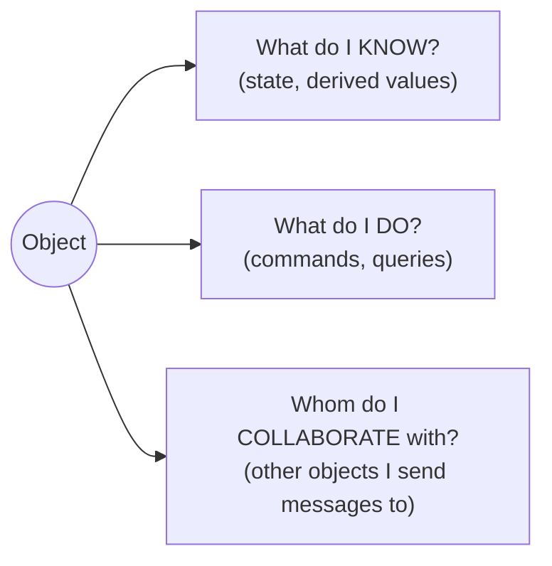
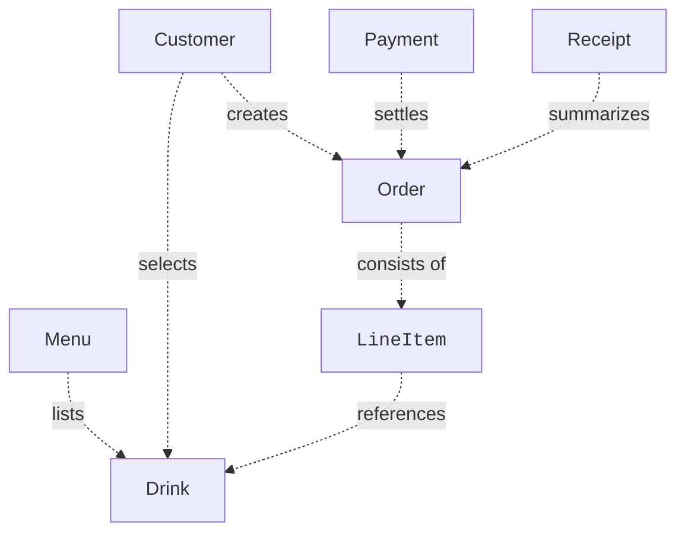
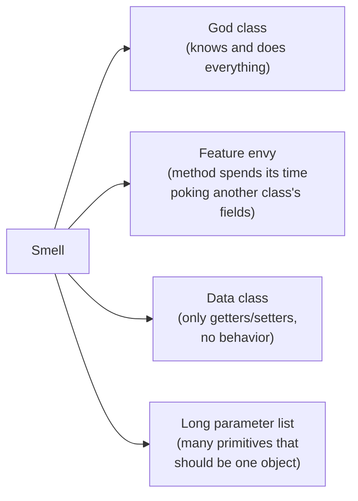
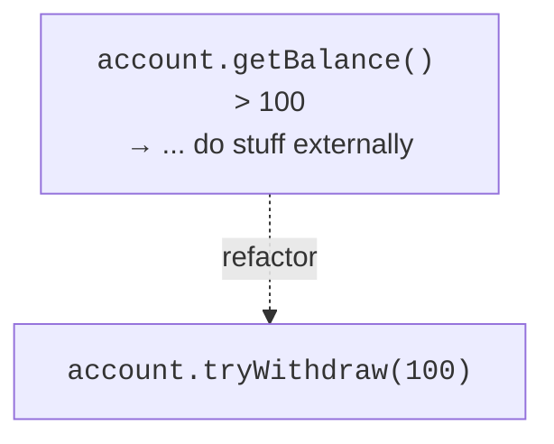

You have learned the *mechanics* of classes, interfaces, inheritance,
and polymorphism. None of that helps if you don't know *which class
should exist* or *which class should hold which behavior*. That
deciding skill is **responsibility-driven design**, and it's the
hardest, and most rewarding, part of OOP.

Responsibility-driven design was named by **Rebecca Wirfs-Brock** in
the late 1980s. The whole idea fits in one sentence:

> **Each object has a small set of responsibilities, and those
> responsibilities determine its behavior and collaborators.**

You stop asking "what fields does this class have?" and start asking
"what does this object *know*, and what does it *do*, and *who does
it ask for help*?"

<Figure
  slug="oopj-responsibility-cutout"
  alt="Three index-card plinths on a platform, each carrying one distinct small tool, thin collaboration lines drawn between them"
/>

## Three questions for every object



A healthy object can answer all three in one or two sentences. If
the *do* list is enormous, the object is doing too much. If the
*know* list is enormous, it probably owns data that belongs to
someone else. If the *collaborate* list is enormous, the object is
acting as a central coordinator and should probably be broken up.

<Figure
  slug="oopj-responsibility-driven-design-three-questions-every-inline-cutout"
  alt="One crate on a bench with three blank cards propped against it"
  caption="Ask what each class knows, what it does, and who it works with."
/>

## CRC cards: a 5-minute design tool

The classic tool for this style of thinking is the **CRC card**,
*Class–Responsibility–Collaborator*. Kent Beck and Ward Cunningham
introduced CRC cards in a 1989 OOPSLA paper with the disarming title
"A Laboratory for Teaching Object-Oriented Thinking"; they had been
using actual index cards to teach object design at Tektronix, and
discovered that the physical card was the point, you can pick a
class up, wave it around while talking about it, and its small size
*forces* the responsibilities to stay few. Wirfs-Brock then made the
cards a centerpiece of responsibility-driven design. Each card has
three fields:

```text
┌────────────────────────────────────────────┐
│ Class:  Order                              │
├────────────────────────────────────────────┤
│ Responsibilities         │ Collaborators   │
│ ─ track its line items   │  LineItem       │
│ ─ compute its total      │                 │
│ ─ know whether it is paid│                 │
│ ─ mark itself as paid    │  Payment        │
└────────────────────────────────────────────┘
```

You write one card per candidate class. The card forces brevity. If
the responsibility list spills off the card, the class is too big.

<Figure
  slug="oopj-responsibility-driven-design-crc-cards-5-minute-inline-cutout"
  alt="Three plain cards on a table, each ruled into the same three blank bands and passed between hands"
  caption="Class, responsibility, collaborator: three questions per card, and the design falls out."
/>

## A worked modeling example

Let's design, on cards, before code, a simple **coffee shop order
system**. From the description:

> A customer chooses one or more drinks from the menu. The system
> creates an order, takes payment, and prints a receipt.

A first naive impulse is to make one giant `CoffeeShop` class that
does everything. Resist it. Look for *nouns* in the description and
make a card for each candidate.

<Figure
  slug="oopj-responsibility-driven-design-worked-modeling-example-inline-cutout"
  alt="One part asking a neighbour for a reading rather than reaching through its casing to take it"
  caption="No class reaches into another's fields; it asks the object that owns them."
/>



A reasonable set of cards might look like:

| Class | Responsibilities | Collaborators |
| --- | --- | --- |
| `Drink` | Know its name and price | none |
| `Menu` | Know which drinks are offered; look one up by name | `Drink` |
| `LineItem` | Know a drink and a quantity; compute its subtotal | `Drink` |
| `Order` | Hold a list of line items; compute total; know if paid | `LineItem` |
| `Payment` | Charge an amount; mark the order as paid | `Order` |
| `Receipt` | Format an order as printed text | `Order` |

Each class owns *its own narrow slice of knowledge and behavior*.

Now translate to Java. Notice that *no class is "in charge of
everything"*. The flow of messages is the conversation.

<CodeBlock
  adapter="java"
  entryFilename="Main.java"
  files={[
    {
      filename: "Main.java",
      starterCode: `import java.util.Arrays;

public class Main {
  public static void main(String[] args) {
    Menu menu = new Menu();
    menu.add(new Drink("Espresso", 250));
    menu.add(new Drink("Latte", 400));
    menu.add(new Drink("Croissant", 300));

    Order o = new Order();
    o.add(new LineItem(menu.find("Latte"), 2));
    o.add(new LineItem(menu.find("Croissant"), 1));

    Payment p = new Payment();
    p.charge(o);

    System.out.println(new Receipt().format(o));
  }
}
`,
    },
    {
      filename: "Drink.java",
      starterCode: `public class Drink {
  private final String name;
  private final int priceCents;
  public Drink(String name, int priceCents) {
    this.name = name;
    this.priceCents = priceCents;
  }
  public String name() { return name; }
  public int price() { return priceCents; }
}
`,
    },
    {
      filename: "Menu.java",
      starterCode: `import java.util.ArrayList;
import java.util.List;

public class Menu {
  private final List<Drink> drinks = new ArrayList<>();

  public void add(Drink d) { drinks.add(d); }

  public Drink find(String name) {
    for (Drink d : drinks) {
      if (d.name().equals(name))
        return d;
    }
    throw new IllegalArgumentException("no such drink: " + name);
  }
}
`,
    },
    {
      filename: "LineItem.java",
      starterCode: `public class LineItem {
  private final Drink drink;
  private final int quantity;

  public LineItem(Drink drink, int quantity) {
    if (quantity <= 0)
      throw new IllegalArgumentException("quantity > 0");
    this.drink = drink;
    this.quantity = quantity;
  }

  public Drink drink() { return drink; }
  public int quantity() { return quantity; }
  public int subtotal() { return drink.price() * quantity; }
}
`,
    },
    {
      filename: "Order.java",
      starterCode: `import java.util.ArrayList;
import java.util.List;

public class Order {
  private final List<LineItem> items = new ArrayList<>();
  private boolean paid = false;

  public void add(LineItem item) { items.add(item); }

  public int total() {
    int sum = 0;
    for (LineItem it : items)
      sum += it.subtotal();
    return sum;
  }

  public boolean isPaid() { return paid; }
  public void markPaid() { paid = true; }

  public List<LineItem> items() { return items; }
}
`,
    },
    {
      filename: "Payment.java",
      starterCode: `public class Payment {
  public void charge(Order order) {
    if (order.isPaid())
      return;
    // Pretend we hit a payment gateway here.
    order.markPaid();
  }
}
`,
    },
    {
      filename: "Receipt.java",
      starterCode: `public class Receipt {
  public String format(Order o) {
    StringBuilder sb = new StringBuilder();
    sb.append("--- RECEIPT ---\\n");
    for (LineItem it : o.items()) {
      sb.append(String.format("%-10s x%-2d  %4d%n", it.drink().name(),
                              it.quantity(), it.subtotal()));
    }
    sb.append("TOTAL          ").append(o.total()).append('\\n');
    sb.append(o.isPaid() ? "(paid)" : "(unpaid)");
    return sb.toString();
  }
}
`,
    },
  ]}
/>

Notice how *no* class reaches into another class's fields. `Receipt`
asks `Order` for its items and total. `Payment` asks `Order` whether
it's paid. `LineItem` asks `Drink` for its price. *Every interaction
is a message.* That is responsibility-driven design.

## Smells that point at responsibility problems

Whenever a class starts feeling wrong, one of these *code smells* is
usually the cause. Each has a fix rooted in responsibility-driven
thinking.



| Smell | Likely cause | Likely fix |
| --- | --- | --- |
| **God class** | One class is doing several jobs | Split out classes per job |
| **Feature envy** | Behavior is on the wrong class | Move the method to the class whose data it uses |
| **Data class / anemic model** | Behavior is in *other* classes | Move methods onto the class that owns the data |
| **Long parameter list** | A *concept* is implicit | Introduce a class that bundles the parameters |

## A quick refactor: feature envy

Look at this `Util.tax(invoice)` method. It looks like it operates on
an `Invoice`, but every line is poking at `Invoice`'s fields. The
behavior *envies* the data, it wants to live on `Invoice`.

<CodeBlock
  adapter="java"
  files={[
    {
      filename: "main.java",
      starterCode: `public class Main {
  public static void main(String[] args) {
    Invoice inv = new Invoice(100.0, 50.0);
    // Awkward: outsider doing the math
    double tax = Util.tax(inv);
    System.out.println("tax = " + tax);
  }
}

class Invoice {
  double subtotal;
  double shipping;
  Invoice(double subtotal, double shipping) {
    this.subtotal = subtotal;
    this.shipping = shipping;
  }
}

class Util {
  static double tax(Invoice inv) {
    return (inv.subtotal + inv.shipping) * 0.10; // pokes Invoice's fields
  }
}
`,
    },
  ]}
/>

The responsibility-driven fix is to move the method onto `Invoice`,
where the data lives, and stop making `Invoice` a passive bag of
fields.

<CodeBlock
  adapter="java"
  files={[
    {
      filename: "main.java",
      starterCode: `public class Main {
  public static void main(String[] args) {
    Invoice inv = new Invoice(100.0, 50.0);
    System.out.println("tax = " + inv.tax());
  }
}

class Invoice {
  private final double subtotal;
  private final double shipping;
  private static final double RATE = 0.10;

  public Invoice(double subtotal, double shipping) {
    this.subtotal = subtotal;
    this.shipping = shipping;
  }

  public double tax() {
    return (subtotal + shipping) * RATE; // owns its own behavior
  }
}
`,
    },
  ]}
/>

Five lines of code moved, but the design is dramatically better.
`Invoice` now owns both its data *and* the rules about its data. The
caller no longer has to know the tax formula. Tomorrow's "Belgian
invoices have a different rate" change happens in `Invoice`, not in
every caller.

## The "tell, don't ask" rule of thumb

A classic shorthand:

> **Tell** an object to do something. Don't **ask** it for data so
> you can do something with the data yourself.



The "tell" form lets the object enforce its own rules. The "ask" form
forces callers to re-implement those rules consistently, which they
won't.

## Practice

<ChallengeCard
  adapter="java"
  title="Move the behavior to the right class"
  instructions={`Refactor a small *feature envy* smell.

You're given two starter classes:

- \`Wallet\` exposes its \`cents\` field as \`public\` (bad).
- \`Buyer\` decides whether the wallet can afford something and then mutates the wallet directly.

Move all of that logic onto \`Wallet\`:

- Make \`cents\` \`private final\`-ish: \`private int cents;\` initialized via the constructor.
- Add \`public boolean buy(int priceCents)\` that returns \`false\` if there isn't enough money (and does *not* change the balance), or returns \`true\` and subtracts the price.
- Add \`public int balance()\`.

Rewrite \`Buyer.shop(...)\` to just *tell* the wallet to buy. The \`Main\` is provided.

Expected output (with starting balance 100):

\`\`\`text
bought apple? true
bought yacht? false
balance: 60
\`\`\``}
  entryFilename="Main.java"
  files={[
    {
      filename: "Main.java",
      starterCode: `public class Main {
  public static void main(String[] args) {
    Wallet w = new Wallet(100);
    Buyer b = new Buyer();
    System.out.println("bought apple? " + b.shop(w, 40));
    System.out.println("bought yacht? " + b.shop(w, 1_000_000));
    System.out.println("balance: " + w.balance());
  }
}
`,
    },
    {
      filename: "Wallet.java",
      starterCode: `public class Wallet {
  public int cents; // TODO: encapsulate this
  public Wallet(int cents) { this.cents = cents; }
}
`,
      solutionCode: `public class Wallet {
  private int cents;
  public Wallet(int cents) { this.cents = cents; }

  public boolean buy(int priceCents) {
    if (priceCents <= 0)
      throw new IllegalArgumentException("price > 0");
    if (priceCents > cents)
      return false;
    cents -= priceCents;
    return true;
  }

  public int balance() { return cents; }
}
`,
    },
    {
      filename: "Buyer.java",
      starterCode: `public class Buyer {
  public boolean shop(Wallet w, int priceCents) {
    // TODO: replace this feature-envy with a single \`tell\` call
    if (w.cents >= priceCents) {
      w.cents -= priceCents;
      return true;
    }
    return false;
  }
}
`,
      solutionCode: `public class Buyer {
  public boolean shop(Wallet w, int priceCents) { return w.buy(priceCents); }
}
`,
    },
  ]}
  tests={[
    {
      id: "tell-dont-ask",
      name: "Behavior lives on Wallet, not Buyer",
      expect: {
        stdoutLines: [
          "bought apple? true",
          "bought yacht? false",
          "balance: 60",
        ],
        stdoutLinesExact: true,
      },
    },
  ]}
/>

## Test your understanding

<MultipleChoice
  markdown={`Which best describes responsibility-driven design?

- All classes should inherit from a shared base class
  > Inheritance is unrelated to responsibility-driven design.
- [o] Each class should have a small, coherent set of responsibilities, and those determine its behavior and its collaborators
  > This is essentially the Wirfs-Brock formulation.
- Each class should have exactly one method
  > Method count isn't the criterion; coherence of responsibility is.
- Behaviour should be split across as many classes as possible
  > Excess fragmentation is its own problem.`}
/>

<MultipleChoice
  markdown={`A method on class \`Foo\` does almost nothing except read fields of a passed-in \`Bar\`. This is the smell called:

- [o] Feature envy
  > The method *envies* Bar's data; it likely belongs on Bar.
- Anemic model
  > That describes a *class* with only data and no behavior, not a single method.
- Long parameter list
  > That's specifically about too many parameters of primitive types.
- God class
  > That's when one class does too much in total.`}
/>

<MultipleChoice
  markdown={`What does the "tell, don't ask" guideline mean?

- Don't write public methods at all
  > You absolutely need public methods to expose behavior.
- [o] Send the object a command to do the thing, rather than pulling out its data and doing the thing yourself
  > This keeps the object in control of its own rules.
- Always pass parameters by value
  > Java has its own parameter-passing rules independent of this guideline.
- Always print debug messages
  > Unrelated to logging.`}
/>
