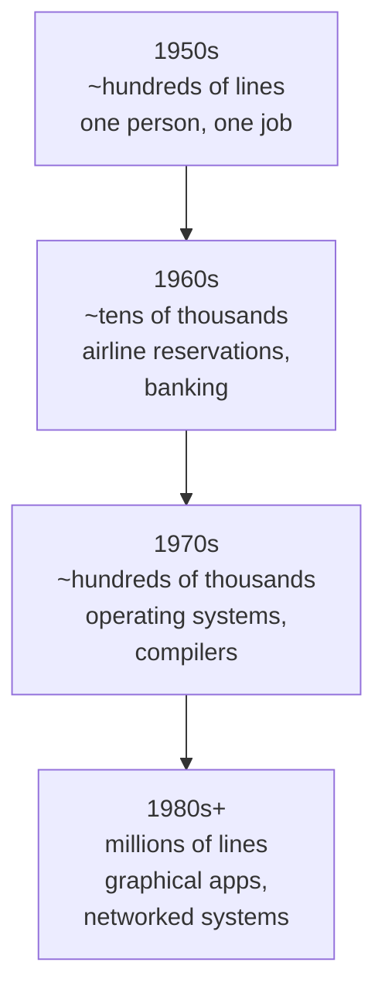
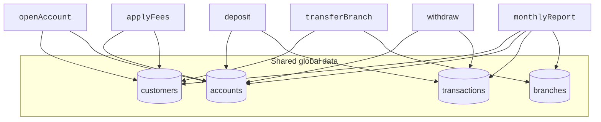

Before we look at a single line of Java, we have to answer a question
that almost nobody asks: **why does object-oriented programming exist
at all?** It was not handed down from on high. It is the answer to a
very specific, very painful problem that the software industry ran
into in the 1960s.

<Figure
  slug="oopj-software-crisis-cutout"
  alt="A precarious leaning tower of mismatched blocks on a platform, loose cables spilling out of its sides"
/>

## A short history of code getting bigger

In the early days of computing, programs were tiny. A complete program
might be a few hundred lines of FORTRAN or assembly, written by one
person, doing one thing, compute a ballistic trajectory, sort a
payroll file, control a thermostat. Code at that size is easy to keep
in your head.

Then computers got cheaper and faster, and the things we asked them to
do got dramatically bigger.

By the late 1960s a single program could be hundreds of thousands of
lines long, written by dozens of people over years, modified long
after the original authors had left. The tools of the previous decade,
global variables, GOTO statements, subroutines that all shared the
same data, simply did not scale to that size.

The most famous casualty was IBM's **OS/360**, the operating system
for the System/360 mainframe family, and one of the largest software
projects ever attempted at the time. It consumed thousands of
programmer-years and still shipped late and over budget. Its manager,
**Fred Brooks**, later distilled the wreckage into *The Mythical
Man-Month* (1975), the most famous book ever written about software
projects, including the observation now known as **Brooks's law**:
*adding manpower to a late software project makes it later*, because
every added person multiplies the communication overhead among all
the others.

In **1968**, at a NATO conference in Garmisch, Germany, attendees gave
this problem a name: **the software crisis**. Projects were running
years late, budgets were exploding, and the resulting software was
frequently late, slow, full of bugs, and almost impossible to change
safely.

<Callout type="info" title="Where the term comes from">
The phrase *"software crisis"* was used at the **1968 NATO Software
Engineering Conference**. The same conference introduced the term
*"software engineering"* itself, and the conference report admits the
name was chosen to be deliberately **provocative**: in 1968, the idea
that writing software could be an engineering discipline, with the
rigor of bridge-building, was closer to an aspiration than a fact.
</Callout>

## What was so painful about procedural code?

The dominant style at the time is sometimes called **procedural
programming**: a program is a list of procedures (functions) that
share access to data, often via global variables. Let's look at a
miniature version of what that felt like.

<CodeBlock
  adapter="java"
  files={[
    {
      filename: "main.java",
      starterCode: `public class Main {
  // Imagine these as "global" data, every procedure can read and write them.
  static String customerName;
  static double customerBalance;
  static boolean customerIsPremium;

  static void deposit(double amount) { customerBalance += amount; }

  static void withdraw(double amount) {
    // Whoops: nothing stops us from going negative.
    customerBalance -= amount;
  }

  static void applyMonthlyFee() {
    if (!customerIsPremium) {
      customerBalance -= 5.0;
    }
  }

  public static void main(String[] args) {
    customerName = "Ada";
    customerBalance = 100.0;
    customerIsPremium = false;

    deposit(50);
    withdraw(200); // overdraws, no protection
    applyMonthlyFee();

    System.out.println(customerName + " balance: " + customerBalance);
  }
}
`,
    },
  ]}
/>

Now imagine a real bank, with *thousands* of customers, dozens of
procedures, and many programmers. Several painful patterns emerge:

- **Data has no owner.** Any function in the program can mutate
  `customerBalance`. If a bug puts it in a bad state, the culprit
  could be *anywhere*.
- **Invariants are not protected.** Nothing prevents `withdraw` from
  making the balance negative. The rule "balance must be ≥ 0" is not
  enforced by the data, it has to be remembered by every author of
  every function.
- **Procedures and data are scattered.** There is no single place to
  look to find "everything about a customer."
- **Change cascades.** Adding a new field to a customer means
  searching the entire codebase for places that read or write
  customer data. Miss one, and you have a bug.
- **Reuse is hard.** To use the "customer logic" in a different
  program, you would have to lift out a tangle of globals and
  procedures that all reference each other.

## A picture of the mess

It helps to visualize what a procedural system looks like as it grows.

Every procedure points at every piece of data. There are no walls.
This is the diagram a senior engineer would draw on a whiteboard right
before saying "...and that is why we cannot ship the new feature on
time."

## Symptoms the crisis produced

By the early 1970s, the industry had a vocabulary for the symptoms:

| Symptom | What it looked like in practice |
| --- | --- |
| **Spaghetti code** | Tangled `GOTO`s and shared state; you couldn't trace one feature without reading the whole program |
| **Brittleness** | A small change in one place broke five things far away |
| **Defect explosion** | More code → more bugs, and the bugs were harder to localize |
| **Long lead times** | Adding "one more field" took weeks because nobody knew what it would break |
| **Knowledge loss** | When the original author left, the system became read-only |

## What would a fix have to look like?

Stand back and the requirements for *any* solution become clear:

1. **Data should have an owner**, code that touches a piece of data
   should be small, named, and findable.
2. **Invariants should be enforced by the type itself**, not by every
   caller's discipline.
3. **Reusable units** should be packageable, so you can lift "customer"
   out of one program and drop it into another.
4. **The structure of the code should mirror the structure of the
   problem**, so a new engineer can navigate it by intuition.
5. **Large systems should compose out of smaller systems**, not exist
   as one giant ball of procedures.

That list is the seed of object-oriented programming. An **object**
will turn out to be exactly the thing that bundles data with the code
that owns it, enforces its own invariants, can be packaged, mirrors
something in the real world, and composes with other objects.

But before we get there, the field needed someone to actually invent
that idea. That happens in the next page.

## Test your understanding

<MultipleChoice
  markdown={`In a procedural system that uses lots of global variables, why are bugs especially hard to track down?

- Because global variables are stored on the heap instead of the stack
  > The storage location of a variable doesn't make a bug harder to find.
- [o] Because *any* function in the program can modify the data, so the culprit could be anywhere
  > With no ownership, every read and write site is a suspect, which makes debugging slow and frustrating.
- Because procedural languages have no \`if\` statements
  > Procedural languages have full control flow; this is unrelated.
- Because the compiler refuses to type-check global state
  > Most compilers happily check globals; the issue is not type-checking.`}
/>

<MultipleChoice
  markdown={`Which best describes what the term *software crisis* (NATO 1968) referred to?

- A shortage of computers in industry
  > Hardware was actually becoming more abundant.
- The first appearance of open-source licensing disputes
  > Open-source licensing debates came much later and are unrelated.
- A specific virus that destroyed mainframe systems
  > It was not a literal attack; it was a structural problem.
- [o] A pattern of large software projects being late, over budget, buggy, and hard to change
  > The crisis was about the difficulty of building and maintaining big systems with the tools of the time.`}
/>

<MultipleChoice
  markdown={`Which property would a *solution* to the software crisis most need?

- A single global database that all functions share
  > That is closer to the problem than the solution.
- More clever \`GOTO\` statements
  > \`GOTO\`-heavy code was part of what made systems unmaintainable.
- [o] Units of code that own their data, enforce their own rules, and can be composed into larger systems
  > This is essentially the definition of an object, which is where OOP enters the story.
- Faster CPUs so procedural code runs quickly
  > Speed doesn't fix maintainability.`}
/>
