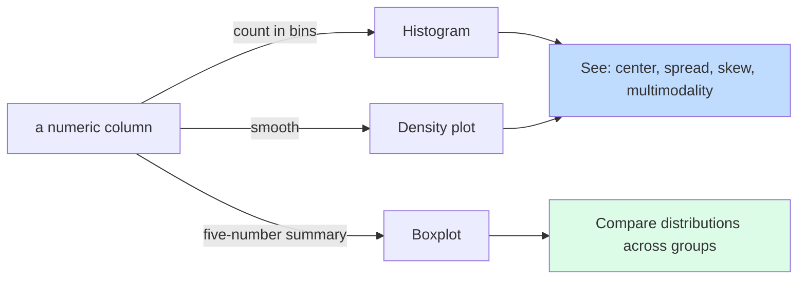

A summary statistic compresses a column to one number. A
**distribution plot** shows you the whole column at once. Each
serves a different purpose, and the experienced analyst always
uses both.

Three plots cover most of what you need:

1. **Histogram**, counts in each bucket
2. **Density plot**, a smooth version of the histogram
3. **Boxplot**, a five-number summary as a picture, easy to
   compare across groups

<Figure
  slug="rlang-distributions-cutout"
  alt="Three small panels side by side on a platform showing a binned bar shape, a smooth mound and a five-point box marker"
/>

## Histograms

The bin width is a decision you make, not a fact about the data, and it
changes what the chart says:

<Chart slug="histogram-bin-width" />

A histogram chops the range of values into bins and counts how
many values fall in each. The result is a picture of where values
*pile up*.

<Figure
  slug="rlang-exploring-distributions-inline-cutout"
  alt="A tray of chips poured into a row of bins, the bins filling into a rounded mound with thin tails at both ends"
/>

<CodeBlock
  adapter="r"
  files={[
    {
      filename: "main.r",
      starterCode: `data(mtcars)
hist(mtcars$mpg,
  main = "Fuel economy (mtcars)",
  xlab = "Miles per gallon",
  col = "steelblue",
  breaks = 10
)
`,
    },
  ]}
/>

The `breaks` argument controls how many bins. The default usually
works, but try `breaks = 5` and `breaks = 30` to see how much
binning affects the impression.

**Things to look for:**

- **Center**: where is the bulk of the data?
- **Spread**: narrow or wide?
- **Skew**: long tail on the right (right-skewed) or on the left
  (left-skewed)?
- **Modes**: one peak (unimodal) or more (multimodal, often a
  sign of a hidden grouping variable)?
- **Gaps and outliers**: empty zones, lonely far-away values

## Density plots

A density plot is a *smoothed* histogram. It often makes the shape
easier to compare, especially across groups:

<CodeBlock
  adapter="r"
  files={[
    {
      filename: "main.r",
      starterCode: `data(mtcars)
d <- density(mtcars$mpg)
plot(d,
  main = "Density of mpg",
  xlab = "Miles per gallon",
  col  = "darkred",
  lwd  = 2
)
polygon(d, col = adjustcolor("darkred", 0.3), border = NA)
`,
    },
  ]}
/>

Density plots have one parameter to keep in mind: the **bandwidth**
(how much smoothing). Too little, and you're back to a noisy
histogram. Too much, and you've smoothed real features away. R's
default usually does a reasonable job.

## Boxplots

A boxplot knows only about quartiles, so it is blind to shape. Three very
different samples, one identical box:

<Chart slug="box-hides-shape" />

A boxplot summarizes a distribution as a *picture of the
five-number summary* (min, Q1, median, Q3, max), with conventions
for marking outliers.

<CodeBlock
  adapter="r"
  files={[
    {
      filename: "main.r",
      starterCode: `data(mtcars)
boxplot(mtcars$mpg,
  main = "mpg distribution",
  ylab = "Miles per gallon",
  col  = "lightblue"
)
`,
    },
  ]}
/>

- The **box** spans Q1 to Q3 (the middle 50%).
- The **line in the middle** is the median.
- The **whiskers** extend out to (roughly) the most extreme
  non-outlier values.
- **Dots** beyond the whiskers are conventional outliers (more
  than 1.5 × IQR past Q1 or Q3).

Boxplots really earn their keep when you want to **compare
distributions across groups**:

<CodeBlock
  adapter="r"
  files={[
    {
      filename: "main.r",
      starterCode: `data(mtcars)
boxplot(mpg ~ cyl,
  data = mtcars,
  main = "mpg by cylinder count",
  xlab = "Cylinders",
  ylab = "mpg",
  col = c("lightblue", "lightgreen", "lightpink")
)
`,
    },
  ]}
/>

In one picture: 4-cyl cars get the best mileage, 8-cyl the worst,
and 6-cyl sits in between with a tight spread. Three groups, one
glance.

## ggplot2 versions

The base R plotting we've used so far is quick and convenient. In
the visualization section we'll learn `ggplot2`, which is more
verbose but enormously more flexible. Here's a sneak peek:

<CodeBlock
  adapter="r"
  files={[
    {
      filename: "main.r",
      starterCode: `library(ggplot2)
data(mtcars)

ggplot(mtcars, aes(x = mpg)) +
  geom_histogram(bins = 10, fill = "steelblue", color = "white")
`,
    },
  ]}
/>

<CodeBlock
  adapter="r"
  files={[
    {
      filename: "main.r",
      starterCode: `library(ggplot2)
data(mtcars)

ggplot(mtcars, aes(x = factor(cyl), y = mpg, fill = factor(cyl))) +
  geom_boxplot() +
  labs(x = "Cylinders", y = "mpg", title = "mpg by cylinders") +
  theme(legend.position = "none")
`,
    },
  ]}
/>

## Reading a distribution: skew

The three shapes you will meet most often, side by side:

<Chart slug="skew-shapes" />

Most real-world data is **right-skewed** (income, transaction
sizes, web traffic, response times). The bulk of values cluster
at low-to-medium values with a long tail of high values.

<CodeBlock
  adapter="r"
  files={[
    {
      filename: "main.r",
      starterCode: `# A skewed distribution: simulated incomes
set.seed(42)
incomes <- round(rlnorm(500, meanlog = 10.5, sdlog = 0.6))

par(mfrow = c(1, 2)) # side by side
hist(incomes,
  breaks = 30, main = "Right-skewed: incomes",
  col = "coral", xlab = "income"
)
boxplot(incomes,
  horizontal = TRUE, main = "Boxplot",
  col = "coral", xlab = "income"
)
par(mfrow = c(1, 1))
`,
    },
  ]}
/>

Notice how the histogram has a long right tail, and the boxplot
has many outliers on the right side. Both are saying the same
thing: *the mean is bigger than the median*, the rich are
pulling the average up.

A common analytical move for right-skewed data: **log-transform
it**. The transformed distribution often looks symmetric and
becomes easier to work with statistically.

<CodeBlock
  adapter="r"
  files={[
    {
      filename: "main.r",
      starterCode: `set.seed(42)
incomes <- round(rlnorm(500, meanlog = 10.5, sdlog = 0.6))

par(mfrow = c(1, 2))
hist(incomes, main = "incomes", col = "coral", breaks = 30)
hist(log10(incomes), main = "log10(incomes)", col = "skyblue", breaks = 30)
par(mfrow = c(1, 1))
`,
    },
  ]}
/>

## Test your understanding

<MultipleChoice
  markdown={`A histogram of a column shows a long tail extending to the right of the bulk of the data. This distribution is:

- bimodal
  > Bimodal means two peaks, not a single tail, this histogram has one dominant cluster with a tail, not two separate humps.
- [o] right-skewed
  > "Right-skewed" means the tail extends to the right (toward larger values). It is the most common shape for natural data like income or transaction sizes.
- symmetric
  > A symmetric distribution has roughly equal bulk on both sides of the center; a long right tail rules that out.
- left-skewed
  > A left-skewed distribution has its long tail pointing to the left (toward smaller values), not the right.
`}
/>

<MultipleChoice
  markdown={`In a boxplot, the "box" itself represents:

- The full range of the data.
  > The full range (minimum to maximum) is shown by the whiskers and outlier dots, not by the box itself.
- The mean ± one standard deviation.
  > The mean ± one SD is a common summary but is not what a boxplot's box represents; the box is defined by quartiles, not the mean.
- [o] The middle 50% of the data, from Q1 (25th percentile) to Q3 (75th percentile).
  > The line inside is the median; the box edges are the quartiles.
- The confidence interval of the mean.
  > A confidence interval is an inferential construct requiring an assumption about the population; the boxplot's box is simply a descriptive display of quartiles.
`}
/>

<MultipleChoice
  markdown={`Why are boxplots especially useful when comparing several groups?

- They show every individual data point.
  > Showing every point is the job of a strip chart or jittered dot plot; a boxplot summarizes the distribution rather than displaying raw values.
- They are the only plot that handles NAs.
  > All standard R plots skip NAs by default; handling missing values is not unique to boxplots.
- They have the fewest pixels.
  > Pixel count is not a meaningful criterion for choosing a plot; compactness of statistical information is what matters.
- [o] They compress each group's full distribution into a small, standardized picture that lines up nicely side-by-side.
  > That makes shifts in center, spread, and outliers easy to spot across many groups at once.
`}
/>

## Mini challenge: visualize a skewed column

Use a histogram and a boxplot, side by side, to explore the
`Ozone` column of the built-in `airquality` dataset (remember
it has NAs). Describe what you see in your own head; the test
just checks the plot was produced.

<ChallengeCard
  adapter="r"
  title="Histogram + boxplot for Ozone"
  instructions={`Produce two side-by-side plots: (1) a histogram of \`airquality$Ozone\` (NAs ignored), (2) a boxplot of the same. Set the layout with \`par(mfrow = c(1, 2))\`.`}
  files={[
    {
      filename: "main.r",
      starterCode: `data(airquality)
oz <- airquality$Ozone # has NAs

par(mfrow = c(1, 2))
# 1. histogram
# 2. boxplot
par(mfrow = c(1, 1))

cat("done\\n")
`,
      solutionCode: `data(airquality)
oz <- airquality$Ozone

par(mfrow = c(1, 2))
hist(oz,
  breaks = 20, col = "coral",
  main = "Ozone histogram", xlab = "Ozone"
)
boxplot(oz, col = "coral", main = "Ozone boxplot")
par(mfrow = c(1, 1))

cat("done\\n")
`,
    },
  ]}
  tests={[
    {
      id: "ran",
      name: "Code ran without error",
      code: `cat("ok\\n")`,
    },
  ]}
/>

So far we've looked at one column at a time. The next page is
about the *relationships* between columns, and where many of
the most interesting analyses begin.
