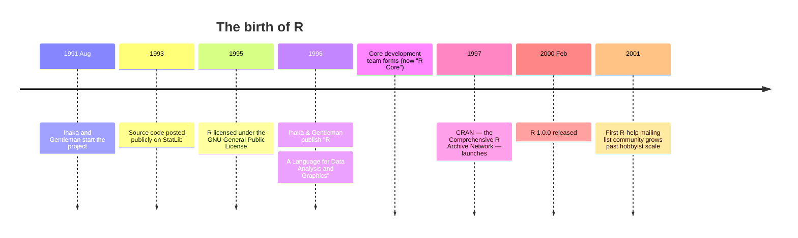

<IllustrationPrompt subject="Ross Ihaka" photo />

In 1991, Ross Ihaka and Robert Gentleman were colleagues in the
statistics department at the University of Auckland, New Zealand.
They were both interested in computing — Ihaka had a PhD in
statistics from Berkeley, Gentleman had done postdoctoral work on
genetics — and both had used the **S** language at previous
institutions.

They had a small, local problem: they wanted to teach introductory
statistics with a hands-on computer lab. They wanted students to
play with data, not just read about it. The natural tool for this
was S-PLUS — but Auckland could not afford site licenses for every
student machine.

So they decided to write their own.

<svg
  viewBox="0 0 640 240"
  role="img"
  aria-label="A small solid blue cube passes along a solid gray arrow into a much larger green cube with smaller cubes budding beside it — the S language reborn at Auckland as R, and growing far beyond its teaching-lab roots"
  style={{ display: "block", width: "100%", maxWidth: "640px", height: "auto", margin: "2.5rem auto" }}
>
  <g style={{ color: "var(--ds-blue-500)" }} fill="currentColor">
    <polygon points="150,100 185,120 150,140 115,120" />
    <polygon points="115,120 150,140 150,166 115,146" fillOpacity="0.65" />
    <polygon points="185,120 150,140 150,166 185,146" fillOpacity="0.4" />
  </g>
  <g fill="var(--ds-gray-400)">
    <rect x="225" y="136.5" width="110" height="3" rx="1.5" />
    <polygon points="333,132.5 344,138 333,143.5" />
  </g>
  <g style={{ color: "var(--ds-green-500)" }} fill="currentColor">
    <polygon points="455,74 515,108 455,142 395,108" />
    <polygon points="395,108 455,142 455,186 395,152" fillOpacity="0.65" />
    <polygon points="515,108 455,142 455,186 515,152" fillOpacity="0.4" />
  </g>
  <g style={{ color: "var(--ds-green-500)" }} fill="currentColor">
    <polygon points="563,47 585,60 563,73 541,60" />
    <polygon points="541,60 563,73 563,90 541,77" fillOpacity="0.65" />
    <polygon points="585,60 563,73 563,90 585,77" fillOpacity="0.4" />
  </g>
  <g style={{ color: "var(--ds-yellow-500)" }} fill="currentColor">
    <polygon points="545,162 567,175 545,188 523,175" />
    <polygon points="523,175 545,188 545,205 523,192" fillOpacity="0.65" />
    <polygon points="567,175 545,188 545,205 567,192" fillOpacity="0.4" />
  </g>
</svg>

## A weekend project that wouldn't end

<IllustrationPrompt subject="Robert Gentleman" photo />

They began on what they later described as a small experiment. They
took inspiration from S in *syntax* — they wanted the language to
feel familiar to anyone who already knew S — but built the
**implementation** from scratch, drawing also on a Lisp-family
language called **Scheme** for the way variables and environments
worked under the hood.

They named it **R**: partly because both their first names started
with R, partly as a nod to "S minus 1" in the alphabet, partly
because, like S, the single-letter name was easy to type at a
prompt.

The first internal version ran in late 1991. For several years it
was used only by themselves and their students. Then, in 1993, they
made a fateful decision: they posted the source code to the
**StatLib** archive at Carnegie Mellon, freely available, and sent
a quiet announcement to the `s-news` mailing list.

People started using it.

## What made R take off

By the late 1990s, R was a curiosity in a fast-growing ecosystem of
open-source tools (Linux had reached 1.0 in 1994, Apache in 1995,
Perl was at its peak). But it was not obvious it would win. SAS was
firmly entrenched in business. S-PLUS was the polished commercial
version of S that already had everything R was trying to build.
SPSS had captured the social sciences. Why did R succeed?

A few reasons stand out.

**It was free, and the license meant it would stay that way.** R
was released under the **GNU General Public License (GPL)**. This
meant anyone — students, researchers, companies in developing
countries, statisticians at small institutions — could install it,
share it, and build on it without paying anyone. For a research
field that runs on graduate students, this was decisive.

**It was a real programming language.** Unlike SAS or SPSS, where
"writing your own analysis" felt like fighting the system, R was
designed so that *users could extend it themselves*. Anyone could
write a function, package it up, and share it with the world.

**CRAN.** In 1997, Kurt Hornik and Friedrich Leisch — Austrian
statisticians collaborating with the R team — launched the
**Comprehensive R Archive Network**. CRAN was a single, central
repository where anyone could submit a package, and where anyone
could install one with a single command. Combined with R's
extensibility, this turned R into a *platform* — a place where the
world's statistical methods were collected.

**Academic credibility.** R was built by statisticians, used by
statisticians, and adopted in the statistics curriculum at one
university after another through the 2000s. New PhDs entered
industry already fluent in R, and brought it with them.

On top of **R Core** (the language itself) sits **CRAN**, and on
top of CRAN sits everything else:

- `ggplot2` — plotting
- `dplyr` — data wrangling
- `caret` — machine learning
- `shiny` — web apps
- `lme4` — mixed models
- `Bioconductor` — genomics
- ...thousands more

By 2010, CRAN had over 2,000 packages. By 2020, over 16,000. Today
there are more than 20,000. Whatever obscure statistical method you
need — from non-parametric regression to phylogenetic tree
estimation — there is almost certainly an R package for it, often
written by the original inventor of the method.

## R was always an "S dialect"

Crucially, R was never advertised as "better than S." Ihaka and
Gentleman wrote in their famous 1996 paper:

> *"We have developed a language for data analysis and graphics
> which is closely related to the S language… The new language,
> which we call R, attempts to be both compatible with S and
> different in important ways."*

The intentional compatibility meant that code written in S could
often run in R with little or no change. Books written for S were
useful as books for R. Decades of accumulated wisdom about
statistical computing came with the language for free.

Compare that to the cost of starting a brand new language: every
book, every tutorial, every method would have had to be rewritten
from scratch. R inherited the entire S culture and then expanded
it.

In 2017, John Chambers — the original creator of S — gave the
keynote at the *useR!* conference. He spoke generously about R as
"the realization of S in the open-source world." S-PLUS, the
commercial product, was already in decline. The free, community-built
descendant had outgrown the commercial parent.

## What R inherited from S — and what it added

Let's look at the very same code idea, written so it would run in
S in 1985 or in R today. The semantics are nearly identical.

<CodeBlock
  adapter="r"
  files={[
    {
      filename: "main.r",
      starterCode: `# Code that is essentially identical to 1985-era S
heights <- c(168, 172, 165, 180, 175, 170, 169)
weights <- c(63, 70, 58, 85, 75, 68, 65)

# Vectorized operations
bmi <- weights / (heights / 100)^2
print(round(bmi, 2))

# Summary functions
cat("min:", min(bmi), " median:", median(bmi), " max:", max(bmi), "\\n")

# A linear model — one of S's signature features
model <- lm(weights ~ heights)
print(coef(model))
`,
    },
  ]}
/>

That same expression — `weights ~ heights` as a model formula —
was an S innovation. R inherited it directly. Notice how
*readable* it is: "regress weights on heights." That is the
fingerprint of a language designed by people who wanted to make
analysis feel close to how you'd describe it in a sentence.

But R added things S never had. A modern R script can use
**lazy evaluation tricks** to build entire chains of operations:

<CodeBlock
  adapter="r"
  files={[
    {
      filename: "main.r",
      starterCode: `library(dplyr)
data(mtcars)

# A dplyr pipeline — distinctly modern-R idiom
mtcars |>
  group_by(cyl) |>
  summarise(
    n         = n(),
    avg_mpg   = mean(mpg),
    avg_hp    = mean(hp),
    avg_wt    = mean(wt)
  )
`,
    },
  ]}
/>

The `|>` operator (called the *native pipe*, added to R in 4.1 in
2021) lets you read code left-to-right: "take mtcars, group by
cylinder, then summarize." That is **not** S syntax — it is a
modern R idiom built on top of decades of community experimentation.
The same query in raw S would have been three or four nested
function calls, much harder to read.

## R today

In 2025 R is one of the two most-used languages in data science
(the other being Python). They are often used together. R's
strengths are:

- **Statistical depth**: if a method exists in academia, R probably
  has a high-quality implementation.
- **Visualization**: `ggplot2` is widely considered the best general
  plotting library in any language.
- **Reproducibility**: tools like `R Markdown` and `Quarto` make it
  easy to produce documents (reports, papers, slides) that include
  live code and embedded results.
- **Domain ecosystems**: in genomics (Bioconductor), in
  epidemiology, in psychometrics, in econometrics, R is the lingua
  franca.

R is not the right tool for every problem. It is not what you would
pick to build a web backend, a large machine-learning training
pipeline, or a real-time control system. But for **thinking with
data** — exploring, modeling, visualizing, communicating — it is
extraordinarily well-suited.

## Test your understanding

<MultipleChoice
  markdown={`Who created R?

- John Chambers and Rick Becker at Bell Labs.
  > Chambers and Becker created **S**, the language R is descended from. R itself was created by two other people.
- [o] Ross Ihaka and Robert Gentleman at the University of Auckland.
  > They started R as a teaching tool in 1991 and released it publicly in 1993.
- Hadley Wickham as part of the tidyverse project.
  > Hadley Wickham is one of R's most influential contributors today, but R itself predates his work by many years.
- The R Foundation as an institutional project.
  > The R Foundation was formed *later*, to steward the language; it did not create it.`}
/>

<MultipleChoice
  markdown={`What is **CRAN**?

- The interactive R user interface.
  > The interactive R interface (the REPL) is just the R console; CRAN is a separate online package repository, not a user interface.
- A book series about R.
  > There are many books about R, but CRAN is a network of servers hosting packages, not a publishing series.
- [o] The Comprehensive R Archive Network — a worldwide repository of R packages.
  > CRAN launched in 1997 and is the place from which R packages are submitted, reviewed, and distributed.
- The compiler used to build the R interpreter.
  > R is compiled from C/Fortran source using standard compilers; CRAN is an online package archive, not a compiler.`}
/>

<MultipleChoice
  markdown={`Which of the following best explains why R has been so successful in academic statistics?

- R is faster than any other language for numerical computing.
  > R is competitive in many cases, but raw speed is not where it shines — and other languages (Julia, C++, Python with NumPy) are often faster for pure number-crunching.
- [o] It is free, extensible, and lets users contribute packages that the entire community can use.
  > The combination of "free under the GPL" + "real programming language" + "CRAN as a central package archive" is what turned R into a true platform for the world's statisticians.
- R was bundled with university computer science textbooks.
  > R spread through academic statistics departments because it was free and purpose-built for statistics, not because it appeared in textbooks as bundled software.
- R is the only language that supports the t-test.
  > The t-test is implemented in every major statistical computing environment, including SAS, SPSS, and Python's scipy; exclusivity was never R's advantage.`}
/>

## Mini challenge: build a simple analysis

Many famous datasets ship with R. One of them is `women`, with
heights and weights of 15 American women. Practice the
S-inherited idioms: subset a vector, compute a summary, and fit a
linear model.

<ChallengeCard
  adapter="r"
  title="Fit a height/weight model"
  instructions={`Using the built-in \`women\` dataset (already loaded):
1. Assign the women's average weight (\`mean\` of \`women$weight\`) to \`avg_weight\`.
2. Fit a linear model \`weight ~ height\` and assign it to \`model\`.
3. Extract the slope coefficient (the "height" coefficient) into a numeric scalar \`slope\`.`}
  files={[
    {
      filename: "main.r",
      initCode: `data(women)`,
      starterCode: `avg_weight <- NA
model <- NULL
slope <- NA
`,
      solutionCode: `avg_weight <- mean(women$weight)
model <- lm(weight ~ height, data = women)
slope <- unname(coef(model)["height"])
`,
    },
  ]}
  tests={[
    {
      id: "avg_weight",
      name: "avg_weight matches mean(women$weight)",
      description: "Should be the arithmetic mean.",
      code: `if (!isTRUE(all.equal(avg_weight, mean(women$weight)))) stop("avg_weight is incorrect")`,
    },
    {
      id: "model_type",
      name: "model is a linear model",
      description: "Should be of class 'lm'",
      code: `if (!inherits(model, "lm")) stop("model must be an 'lm' object")`,
    },
    {
      id: "slope",
      name: "slope matches the height coefficient",
      description: "Numeric scalar",
      code: `expected <- unname(coef(lm(weight ~ height, data = women))["height"]); if (!isTRUE(all.equal(slope, expected))) stop(sprintf("expected slope %s", expected))`,
    },
  ]}
/>

In the next chapter we will zoom out one more time and answer the
"so what?" question — why R, specifically, matters in 2025, even in
a world that also has Python, Julia, and a thousand other tools.
