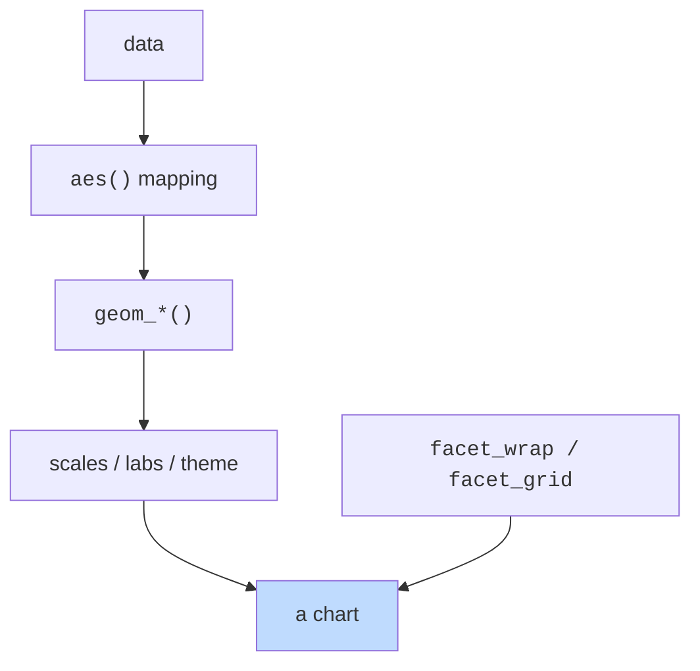

`ggplot2` is the most influential R package of the last 20 years.
It is based on a 1999 book, *The Grammar of Graphics*, by Leland
Wilkinson. The grammar's central claim: **every chart, no matter
how complex, is built from the same handful of components.**

Learn those components and you can build any chart you can
imagine.

The components:

| Component | What it answers |
| --- | --- |
| **Data** | Where do the numbers come from? |
| **Aesthetic mapping** | Which columns map to which visual properties (x, y, color, size, shape)? |
| **Geometry (geom)** | What kind of marks do we draw (points, lines, bars, boxes)? |
| **Scales** | How do data values map to visual values (axis breaks, color palettes)? |
| **Facets** | Do we want a grid of small charts split by some variable? |
| **Coordinates** | Cartesian, polar, flipped? |
| **Theme** | Cosmetic styling — fonts, colors, gridlines. |

Each part is added with `+`.

<svg
  viewBox="0 0 640 240"
  role="img"
  aria-label="Three translucent panes — one holding data dots, one holding axes, one holding a trend mark — overlap diagonally, layering into a single chart the way ggplot adds components"
  style={{ display: "block", width: "100%", maxWidth: "640px", height: "auto", margin: "2.5rem auto" }}
>
  <g style={{ color: "var(--ds-blue-500)" }} fill="currentColor">
    <rect x="100" y="30" width="240" height="140" rx="14" fillOpacity="0.08" />
    <circle cx="138" cy="64" r="4.5" />
    <circle cx="176" cy="98" r="4.5" />
    <circle cx="214" cy="74" r="4.5" />
    <circle cx="252" cy="124" r="4.5" />
    <circle cx="288" cy="94" r="4.5" />
  </g>
  <g style={{ color: "var(--ds-green-500)" }} fill="currentColor">
    <rect x="170" y="60" width="240" height="140" rx="14" fillOpacity="0.08" />
    <rect x="196" y="82" width="3" height="96" rx="1.5" fillOpacity="0.6" />
    <rect x="196" y="175" width="186" height="3" rx="1.5" fillOpacity="0.6" />
  </g>
  <g style={{ color: "var(--ds-yellow-500)" }} fill="currentColor">
    <rect x="240" y="90" width="240" height="140" rx="14" fillOpacity="0.08" />
    <rect x="266" y="149.5" width="186" height="5" rx="2.5" transform="rotate(-14 359 152)" fillOpacity="0.85" />
  </g>
</svg>

## A first ggplot

<CodeBlock
  adapter="r"
  files={[
    {
      filename: "main.r",
      starterCode: `library(ggplot2)
data(mtcars)

ggplot(mtcars, aes(x = wt, y = mpg)) +
  geom_point(color = "steelblue", size = 3)
`,
    },
  ]}
/>

Read it as a sentence:

- *Start a plot of `mtcars`* (the data)
- *...mapping wt to x and mpg to y* (the aesthetics)
- *...and add a layer of points* (the geometry)

That's the whole grammar. Every ggplot in existence is some
extension of this skeleton.

## Geometries: change the chart, not the rest

Try different geoms on the same data:

<CodeBlock
  adapter="r"
  files={[
    {
      filename: "main.r",
      starterCode: `library(ggplot2)
data(mtcars)

p <- ggplot(mtcars, aes(x = wt, y = mpg))

p + geom_point() # scatter
p + geom_smooth() # smoothed trend
p + geom_point() + geom_smooth(method = "lm") # both!
`,
    },
  ]}
/>

You change one word (`geom_point` → `geom_smooth`) and you get a
fundamentally different chart. Same data, same mapping, different
mark.

A small map of the most-used geoms:

| Geom | What it draws |
| --- | --- |
| `geom_point()` | dots — scatterplots |
| `geom_line()` | line connecting points in x order |
| `geom_bar()` | bars (counts) — needs only x |
| `geom_col()` | bars (specified heights) — needs x and y |
| `geom_histogram()` | a histogram of one variable |
| `geom_density()` | a smoothed density |
| `geom_boxplot()` | boxplots |
| `geom_smooth()` | a smoothed trend line with confidence band |

## Mapping vs. setting

This is the single most common confusion for ggplot beginners.

- **Inside `aes()`**: you're saying "let *this column* control
  this property."
- **Outside `aes()`**: you're saying "set this property to *this
  constant value*."

<CodeBlock
  adapter="r"
  files={[
    {
      filename: "main.r",
      starterCode: `library(ggplot2)
data(mtcars)

# MAPPING color to a column (cyl): one color per unique value of cyl
ggplot(mtcars, aes(x = wt, y = mpg, color = factor(cyl))) +
  geom_point(size = 3)

# SETTING color to a constant: every point the same color
ggplot(mtcars, aes(x = wt, y = mpg)) +
  geom_point(color = "steelblue", size = 3)
`,
    },
  ]}
/>

If you put a literal `color = "steelblue"` *inside* `aes()`,
ggplot will treat `"steelblue"` as a category name and give you
the default categorical color, with a useless legend. The
takeaway:

- Want it driven by data? → put it *inside* `aes()`
- Want it constant? → put it *outside* `aes()`

## Faceting: small multiples for free

Often you want the same plot, broken into panels by some
variable. ggplot makes this trivial with `facet_wrap()` and
`facet_grid()`:

<CodeBlock
  adapter="r"
  datasets={[{ path: "palmer-penguins.csv", stageAs: "penguins.csv" }]}
  files={[
    {
      filename: "main.r",
      initCode: `library(ggplot2)\npenguins <- read.csv("penguins.csv")\npenguins <- na.omit(penguins)`,
      starterCode: `ggplot(penguins, aes(x = flipper_length_mm, y = body_mass_g)) +
  geom_point(color = "steelblue") +
  facet_wrap(~species) +
  labs(title = "Flipper length vs. body mass, by species")
`,
    },
  ]}
/>

One line — `facet_wrap(~ species)` — and you get three
side-by-side panels, one per species. *Small multiples*, the
single most powerful visualization technique for spotting
group-level differences.

## Labels and titles

`labs()` is for everything textual:

<CodeBlock
  adapter="r"
  files={[
    {
      filename: "main.r",
      starterCode: `library(ggplot2)
data(mtcars)

ggplot(mtcars, aes(x = wt, y = mpg, color = factor(cyl))) +
  geom_point(size = 3) +
  labs(
    title    = "Fuel economy falls with weight",
    subtitle = "1974 Motor Trend cars",
    x        = "Weight (1000s of lbs)",
    y        = "Miles per gallon",
    color    = "Cylinders",
    caption  = "Source: built-in mtcars dataset"
  )
`,
    },
  ]}
/>

Always set the title and axis labels. *Always*. They cost almost
nothing and save your reader a lot of guessing.

## A few more geoms in action

A bar chart with counts (categorical x):

<CodeBlock
  adapter="r"
  files={[
    {
      filename: "main.r",
      starterCode: `library(ggplot2)
data(mtcars)

ggplot(mtcars, aes(x = factor(cyl))) +
  geom_bar(fill = "steelblue") +
  labs(x = "Cylinders", y = "Number of cars")
`,
    },
  ]}
/>

A grouped boxplot (numeric y by categorical x):

<CodeBlock
  adapter="r"
  datasets={[{ path: "palmer-penguins.csv", stageAs: "penguins.csv" }]}
  files={[
    {
      filename: "main.r",
      initCode: `library(ggplot2)\npenguins <- read.csv("penguins.csv")\npenguins <- na.omit(penguins)`,
      starterCode: `ggplot(penguins, aes(x = species, y = body_mass_g, fill = species)) +
  geom_boxplot() +
  labs(y = "Body mass (g)") +
  theme(legend.position = "none")
`,
    },
  ]}
/>

A line chart over time:

<CodeBlock
  adapter="r"
  files={[
    {
      filename: "main.r",
      starterCode: `library(ggplot2)
data(airquality)

ggplot(airquality, aes(x = Day, y = Temp)) +
  geom_line(color = "steelblue") +
  geom_point(color = "steelblue") +
  facet_wrap(~Month, ncol = 5) +
  labs(
    title = "Daily temperatures by month, NY 1973",
    x = "Day of month", y = "Temp (°F)"
  )
`,
    },
  ]}
/>

Notice how almost identical the structure is across very
different chart types. That's the grammar at work.

## Themes

A `theme()` call lets you tweak almost any visual element. Ggplot
also ships with several full themes:

<CodeBlock
  adapter="r"
  files={[
    {
      filename: "main.r",
      starterCode: `library(ggplot2)
data(mtcars)

p <- ggplot(mtcars, aes(x = wt, y = mpg)) +
  geom_point(color = "steelblue", size = 3)

p + theme_minimal()
p + theme_bw()
p + theme_classic()
`,
    },
  ]}
/>

For most analytical work, `theme_minimal()` is a great default —
clean, gridded, modern.

## Test your understanding

<MultipleChoice
  markdown={`What's the difference between writing \`geom_point(color = "red")\` and \`geom_point(aes(color = "red"))\`?

*Hint: think about what \`aes()\` is for — mapping data to a property versus setting a property to a fixed value.*

- They are equivalent.
  > The \`aes()\` wrapper changes the meaning: one sets a constant color, the other maps a value to the color scale.
- The first errors; only the second works.
  > Both forms are syntactically valid; the difference is in behavior, not whether they produce an error.
- [o] The first **sets** every point to red. The second **maps** the literal string "red" to color as if it were a category, and ggplot picks the default color for that category — usually not red — and adds a useless legend.
  > Inside \`aes()\`, you map data to properties. Outside, you set properties to constant values.
- The second is faster.
  > Speed is not the distinction here; the difference is setting a constant versus mapping to a scale.`}
/>

<MultipleChoice
  markdown={`Which is the right ggplot to make a scatterplot of \`hp\` (x) vs \`mpg\` (y) from \`mtcars\`?

- \`ggplot(mtcars) + geom_point(hp, mpg)\`
  > \`geom_point()\` does not accept bare column names as positional arguments; column-to-axis mappings must be declared inside \`aes()\`.
- [o] \`ggplot(mtcars, aes(x = hp, y = mpg)) + geom_point()\`
  > Aesthetic mappings go in \`aes()\` inside \`ggplot()\` (or inside the geom).
- \`plot(mtcars$hp, mtcars$mpg)\`
  > \`plot()\` is base R's generic plot function, not a ggplot2 call; it produces a basic scatterplot but does not use the grammar-of-graphics layer system.
- \`ggplot(mtcars, hp, mpg) + scatter()\`
  > \`ggplot()\` takes a data frame and optionally an \`aes()\` call as arguments — bare column names are not valid in the second and third positions, and \`scatter()\` is not a ggplot2 function.`}
/>

<MultipleChoice
  markdown={`To split a ggplot into one small panel per species in \`penguins\`, you add:

- [o] \`facet_wrap(~ species)\`
  > \`facet_wrap()\` creates one panel per unique value, laid out in a wrapping grid.
- \`group_by(species)\`
  > \`group_by()\` is a dplyr verb for grouping rows before summarization; it has no effect inside a ggplot call.
- \`color = species\`
  > Setting \`color = species\` inside \`aes()\` colors the points by species in a single panel — it does not split the chart into separate panels.
- \`split(species)\`
  > \`split()\` is a base R function that partitions a vector or data frame into a list; it is not a ggplot2 layer and cannot be added to a plot with \`+\`.`}
/>

## Mini challenge: a publication-ready penguin plot

Build a ggplot of `penguins` showing **flipper_length_mm** on the x
axis, **body_mass_g** on the y axis, colored by **species**, with a
linear smoother per species, faceted by species, with a real title
and axis labels.

<ChallengeCard
  adapter="r"
  title="Compose a real ggplot"
  instructions={`Assign the plot to a variable called \`p\`. It should:
- use \`penguins\` as data (already loaded from \`penguins.csv\`)
- map \`flipper_length_mm\` to x, \`body_mass_g\` to y, \`species\` to color
- include \`geom_point()\` and \`geom_smooth(method = "lm")\`
- be faceted by \`species\`
- have a title and meaningful axis labels (use \`labs()\`)

Then print(p) to render it.`}
  datasets={[{ path: "palmer-penguins.csv", stageAs: "penguins.csv" }]}
  files={[
    {
      filename: "main.r",
      initCode: `library(ggplot2)\npenguins <- read.csv("penguins.csv")\npenguins <- na.omit(penguins)`,
      starterCode: `p <- NULL # build the plot

print(p)
`,
      solutionCode: `p <- ggplot(penguins, aes(
  x = flipper_length_mm, y = body_mass_g,
  color = species
)) +
  geom_point(size = 2, alpha = 0.7) +
  geom_smooth(method = "lm", se = FALSE) +
  facet_wrap(~species) +
  labs(
    title = "Flipper length vs. body mass, by species",
    x = "Flipper length (mm)",
    y = "Body mass (g)"
  )
print(p)
`,
    },
  ]}
  tests={[
    {
      id: "is_gg",
      name: "p is a ggplot",
      code: `if (!inherits(p, "ggplot")) stop("p must be a ggplot")`,
    },
    {
      id: "mapping",
      name: "Maps flipper_length_mm and body_mass_g",
      code: `m <- p$mapping
xs <- rlang::as_label(m$x); ys <- rlang::as_label(m$y)
if (!grepl("flipper_length_mm", xs)) stop("x should be flipper_length_mm")
if (!grepl("body_mass_g", ys)) stop("y should be body_mass_g")`,
    },
    {
      id: "facet",
      name: "Faceted by species",
      code: `if (!inherits(p$facet, "FacetWrap")) stop("must use facet_wrap")`,
    },
  ]}
/>

We can now make principled, well-labeled charts. The next page
is about *reading* them — what to look for when a chart lands on
your desk.
