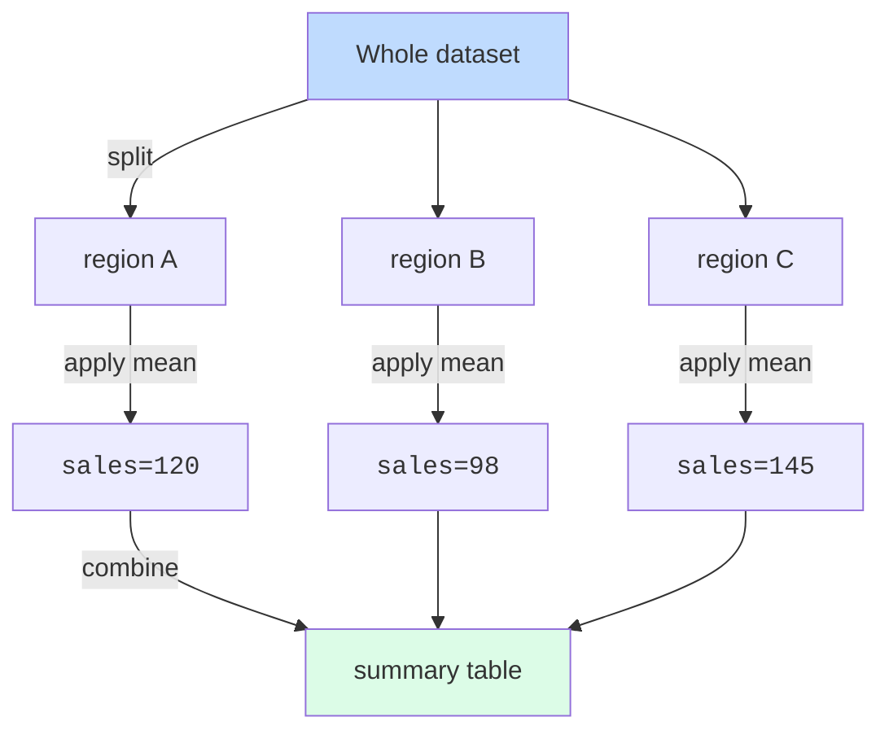

Almost every interesting analytical question is a "per-group"
question:

- Average sales **per region**.
- Median salary **per department**.
- Maximum temperature **per month**.
- Win rate **per team**.
- Conversion rate **per campaign**.

The pattern is universal and has a name: **split-apply-combine**.

In dplyr, you do it in two lines: `group_by()` + `summarise()`.

<svg
  viewBox="0 0 640 230"
  role="img"
  aria-label="A strip of mixed blue, green, and yellow squares fans down three solid gray arrows into color-pure group cards, each collapsing its rows into one summary bar sized to the group — group_by splits, summarize reduces"
  style={{ display: "block", width: "100%", maxWidth: "640px", height: "auto", margin: "2.5rem auto" }}
>
  <rect x="130" y="20" width="380" height="44" rx="10" fill="currentColor" opacity="0.06" />
  <g style={{ color: "var(--ds-blue-500)" }} fill="currentColor">
    <rect x="150" y="35" width="14" height="14" rx="4" />
    <rect x="288" y="35" width="14" height="14" rx="4" />
    <rect x="334" y="35" width="14" height="14" rx="4" />
    <rect x="472" y="35" width="14" height="14" rx="4" />
  </g>
  <g style={{ color: "var(--ds-green-500)" }} fill="currentColor">
    <rect x="196" y="35" width="14" height="14" rx="4" />
    <rect x="380" y="35" width="14" height="14" rx="4" />
  </g>
  <g style={{ color: "var(--ds-yellow-500)" }} fill="currentColor">
    <rect x="242" y="35" width="14" height="14" rx="4" />
    <rect x="426" y="35" width="14" height="14" rx="4" />
  </g>
  <g fill="var(--ds-gray-500)">
    <rect x="153" y="72" width="4" height="22" rx="2" />
    <polygon points="147,94 163,94 155,106" />
    <rect x="318" y="72" width="4" height="22" rx="2" />
    <polygon points="312,94 328,94 320,106" />
    <rect x="483" y="72" width="4" height="22" rx="2" />
    <polygon points="477,94 493,94 485,106" />
  </g>
  <g style={{ color: "var(--ds-blue-500)" }} fill="currentColor">
    <rect x="85" y="112" width="140" height="96" rx="12" fillOpacity="0.1" />
    <rect x="115" y="128" width="14" height="14" rx="4" />
    <rect x="137" y="128" width="14" height="14" rx="4" />
    <rect x="159" y="128" width="14" height="14" rx="4" />
    <rect x="181" y="128" width="14" height="14" rx="4" />
    <rect x="111" y="168" width="88" height="12" rx="6" />
  </g>
  <g style={{ color: "var(--ds-green-500)" }} fill="currentColor">
    <rect x="250" y="112" width="140" height="96" rx="12" fillOpacity="0.1" />
    <rect x="302" y="128" width="14" height="14" rx="4" />
    <rect x="324" y="128" width="14" height="14" rx="4" />
    <rect x="294" y="168" width="52" height="12" rx="6" />
  </g>
  <g style={{ color: "var(--ds-yellow-500)" }} fill="currentColor">
    <rect x="415" y="112" width="140" height="96" rx="12" fillOpacity="0.14" />
    <rect x="467" y="128" width="14" height="14" rx="4" />
    <rect x="489" y="128" width="14" height="14" rx="4" />
    <rect x="459" y="168" width="52" height="12" rx="6" />
  </g>
</svg>

## The basic pattern

<CodeBlock
  adapter="r"
  files={[
    {
      filename: "main.r",
      starterCode: `library(dplyr)
data(mtcars)

# Average mpg per number of cylinders
mtcars |>
  group_by(cyl) |>
  summarise(avg_mpg = mean(mpg))
`,
    },
  ]}
/>

Read it: "Group the data by `cyl`. Within each group, compute the
mean of `mpg`. Combine."

Without `group_by()`, `summarise()` returns one row total. With
`group_by(cyl)`, it returns one row *per cyl* value. That tiny
change is enormous.

## Multiple summaries at once

You can compute many summary columns in a single `summarise()`
call:

<CodeBlock
  adapter="r"
  files={[
    {
      filename: "main.r",
      starterCode: `library(dplyr)
data(mtcars)

mtcars |>
  group_by(cyl) |>
  summarise(
    n       = n(),
    avg_mpg = mean(mpg),
    sd_mpg  = sd(mpg),
    avg_hp  = mean(hp),
    max_hp  = max(hp)
  )
`,
    },
  ]}
/>

`n()` is a special dplyr helper meaning "how many rows in this
group." You will use it constantly.

## Multiple grouping variables

Group by more than one column to get all combinations:

<CodeBlock
  adapter="r"
  files={[
    {
      filename: "main.r",
      starterCode: `library(dplyr)
data(mtcars)

mtcars |>
  group_by(cyl, am) |> # am = transmission (0 = auto, 1 = manual)
  summarise(
    n       = n(),
    avg_mpg = mean(mpg),
    .groups = "drop"
  )
`,
    },
  ]}
/>

The `.groups = "drop"` argument is a small dplyr nicety that tells
it to *un-group* the result after summarising. Without it, dplyr
prints a friendly message reminding you the result is still
grouped. Either way, it's good practice to be explicit.

## Counting groups: `count()`

Counting how many rows are in each group is so common that there's
a shortcut: `count()`. These two are equivalent:

<CodeBlock
  adapter="r"
  files={[
    {
      filename: "main.r",
      starterCode: `library(dplyr)
data(mtcars)

# Long form
mtcars |>
  group_by(cyl) |>
  summarise(n = n())

# Short form
mtcars |> count(cyl)

# Multi-level
mtcars |> count(cyl, am)

# Sorted by count descending
mtcars |> count(cyl, sort = TRUE)
`,
    },
  ]}
/>

`count()` is your go-to for the question *"what categories exist,
and how many rows of each?"*

## Grouped `mutate()`: per-group calculations that keep the rows

`group_by()` doesn't only work with `summarise()`. With `mutate()`,
it computes the new column *within each group*, but keeps every
row.

<CodeBlock
  adapter="r"
  files={[
    {
      filename: "main.r",
      starterCode: `library(dplyr)
data(mtcars)

# Add each car's mpg as a fraction of the average mpg for cars with that many cyl
mtcars |>
  group_by(cyl) |>
  mutate(
    cyl_avg_mpg = mean(mpg),
    pct_of_cyl  = mpg / cyl_avg_mpg
  ) |>
  ungroup() |>
  select(mpg, cyl, cyl_avg_mpg, pct_of_cyl) |>
  head(10)
`,
    },
  ]}
/>

This pattern — "compute a per-group statistic, then express each
row relative to it" — is extremely common. It's how you
normalize, rank within groups, compute z-scores per category,
etc.

`ungroup()` is the inverse of `group_by()`. After you're done
with grouped work, ungroup so later code isn't surprised.

## Slicing: top N per group

A frequent question: "show me the *top* N items *per group*." The
verb is `slice_max()` (and friends).

<CodeBlock
  adapter="r"
  files={[
    {
      filename: "main.r",
      starterCode: `library(dplyr)
data(mtcars)

# Top 2 most fuel-efficient cars per cylinder count
mtcars |>
  tibble::rownames_to_column("car") |>
  group_by(cyl) |>
  slice_max(mpg, n = 2) |>
  select(car, cyl, mpg)
`,
    },
  ]}
/>

`slice_max(col, n)` keeps the top `n` rows in each group by some
column. Siblings: `slice_min()`, `slice_head()`, `slice_tail()`,
`slice_sample()`.

## A realistic example: penguins by species

The Palmer penguins come in three species. Per-species summary
statistics are the natural question:

<CodeBlock
  adapter="r"
  datasets={[{ path: "palmer-penguins.csv", stageAs: "penguins.csv" }]}
  files={[
    {
      filename: "main.r",
      initCode: `library(dplyr)\npenguins <- read.csv("penguins.csv")\npenguins <- na.omit(penguins)`,
      starterCode: `penguins |>
  group_by(species) |>
  summarise(
    n           = n(),
    avg_flipper = mean(flipper_length_mm),
    avg_mass    = mean(body_mass_g),
    sd_mass     = sd(body_mass_g),
    .groups     = "drop"
  )
`,
    },
  ]}
/>

One row per species, all summaries on the same line.

## Multi-file challenge: monthly air quality

Let's apply this to `airquality`. We'll structure the analysis
across two files: one helper file with reusable functions, and
one main script that computes a monthly summary.

<ChallengeCard
  adapter="r"
  title="Monthly summary of NYC air quality"
  instructions={`Complete \`main.R\` so it produces a data frame \`monthly\` with one row per month, columns:
- \`Month\`
- \`avg_ozone\` (mean of Ozone, NAs removed)
- \`avg_temp\`  (mean of Temp)
- \`n_obs\`     (number of rows in that month)

You can use the helper \`mean_na()\` from \`utils.R\`.`}
  entryFilename="main.R"
  files={[
    {
      filename: "main.R",
      starterCode: `library(dplyr)
source("utils.R")

data(airquality)

monthly <- NULL  # build using group_by + summarise

print(monthly)
`,
      solutionCode: `library(dplyr)
source("utils.R")

data(airquality)

monthly <- airquality |>
  group_by(Month) |>
  summarise(
    avg_ozone = mean_na(Ozone),
    avg_temp  = mean_na(Temp),
    n_obs     = n(),
    .groups   = "drop"
  )

print(monthly)
`,
    },
    {
      filename: "utils.R",
      starterCode: `# Helper to compute mean ignoring NAs
mean_na <- function(x) mean(x, na.rm = TRUE)
`,
      solutionCode: `mean_na <- function(x) mean(x, na.rm = TRUE)
`,
    },
  ]}
  tests={[
    {
      id: "df",
      name: "monthly is a data frame",
      code: `if (!is.data.frame(monthly)) stop("monthly must be a data frame")`,
    },
    {
      id: "rows",
      name: "Has 5 rows (one per month)",
      code: `if (nrow(monthly) != 5) stop(sprintf("expected 5 rows, got %s", nrow(monthly)))`,
    },
    {
      id: "cols",
      name: "Has the right columns",
      code: `need <- c("Month","avg_ozone","avg_temp","n_obs")
if (!all(need %in% names(monthly))) stop(sprintf("missing: %s", paste(setdiff(need, names(monthly)), collapse=",")))`,
    },
  ]}
/>

## Test your understanding

<MultipleChoice
  markdown={`What's the universal pattern that \`group_by() |> summarise()\` implements?

- Filter-arrange-join
  > Filter, arrange, and join are individual dplyr verbs, not a description of the group-and-summarise pattern.
- [o] Split-apply-combine
  > Split the data into groups, apply a computation to each, combine the results into a single table.
- Map-reduce-filter
  > Map-reduce is a distributed computing pattern; the group-summarise workflow is more precisely called split-apply-combine.
- Sort-merge-deduplicate
  > Sorting, merging, and deduplicating are separate data manipulation steps unrelated to the per-group aggregation pattern.`}
/>

<MultipleChoice
  markdown={`In a dplyr pipeline, what does \`n()\` do?

- Returns the number of columns.
  > The number of columns is given by \`ncol()\`, not \`n()\`; \`n()\` counts rows in the current context.
- [o] Returns the number of rows in the current (possibly grouped) data.
  > Inside \`summarise()\` after a \`group_by()\`, \`n()\` gives the count per group.
- Returns the mean of the data.
  > The mean is computed with \`mean()\`, not \`n()\`; \`n()\` returns a row count, not an average.
- Returns the row name.
  > Row names are accessed with \`rownames()\`; \`n()\` counts how many rows are in the current (possibly grouped) slice.`}
/>

<MultipleChoice
  markdown={`What's the difference between \`group_by(cyl) |> summarise(avg = mean(mpg))\` and \`group_by(cyl) |> mutate(avg = mean(mpg))\`?

- They're the same.
  > The two produce different shapes: \`summarise\` collapses to one row per group, while \`mutate\` preserves all original rows.
- \`summarise\` is slower than \`mutate\`.
  > Speed is not the distinction; the fundamental difference is that \`summarise\` collapses rows and \`mutate\` keeps them.
- [o] \`summarise\` returns one row per group (collapses); \`mutate\` keeps every row and broadcasts the group statistic into each row.
  > Use \`summarise\` for a compact group table, \`mutate\` when you want a per-row column that depends on the group.
- \`mutate\` cannot be used with \`group_by\`.
  > \`mutate\` works perfectly well after \`group_by\`; it computes each new column value within the group context while retaining all rows.`}
/>

The last page in this section covers *reshaping* — switching
between wide and long forms when your data isn't yet tidy.
