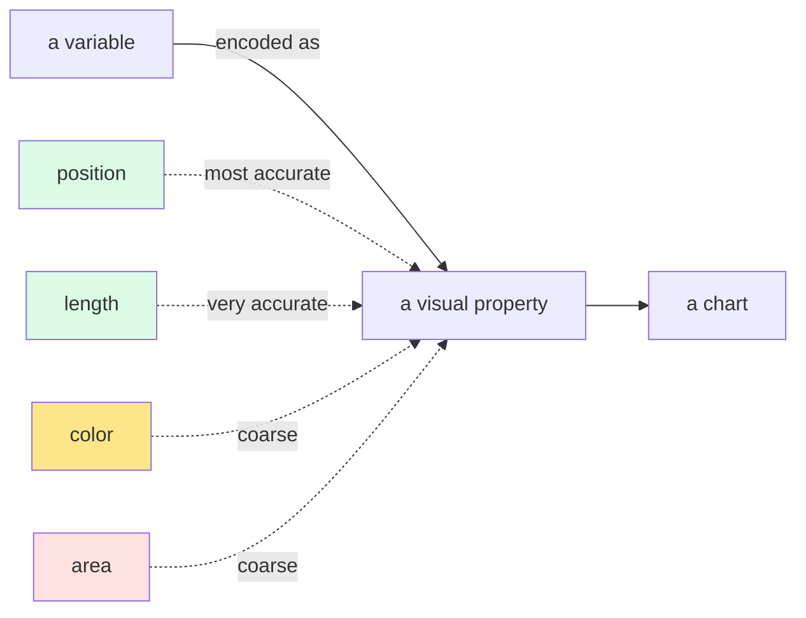

A good chart is a *thought made visible*. A bad chart is a
distraction at best, a lie at worst. Both use the same software,
the same data, even sometimes the same chart type. The difference
is in the *choices*, and most of the choices follow a handful of
principles that have been refined over a century.

This page is about those principles. We won't write much code on
this page. The next page (ggplot2) gives you the tools to apply
what you learn here.

<Figure
  slug="rlang-viz-principles-cutout"
  alt="A cluttered chart panel on one platform beside a stripped-back version of the same chart, only its data marks remaining"
/>

## Charts are *encodings*

The channels are not equally good. The same difference read as a position, a
length, an angle, an area, and a color:

<Chart slug="encoding-accuracy" />

Every chart maps a *variable in the data* to a *visual property
on the page*. The toolbox of visual properties is small:

| Visual property | Best for | Notes |
| --- | --- | --- |
| Position (x, y) | numeric variables, comparison | by far the most accurate channel |
| Length | numeric, compared to a common baseline | bars |
| Angle / area | numeric (poorly) | avoid pie charts when accuracy matters |
| Color (hue) | categorical | ~7 distinct values is a hard limit |
| Color (intensity) | numeric (ordered) | sequential scales |
| Shape | categorical | low precision; limit to a few values |
| Size | numeric | low precision; only for emphasis |

The most important rule: **encode your most important variable
in position**. People read position with near-perfect accuracy
and color/size only crudely.

<Figure
  slug="rlang-principles-of-visualization-charts-are-encodings-inline-cutout"
  alt="A column of plain chips joined by cords to a dial marked for height, size and ink"
  caption="A chart encodes numbers as position, size or color, and position wins."
/>

## Match the chart type to the question

Different questions call for different charts:

| Question | Best chart |
| --- | --- |
| How is one numeric variable distributed? | histogram, density |
| How do two numeric variables relate? | scatterplot |
| How does a numeric variable differ by group? | boxplot, violin, dot plot |
| How do counts compare across categories? | bar chart |
| How does something change over time? | line chart |
| How is a whole made of parts? | bar chart (yes, almost always better than a pie) |

Bar charts are dramatically underrated. Pie charts and 3D charts
are wildly overrated. The eye is bad at angles and worse at
volumes.

## Less is more: the data-ink ratio

Edward Tufte coined the term *data-ink ratio*: the proportion of
a chart's ink that is actually showing data. Maximize it.
*Ruthlessly remove*:

- 3D effects on 2D data
- Background colors that don't encode anything
- Drop shadows
- Heavy gridlines (light is fine; thick is noise)
- Decorative icons
- Redundant labels and legends

A chart's job is to *show data*. Everything else is competition.

## Use color with intention

One in twelve men has a red-green color deficiency. The same chart in a
default palette and a colorblind-safe one, each as they see it:

<Chart slug="colorblind-safe" />

Color is powerful and easily abused.

- **Categorical hues** (red, blue, green, ...): use to distinguish
  *unordered* categories. Keep the count low, most people can
  hold ~7 colors apart, and many fewer if the chart is small or
  the dots are tiny.
- **Sequential color scales** (light → dark single hue): use for
  *ordered* numeric variables. Light = low, dark = high.
- **Diverging scales** (blue → white → red, etc.): use when the
  variable has a meaningful *midpoint* (zero, average).

Two additional rules:

1. **Color is not free.** Each color you add is one more thing
   the reader has to translate. If you can encode something
   structurally instead (with position, faceting, or order),
   prefer that.
2. **Be colorblind-friendly.** Avoid red/green as the only
   distinguishing pair. Use palettes like `viridis` or
   `RColorBrewer`'s color-safe sets, modern R plotting tools
   make this almost free.

## Order matters

The same twelve bars, alphabetical and then sorted by value:

<Chart slug="sorted-bars" />

If your categories don't have a natural order (alphabetic doesn't
count), *sort them by the thing you're showing*. A bar chart of
sales by region, sorted by sales, is dramatically clearer than
the same chart sorted alphabetically. The eye can read "decreasing
in this direction" without effort.

## Aspect ratio and scale

The same series at three aspect ratios. The trend is identical in all three
and only one of them lets you see it:

<Chart slug="aspect-ratio-banking" />

- **Don't truncate axes** for bar charts. (Truncating amplifies
  small differences and is a classic chart crime.)
- **Don't add a meaningless baseline** to line charts. Starting a
  y-axis at zero is the *default* for bars but a *choice* for
  lines.
- **Use the right aspect ratio** so trends look the way they
  actually are. Stretching a chart wide flattens trends;
  squishing it tall exaggerates them.

<Figure
  slug="rlang-principles-of-visualization-inline-cutout"
  alt="Two charts of the same data, one cluttered with ornament and one plain, the plain one obviously easier to read"
  caption="Strip the ornament and the same data becomes far easier to read."
/>

## Title, axis labels, units

This sounds obvious. It is, and yet 80% of beginner charts skip
at least one:

- Title that says *what the chart is showing*, not just the
  variable names ("MPG falls as weight rises" is better than
  "mpg vs wt")
- Axis labels with **units** ("Weight (1000s of lbs)" not just
  "wt")
- Legend that doesn't restate something already obvious

If a chart needs paragraphs of caption to make sense, the chart
isn't doing its job.

## One chart, one message

Cram more than one main message into a chart, and most readers
will absorb none of them. If you have two things to say, make
two charts. The eye is a serial reader; charts are best when
they are crisp and singular.

Start from a single question, *what is the one thing you want the
reader to take away?*, and let it drive every decision:

1. Settle on a single, clear takeaway.
2. Encode that takeaway in *position* if you can.
3. Remove every drop of non-data ink.
4. Write a title and axis labels that name the takeaway.

The result is a chart that doesn't need explaining.

A bad chart and a good chart, same data, look at them and pick
the one you'd put in a report.

<CodeBlock
  adapter="r"
  files={[
    {
      filename: "main.r",
      starterCode: `# A bad chart: rainbow colors, 3D-looking effect, no labels
data(mtcars)
mtcars$car <- rownames(mtcars)
top <- mtcars[order(-mtcars$mpg), ][1:5, ]

barplot(top$mpg,
  names.arg = top$car,
  col       = rainbow(5),
  main      = ""
)
`,
    },
  ]}
/>

Every one of those choices costs the reader something: the rainbow
implies a meaning the colors do not have, the unsorted bars make
comparison a hunt, and the missing axis label leaves you guessing at the
units. Here is the same data with each of those decisions reversed:

<CodeBlock
  adapter="r"
  files={[
    {
      filename: "main.r",
      starterCode: `# A better chart: single color, sorted, real title, axis label
data(mtcars)
mtcars$car <- rownames(mtcars)
top <- mtcars[order(-mtcars$mpg), ][1:5, ]

par(mar = c(5, 8, 4, 2)) # extra left margin for names
barplot(rev(top$mpg),
  names.arg = rev(top$car),
  horiz     = TRUE,
  col       = "steelblue",
  las       = 1,
  xlab      = "Miles per gallon",
  main      = "Top 5 most fuel-efficient cars (mtcars)"
)
`,
    },
  ]}
/>

What changed:

- Sorted (so the order encodes ranking)
- Horizontal (so the names fit and read naturally)
- Single color (no false categorical distinctions)
- Title that says what the chart is *about*
- Axis label with the right name

The data is the same. The reader's experience is not.

## Test your understanding

<MultipleChoice
  markdown={`Which visual property is read with the **highest accuracy** by the human eye?

- Area
  > Area (as in bubble charts or pie slices) requires comparing two-dimensional quantities, which the eye does poorly compared to reading positions on a shared axis.
- [o] Position along a common scale
  > Position (and length to a common baseline) is the most accurate visual channel. Color and area are far coarser.
- Color hue
  > Color hue is useful for distinguishing categories, but humans can only discriminate about 7 hues and cannot reliably read quantitative differences from it.
- Shape
  > Shape lets us tell categories apart but carries no quantitative information and is among the least accurate visual channels.`}
/>

<MultipleChoice
  markdown={`Why are pie charts often a poor choice?

- R does not support them.
  > R supports pie charts via \`pie()\` in base R; the objection is perceptual accuracy, not software support.
- [o] The eye reads angles and areas poorly, bar charts (which use position/length) are usually clearer and more accurate.
  > Almost any time you'd reach for a pie chart, a sorted bar chart is better.
- They take more pixels.
  > Pixel count has nothing to do with whether a chart communicates accurately; the issue is how the human eye reads the encoded values.
- They cannot show more than two categories.
  > Pie charts can show many categories, but with more slices the angle differences become even harder to judge accurately.`}
/>

<MultipleChoice
  markdown={`If you have a bar chart with five regions and no inherent order, you should:

- Sort alphabetically.
  > Alphabetical order encodes nothing about the underlying data, so the reader has to scan the entire chart to find the highest or lowest bar.
- [o] Sort by the value you're plotting, so the chart's order itself encodes a ranking.
  > Sorting by value lets the reader see the ranking instantly with no conscious effort.
- Sort by region ID.
  > An arbitrary ID number carries no useful data signal; it conveys the same meaningless order as random placement.
- Leave them in a random order.
  > A random order makes every comparison harder because neither the sequence nor the data value drives placement.`}
/>

The principles are language-agnostic. The next page is about
the *language* that makes them easy to apply in R: the **grammar
of graphics** as implemented in `ggplot2`.
