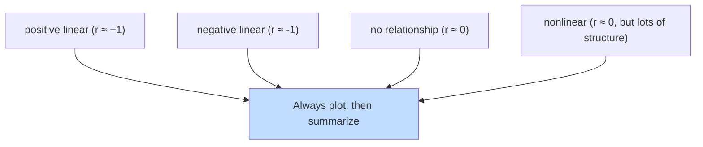
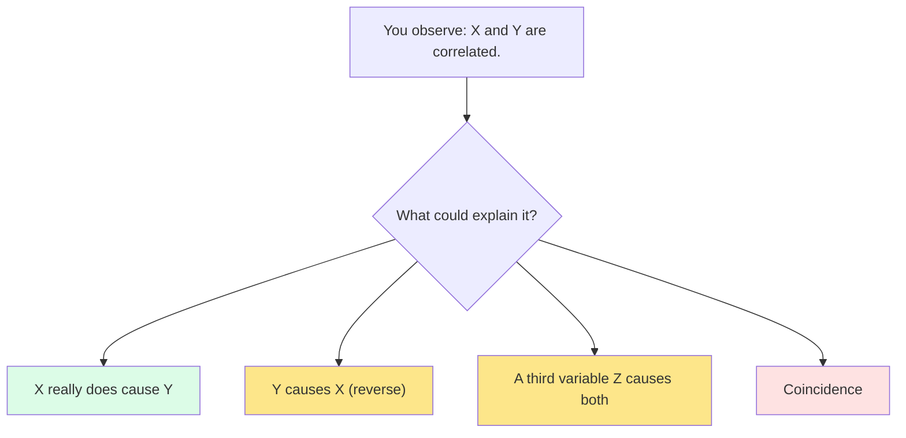

So far we've explored columns one at a time. But most interesting
questions are *relational*: does increasing X tend to go with
increasing Y? Are some categories overrepresented in some groups?
Is what we're seeing a real signal, or just noise?

This page introduces the three core tools:

- **Scatterplots** for two numeric variables
- **Correlation** for measuring how strongly two numeric
  variables move together
- **Cross-tabulation** for two categorical variables

And it ends with two cautionary words: **correlation is not
causation.**

<Figure
  slug="rlang-relationships-cutout"
  alt="A scatter of dots rising across a plane with a straight trend ribbon threading through them, a small cross-tab grid beside it"
/>

## Scatterplots

With enough points a scatterplot fills in solid. Opacity is the first fix,
and it costs nothing:

<Chart slug="overplotting-alpha" />

The simplest, most informative two-variable plot: one dot per
observation, position by (x, y).

<Figure
  slug="rlang-relationships-between-variables-inline-cutout"
  alt="Two columns of chips joined by cords, the cords rising together on the left and crossing on the right"
/>

<CodeBlock
  adapter="r"
  files={[
    {
      filename: "main.r",
      starterCode: `data(mtcars)
plot(mtcars$wt, mtcars$mpg,
  pch  = 19,
  col  = "steelblue",
  xlab = "Weight (1000s of lbs)",
  ylab = "Miles per gallon",
  main = "MPG vs. weight"
)
abline(lm(mpg ~ wt, data = mtcars), col = "red", lwd = 2)
`,
    },
  ]}
/>

Two things to look for in a scatterplot:

1. **Direction**, do the dots tend to rise (positive
   relationship) or fall (negative) from left to right?
2. **Strength**, do the dots hug a clear line, or are they a
   diffuse cloud?

For mtcars: heavier cars get worse mileage, and the relationship
is very tight. (This is unsurprising, but it's reassuring when
the data agrees with intuition.)

## Correlation: one number for "how related?"

What the number looks like at various strengths, and what it cannot see:

<Chart slug="correlation-scatters" />

The **Pearson correlation** measures linear association on a
scale from -1 to +1:

- **+1**: perfect positive linear relationship
- **0**: no linear relationship
- **-1**: perfect negative linear relationship

<CodeBlock
  adapter="r"
  files={[
    {
      filename: "main.r",
      starterCode: `data(mtcars)

cor(mtcars$wt, mtcars$mpg) # very negative
cor(mtcars$hp, mtcars$qsec) # somewhat negative
cor(mtcars$mpg, mtcars$qsec) # mild positive
`,
    },
  ]}
/>

For a quick overview, `cor()` accepts a whole data frame and
returns a matrix:

<CodeBlock
  adapter="r"
  files={[
    {
      filename: "main.r",
      starterCode: `data(mtcars)
round(cor(mtcars[, c("mpg", "hp", "wt", "qsec")]), 2)
`,
    },
  ]}
/>

A few rules to remember about correlation:

- It only measures **linear** association. A perfect curve can
  have correlation near zero.
- It is sensitive to **outliers**. A single far-away point can
  swing it dramatically.
- Like the mean, it can be misleading. **Plot, then correlate**,
  never the other way around.

<Figure
  slug="rlang-relationships-between-variables-correlation-one-number-inline-cutout"
  alt="Two boards of chips, one drifting tightly upward and one scattered, a single gauge beside each"
/>

## A glance at the four "famous" patterns

Two variables can be *highly related* (curve, for example, or a
clear group separation) while their correlation is *zero*.
That's why scatterplots are non-negotiable.

## Categorical × categorical: cross-tabulation

When both variables are categorical, you don't have positions,
you have *counts of combinations*. `table()` does this in base R:

<CodeBlock
  adapter="r"
  files={[
    {
      filename: "main.r",
      starterCode: `data(mtcars)

# Counts: cylinders × transmission
table(mtcars$cyl, mtcars$am)

# With row/column proportions
prop.table(table(mtcars$cyl, mtcars$am), margin = 1) # row %
prop.table(table(mtcars$cyl, mtcars$am), margin = 2) # col %
`,
    },
  ]}
/>

Read the second table as: *"of all 4-cylinder cars, what fraction
were manual transmission?"* You can already see (in mtcars) that
the smaller-cylinder cars tend to be manual; the bigger ones tend
to be automatic.

## Categorical × numeric: boxplots and grouped summaries

When one variable is categorical and one is numeric, a boxplot
per group is hard to beat, and grouped summaries put numbers on
what you see:

<CodeBlock
  adapter="r"
  datasets={[{ path: "palmer-penguins.csv", stageAs: "penguins.csv" }]}
  files={[
    {
      filename: "main.r",
      initCode: `library(dplyr)\npenguins <- read.csv("penguins.csv")\npenguins <- na.omit(penguins)`,
      starterCode: `# Numbers
penguins |>
  group_by(species) |>
  summarise(
    mean_mass = mean(body_mass_g),
    sd_mass   = sd(body_mass_g),
    .groups   = "drop"
  )
`,
    },
  ]}
/>

<CodeBlock
  adapter="r"
  datasets={[{ path: "palmer-penguins.csv", stageAs: "penguins.csv" }]}
  files={[
    {
      filename: "main.r",
      initCode: `penguins <- read.csv("penguins.csv")\npenguins <- na.omit(penguins)`,
      starterCode: `boxplot(body_mass_g ~ species,
  data = penguins,
  col = c("lightblue", "lightgreen", "lightpink"),
  main = "Body mass by species",
  ylab = "Body mass (g)"
)
`,
    },
  ]}
/>

Gentoo is clearly heavier than the other two. Adelie and Chinstrap
overlap but differ a little. The picture and the table tell the
same story.

## The most important warning: correlation ≠ causation

A related trap: the same data can favour one group in every subgroup and the
other overall, purely from how the groups are sized.

<Chart slug="simpsons-paradox" />

Two variables can be correlated without one *causing* the other.
Possibilities:

1. **X causes Y** (the interesting case)
2. **Y causes X** (reverse causation)
3. **A third thing Z causes both** (confounding)
4. **Pure coincidence** (especially in noisy or short data)

Ice cream sales and drowning deaths are correlated. Ice cream
does not cause drowning. *Summer* causes both.

Establishing causation requires either a **randomized experiment**
(rare in observational data) or careful **causal reasoning**
beyond what summary statistics alone can do.

Beginners often jump from "X and Y are correlated" to "X causes
Y." Don't. The correlation is a *clue*, not a *conclusion*.

## A tiny case study: do bigger engines really use more fuel?

<CodeBlock
  adapter="r"
  files={[
    {
      filename: "main.r",
      starterCode: `data(mtcars)

# Numerically
cor(mtcars$disp, mtcars$mpg) # strongly negative

# Visually
plot(mtcars$disp, mtcars$mpg,
  pch = 19, col = "steelblue",
  xlab = "Displacement (cu in)",
  ylab = "mpg",
  main = "Bigger engines, worse mileage?"
)
abline(lm(mpg ~ disp, data = mtcars), col = "red", lwd = 2)
`,
    },
  ]}
/>

Correlation around -0.85. Clearly negative. But, is engine
displacement *causing* the worse mileage, or is it that bigger
cars tend to have both bigger engines *and* more weight, and
weight is the real driver? Plot `wt` vs `disp` and you'll see
how tightly *those* two go together. We can't separate them just
by looking at the correlation matrix.

This is **confounding**, and it's why the next steps in any real
analysis usually involve multivariate methods (regression,
modeling), which are beyond this course but worth knowing as
the natural next step.

## Test your understanding

<MultipleChoice
  markdown={`The correlation between two variables is computed as -0.92. What does that imply?

- [o] They have a strong negative linear relationship, when one tends to go up, the other tends to go down.
  > Correlation measures linear association strength and direction, on a scale from -1 to +1. It does *not* establish causation.
- One causes the other.
  > Correlation measures association, not causation; knowing the correlation tells you nothing about which variable (if either) drives the other.
- They are unrelated.
  > A correlation of -0.92 is close to -1, indicating a strong relationship; it is the direction (negative) and not whether one exists that this choice gets wrong.
- One of the variables has more NAs than the other.
  > The correlation coefficient says nothing about missingness; it only quantifies the linear association between the non-missing paired values.`}
/>

<MultipleChoice
  markdown={`Two variables have correlation 0. Which conclusion is **always** justified?

- [o] They have no *linear* relationship. They might still have a curved or otherwise structured relationship, only a plot will tell you.
  > Pearson correlation only sees linear association.
- They have no relationship of any kind.
  > A perfect curve, like a U-shape, can have a Pearson correlation near zero, even though there is a very clear nonlinear pattern.
- The dataset is too small.
  > Dataset size affects the *precision* of the correlation estimate, not what a value of zero means; small samples can still be linearly related.
- They are completely independent.
  > Independence means no relationship of any kind; a correlation of 0 only rules out a *linear* relationship, not all possible relationships.`}
/>

<MultipleChoice
  markdown={`Ice cream sales and drowning rates are strongly correlated. The most likely explanation is:

- Ice cream causes drowning.
  > There is no plausible mechanism by which consuming ice cream increases drowning risk; both variables are driven by a shared seasonal cause.
- Pure coincidence.
  > The correlation is too consistent year after year and too strong to be random noise; a shared cause (hot weather) produces it systematically.
- Drowning causes ice cream sales (e.g., grieving families binge).
  > Reverse causation is logically implausible here; neither variable can causally produce the other.
- [o] A third variable, summer/hot weather, causes both. This is a *confounding* variable.
  > This is the classic example of why correlation does not imply causation.`}
/>

## Mini challenge: build a correlation table

For `mtcars`, compute the correlation matrix of just `mpg`,
`hp`, `wt`, and `qsec`, rounded to 2 decimals. Assign it to
`cor_mat`.

<ChallengeCard
  adapter="r"
  title="A small correlation matrix"
  instructions={`Build \`cor_mat\`, a 4×4 numeric matrix of correlations among the columns \`mpg\`, \`hp\`, \`wt\`, and \`qsec\`, rounded to 2 decimal places.`}
  files={[
    {
      filename: "main.r",
      starterCode: `data(mtcars)

cor_mat <- NULL # 4x4 rounded correlation matrix

print(cor_mat)
`,
      solutionCode: `data(mtcars)
cor_mat <- round(cor(mtcars[, c("mpg", "hp", "wt", "qsec")]), 2)
print(cor_mat)
`,
    },
  ]}
  tests={[
    {
      id: "is_matrix",
      name: "Is a matrix",
      code: `if (!is.matrix(cor_mat)) stop("cor_mat must be a matrix")`,
    },
    {
      id: "dims",
      name: "Is 4 x 4",
      code: `if (!all(dim(cor_mat) == c(4,4))) stop(sprintf("expected 4x4, got %sx%s", nrow(cor_mat), ncol(cor_mat)))`,
    },
    {
      id: "diag",
      name: "Diagonal is 1",
      code: `if (!all(diag(cor_mat) == 1)) stop("diagonal should all be 1.00")`,
    },
    {
      id: "negative",
      name: "mpg ~ wt is strongly negative",
      code: `if (!("mpg" %in% rownames(cor_mat)) || !("wt" %in% colnames(cor_mat))) stop("missing rows/cols")
if (cor_mat["mpg","wt"] > -0.7) stop(sprintf("expected mpg~wt strongly negative, got %s", cor_mat["mpg","wt"]))`,
    },
  ]}
/>

We've now seen the analytical workhorses. The next section is
about making your findings *visible* and *persuasive*, the art
of data visualization.
