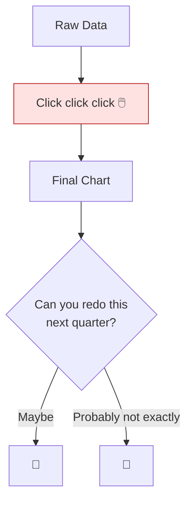
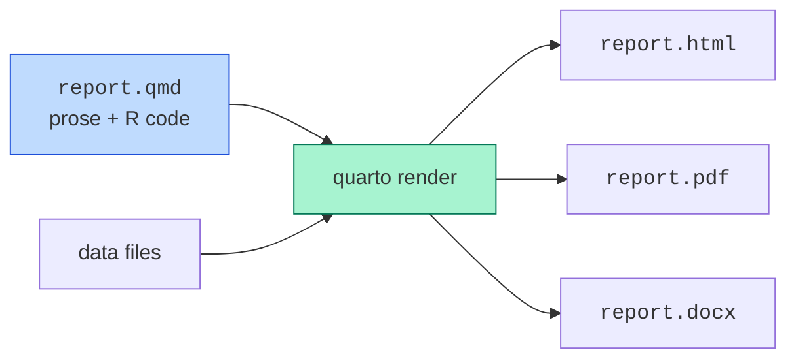
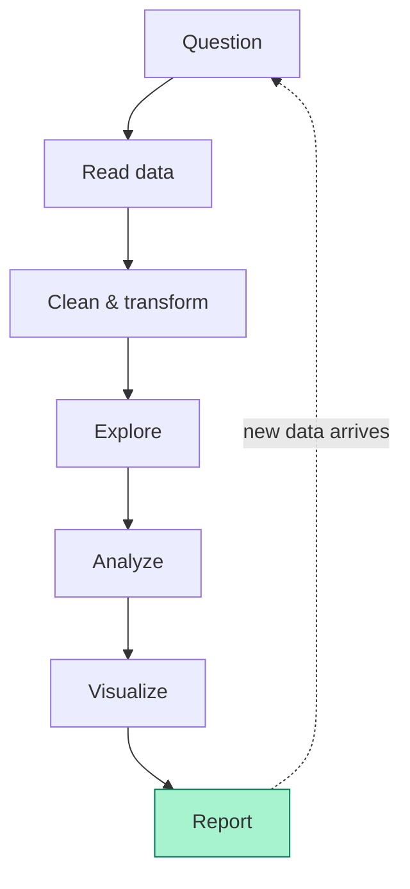

In 2010, two Harvard economists published a famous paper titled
*"Growth in a Time of Debt."* It claimed that countries with debt
above 90% of GDP grew much more slowly than other countries. The
paper became a key piece of evidence cited by politicians around
the world in favor of austerity policies.

Three years later, a graduate student named **Thomas Herndon** at
the University of Massachusetts tried to reproduce the analysis as
a class assignment. He found:

- A **spreadsheet error** that excluded several countries from the
  average.
- An **unconventional weighting choice** that gave equal weight to
  each country regardless of how many years of data it had.
- A **selective exclusion of data** that, when undone, made the
  reported effect much weaker.

When the analysis was redone properly, the dramatic "90% cliff"
result largely disappeared. By that point, the paper had already
been cited in support of trillion-dollar policy decisions.

This is the **reproducibility problem**. It is not a small academic
inconvenience; it is one of the central crises of modern empirical
work. And it is one of the reasons R, and the surrounding culture
of *scripted* analysis, matters.

<Figure
  slug="rlang-reproducible-cutout"
  alt="One script block feeding a machine that stamps three identical output sheets on a platform"
/>

## Why spreadsheets fail at reproducibility

A spreadsheet feels concrete: you can see your data, you can click,
you can tweak. But that interactivity is exactly what destroys
reproducibility. A spreadsheet analysis is a sequence of mouse
clicks and keyboard shortcuts that **leaves no trace**.

Consider a typical "real-world" analysis done in Excel:

1. Open `sales_q3.xlsx`.
2. Sort by `region`.
3. Filter out rows where `status = "test"`.
4. Insert a column `=B2*C2`.
5. Copy that formula down 1,200 rows.
6. Make a pivot table.
7. Copy the result into PowerPoint.

Now ask the analyst, six months later, "Can you redo this with the
Q4 data?" They have to remember every step. Did they filter out
"test", or "Test"? Did they multiply column B by C, or D by C? Was
that pivot table summing or averaging? Did they manually fix a few
cells they thought looked wrong?



Multiply this by every analyst in every company, every year, and
you have an enormous body of "facts", quoted in board meetings, in
peer-reviewed papers, in news headlines, that **nobody can re-run
to verify**.

## What "reproducible" really means

A **reproducible analysis** is one where another person (or
future-you) can take:

- The original raw data, and
- The original analysis code,

and rerun the entire pipeline to get *exactly* the same numbers,
tables, and figures as the published result.

<Figure
  slug="rlang-reproducible-analysis-inline-cutout"
  alt="One sealed strip of steps run twice on two benches, both ending with the same result"
/>

The bar is high on purpose. If a result is reproducible, you can:

- **Verify** the work, catch errors, like Herndon did.
- **Update** the work when new data arrives, without redoing every
  step from memory.
- **Adapt** the work to a related question by editing the script.
- **Teach** the work, the code itself shows future students how
  the analysis was done.

R was not the first language to enable this, but it was one of the
first to make it *the default cultural expectation*.

## What scripted analysis gives you

When your analysis is a script (an R file), you get reproducibility
almost for free. The script *is* the record of what you did.
Re-running it reproduces every step:

<CodeBlock
  adapter="r"
  files={[
    {
      filename: "main.r",
      starterCode: `# A tiny reproducible analysis: average mpg per cylinder group
data(mtcars)

# Filter to cars with at least 4 cylinders
clean <- mtcars[mtcars$cyl >= 4, ]

# Group means
result <- aggregate(mpg ~ cyl, data = clean, FUN = mean)

# Round and print
result$mpg <- round(result$mpg, 2)
print(result)
`,
    },
  ]}
/>

Six months from now you can open this file, re-run it, and get the
exact same table. If the data changes, the same script gives you
the new answer. If you want to add a row for "median mpg," you edit
the script once and re-run.

Compare to "I clicked through a pivot table." There is no
comparison. Code is a written record; clicks are not.

## R Markdown and Quarto: weaving prose, code, and results

R's contribution to reproducibility goes beyond "just write
scripts." It is the broader idea of **literate programming for
data analysis**, where a *single document* contains the narrative,
the code, the output, and the figures, and the document re-runs
itself each time you render it.

This idea began with Donald Knuth in the 1980s, was reimagined for
statistics by Friedrich Leisch (creator of `Sweave`) in 2002, and
matured into **R Markdown** (around 2014) and now **Quarto** (2022).

The structure of an R Markdown / Quarto document looks roughly like
this:

````markdown
# Did sales improve in Q4?

This report examines our Q3 vs Q4 sales data.

```{r}
sales <- read_csv("data/sales.csv")
summary(sales)
```

Average sales per region:

```{r}
sales |>
  group_by(region) |>
  summarise(avg = mean(amount))
```
````

When you render this file, R runs every code chunk, captures the
output and any plots, and produces a polished HTML, PDF, or Word
document. The narrative around the numbers, and the numbers
themselves, are guaranteed to be in sync, *because they are
generated together*.



Many peer-reviewed papers, government reports, and corporate
analyses are now built this way. The published PDF you read is *not
a typed-up summary of an analysis*, it *is* the analysis, frozen
into a printable form.

## A small example: code that documents itself

Even without R Markdown, well-written R code can be self-documenting.
Notice how this short script reads almost like a paragraph
explaining what it is doing:

<CodeBlock
  adapter="r"
  files={[
    {
      filename: "main.r",
      starterCode: `library(dplyr)
data(mtcars)

# Question: for each cylinder group, what is the average fuel
# economy of cars heavier than 2.5 tons?

mtcars |>
  filter(wt > 2.5) |>
  group_by(cyl) |>
  summarise(
    n_cars = n(),
    avg_mpg = round(mean(mpg), 2),
    avg_horsepower = round(mean(hp), 1)
  )
`,
    },
  ]}
/>

The pipeline `filter -> group_by -> summarise` mirrors the English
question: "filter to heavy cars, group by cylinder count, summarize
fuel economy and horsepower." Anyone who reads this code can answer
"what does this analysis do?" without running it.

## What reproducibility is not

Two common misunderstandings are worth clearing up.

<Figure
  slug="rlang-reproducible-analysis-spreadsheets-fail-at-inline-cutout"
  alt="A board of filled cells with a hand altering one cell directly and no record of the change anywhere"
/>

**Reproducibility is not about being inflexible.** A reproducible
analysis is *more* flexible, not less. Want to redo your study with
different filtering criteria? Change one line and re-run. Want to
extend it to next quarter's data? Change the input filename. The
script is a *recipe*, not a frozen artifact.

**Reproducibility is not about replication.** *Replication* is when
a different team gathers different data and confirms the same
finding, that is a separate (and also vital) scientific practice.
Reproducibility just means "given the same inputs, can we get the
same outputs?" It is a much lower bar, but it is shockingly often
not met.

## A workflow worth practicing

Throughout this course we will practice the reproducible workflow:



Every step lives in code. Every step is rerunnable. The output of
the pipeline (a report, a chart, a number) is always a function of
inputs you can point to.

This is the modern way of working with data, and R is, in many
ways, where this culture was born and is most thoroughly
institutionalized.

## Test your understanding

<MultipleChoice
  markdown={`What is the **primary** reason scripted (rather than spreadsheet) analyses are considered more reproducible?

- [o] The script *itself* is a precise record of every step, which means anyone (including future-you) can re-run the exact analysis.
  > Reproducibility is fundamentally about leaving a trail. A script *is* the trail; a sequence of mouse clicks is not.
- Scripts can analyze more data.
  > Memory and processing limits apply to both scripts and spreadsheets; the case for scripts is reproducibility, not raw data capacity.
- Scripts are always faster.
  > Execution speed depends on the algorithm and data size, not whether the analysis is scripted or in a spreadsheet; reproducibility is the primary advantage of scripted analysis.
- Spreadsheets cannot do statistics.
  > Spreadsheets can perform statistical calculations; the issue is that the process is opaque and easily lost.`}
/>

<MultipleChoice
  markdown={`What does R Markdown / Quarto enable that a plain R script does not?

- [o] It interleaves prose, code, and computed output into a single document that is regenerated from the data every time it is rendered.
  > This means the narrative explanation and the actual numbers in your report are always in sync, there is no opportunity for a stale copy-pasted figure to disagree with the text.
- It eliminates the need to know R.
  > R Markdown and Quarto still require writing R (or Python, Julia, etc.) in the code chunks; the format adds prose-weaving capabilities, not a no-code interface.
- It runs R faster.
  > R Markdown and Quarto execute the same R code as a plain script; rendering adds overhead rather than reducing it.
- It encrypts your data automatically.
  > Neither R Markdown nor Quarto provides encryption; security of underlying data files is a separate concern managed at the file-system or infrastructure level.`}
/>

<MultipleChoice
  markdown={`Which of the following is the **closest** to the definition of *reproducible analysis*?

- A study that, when repeated with new participants, gives the same finding.
  > That is *replication*, a separate concept.
- [o] An analysis where another person, given the same raw data and the same code, can rerun the pipeline and obtain the same final numbers, tables, and figures.
  > Reproducibility is about *given the same inputs, getting the same outputs*. Replication is a stricter and separate scientific practice.
- An analysis that produces only one possible answer no matter the data.
  > Reproducibility is not about a unique answer, different data legitimately produce different results; the point is that given the same inputs, anyone can get the same outputs.
- An analysis whose findings have been confirmed by a peer-reviewed journal.
  > Peer review evaluates whether a finding is credible, but a paper can be peer-reviewed without providing the data or code needed for anyone to reproduce it.`}
/>

## Mini challenge: turn a click-process into a script

You are given the small dataframe `sales` (already loaded).
A coworker did the following analysis by clicking around in a
spreadsheet:

> "I filtered to rows where `region` is `'East'` or `'West'`, then
> computed `total = units * price`, then summed `total` by region."

Reproduce this in R as a single piped pipeline and store the final
two-row data frame in a variable called `by_region`.

<ChallengeCard
  adapter="r"
  title="Scripted version of a manual analysis"
  instructions={`Using \`sales\` (provided), create a data frame \`by_region\` with two rows, one for "East" and one for "West", and two columns: \`region\` and \`total_revenue\` (the sum of \`units * price\`).
You may use base R or dplyr, either is fine.`}
  files={[
    {
      filename: "main.r",
      initCode: `sales <- data.frame(
  region = c("East", "West", "North", "East", "West", "South", "East", "West"),
  units  = c(10,     20,     15,      5,      25,     7,       12,     18),
  price  = c(5,      4,      6,       5,      4,      7,       5,      4),
  stringsAsFactors = FALSE
)`,
      starterCode: `# Compute by_region here
by_region <- NULL

print(by_region)
`,
      solutionCode: `library(dplyr)

by_region <- sales |>
  filter(region %in% c("East", "West")) |>
  mutate(total = units * price) |>
  group_by(region) |>
  summarise(total_revenue = sum(total)) |>
  ungroup() |>
  as.data.frame()

print(by_region)
`,
    },
  ]}
  tests={[
    {
      id: "is_df",
      name: "by_region is a data frame",
      description: "Should be a data.frame",
      code: `if (!is.data.frame(by_region)) stop("by_region must be a data.frame")`,
    },
    {
      id: "rows",
      name: "Exactly two rows",
      description: "East and West",
      code: `if (nrow(by_region) != 2) stop(sprintf("expected 2 rows, got %d", nrow(by_region)))`,
    },
    {
      id: "cols",
      name: "Has region and total_revenue columns",
      description: "Both required",
      code: `if (!all(c("region","total_revenue") %in% names(by_region))) stop("missing region/total_revenue")`,
    },
    {
      id: "values",
      name: "Totals are correct",
      description: "East=10*5+5*5+12*5=135; West=20*4+25*4+18*4=252",
      code: `ord <- order(by_region$region); got <- by_region$total_revenue[ord]; want <- c(135, 252); if (!isTRUE(all.equal(as.numeric(got), want))) stop(sprintf("expected %s, got %s", paste(want, collapse=","), paste(got, collapse=",")))`,
    },
  ]}
/>

This is the last of the optional history chapters, and a fitting
place to end: reproducibility is the cultural value that ties the
whole R story together, from Fisher checking his arithmetic twice by
hand, to Bell Labs making data a first-class object, to a graduate
student catching a trillion-dollar spreadsheet error. The final page
points you toward where to go next.
