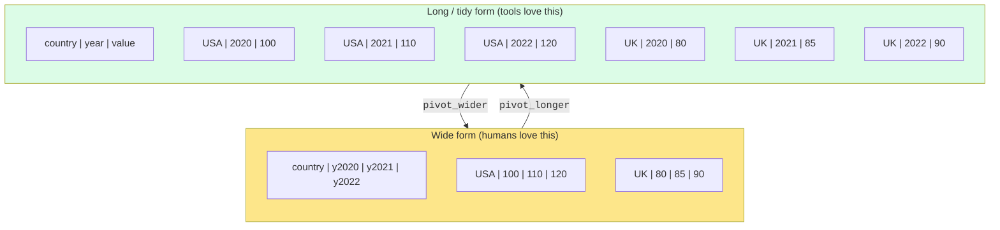
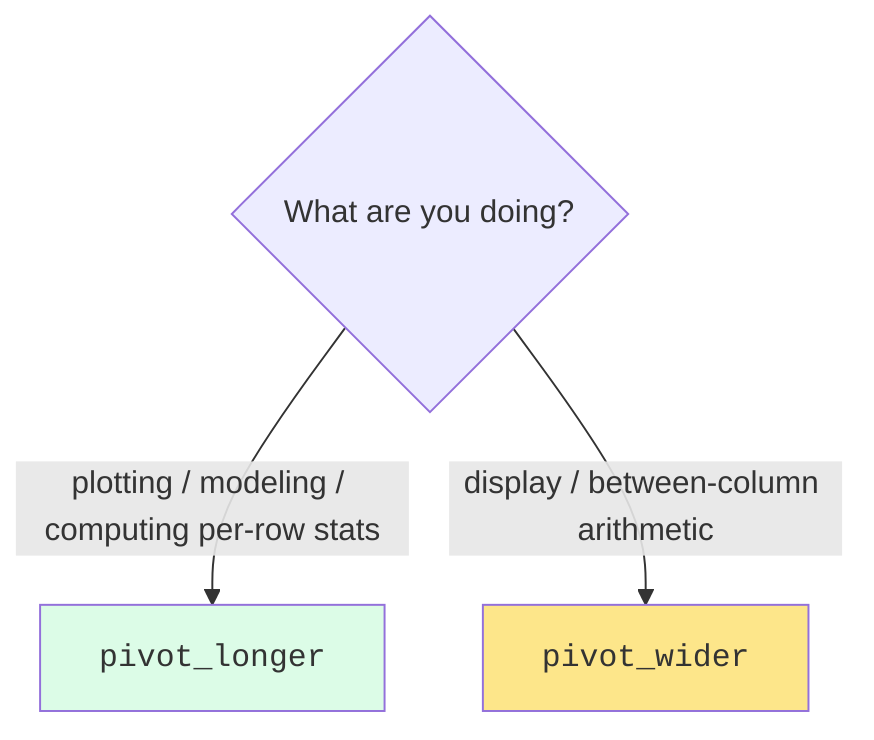

You'll often receive data in a shape that's friendly for humans
to read but hostile for analysis. The fix is **reshaping**:
turning wide tables into long ones, or vice versa.

The `tidyr` package provides two verbs that cover almost every
case:

- **`pivot_longer()`**, wide → long (more rows, fewer columns)
- **`pivot_wider()`**, long → wide (fewer rows, more columns)

You'll use `pivot_longer()` *much* more often than
`pivot_wider()`, because the wild typically delivers data wide
and your tools want it long.

<Figure
  slug="rlang-reshaping-cutout"
  alt="A wide short grid platform folding along a hinge into a tall narrow grid of the same tiles"
/>

## Wide vs. long, visually

Same data, two shapes. Same six numbers either way.

## `pivot_longer()`: wide → long

<CodeBlock
  adapter="r"
  files={[
    {
      filename: "main.r",
      starterCode: `library(tidyr)

wide <- data.frame(
  country = c("USA", "UK"),
  y2020   = c(100, 80),
  y2021   = c(110, 85),
  y2022   = c(120, 90)
)

long <- wide |>
  pivot_longer(
    cols      = starts_with("y"),
    names_to  = "year",
    values_to = "value"
  )

print(long)
`,
    },
  ]}
/>

Three arguments do all the work:

- `cols`: which columns to fold up (here, every column starting
  with `"y"`)
- `names_to`: the name of the **new column** that will hold the
  *old column names* (here, `"year"`)
- `values_to`: the name of the new column that will hold the
  *values* (here, `"value"`)

You can also clean up the year strings on the fly:

<CodeBlock
  adapter="r"
  files={[
    {
      filename: "main.r",
      starterCode: `library(tidyr)

wide <- data.frame(
  country = c("USA", "UK"),
  y2020   = c(100, 80),
  y2021   = c(110, 85),
  y2022   = c(120, 90)
)

long <- wide |>
  pivot_longer(
    cols = starts_with("y"),
    names_to = "year",
    names_prefix = "y",
    names_transform = list(year = as.integer),
    values_to = "value"
  )

print(long)
str(long)
`,
    },
  ]}
/>

Notice `year` is now a proper integer column, not the string
`"y2020"`. That makes it usable as an x-axis, sortable, etc.

## `pivot_wider()`: long → wide

Sometimes you really do want wide format, usually for display, or
to compute differences between columns.

<CodeBlock
  adapter="r"
  files={[
    {
      filename: "main.r",
      starterCode: `library(tidyr)

long <- data.frame(
  country = rep(c("USA", "UK"), each = 3),
  year    = rep(c(2020, 2021, 2022), times = 2),
  value   = c(100, 110, 120, 80, 85, 90)
)

wide <- long |>
  pivot_wider(
    names_from  = year,
    values_from = value
  )

print(wide)
`,
    },
  ]}
/>

Just two arguments:

- `names_from`: which column's *values* become the new columns'
  *names*
- `values_from`: which column's values fill those new columns

## A realistic example: temperatures by month

The built-in `airquality` dataset is mostly tidy already, but
let's deliberately make it wide and then pivot it back:

<CodeBlock
  adapter="r"
  files={[
    {
      filename: "main.r",
      starterCode: `library(dplyr)
library(tidyr)

data(airquality)

# Monthly means in long form
long <- airquality |>
  group_by(Month) |>
  summarise(
    avg_ozone = mean(Ozone, na.rm = TRUE),
    avg_temp  = mean(Temp),
    .groups   = "drop"
  ) |>
  pivot_longer(
    cols      = c(avg_ozone, avg_temp),
    names_to  = "metric",
    values_to = "value"
  )
print(long)

# Pivot it wide for display (months across the top)
wide <- long |>
  pivot_wider(names_from = Month, values_from = value)
print(wide)
`,
    },
  ]}
/>

Notice what just happened: long form is great for *computing*
(one row per metric per month), wide form is great for *reading*
(metrics down the side, months across the top).

## Separating combined columns

Sometimes a single column holds two variables glued together,
"2022-Q1", "Male-30", "USA_Sales". The `separate_wider_delim()`
function splits them:

<CodeBlock
  adapter="r"
  files={[
    {
      filename: "main.r",
      starterCode: `library(tidyr)

df <- data.frame(
  period = c("2022-Q1", "2022-Q2", "2023-Q1", "2023-Q2"),
  sales  = c(100, 120, 110, 140)
)

df |>
  separate_wider_delim(
    period,
    delim = "-",
    names = c("year", "quarter")
  )
`,
    },
  ]}
/>

The result has two columns where there was one. The reverse
operation, `unite()`, glues columns back together.

## When to reshape

A simple rule of thumb:

- If you want to **plot multiple measurements** with `ggplot2` (one
  line per metric, faceting by metric, etc.) → pivot **longer**.
- If you want to **display** a per-group summary in a compact
  table for humans → pivot **wider**.
- If you want to **compute differences/ratios between two
  measurements** that currently live in different rows → pivot
  **wider** so they're in the same row, compute, then optionally
  pivot back.

## Test your understanding

<MultipleChoice
  markdown={`A table has columns \`country\`, \`gdp_2020\`, \`gdp_2021\`, \`gdp_2022\`. To turn it into a tidy long form with columns \`country\`, \`year\`, \`gdp\`, you would use:

- \`pivot_wider()\`
  > \`pivot_wider()\` goes in the opposite direction, it spreads rows into new columns, making a table wider rather than longer.
- \`group_by()\`
  > \`group_by()\` marks groups for downstream aggregation; it does not reshape the table or change the number of columns.
- [o] \`pivot_longer()\`
  > \`pivot_longer()\` folds multiple columns into a key column (year) and a value column (gdp).
- \`select()\`
  > \`select()\` chooses or drops columns but does not fold them into new rows; the shape of the table stays the same.`}
/>

<MultipleChoice
  markdown={`A long table has columns \`country\`, \`year\`, \`gdp\`. To produce a display-friendly wide table with one column per year, you would use:

- [o] \`pivot_wider(names_from = year, values_from = gdp)\`
  > Year's *values* become the new column *names*; gdp's values fill them.
- \`pivot_longer(cols = year)\`
  > \`pivot_longer()\` would make the table longer (more rows), not wider, the opposite of what is needed here.
- \`summarise(gdp = mean(gdp))\`
  > \`summarise()\` reduces rows to a single aggregate value; it does not spread a column's values into new columns.
- \`mutate(year = as.character(year))\`
  > Converting \`year\` to a character type changes the column's type but does not reshape the table in any way.`}
/>

<MultipleChoice
  markdown={`When working with ggplot2, you typically want your data in:

- Wide form, because plots need rectangles.
  > ggplot reads data from a data frame, not a matrix; and having one column per measurement makes mapping aesthetics impossible when there are multiple metrics.
- [o] Long form, because ggplot maps **columns** to visual properties (one column per variable).
  > Long form is what makes \`aes(color = metric)\`-style mappings work cleanly.
- Either, ggplot doesn't care.
  > ggplot does care: each aesthetic mapping names one column, so all values for a given variable must live in one column (long form), not spread across many columns (wide form).
- A matrix, not a data frame.
  > ggplot2 expects a data frame (or tibble) as input; while a matrix can be coerced, ggplot's grammar is designed around named columns in a data frame.`}
/>

## Mini challenge: tidy quarterly sales

You're given a wide table of quarterly sales by region. Reshape
it into a tidy long-form data frame `sales_long` with columns
`region`, `quarter`, and `sales`.

<ChallengeCard
  adapter="r"
  title="Pivot quarterly sales"
  instructions={`Pivot the columns Q1..Q4 into a single \`quarter\` column and a \`sales\` column. The \`region\` column stays as is.`}
  files={[
    {
      filename: "main.r",
      initCode: `sales_wide <- data.frame(
  region = c("North", "South", "East", "West"),
  Q1     = c(120, 80, 100, 95),
  Q2     = c(140, 90, 110, 105),
  Q3     = c(135, 85, 115, 100),
  Q4     = c(160, 95, 130, 120)
)
`,
      starterCode: `library(tidyr)

# sales_wide is already defined
sales_long <- NULL # pivot it longer

print(sales_long)
`,
      solutionCode: `library(tidyr)

sales_long <- sales_wide |>
  pivot_longer(
    cols      = Q1:Q4,
    names_to  = "quarter",
    values_to = "sales"
  )

print(sales_long)
`,
    },
  ]}
  tests={[
    {
      id: "rows",
      name: "16 rows (4 regions x 4 quarters)",
      code: `if (nrow(sales_long) != 16) stop(sprintf("expected 16 rows, got %s", nrow(sales_long)))`,
    },
    {
      id: "cols",
      name: "Has region, quarter, sales",
      code: `need <- c("region","quarter","sales")
if (!all(need %in% names(sales_long))) stop("missing required columns")`,
    },
    {
      id: "sum",
      name: "Total sales preserved",
      code: `if (sum(sales_long$sales) != sum(sales_wide[, paste0("Q", 1:4)])) stop("totals don't match")`,
    },
  ]}
/>

We can now wrangle, group, summarize, and reshape. The next
section is about *what to do* with all that capability, the
art of exploratory data analysis.
