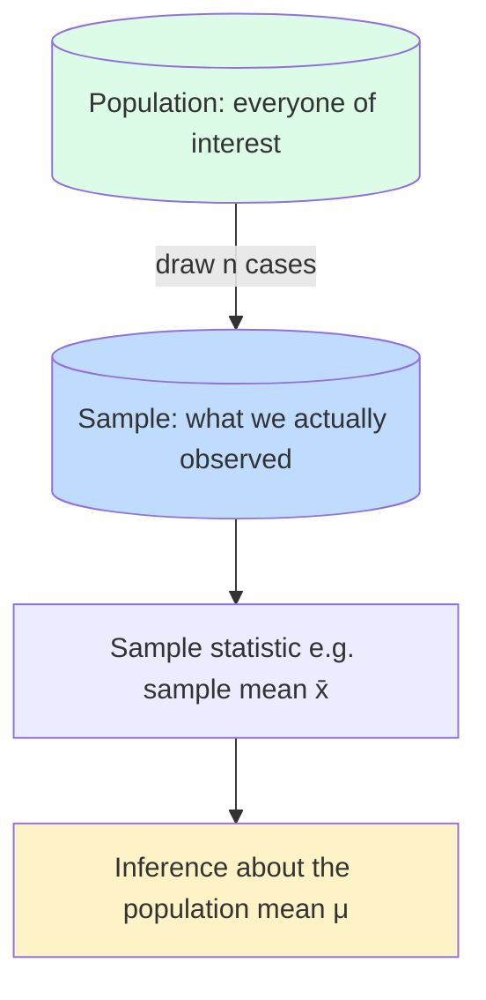

When pollsters say "we surveyed 1,000 voters," they're not
saying the country has 1,000 voters. They're saying: from the
many millions of voters (the **population**), we observed 1,000
of them (the **sample**) and we'll use that sample to make
guesses about the population.

This page explains:

1. The population/sample distinction and why it matters.
2. How sample statistics behave (the **sampling distribution**).
3. The **Central Limit Theorem**, the deep reason why "mean ±
   error" works even when individual data points are weird.

<svg
  viewBox="0 0 640 220"
  role="img"
  aria-label="A large light blue card filled with pale dots sends a solid gray arrow to a small green card holding just four solid dots, every dataset is a sample lifted out of a much larger population"
  style={{ display: "block", width: "100%", maxWidth: "640px", height: "auto", margin: "2.5rem auto" }}
>
  <g style={{ color: "var(--ds-blue-500)" }} fill="currentColor">
    <rect x="60" y="30" width="260" height="160" rx="16" fillOpacity="0.08" />
  </g>
  <g style={{ color: "var(--ds-blue-500)" }} fill="currentColor" fillOpacity="0.45">
    <circle cx="96" cy="60" r="5" />
    <circle cx="140" cy="54" r="5" />
    <circle cx="184" cy="62" r="5" />
    <circle cx="228" cy="56" r="5" />
    <circle cx="272" cy="64" r="5" />
    <circle cx="108" cy="98" r="5" />
    <circle cx="152" cy="104" r="5" />
    <circle cx="196" cy="96" r="5" />
    <circle cx="240" cy="102" r="5" />
    <circle cx="284" cy="94" r="5" />
    <circle cx="96" cy="138" r="5" />
    <circle cx="140" cy="146" r="5" />
    <circle cx="184" cy="136" r="5" />
    <circle cx="228" cy="144" r="5" />
    <circle cx="272" cy="152" r="5" />
  </g>
  <g fill="var(--ds-gray-400)">
    <rect x="340" y="108.5" width="90" height="3" rx="1.5" />
    <polygon points="428,104.5 439,110 428,115.5" />
  </g>
  <g style={{ color: "var(--ds-green-500)" }} fill="currentColor">
    <rect x="470" y="68" width="130" height="84" rx="14" fillOpacity="0.12" />
    <circle cx="502" cy="110" r="6" />
    <circle cx="530" cy="94" r="6" />
    <circle cx="546" cy="126" r="6" />
    <circle cx="574" cy="106" r="6" />
  </g>
</svg>

## Population vs. sample

A few critical terms:

- **Population**: the full set of entities you care about (every
  voter, every customer, every star in the galaxy).
- **Sample**: the subset you actually observed.
- **Parameter** (μ, σ, π, …): a true value describing the
  *population*. Usually unknown.
- **Statistic** (x̄, s, p̂, …): a value you computed from the
  *sample*. Known but variable.

We use statistics to *estimate* parameters. The estimate is
always uncertain because someone else sampling 1,000 different
voters would get a slightly different x̄.

## Drawing a sample in R

Built-in tools:

<CodeBlock
  adapter="r"
  files={[
    {
      filename: "main.r",
      starterCode: `# A pretend "population" of 100,000 adult heights (cm)
set.seed(1)
population <- rnorm(100000, mean = 170, sd = 9)

cat("Population mean:", mean(population), "\\n")
cat("Population sd:  ", sd(population), "\\n")

# Take a sample of 50
sample50 <- sample(population, size = 50, replace = FALSE)

cat("Sample mean:", mean(sample50), "\\n")
cat("Sample sd:  ", sd(sample50), "\\n")
`,
    },
  ]}
/>

The sample statistics are *close to* but not *equal to* the
population values. That gap is the cost of not measuring
everyone.

## Bias vs. variability

Two things can go wrong with a sample:

- **Bias**, your sampling method systematically misses certain
  cases. (Surveying only people who answer landlines biases
  toward older respondents.)
- **Variability**, even an unbiased method produces sample
  statistics that wiggle from one sample to the next.

Big sample sizes shrink **variability** but not **bias**. A
biased survey of 10 million people is still biased. This is why
*how* you sample matters as much as *how much* you sample.

| Sampling method | Where the estimates land |
| --- | --- |
| Unbiased + low variance ✅ | Cluster near the truth |
| Biased ❌ | Cluster tightly, but not near the truth |
| Unbiased + high variance | Centered on the truth, but scattered |

## The sampling distribution of the mean

If you took *many* samples of size 50 from our population and
computed `mean()` each time, you'd get a distribution of means.
Let's actually do it:

<CodeBlock
  adapter="r"
  files={[
    {
      filename: "main.r",
      starterCode: `set.seed(1)
population <- rnorm(100000, mean = 170, sd = 9)

# Repeat: draw a sample of 50, compute its mean
many_means <- replicate(5000, mean(sample(population, 50)))

hist(many_means,
  breaks = 40,
  col    = "steelblue",
  main   = "Sampling distribution of the mean (n=50, 5000 reps)",
  xlab   = "Sample mean (cm)"
)

cat("Mean of sample means:", mean(many_means), "\\n")
cat("SD of sample means:  ", sd(many_means), "\\n")
cat("Theoretical SE = sd(pop)/sqrt(n) =", sd(population) / sqrt(50), "\\n")
`,
    },
  ]}
/>

Three things to notice:

1. The histogram is **bell-shaped**, centered on the population
   mean (~170 cm).
2. The spread of the sampling distribution (the SD of
   `many_means`) matches `sd(population) / sqrt(n)`, that's the
   **standard error of the mean**.
3. Although *one* sample bounces around, the *distribution of
   possible sample means* is highly predictable.

This regularity, the sampling distribution of x̄ being
bell-shaped and narrower than the population, is what makes
quantitative inference possible.

## The Central Limit Theorem (in plain English)

Here's the magic: *even if the underlying population is not
bell-shaped*, the distribution of sample means becomes
bell-shaped as n grows. Let's see this with a *very* non-normal
population, an exponential distribution (lots of small values,
a long right tail):

<CodeBlock
  adapter="r"
  files={[
    {
      filename: "main.r",
      starterCode: `set.seed(1)

# An extremely right-skewed population
population <- rexp(100000, rate = 1) # mean = 1, sd = 1

par(mfrow = c(2, 2))

hist(population,
  breaks = 60, col = "tomato",
  main = "Population (exponential)", xlab = "x"
)

for (n in c(2, 10, 50)) {
  means <- replicate(5000, mean(sample(population, n)))
  hist(means,
    breaks = 40, col = "steelblue",
    main = paste0("Sample means, n=", n),
    xlab = "x̄"
  )
}

par(mfrow = c(1, 1))
`,
    },
  ]}
/>

The population is heavily skewed. With n = 2, the distribution
of means still looks skewed. With n = 10, it's much closer to
bell-shaped. By n = 50, it's nearly normal.

**That** is the Central Limit Theorem: the sampling distribution
of the mean tends toward a normal distribution as n grows, *no
matter what shape the population has* (with some technical
caveats). It's why so many statistical methods quietly assume
normality of the sample mean rather than of the data itself.

## Why this matters in practice

The CLT is the reason you can:

- Build confidence intervals for the mean without knowing the
  exact shape of the population.
- Run a t-test on right-skewed data when n is large and not feel
  guilty.
- Trust the standard error formula `sd / sqrt(n)` as a useful
  summary of uncertainty.

It does **not** help you when:

- Your sample is biased (no math fixes a bad sampling design).
- n is small *and* the population is wildly skewed.
- You care about something other than the mean (medians, maxima,
  etc., have their own sampling distributions).

## A concrete example: estimating an average rating

Suppose 5,000 customers rated your product 1–5 stars. You can
only afford to ask 100 of them. How accurately can you estimate
the average rating?

<CodeBlock
  adapter="r"
  files={[
    {
      filename: "main.r",
      starterCode: `set.seed(2)

# Pretend "true" population of 5000 ratings, mostly 4s and 5s
population <- sample(1:5, 5000, replace = TRUE, prob = c(0.05, 0.10, 0.20, 0.35, 0.30))
cat("True population mean:", mean(population), "\\n\\n")

# Take a single sample of 100
sample100 <- sample(population, 100)
xbar <- mean(sample100)
se <- sd(sample100) / sqrt(100)

cat("Sample mean:", round(xbar, 3), "\\n")
cat("Standard error:", round(se, 3), "\\n")
cat(sprintf(
  "Approx 95%% interval: [%.2f, %.2f]\\n",
  xbar - 2 * se, xbar + 2 * se
))
`,
    },
  ]}
/>

The "approximate 95% interval" `x̄ ± 2·SE` is a quick rule of
thumb, about 95% of the time, an interval built like this
covers the true population mean. (We'll polish that idea on the
next page.)

## Test your understanding

<MultipleChoice
  markdown={`The **standard error of the mean** with sample size n and population SD σ is approximately:

*Hint: the standard error should get smaller as the sample size n grows.*

- σ
  > This is the spread of individual values, which does not depend on n at all, the standard error must shrink as n grows.
- [o] σ / √n
  > Doubling sample size shrinks SE by √2, quadrupling shrinks it by 2, etc.
- σ × n
  > This grows with n, but the standard error should shrink as you collect more data.
- σ² / n
  > This uses the variance (σ²) and divides by n rather than √n, so the units and rate of shrinkage are both wrong.`}
/>

<MultipleChoice
  markdown={`The Central Limit Theorem says:

- All data is normally distributed if you collect enough.
  > The CLT says the *sampling distribution of the mean* becomes normal, not the raw data; individual observations in a skewed population remain skewed no matter how many you collect.
- [o] The distribution of the **sample mean** becomes approximately normal as n grows, regardless of the population shape.
  > It's a statement about averages, not about individual data points.
- Skewed data can be ignored.
  > Skewed data affects which summary statistics are appropriate and how you interpret results; the CLT does not make skewness irrelevant for individual observations or for small samples.
- p-values are always small.
  > The CLT justifies using normal-based test statistics for large samples; it says nothing about whether effects are large or p-values are small.`}
/>

<MultipleChoice
  markdown={`Why is "sampling 10 million biased people" still a problem?

- It's never a problem if n is huge.
  > A large biased sample converges very precisely to the wrong answer, large n reduces variability, but cannot remove a systematic offset in the sampling process.
- [o] Bias is a systematic offset that big sample size does **not** fix, you'll just be very precisely wrong.
  > Sample size shrinks variance, but only sound sampling design eliminates bias.
- p-values become unreliable.
  > p-values and confidence intervals address variability, not bias; a biased sample will produce p-values that are too small or confidence intervals that miss the true parameter, regardless of n.
- The CLT stops applying.
  > The CLT still applies to biased samples, sample means still become approximately normal, but they converge to a biased value rather than the true population mean.`}
/>

## Mini challenge: estimate the mean with uncertainty

Given the population vector `pop`, draw a sample of size 30,
compute the sample mean `x_bar` and the standard error `se`, and
report a rough 95% interval `ci` of length 2 (low, high) using
the rule x̄ ± 2·SE.

<ChallengeCard
  adapter="r"
  title="Sample mean + rough 95% CI"
  instructions={`Use \`set.seed(123)\`, take a sample of size 30 from \`pop\`, store its mean in \`x_bar\` and standard error in \`se\` (use \`sd / sqrt(n)\`), and build a length-2 numeric vector \`ci\` containing \`x_bar - 2*se\` and \`x_bar + 2*se\`.`}
  files={[
    {
      filename: "main.r",
      starterCode: `set.seed(123)
pop <- rnorm(100000, mean = 50, sd = 12)

x_bar <- NULL
se <- NULL
ci <- NULL

cat("x_bar:", x_bar, "\\n")
cat("se:   ", se, "\\n")
cat("ci:   ", ci, "\\n")
`,
      solutionCode: `set.seed(123)
pop <- rnorm(100000, mean = 50, sd = 12)
samp <- sample(pop, 30)
x_bar <- mean(samp)
se <- sd(samp) / sqrt(length(samp))
ci <- c(x_bar - 2 * se, x_bar + 2 * se)
`,
    },
  ]}
  tests={[
    {
      id: "xbar",
      name: "x_bar is numeric scalar",
      code: `if (!is.numeric(x_bar) || length(x_bar) != 1) stop("x_bar must be a single numeric")`,
    },
    {
      id: "se",
      name: "se is positive scalar",
      code: `if (!is.numeric(se) || length(se) != 1 || se <= 0) stop("se must be a positive numeric scalar")`,
    },
    {
      id: "ci",
      name: "ci length 2 and brackets x_bar",
      code: `if (length(ci) != 2 || ci[1] >= x_bar || ci[2] <= x_bar) stop("ci must be c(low, high) bracketing x_bar")`,
    },
    {
      id: "covers",
      name: "Interval is reasonable",
      code: `if (50 < ci[1] || 50 > ci[2]) warning("CI did not cover the true mean, that's possible ~5% of the time, try a different seed")`,
    },
  ]}
/>

Next, we'll unpack what that interval really *means*, and
explore p-values, confidence intervals, and how to keep your
intuition honest when reading statistical claims.
