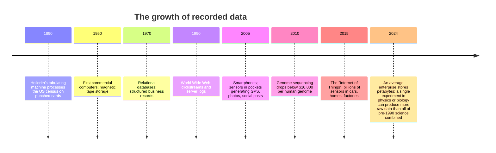

For most of human history, **data was scarce**.

A merchant in 1750 might keep a single ledger of grain sales, a few
hundred entries scratched onto paper over a year. A scientist in
1820 might spend a decade gathering a few thousand astronomical
observations, each one painstakingly recorded by candlelight. Even
into the 20th century, a census, counting an entire country, was
done by hand, took years to compile, and was the kind of project
that built (and broke) governments.

In that world, **a single number was precious**. Every observation
was hard-won. The arithmetic for analyzing it was done with quills,
slide rules, and later mechanical calculators. The question was
never "how do I process all this data?", it was "how do I squeeze
every drop of insight out of the little data I have?"

<Figure
  slug="rlang-age-of-data-cutout"
  alt="A single precious ledger book on a small plinth beside a towering cascade of identical data tiles pouring off a platform"
/>

## The trickle becomes a stream

Then, slowly at first and then very fast, the world started
generating data the way clouds generate rain.

Each step roughly multiplied the world's stored data by ten or more.
We are now in an era where the *bottleneck is no longer
collection*, it is **understanding**.

## What changed in science

Look at any branch of science and you will see the same pattern.

**Astronomy.** Galileo recorded a few dozen drawings of Jupiter's
moons. The modern Vera Rubin Observatory will produce about 20
terabytes of images *every single night*, a stream so large that
human eyes will never look at most of it. Discoveries have to be
made by computer programs that scan the data.

**Biology.** A 1960s geneticist might study a single gene over
years. A modern lab can sequence the entire genome of an organism
in an afternoon. The Human Genome Project, a 13-year, $3-billion
international effort that finished in 2003, could now be repeated
by a single graduate student in a week.

**Climate science.** A 1900s meteorologist had a handful of weather
stations and ship logs. A modern climate model ingests data from
thousands of satellites, weather balloons, ocean buoys, and ground
sensors, and produces multi-petabyte simulations of the entire
atmosphere.

**Medicine.** A patient in 1980 had a paper chart with maybe 50
data points: a few vitals, a few lab tests, some notes. A patient
in 2025 might have continuous heart-rate data from a wearable, a
genomic profile, dozens of imaging studies, electronic prescription
history, and a decade of structured lab results.

In every case, the *science* did not change, gravity, DNA, weather,
and biology work the same as they always did. What changed is that
suddenly you could **see** them in detail you never could before. And
that meant the limiting factor became not "how do I gather more
data?" but "how do I make sense of what I have?"

## What changed in business and society

Outside of science, the same thing happened.

A retailer in 1960 knew its monthly sales by store, more or less. A
retailer in 2025 knows, for each customer, every item they viewed,
how long they hovered, what they put in their cart and then removed,
and how that varies by time of day and weather. The actual goods on
the shelf changed slowly; what changed is how much *signal* the
retailer captures about each shopper.

A city in 1980 knew its population from the most recent census. A
city in 2025 can estimate, in near real time, how many people are
in each neighborhood from anonymized mobile-phone pings, traffic
sensors, and transit fare data.

This abundance creates a new kind of question. We are no longer
asking "what is the answer?", we are asking "**which of these
hundred possible patterns is real, and which is just noise?**"

## The problem of "too much"

If data were just *more of the same*, we could keep doing what we
always did, only longer. Multiply by ten? Spend ten times as long
with the calculator. But that is not how it works. When the size of
the data jumps by a thousand or a million, the *kinds of mistakes
you can make* change too.

Consider three problems that simply did not exist when data was
small:

1. **Spurious patterns.** If you test enough hypotheses against a
   large dataset, some will look "significant" purely by chance. A
   study of 10,000 variables will find dozens of "discoveries" that
   are pure noise. Avoiding this requires *statistical thinking*
   built into the analysis pipeline.
2. **Hidden bias.** A small dataset is often gathered carefully and
   the researcher knows every quirk. A massive dataset, say,
   scraped from a website or pulled from sensors, comes with bias
   you cannot see: missing demographics, broken sensors, dropped
   records during outages. The bigger the data, the *easier* it is
   to be confidently wrong.
3. **Reproducibility.** If your "analysis" was a person clicking
   through 47 menus in a spreadsheet, no one, including you, six
   months later, can rerun it. With giant datasets and complicated
   workflows, "trust me, I clicked the right buttons" is not good
   enough.

The combination of these three problems is what brought
**programming languages for data** to the center of modern science
and business. The slide rule, the calculator, and the spreadsheet
each had their moment. But once data became big and the questions
became subtle, the analyst needed something more like a workbench
of tools, and those tools needed to be code.

## Why this matters for R

R was born exactly at the moment when this shift was accelerating.
It was designed by statisticians who could see the problem coming:
how do you let a thoughtful, non-engineer scientist *think
statistically about data*, at scale, with tools that are honest
about uncertainty?

R's origin story is genuinely good, two New Zealand academics, a
free weekend project that quietly displaced a million-dollar
commercial product, and we tell it in full in the optional
"deeper history" chapters near the end of the course. But you learn
a language by *using* it, so we are not going to make you wait. One
more short page on how to *think* like a data analyst, and then you
write your first R the page after that.

<MultipleChoice
  markdown={`Which of the following best describes how the **bottleneck** in data analysis has shifted over the past 50 years?

- The bottleneck is now purely hardware, we need faster computers.
  > Hardware matters, but the bigger constraint is human: turning data into reliable insight.
- There is no longer any bottleneck because AI handles everything.
  > AI tools help, but they still require thoughtful humans to choose questions, evaluate results, and avoid garbage-in/garbage-out problems.
- [o] The bottleneck has shifted from *collecting* data to *understanding* it.
  > For most of history, gathering data was the hard part. Today, data is generated in huge volumes automatically; the challenge is interpreting it, separating signal from noise, and making decisions that are not fooled by spurious patterns.
- The bottleneck has stayed the same: people still mostly run out of data.
  > Data scarcity was the bottleneck for most of history, but the text describes how the world has shifted from data-scarce to data-abundant, making *understanding* the new limiting factor.`}
/>

<MultipleChoice
  markdown={`Why does *spurious patterns* become a more dangerous problem as datasets grow larger?

- [o] When you test many hypotheses against a large dataset, some will look "statistically interesting" purely by chance.
  > This is sometimes called the *multiple comparisons problem*, and it is one of the main reasons data analysts need disciplined statistical tools, not just spreadsheets.
- Large datasets are always biased.
  > Bias is a potential problem with large datasets, but it is a separate issue from spurious patterns; here the concern is false positives due to testing many hypotheses.
- Larger datasets cannot be visualized.
  > Large datasets can absolutely be visualized (with sampling, aggregation, or appropriate tools); the spurious-patterns problem is a statistical phenomenon, not a visualization limitation.
- Computers introduce rounding errors at scale.
  > Floating-point rounding errors are a real concern in numerical computing but are not the primary reason large datasets produce spurious patterns; multiple-comparison inflation is.`}
/>

<MultipleChoice
  markdown={`Which of these is **not** primarily a consequence of the explosion in data over the past few decades?

- The need for reproducible, scripted analyses
  > The explosion of data made reproducibility more critical, not less; large, complex workflows that cannot be rerun are a direct consequence of the data boom.
- The risk of finding patterns that are not really there
  > Spurious patterns are an established consequence of large-scale data exploration; testing many hypotheses on big datasets inflates false-discovery rates.
- The shift from hand calculation to programmatic analysis
  > Programmatic analysis emerged directly from the need to process data volumes too large for manual methods; it is a well-documented consequence of the data explosion.
- [o] The disappearance of the need to understand basic arithmetic
  > Basic arithmetic is *more* important than ever, because you need to sanity-check what the computer is doing. Tools amplify both correct and incorrect reasoning.`}
/>

In the next page we make the mental shift that the rest of the
course depends on: learning to think about *whole collections of
data at once* instead of one number at a time. Then we start writing
R for real.
