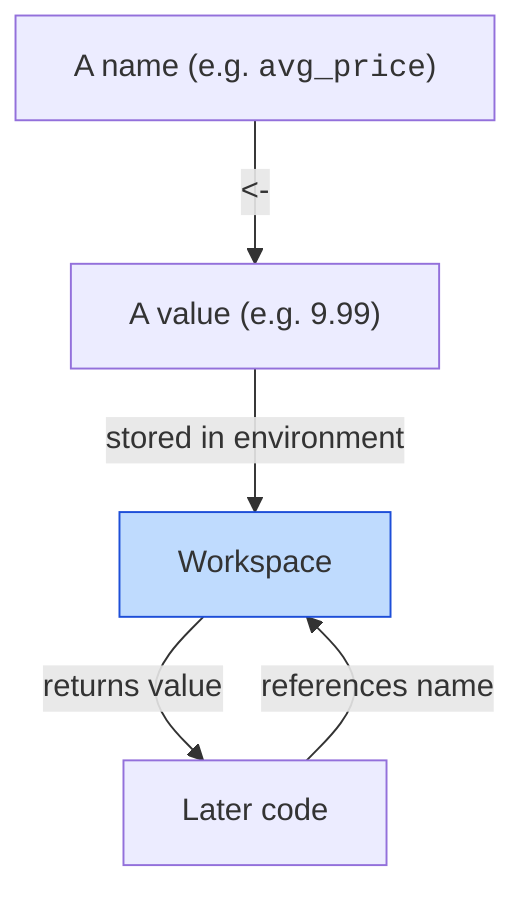
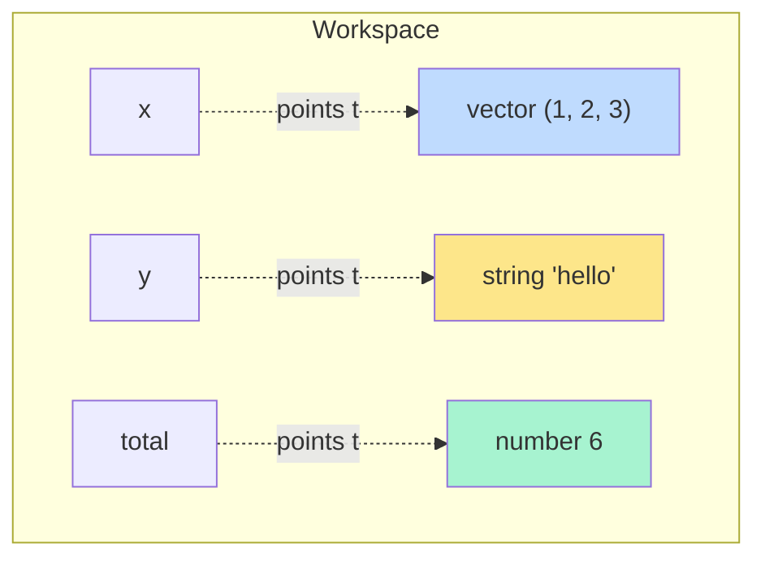

Programming, fundamentally, is *naming things and acting on those
names*. R's variable system is delightfully simple: you write a
name, an arrow, and a value, and R remembers it.

<CodeBlock
  adapter="r"
  files={[
    {
      filename: "main.r",
      starterCode: `# The basic shape: name <- value
x <- 42
greeting <- "Hello, R!"
prices <- c(9.99, 14.50, 24.00)

print(x)
print(greeting)
print(prices)
`,
    },
  ]}
/>

The leftward-pointing arrow `<-` is R's **assignment operator**.
You will see it everywhere.

<Figure
  slug="rlang-variables-cutout"
  alt="A labelled storage jar on a platform with a left-pointing arrow feeding a value block into its open mouth"
/>

## Why `<-` and not `=`?

If you have used most other languages, you have used `=` for
assignment. R does support `=` for assignment too, and it works in
most places. But the `<-` arrow is strongly preferred, for two
historical and one practical reason:

- **History.** S used `<-` from the start (it was originally typed
  as a single character on APL keyboards back in the 1970s). R
  inherited the convention.
- **Distinctness from `==`.** In R, `x = 5` and `x == 5` are both
  meaningful (assignment vs. comparison). The arrow `<-` removes
  any ambiguity at a glance.
- **Distinctness from function arguments.** In a function call like
  `mean(x = 1:10)`, the `=` is **not assignment**, it is naming an
  argument. Reserving `<-` for true assignment keeps the two
  worlds visually separate.

Most modern editors (including the editor on this page) let you
type `<-` with a single shortcut. In RStudio it is `Alt + -`. In
this course we will use `<-` everywhere.

## What is a "valid" variable name?

R variable names can include letters, numbers, `.`, and `_`, but
must **start with a letter or a dot**. They are **case-sensitive**.
Some examples:

```r
x          # ok
my_var     # ok and preferred style
myVar      # also ok (camelCase)
my.var     # ok in R (the dot is allowed!)
.x         # ok (starts with a dot, used for "hidden" variables)
2x         # NOT ok, cannot start with a number
my-var     # NOT ok, `-` is the subtraction operator
```

A few names are reserved by the language and cannot be used as
variables: `if`, `else`, `for`, `while`, `function`, `return`,
`TRUE`, `FALSE`, `NULL`, `NA`, `Inf`, `NaN`. (Mostly you would
never want to use these as variable names anyway.)



The diagram captures everything that happens. The "workspace"
(formally the *global environment*) is just a key-value store: names
point to values. When R sees a name in an expression, it looks it
up in the workspace.

## The naming question is the whole game

Most beginners think the hard part is the *syntax*. It is not. The
hard part is *naming*.

Compare these two equivalent computations:

```r
# Version A, terrible names
x <- read.csv("data.csv")
y <- x[x$z > 100, ]
m <- mean(y$w)
```

```r
# Version B, meaningful names
sales        <- read.csv("data.csv")
big_orders   <- sales[sales$amount > 100, ]
avg_revenue  <- mean(big_orders$revenue)
```

The two versions are *byte-identical to the computer* in what they
do. They are *worlds apart* for a human reader. Reading version B,
you can almost guess the analysis without thinking. Reading version
A, you have to work out what each name means as you go.

Three quick guidelines for naming:

1. **Use descriptive names.** Prefer `customer_age` over `x`.
2. **Use lowercase with underscores.** `customer_age`, not
   `CustomerAge` or `customerAge`. (Both styles work, but
   `lower_snake_case` is the dominant convention in modern R.)
3. **Save abbreviations for things that are common in your domain.**
   `bmi` is fine. `cag` for "customer age group" is not, write
   `customer_age_group`.

## Assignment is silent

When you assign, R does not print anything. Only by *referencing*
the variable (or by wrapping the assignment in parentheses) do you
see the value.

<Figure
  slug="rlang-variables-and-assignment-inline-cutout"
  alt="A labelled tag being tied to a block on a bench, and the same tag later moved to a different block"
/>

<CodeBlock
  adapter="r"
  files={[
    {
      filename: "main.r",
      starterCode: `a <- 100 # no output, assignment is silent
print(a) # shows 100

# Trick: parenthesize the assignment to both store and print
(b <- 200)
`,
    },
  ]}
/>

The "wrap in parentheses" trick is sometimes useful for quick
interactive exploration. Most of the time, though, you will
assign on one line and inspect on the next.

## Updating variables

You can overwrite a variable by assigning again. R does not warn
you, it just replaces the old value.

<CodeBlock
  adapter="r"
  files={[
    {
      filename: "main.r",
      starterCode: `count <- 0
print(count)

count <- count + 1 # this is fine: read the right side, then store on the left
print(count)

count <- count * 10
print(count)
`,
    },
  ]}
/>

Notice the line `count <- count + 1`. This is **not** a math
equation (which would be nonsense, no number equals itself plus
one). It is a *command*: "compute `count + 1`, then store the
result back into `count`." The right side is evaluated first, the
left side receives the result. This pattern shows up constantly.

## What a "value" really is

When you write `x <- c(1, 2, 3)`, R does three things:

1. Creates a vector with the three numbers.
2. Stores that vector somewhere in memory.
3. Adds an entry to your workspace mapping the name `x` to that
   stored vector.

<Figure
  slug="rlang-variables-and-assignment-not-inline-cutout"
  alt="A tag being tied onto a block by a hooked tool that only works in one direction"
/>

When you later write `x + 1`, R:

1. Looks up `x` in the workspace.
2. Finds the vector it points to.
3. Evaluates the expression on that vector.



This is a mental model that pays off later. When we talk about
copying data, modifying data, and what happens "behind the
scenes" inside `dplyr` pipelines, you will be able to reason
about it because you understand that names are *pointers to
values*, not values themselves.

## A subtle but important point: copy on assignment

In R, when you assign one variable to another, you generally get
an *independent* copy. Changing one does not change the other.

<CodeBlock
  adapter="r"
  files={[
    {
      filename: "main.r",
      starterCode: `x <- c(1, 2, 3)
y <- x # y now refers to a copy of x's data
y[1] <- 999 # change y's first element

print(x) # x is unchanged
print(y) # y has 999 in first position
`,
    },
  ]}
/>

This *copy-on-modify* behavior is one of R's most thoughtful
design choices. It makes R code very safe: you can pass a variable
into a function, and the function cannot secretly mutate your
data. The downside is that R can be memory-inefficient for *very*
large datasets, but for the kind of work in this course, it's
exactly what you want.

(Many other languages, Python, Java, JavaScript, work
differently here. If you are coming from one of those, this is one
of R's most pleasant surprises.)

## Listing and removing variables

You can ask R what variables exist in the current workspace, and
you can remove them.

<CodeBlock
  adapter="r"
  files={[
    {
      filename: "main.r",
      starterCode: `x <- 1
y <- 2
z <- 3

# What's in the workspace?
print(ls())

# Remove a single variable
rm(x)
print(ls())

# Remove everything
rm(list = ls())
print(ls())
`,
    },
  ]}
/>

In WebR, every code block starts with a fresh workspace, so you
rarely need `rm()` interactively. But in long sessions or shared
scripts it can be useful for cleaning up.

## Test your understanding

<MultipleChoice
  markdown={`Which line of R **assigns** the value 7 to a variable called \`count\`?

- \`count ~ 7\`
  > \`~\` is used in model formulas, not for assignment.
- [o] \`count <- 7\`
  > \`<-\` is R's assignment operator.
- \`count := 7\`
  > \`:=\` is used in some packages (like data.table), but not in standard R assignment.
- \`count == 7\`
  > That is a comparison, not an assignment. It returns \`TRUE\` or \`FALSE\`.`}
/>

<MultipleChoice
  markdown={`After running:

\`\`\`r
x <- 5
y <- x
y <- y + 1
\`\`\`

What is the value of \`x\`?

- An error
  > The code is valid R and runs without error.
- \`6\`
  > That would be true if R had reference semantics, but it doesn't here.
- [o] \`5\`
  > When you wrote \`y <- x\`, R gave \`y\` its own independent copy. Modifying \`y\` leaves \`x\` alone.
- \`NA\`
  > \`x\` was assigned a concrete value (5) and never changed, so it is not missing.`}
/>

<MultipleChoice
  markdown={`Which of these is **not** a valid R variable name?

- \`my_var\`
  > Letters, digits, underscores, and dots are allowed, and a name may start with a letter, this is valid.
- \`.hidden\`
  > A leading dot is allowed; such names are simply hidden from \`ls()\` by default, but they are still valid.
- \`avg.price\`
  > Dots are allowed inside R names, this is valid (though somewhat dated style).
- [o] \`2nd_quarter\`
  > R variable names cannot start with a digit.`}
/>

<MultipleChoice
  markdown={`Why does R conventionally use \`<-\` for assignment instead of \`=\`?

- \`=\` is forbidden in R.
  > It is not, \`=\` also works for assignment in most contexts.
- Because R does not understand the \`=\` symbol.
  > R uses \`=\` for named function arguments and supports it for assignment; the convention to prefer \`<-\` is stylistic, not a language limitation.
- [o] To keep assignment visually distinct from comparison (\`==\`) and from named function arguments (\`mean(x = 1:10)\`).
  > The arrow leaves no doubt that what's happening is a write, not a read or a label.
- Because \`=\` is reserved for SQL.
  > R is an independent language with no special reservation of \`=\` for SQL; the preference for \`<-\` is about clarity within R itself.`}
/>

## Mini challenge: a running budget

Define a variable `budget` (your starting balance), then make
three "purchase" assignments that each subtract some amount from
`budget`. After the last assignment, `budget` should hold the
correct remaining balance.

<ChallengeCard
  adapter="r"
  title="Running budget"
  instructions={`Start with \`budget <- 100\`. Then make three updates so that after all three:
- subtract 25 (groceries)
- subtract 12 (coffee)
- subtract 8 (parking)

After all three updates, \`budget\` should equal \`100 - 25 - 12 - 8 = 55\`.`}
  files={[
    {
      filename: "main.r",
      starterCode: `budget <- 100

# Three updates here

cat("Remaining: $", budget, "\\n", sep = "")
`,
      solutionCode: `budget <- 100
budget <- budget - 25
budget <- budget - 12
budget <- budget - 8
cat("Remaining: $", budget, "\\n", sep = "")
`,
    },
  ]}
  tests={[
    {
      id: "budget",
      name: "budget is 55",
      description: "After the three subtractions",
      code: `if (!isTRUE(all.equal(budget, 55))) stop(sprintf("expected 55, got %s", budget))`,
    },
  ]}
/>

With variables in hand, we are ready to talk about R's most
distinctive design choice: the fact that **everything is a
vector**. That is the next page.
