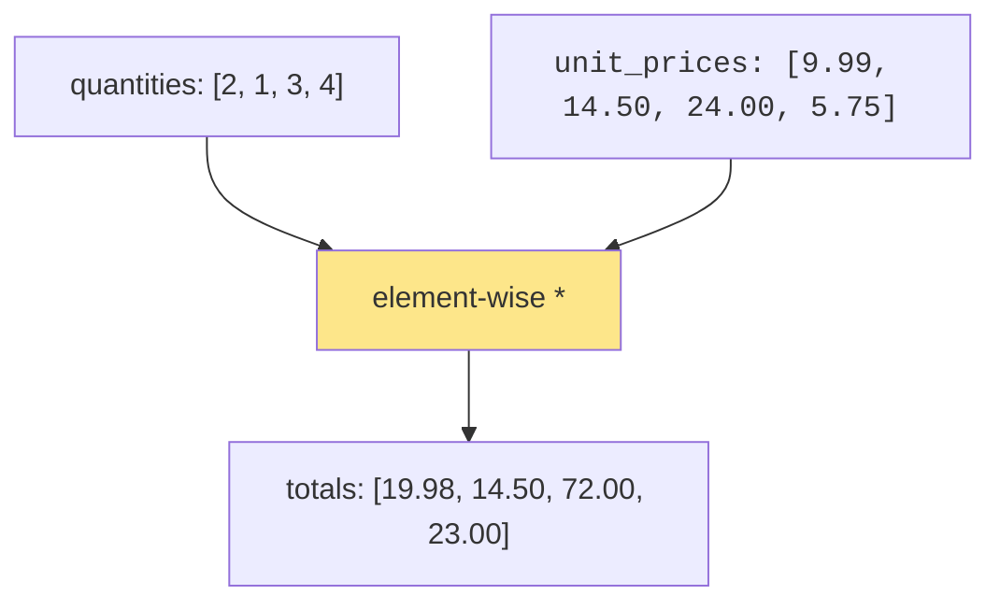
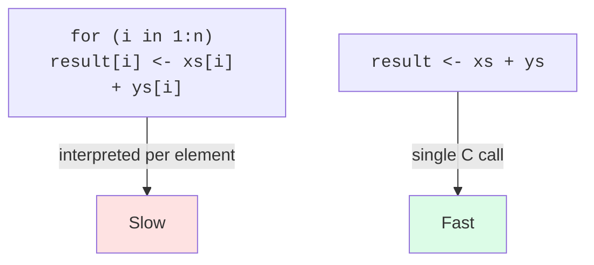

In most programming languages, if you want to add 1 to every
number in a list, you write a loop:

```
for each item in list:
    item = item + 1
```

In R, you write:

```r
xs + 1
```

That's it. No loop. R applies the `+ 1` to every element of `xs`
automatically. This is called **vectorized computation**, and once
you internalize it, your R code becomes shorter, clearer, and
often *much* faster.

<svg
  viewBox="0 0 640 240"
  role="img"
  aria-label="A row of cells holding light blue dots passes under one wide plus-one bar that presses on every cell at once, leaving a row of darker blue dots below, vectorized computation transforms the whole vector in a single step"
  style={{ display: "block", width: "100%", maxWidth: "640px", height: "auto", margin: "2.5rem auto" }}
>
  <g style={{ color: "var(--ds-blue-500)" }} fill="currentColor" fillOpacity="0.1">
    <rect x="150" y="40" width="36" height="36" rx="8" />
    <rect x="198" y="40" width="36" height="36" rx="8" />
    <rect x="246" y="40" width="36" height="36" rx="8" />
    <rect x="294" y="40" width="36" height="36" rx="8" />
    <rect x="342" y="40" width="36" height="36" rx="8" />
    <rect x="390" y="40" width="36" height="36" rx="8" />
  </g>
  <g style={{ color: "var(--ds-blue-300)" }} fill="currentColor">
    <circle cx="168" cy="58" r="6" />
    <circle cx="216" cy="58" r="6" />
    <circle cx="264" cy="58" r="6" />
    <circle cx="312" cy="58" r="6" />
    <circle cx="360" cy="58" r="6" />
    <circle cx="408" cy="58" r="6" />
  </g>
  <g style={{ color: "var(--ds-blue-500)" }} fill="currentColor">
    <rect x="150" y="128" width="276" height="18" rx="9" />
    <rect x="166" y="150" width="4" height="16" fillOpacity="0.6" />
    <rect x="214" y="150" width="4" height="16" fillOpacity="0.6" />
    <rect x="262" y="150" width="4" height="16" fillOpacity="0.6" />
    <rect x="310" y="150" width="4" height="16" fillOpacity="0.6" />
    <rect x="358" y="150" width="4" height="16" fillOpacity="0.6" />
    <rect x="406" y="150" width="4" height="16" fillOpacity="0.6" />
    <polygon points="161,166 175,166 168,178" fillOpacity="0.8" />
    <polygon points="209,166 223,166 216,178" fillOpacity="0.8" />
    <polygon points="257,166 271,166 264,178" fillOpacity="0.8" />
    <polygon points="305,166 319,166 312,178" fillOpacity="0.8" />
    <polygon points="353,166 367,166 360,178" fillOpacity="0.8" />
    <polygon points="401,166 415,166 408,178" fillOpacity="0.8" />
  </g>
  <g style={{ color: "var(--ds-white)" }} fill="currentColor">
    <text x="276" y="142" fontFamily="var(--font-mono), ui-monospace, monospace" fontSize="13" fontWeight="700">+1</text>
  </g>
  <g style={{ color: "var(--ds-blue-500)" }} fill="currentColor" fillOpacity="0.1">
    <rect x="150" y="182" width="36" height="36" rx="8" />
    <rect x="198" y="182" width="36" height="36" rx="8" />
    <rect x="246" y="182" width="36" height="36" rx="8" />
    <rect x="294" y="182" width="36" height="36" rx="8" />
    <rect x="342" y="182" width="36" height="36" rx="8" />
    <rect x="390" y="182" width="36" height="36" rx="8" />
  </g>
  <g style={{ color: "var(--ds-blue-700)" }} fill="currentColor">
    <circle cx="168" cy="200" r="6" />
    <circle cx="216" cy="200" r="6" />
    <circle cx="264" cy="200" r="6" />
    <circle cx="312" cy="200" r="6" />
    <circle cx="360" cy="200" r="6" />
    <circle cx="408" cy="200" r="6" />
  </g>
</svg>

## Arithmetic on whole vectors

Every basic operator works element-by-element on vectors:

<CodeBlock
  adapter="r"
  files={[
    {
      filename: "main.r",
      starterCode: `prices <- c(9.99, 14.50, 24.00, 5.75)

# Add 8% sales tax to every price
prices * 1.08

# Convert to euros (say, 1 USD = 0.92 EUR)
prices * 0.92

# Round each to two decimals
round(prices * 1.08, 2)
`,
    },
  ]}
/>

No loops, no temporary variables. The expression *describes the
shape of the answer*, and R fills it in.

## Two vectors of the same length

When you combine two vectors, R lines them up element-by-element:

<CodeBlock
  adapter="r"
  files={[
    {
      filename: "main.r",
      starterCode: `quantities <- c(2, 1, 3, 4)
unit_prices <- c(9.99, 14.50, 24.00, 5.75)

# Line item totals
totals <- quantities * unit_prices
print(totals)

# Grand total
sum(totals)
`,
    },
  ]}
/>

This is the heart of how data analysts think: you have
*parallel columns*, and you operate on them as wholes.



## Recycling: when lengths differ

If the two vectors are *different lengths*, R **recycles** the
shorter one, it repeats it as needed to match the length of the
longer one.

<CodeBlock
  adapter="r"
  files={[
    {
      filename: "main.r",
      starterCode: `# Length 6 + length 1, the scalar gets recycled
c(10, 20, 30, 40, 50, 60) + 1

# Length 6 + length 2, (1, 2) is repeated as (1,2,1,2,1,2)
c(10, 20, 30, 40, 50, 60) + c(1, 2)

# Length 6 + length 3, (1,2,3) repeats as (1,2,3,1,2,3)
c(10, 20, 30, 40, 50, 60) + c(1, 2, 3)
`,
    },
  ]}
/>

This is most useful in the very common case where one vector is
length 1 (a "scalar"). When the lengths don't divide evenly, R
will *warn* you, that warning almost always means a bug:

<CodeBlock
  adapter="r"
  files={[
    {
      filename: "main.r",
      starterCode: `# Length 5 + length 2: doesn't divide evenly, R warns
c(1, 2, 3, 4, 5) + c(10, 20)
`,
    },
  ]}
/>

The result is computed (R recycles `(10, 20)` to `(10, 20, 10, 20,
10)` and adds), but the warning is R saying: "Are you sure you
meant this?" Almost always: no. Either trim or extend one of the
vectors deliberately.

## Built-in summary functions

R has a small army of functions that take a vector and return a
single summary value. You will use these constantly:

<CodeBlock
  adapter="r"
  files={[
    {
      filename: "main.r",
      starterCode: `scores <- c(82, 91, 76, 100, 65, 88, 79, 93, 71, 85)

mean(scores) # average
median(scores) # middle value
sd(scores) # standard deviation
var(scores) # variance
min(scores)
max(scores)
range(scores) # min and max together
sum(scores)
length(scores)
quantile(scores) # five-number summary
`,
    },
  ]}
/>

Notice how every one of these functions has the same shape:
*vector in, summary out*. Once you have this mental model, half of
"data analysis in R" is just knowing which summary function to
call.

## Cumulative and rolling operations

A few functions take a vector in and give a vector of the same
length out, computing as they go:

<CodeBlock
  adapter="r"
  files={[
    {
      filename: "main.r",
      starterCode: `daily_sales <- c(120, 150, 80, 200, 175, 90, 110)

# Running totals
cumsum(daily_sales)

# Running averages can be made by combining cumsum and seq_along
cumsum(daily_sales) / seq_along(daily_sales)

# Differences day to day
diff(daily_sales)
`,
    },
  ]}
/>

## A small but mighty example: standardizing a vector

A common data-prep step is *standardizing* a vector, subtracting
the mean and dividing by the standard deviation, so the result has
mean 0 and standard deviation 1.

<CodeBlock
  adapter="r"
  files={[
    {
      filename: "main.r",
      starterCode: `heights <- c(160, 172, 168, 181, 155, 175, 169, 178)

# Step by step
mean_h <- mean(heights)
sd_h <- sd(heights)
z <- (heights - mean_h) / sd_h

print(round(z, 2))

# Check: standardized vector has mean ~0, sd ~1
mean(z)
sd(z)
`,
    },
  ]}
/>

Three lines, no loops. This is *the* archetypal R operation: a
small chain of vectorized expressions producing a transformed
column.

## Why vectorized code is faster, too

In most interpreted languages, a `for` loop in user code has
overhead at every step. In R, every vectorized operation is
implemented in highly-optimized C under the hood, when you write
`x + y`, R does the whole computation in one call to a fast
internal routine.

This means **vectorized R is often 10–100x faster than the
equivalent loop**, on top of being shorter and easier to read.



You can, and sometimes should, write loops in R. But your *first
instinct* should always be: "is there a vectorized way to express
this?" 95% of the time, there is.

## Test your understanding

<MultipleChoice
  markdown={`What does \`c(1, 2, 3) * 10\` return?

- \`60\` (the product of all elements times 10)
  > Multiplication here is element-wise, not a single product of everything; you get a vector back, not one number.
- [o] \`10 20 30\`
  > The \`10\` is recycled to match the length of the vector, then multiplied element-wise.
- An error, different lengths
  > A length-1 value is recycled to match the vector, so this is valid rather than an error.
- \`c(10, 2, 3)\`
  > The \`10\` multiplies *every* element, not just the first one.`}
/>

<MultipleChoice
  markdown={`What value does \`mean(c(2, 4, 6, 8))\` produce?

- \`4\`
  > 4 is the median of (2, 4, 6, 8), not the mean; the arithmetic mean is (2+4+6+8)/4 = 5.
- [o] \`5\`
  > \`(2 + 4 + 6 + 8) / 4 = 20 / 4 = 5\`.
- \`6\`
  > 6 is neither the mean nor the median of this vector; the sum is 20 and dividing by 4 gives 5.
- \`20\`
  > 20 is the *sum* of the vector elements, not the mean; \`mean()\` divides the sum by the number of elements.`}
/>

<MultipleChoice
  markdown={`In R, you almost never need to write a \`for\` loop to apply an operation to every element of a vector. Why?

- Because \`for\` loops are forbidden in R.
  > \`for\` loops are valid R syntax; they are just rarely the most concise or efficient way to process a vector when a vectorized alternative exists.
- [o] Because operations and most built-in functions are *vectorized*, they automatically apply to every element.
  > This is R's signature design choice and is the reason R code for data work is so compact.
- Because R secretly rewrites loops as parallel code.
  > R does not automatically parallelize loops; vectorized operations are fast because they are implemented as optimized C routines, not because of hidden parallelism.
- Because R cannot iterate over vectors.
  > R can iterate over vectors with \`for\`, \`while\`, and \`lapply\`; the reason to prefer vectorization is clarity and performance, not an inability to iterate.`}
/>

## Mini challenge: convert Celsius to Fahrenheit

Given a vector of temperatures in Celsius, produce a vector of
temperatures in Fahrenheit using the formula `F = C * 9/5 + 32`.

<ChallengeCard
  adapter="r"
  title="Vectorized temperature conversion"
  instructions={`Given \`celsius\`, compute \`fahrenheit\` as a vector. No loops needed, use vectorized arithmetic.`}
  files={[
    {
      filename: "main.r",
      initCode: `celsius <- c(0, 10, 20, 30, 37, 100)
`,
      starterCode: `# celsius is already defined
fahrenheit <- NULL # replace NULL with the vectorized formula

print(fahrenheit)
`,
      solutionCode: `fahrenheit <- celsius * 9 / 5 + 32
print(fahrenheit)
`,
    },
  ]}
  tests={[
    {
      id: "temps",
      name: "Conversion is correct",
      description: "Compare against the expected output",
      code: `expected <- c(32, 50, 68, 86, 98.6, 212)
if (!isTRUE(all.equal(fahrenheit, expected))) stop(sprintf("expected %s, got %s", paste(expected, collapse=","), paste(fahrenheit, collapse=",")))`,
    },
  ]}
/>

Next we will look at the two specialized vector types that get
heavy use in data work: **logical** vectors (which power filtering)
and **character** vectors (which carry every label, name, and
category in your dataset).
