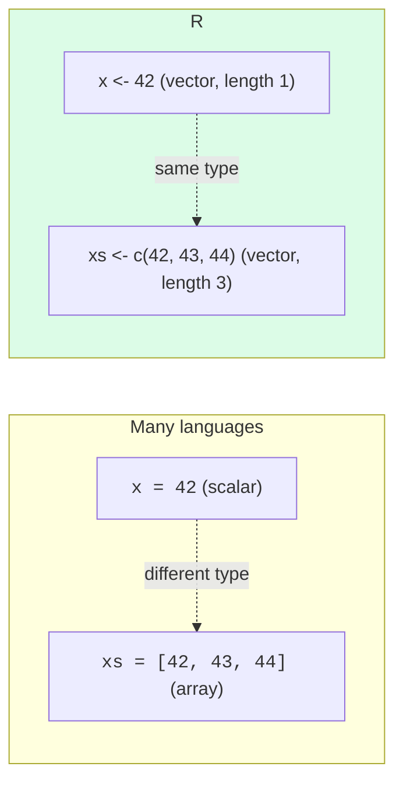
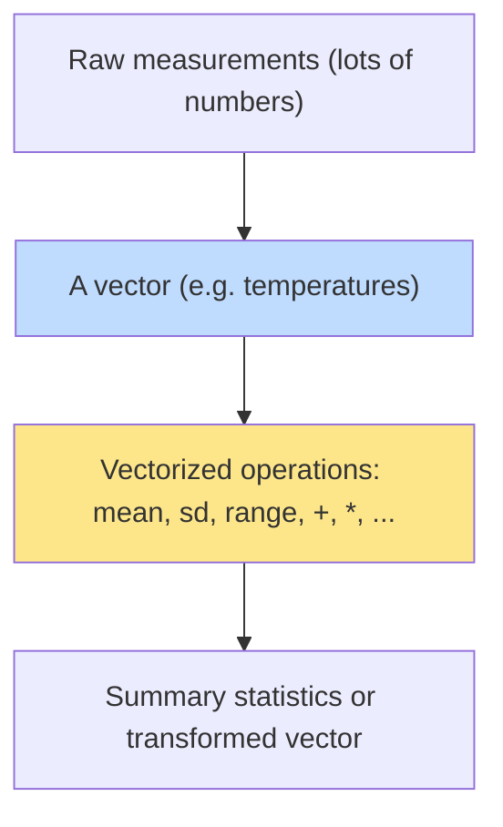

If R has a "secret," this is it: **everything is a vector.** When
you write `x <- 5`, R does *not* store a single number, it stores
a vector of length one that happens to contain the number 5. There
are no scalars hiding under the surface. The vector *is* the
fundamental unit of data in R.

This is why R is so good at data work. Most data analysis is, at
its core, "do something to every value in a column." R was built
around that operation from day one.

<svg
  viewBox="0 0 640 240"
  role="img"
  aria-label="The number five written alone points along a thin gray arrow to what R actually stores, a capsule holding a single element, stacked above longer capsules of three and six elements: in R every value is already a vector"
  style={{ display: "block", width: "100%", maxWidth: "640px", height: "auto", margin: "2.5rem auto" }}
>
  <g style={{ color: "var(--ds-blue-500)" }} fill="currentColor">
    <text x="110" y="80" fontFamily="var(--font-mono), ui-monospace, monospace" fontSize="32" fontWeight="700">5</text>
  </g>
  <g fill="var(--ds-gray-400)">
    <rect x="150" y="66.5" width="60" height="3" rx="1.5" />
    <polygon points="208,62.5 219,68 208,73.5" />
  </g>
  <g style={{ color: "var(--ds-blue-500)" }} fill="currentColor">
    <rect x="240" y="44" width="48" height="48" rx="16" fillOpacity="0.12" />
    <circle cx="264" cy="68" r="9" />
  </g>
  <g style={{ color: "var(--ds-green-500)" }} fill="currentColor">
    <rect x="240" y="116" width="128" height="44" rx="15" fillOpacity="0.12" />
    <circle cx="264" cy="138" r="9" />
    <circle cx="304" cy="138" r="9" />
    <circle cx="344" cy="138" r="9" />
  </g>
  <g style={{ color: "var(--ds-yellow-500)" }} fill="currentColor">
    <rect x="240" y="172" width="236" height="44" rx="15" fillOpacity="0.12" />
    <circle cx="264" cy="194" r="9" />
    <circle cx="302" cy="194" r="9" />
    <circle cx="340" cy="194" r="9" />
    <circle cx="378" cy="194" r="9" />
    <circle cx="416" cy="194" r="9" />
    <circle cx="454" cy="194" r="9" />
  </g>
</svg>

## Creating vectors with `c()`

The function `c()` (for *combine*) is how you build a vector by
hand:

<CodeBlock
  adapter="r"
  files={[
    {
      filename: "main.r",
      starterCode: `temperatures <- c(68, 71, 70, 74, 72, 69, 75)
print(temperatures)
length(temperatures)
`,
    },
  ]}
/>

The output starts with `[1]`. That `[1]` is the *index of the first
element shown on this line*. If the vector were long enough to
wrap across lines, you would see `[1]`, then `[8]`, then `[15]`,
and so on, R is helpfully telling you where you are in the
vector.

## Length-one vectors

The "scalar" you thought you were creating is just a vector of
length 1:

<CodeBlock
  adapter="r"
  files={[
    {
      filename: "main.r",
      starterCode: `x <- 42
print(x) # [1] 42
length(x) # [1] 1
is.vector(x) # [1] TRUE
x[1] # [1] 42, yes, you can index it
`,
    },
  ]}
/>

There is no `x` that is "the number 42." There is only `x`, which
is a vector of length one whose first element is 42.

This is not a curiosity, it's the foundation of everything that
follows. When you learn `mean(x)`, it works on length 1, length
100, or length 10 million. The same word, the same idea, every
time.

## Sequences: `:` and `seq()`

Building vectors by typing every number would be miserable. R has
shortcuts.

<CodeBlock
  adapter="r"
  files={[
    {
      filename: "main.r",
      starterCode: `# Integer range
1:10

# Same in reverse
10:1

# Arbitrary step with seq()
seq(0, 1, by = 0.1)

# Or a fixed number of values
seq(0, 100, length.out = 5)

# Repeat a pattern
rep(0, times = 5)
rep(c("yes", "no"), times = 3)
`,
    },
  ]}
/>

`:` builds an integer sequence. `seq()` is the general tool, you
either specify a step (`by =`) or a number of values
(`length.out =`). `rep()` repeats. Between these three you can
build almost any pattern you need.

## Types of vectors

A vector has a *type*. All elements share one type. The basic
ones:

| Type | Example |
| --- | --- |
| numeric (double) | `c(1.0, 2.5, -3.7)` |
| integer | `c(1L, 2L, 3L)` (the `L` makes it an integer) |
| character | `c("apple", "banana")` |
| logical | `c(TRUE, FALSE, TRUE)` |

If you try to mix types in `c()`, R will silently *coerce* them to
a common type:

<CodeBlock
  adapter="r"
  files={[
    {
      filename: "main.r",
      starterCode: `# Mixing logical + numeric -> numeric
c(TRUE, FALSE, 3)

# Mixing anything + character -> character
c(1, "two", TRUE)
`,
    },
  ]}
/>

The coercion order is: logical → integer → numeric → character.
This is sometimes surprising, `c(1, "two")` gives you the
*string* `"1"`, not the number 1. It is one of R's well-known
gotchas. The fix is to be intentional: keep one type per vector,
and use a list (`list()`) when you genuinely need mixed types.

## Indexing: get me element N (or N, M, P…)

You access elements with `[ ]`. The first element is `[1]`, not
`[0]` like in Python or JavaScript.

<CodeBlock
  adapter="r"
  files={[
    {
      filename: "main.r",
      starterCode: `days <- c("Mon", "Tue", "Wed", "Thu", "Fri", "Sat", "Sun")

days[1] # first element
days[3] # third
days[c(1, 5, 7)] # several at once, pass a vector of indices!
days[-1] # everything except the first (negative index = exclude)
days[-c(1, 7)] # everything except first and last
days[2:4] # a contiguous slice
days[length(days)] # the last element
`,
    },
  ]}
/>

Two things to notice:

1. R uses **1-based indexing**. The first element is 1. (This
   matches how mathematicians and statisticians have always
   counted things. Most "data people" find it natural.)
2. A *negative* index doesn't mean "from the end", it means
   *exclude this position*. To get the last element, use
   `days[length(days)]` or `tail(days, 1)`.

## Naming a vector's elements

You can give names to the slots in a vector. This is wildly useful
for working with tabular-ish data without making a full data
frame.

<CodeBlock
  adapter="r"
  files={[
    {
      filename: "main.r",
      starterCode: `ages <- c(alice = 30, bob = 25, carol = 41)
print(ages)

# Access by name
ages["bob"]

# Get just the names
names(ages)

# Or just the values
unname(ages)
`,
    },
  ]}
/>

Many R functions return named vectors. When you compute summary
statistics, you will see this constantly:

<CodeBlock
  adapter="r"
  files={[
    {
      filename: "main.r",
      starterCode: `summary(c(1, 2, 3, 4, 5, 100))
`,
    },
  ]}
/>

That `Min.`, `1st Qu.`, etc., are the names of the result vector.

## Why this matters: vectors *are* your data

In nearly every analysis you will ever do, your data lives as
columns. A column is a vector. The "ages" of every patient. The
"prices" of every transaction. The "temperatures" of every day.

When you learn to think in vectors, you are learning to think the
way data analysts think: in terms of *whole columns at once*,
never one element at a time.

The next page is about *operating* on vectors, and that is where R
really starts to shine.

## Test your understanding

<MultipleChoice
  markdown={`What does \`length(c("a", "b", "c"))\` return?

- \`1\`
  > \`length()\` counts the number of elements in the vector, not the number of characters; a three-element vector has length 3, not 1.
- \`2\`
  > The vector \`c("a", "b", "c")\` has three elements; there is no reason to expect 2.
- [o] \`3\`
  > The vector has three character elements.
- \`"abc"\`
  > \`length()\` returns an integer count of elements; to concatenate elements into a single string, you would use \`paste(c("a","b","c"), collapse = "")\`.`}
/>

<MultipleChoice
  markdown={`What is the value of \`c(1, "two", TRUE)\`?

- A list with three different types
  > That would be \`list(1, "two", TRUE)\`, not \`c(...)\`.
- An error
  > R does not error on mixed-type \`c()\` calls; it silently coerces all elements to the most general type present.
- [o] A character vector: \`"1" "two" "TRUE"\`
  > Mixing types with \`c()\` coerces everything to the most general type, in this case, character.
- A numeric vector: \`1 2 1\`
  > The presence of the character \`"two"\` forces coercion all the way to character, not just numeric; \`TRUE\` becomes \`"TRUE"\` and 1 becomes \`"1"\`.`}
/>

<MultipleChoice
  markdown={`Given \`x <- c(10, 20, 30, 40, 50)\`, what does \`x[-2]\` return?

*Hint: in R a negative index does not count from the end (as in some languages), it drops that position.*

- \`20\`
  > That is \`x[2]\`. A negative index does not select the second element; it removes it.
- \`40\`
  > A negative index in R does not mean "second from the end" the way it does in some other languages.
- [o] \`10 30 40 50\`
  > Negative indices in R mean *exclude this position*. \`x[-2]\` returns everything except the second element.
- \`50 40 30 10\` (reversed without the second)
  > Negative indexing removes a position but does not reverse the remaining order.`}
/>

## Mini challenge: pick out the weekdays

You're given a vector of all 7 days of the week. Use indexing to
produce a new vector `weekdays` that contains only Monday through
Friday.

<ChallengeCard
  adapter="r"
  title="Slice out weekdays"
  instructions={`Use indexing to assign \`weekdays\` to the first 5 elements of \`days\`.`}
  files={[
    {
      filename: "main.r",
      initCode: `days <- c("Mon", "Tue", "Wed", "Thu", "Fri", "Sat", "Sun")
`,
      starterCode: `# days is already defined: c("Mon", ..., "Sun")
weekdays <- NULL # replace NULL with the right slice

print(weekdays)
`,
      solutionCode: `weekdays <- days[1:5]
print(weekdays)
`,
    },
  ]}
  tests={[
    {
      id: "weekdays",
      name: "weekdays has Mon–Fri",
      description: "Length 5 and matches the first five days",
      code: `if (!identical(weekdays, c("Mon","Tue","Wed","Thu","Fri"))) stop("weekdays should be Mon..Fri")`,
    },
  ]}
/>

With vectors in hand, we're ready for the magic trick: doing
arithmetic on entire vectors at once.
