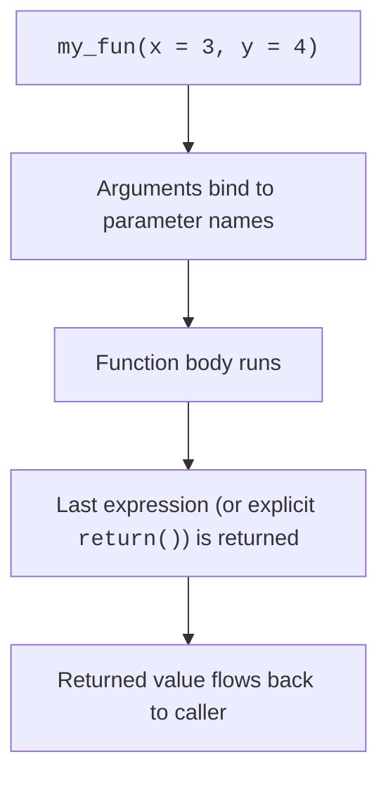

So far, almost every code block we've written has been a linear
script: do a thing, then do another thing. That works for small,
one-off analyses. But the moment you find yourself writing the
same five lines for the fifth dataset, you've hit the wall that
**functions** were invented to break through.

A function is just a *named, reusable recipe*. You package up
some logic, give it a name, declare what it needs, and from then
on you call it by name. Your analysis script reads like a story
("clean, transform, summarize, plot") instead of like the inside
of a kitchen ("chop, chop, chop, stir, stir, chop, stir, …").

<Figure
  slug="rlang-functions-cutout"
  alt="A sealed labelled machine box on a platform with an input hopper on one side and an output chute on the other"
/>

## Anatomy of a function



A function in R has four parts:

- A **name** (the variable you assign it to).
- A list of **parameters** (the names the function uses
  internally for its inputs).
- A **body** (the R code that runs).
- A **return value** (by default, the value of the last
  expression, or whatever you wrap in `return()`).

<Figure
  slug="rlang-writing-your-own-functions-inline-cutout"
  alt="A bench where a repeated set of three actions is boxed into a single crank-handled machine used three times over"
/>

The simplest possible function:

<CodeBlock
  adapter="r"
  files={[
    {
      filename: "main.r",
      starterCode: `square <- function(x) {
  x * x
}

square(3)
square(c(1, 2, 3, 4))
`,
    },
  ]}
/>

Note: because `*` is vectorized, our `square()` function also
works on whole vectors. We didn't have to write a loop.

## Defaults and named arguments

You can give parameters default values, and callers can specify
arguments by name in any order:

<CodeBlock
  adapter="r"
  files={[
    {
      filename: "main.r",
      starterCode: `greet <- function(name, greeting = "Hello") {
  paste0(greeting, ", ", name, "!")
}

greet("Ada")
greet("Bob", greeting = "Hi")
greet(name = "Cleo", greeting = "Hey")
`,
    },
  ]}
/>

Defaults are wonderful: they make the *common* case easy while
keeping the *uncommon* case possible.

## A useful, real-world function

Let's write something concrete: a function that takes a numeric
vector and returns a small named list summarizing it.

<CodeBlock
  adapter="r"
  files={[
    {
      filename: "main.r",
      starterCode: `describe <- function(x, na.rm = TRUE) {
  list(
    n      = length(x),
    n_na   = sum(is.na(x)),
    mean   = mean(x, na.rm = na.rm),
    median = median(x, na.rm = na.rm),
    sd     = sd(x, na.rm = na.rm),
    min    = min(x, na.rm = na.rm),
    max    = max(x, na.rm = na.rm)
  )
}

describe(mtcars$mpg)
describe(c(1, 2, NA, 4, 5))
`,
    },
  ]}
/>

That single function replaces ~7 lines you'd otherwise rewrite
every time you wanted a summary. The benefits compound: if you
later want to add `quantile()` or change the NA handling, you
edit one place.

## The DRY principle: Don't Repeat Yourself

Look at this code. What's the pattern?

```r
mean_mpg  <- mean(mtcars$mpg)
mean_hp   <- mean(mtcars$hp)
mean_wt   <- mean(mtcars$wt)
mean_qsec <- mean(mtcars$qsec)
```

Four nearly identical lines. The moment you have to compute one
*more* mean, you copy-paste again. That's a smell. A function
removes the repetition:

<CodeBlock
  adapter="r"
  files={[
    {
      filename: "main.r",
      starterCode: `# Compact: one function call per column you care about
means <- sapply(mtcars[, c("mpg", "hp", "wt", "qsec")], mean)
print(means)

# Or just use existing tools, colMeans does it directly:
colMeans(mtcars[, c("mpg", "hp", "wt", "qsec")])
`,
    },
  ]}
/>

**Rule of thumb:** if you see yourself typing the same shape of
code 3+ times with small variations, lift it into a function (or
find an existing one, chances are someone already wrote it).

## Functions for transformations

Functions shine in data transformation. Here's one that
standardizes a numeric vector (subtract mean, divide by SD,
useful for comparing variables on different scales):

<CodeBlock
  adapter="r"
  files={[
    {
      filename: "main.r",
      starterCode: `standardize <- function(x) {
  (x - mean(x, na.rm = TRUE)) / sd(x, na.rm = TRUE)
}

z <- standardize(mtcars$mpg)
round(head(z), 2)
cat("mean:", mean(z), " sd:", sd(z), "\\n")
`,
    },
  ]}
/>

You can now apply it to many columns:

<CodeBlock
  adapter="r"
  files={[
    {
      filename: "main.r",
      starterCode: `standardize <- function(x) (x - mean(x, na.rm = TRUE)) / sd(x, na.rm = TRUE)

z_mtcars <- as.data.frame(lapply(mtcars[, c("mpg", "hp", "wt")], standardize))
head(z_mtcars)
`,
    },
  ]}
/>

Without the function, you'd repeat the standardization
expression once per column.

## Function design tips

- **Name verbs.** Functions *do* things: `compute_*`,
  `clean_*`, `summarize_*`, `plot_*`. Avoid `f1`, `helper`,
  `do_stuff`.
- **One job per function.** A function called `load_and_clean()`
  is a code smell, split it into `load_data()` and
  `clean_data()`.
- **Keep it small.** If a function won't fit on a screen, it's
  probably trying to do too much.
- **Predictable inputs and outputs.** Document what the function
  expects and returns (even if just a comment).
- **Pure functions are easier to reason about.** A function that
  only depends on its inputs (no global state) is much easier to
  test and reuse.

## Pure vs. side-effecting

A "pure" function returns a value and changes nothing else. A
"side-effecting" function does things to the outside world
(prints, plots, writes a file, modifies a global). Both are
useful, but mixing them inside one function makes code hard to
reason about:

```r
# Mixed concerns, hard to reuse
analyze_and_print <- function(x) {
  result <- mean(x) / sd(x)
  cat("Result is:", result, "\\n")  # side effect
  result
}
```

Better to separate:

<CodeBlock
  adapter="r"
  files={[
    {
      filename: "main.r",
      starterCode: `# Pure: just computes and returns
signal_to_noise <- function(x) {
  mean(x, na.rm = TRUE) / sd(x, na.rm = TRUE)
}

# Side-effecting wrapper if you also want to print
report_snr <- function(x, label = "x") {
  s <- signal_to_noise(x)
  cat(sprintf("%s: signal/noise = %.3f\\n", label, s))
  invisible(s)
}

report_snr(mtcars$mpg, "mpg")
report_snr(mtcars$hp, "hp")
`,
    },
  ]}
/>

`invisible()` returns a value without auto-printing, useful
when the caller might or might not want it.

## Scope, briefly

Variables created inside a function live *only* inside it. They
don't leak out to your global environment:

<CodeBlock
  adapter="r"
  files={[
    {
      filename: "main.r",
      starterCode: `temp_var_in_global <- "I exist out here"

scoped <- function() {
  temp_var_in_global <- "I'm only inside the function"
  temp_var_in_global
}

cat(scoped(), "\\n")
cat(temp_var_in_global, "\\n") # unchanged
`,
    },
  ]}
/>

This isolation is a feature: it prevents functions from
silently breaking each other. Variables you want to share across
the analysis live in the global environment; everything else
stays local.

## Test your understanding

<MultipleChoice
  markdown={`A function in R returns:

- A list of all its expressions.
  > Only one value is returned; to return multiple values you must explicitly pack them into a list and return that list.
- The first expression.
  > R evaluates all expressions in the function body in order and returns the *last* one, not the first.
- Nothing, only \`return()\` returns.
  > \`return()\` is optional in R; a function automatically returns the value of its last evaluated expression even without an explicit \`return()\` call.
- [o] The value of its last expression by default, or an explicit \`return()\` value if you use one.
  > Many idiomatic R functions just end with the value to return.`}
/>

<MultipleChoice
  markdown={`Why is the DRY ("Don't Repeat Yourself") principle especially valuable in analysis code?

- Functions run faster than inline code.
  > In R, calling a function does not inherently make code faster than equivalent inline expressions; performance depends on what the code does, not whether it is wrapped in a function.
- It saves typing.
  > Saving keystrokes is a side effect, not the core reason; the real value is that a single change in one function propagates correctly everywhere it is called.
- It makes scripts shorter.
  > Shorter code is a byproduct, not the primary motivation; the main gain is that there is only one place to change and verify when requirements evolve.
- [o] Every duplication is a place a bug can hide and a place you'll have to remember to update, lifting repeated logic into a function gives you one place to fix it and one place to test.
  > Fewer redundant lines = fewer ways for the code to drift out of sync with itself.`}
/>

<MultipleChoice
  markdown={`Which is the best name for a function that computes a standardized z-score from a numeric vector?

- \`do_thing\`
  > Vague verb names like \`do_thing\` describe the fact that *something* happens but give no information about what it computes.
- \`x_value\`
  > \`x_value\` sounds like a variable holding a value, not a function that performs a transformation; noun-style names mislead the reader.
- [o] \`standardize\`
  > Function names should be verbs that describe what the function *does*.
- \`f\`
  > Single-letter names convey no meaning; a reader cannot tell what the function does from its name alone.`}
/>

## Mini challenge: write a `summarize_group` function

Write a function called `summarize_group(x)` that takes a
numeric vector and returns a **named list** with elements
`n`, `mean`, and `sd`. Use `na.rm = TRUE` for both the mean and
the SD.

<ChallengeCard
  adapter="r"
  title="Build summarize_group()"
  instructions={`Define \`summarize_group <- function(x) { ... }\` so that calling it on a numeric vector returns a list with elements \`n\` (length), \`mean\` (mean, ignoring NAs), and \`sd\` (sd, ignoring NAs).`}
  files={[
    {
      filename: "main.r",
      starterCode: `summarize_group <- function(x) {
  # TODO: return list(n = ..., mean = ..., sd = ...)
}

summarize_group(c(1, 2, NA, 4, 5))
`,
      solutionCode: `summarize_group <- function(x) {
  list(
    n    = length(x),
    mean = mean(x, na.rm = TRUE),
    sd   = sd(x, na.rm = TRUE)
  )
}

summarize_group(c(1, 2, NA, 4, 5))
`,
    },
  ]}
  tests={[
    {
      id: "isfun",
      name: "summarize_group is a function",
      code: `if (!is.function(summarize_group)) stop("summarize_group must be a function")`,
    },
    {
      id: "shape",
      name: "Returns named list with n, mean, sd",
      code: `r <- summarize_group(c(1,2,3,4,5)); if (!is.list(r) || !all(c("n","mean","sd") %in% names(r))) stop("return value must be a list with elements n, mean, sd")`,
    },
    {
      id: "values",
      name: "Values are correct (no NAs)",
      code: `r <- summarize_group(c(1,2,3,4,5)); if (r$n != 5 || abs(r$mean - 3) > 1e-9 || abs(r$sd - sd(c(1,2,3,4,5))) > 1e-9) stop("values are off")`,
    },
    {
      id: "nas",
      name: "Handles NAs correctly",
      code: `r <- summarize_group(c(1,2,NA,4,5)); if (r$n != 5 || abs(r$mean - 3) > 1e-9) stop("with NAs, n should still be length (5) and mean should use na.rm=TRUE (3)")`,
    },
  ]}
/>

Functions are the building block of every reusable analysis.
On the next page, we'll zoom out one more level: **scripts and
projects**, how to organize a real analysis on disk so future-
you (and your collaborators) can actually run it.
