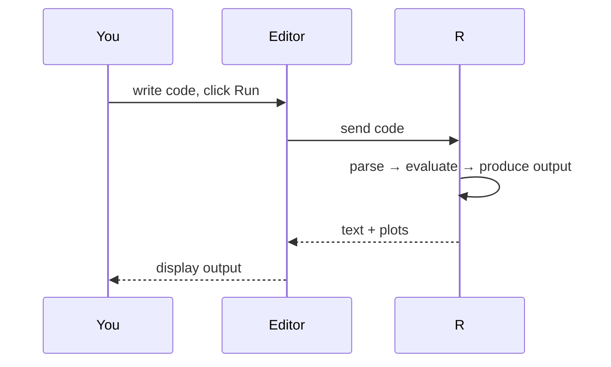
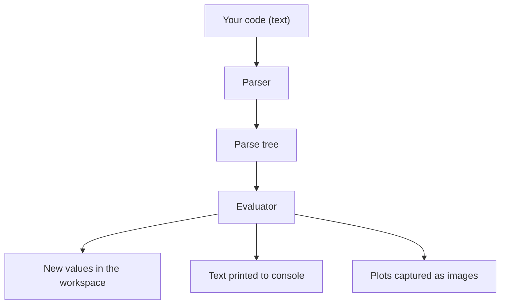

Let us run R for the first time.

You do not have to install anything. The code block below is a
fully functional R session, running in your browser. Click **Run**.

<CodeBlock
  adapter="r"
  files={[
    {
      filename: "main.r",
      starterCode: `print("Hello, R!")
`,
    },
  ]}
/>

When you ran that, several things happened invisibly:

1. R compiled your line of code.
2. It looked up the name `print` and found it refers to a built-in
   function.
3. It evaluated the string `"Hello, R!"` (which is a piece of
   "character data").
4. It called the function on the data.
5. The function wrote `"Hello, R!"` to the output stream.
6. WebR captured that and showed it to you.

That whole cycle happens every time you run code. Once you have
internalized that this is what a "run" is, R becomes much less
mysterious.

<Figure
  slug="rlang-first-program-cutout"
  alt="The Dataslope marmot mascot beside a small console panel showing a single glowing prompt caret, one output ribbon curling from its base"
/>

## What is "the prompt"?

If you were running R locally in a terminal, you would see
something like:

```text
R version 4.5.0 (2025-04-11) -- "Spring Renaissance"
Copyright (C) 2025 The R Foundation for Statistical Computing
Platform: x86_64-pc-linux-gnu (64-bit)
> 
```

The `>` is the **R prompt**. It is R saying "I am ready for an
instruction." You type one, press Enter, and R either evaluates it
and shows the result, or prints an error.

In WebR, we replace the prompt with a friendly code editor, but
the semantics are the same. Each time you click **Run**, R reads
your code, evaluates it top to bottom, and prints the output.



## Two kinds of "output"

R has a slightly unusual habit. There are two ways something can
appear in the output area:

1. **Printing explicitly**, with `print()` or `cat()`.
2. **Auto-printing**, which happens when you type an expression and
   do not assign it.

Both are useful; they are easy to confuse at first.

<CodeBlock
  adapter="r"
  files={[
    {
      filename: "main.r",
      starterCode: `# Auto-printing: the result of an unassigned expression is shown
1 + 1

# Explicit printing: same effect, but you typed the verb
print(2 + 2)

# Assignment: NO automatic output, result is stored, not shown
x <- 3 + 3

# Now explicitly show what's in x
print(x)
`,
    },
  ]}
/>

Notice the third line, `x <- 3 + 3`. Nothing appeared in the
output, because the *value* of that expression was assigned to a
name (`x`) instead of being printed. This is the most common
"why didn't anything happen?" confusion for beginners. The answer
is always: it *did* happen, you just stored the result.

## The two ways to print: `print()` versus `cat()`

R inherits these two siblings from S, and they behave slightly
differently.

`print()` shows the value with its R-style formatting (vectors get
index hints like `[1]`, strings appear in quotes, etc.). It is
designed for *interactive inspection*.

`cat()` concatenates its arguments into a plain string and writes
it. It is designed for *making readable output*.

<CodeBlock
  adapter="r"
  files={[
    {
      filename: "main.r",
      starterCode: `# print() gives you R-style display
print("Hello, R!")
print(c(1, 2, 3))

# cat() makes nicer messages for humans
cat("The answer is", 42, "\\n")

# Mix variables into a sentence
city <- "Auckland"
temp <- 17.5
cat("In", city, "today it is", temp, "degrees.\\n")
`,
    },
  ]}
/>

Use `print()` when you want to *inspect* a value. Use `cat()` when
you want to *write a sentence*. As a rule of thumb: if you are
building a message with multiple pieces, use `cat()`.

The `"\n"` is a **newline** character, without it, multiple
`cat()` calls would all run together on a single line.

## Comments

Anything after a `#` on a line is a **comment**, R ignores it.
Comments are notes you leave for the next human to read your code
(often yourself, three months from now).

<CodeBlock
  adapter="r"
  files={[
    {
      filename: "main.r",
      starterCode: `# This whole line is a comment
x <- 10 # this part of the line is a comment, too

# Comments are how you explain *why*, not just *what*
# Bad: "set x to 10"
# Good: "x = number of patients in the trial"
n_patients <- 10

cat("There are", n_patients, "patients.\\n")
`,
    },
  ]}
/>

A good general rule: code should describe *what* you are doing
through naming, and comments should explain *why* you are doing it.
You will see this throughout the course.

## Errors are friendly (most of the time)

R will tell you when it does not understand. Most of the time the
message is helpful, if a bit terse.

<CodeBlock
  adapter="r"
  files={[
    {
      filename: "main.r",
      starterCode: `# Misspelled function name
prnt("hello")
`,
    },
  ]}
/>

That should produce an error like:

```text
Error in prnt("hello") : could not find function "prnt"
```

The message tells you:
- *Where* the problem is (`in prnt("hello")`).
- *What* the problem is (`could not find function "prnt"`).

Try fixing it:

<CodeBlock
  adapter="r"
  files={[
    {
      filename: "main.r",
      starterCode: `# Fix me!
prnt("hello")
`,
    },
  ]}
/>

Errors are not a sign you have failed; they are a sign R is
helping you. You will read a lot of error messages over the years.
The good news: they get easier with practice, and Googling the
exact text of an R error almost always finds the answer.

## What R is doing under the hood

When you click **Run**, the WebR runtime does roughly this:



Nothing more, nothing less. There is no "code review fairy" who
fixes things. There is no AI inferring what you meant. R does
exactly what you write, and reports exactly what happened.

This is **simultaneously the wonderful and the scary thing** about
programming: the machine is rigorously, mercilessly literal.

## A small program that does something real

Let's combine everything so far into a one-screen program. We
will compute a heart-health summary for a small group of people.

<CodeBlock
  adapter="r"
  files={[
    {
      filename: "main.r",
      starterCode: `# Tiny health checkup program

names <- c("Alice", "Bob", "Carmen", "Dario")
heights <- c(165, 178, 170, 182) # cm
weights <- c(60, 85, 72, 95) # kg

# Body Mass Index = weight (kg) / height (m)^2
bmi <- weights / (heights / 100)^2

# Round to 1 decimal for readability
bmi <- round(bmi, 1)

# Show a summary line for each person
for (i in seq_along(names)) {
  status <- if (bmi[i] < 18.5) {
    "underweight"
  } else if (bmi[i] < 25) {
    "healthy"
  } else if (bmi[i] < 30) {
    "overweight"
  } else {
    "obese"
  }
  cat(names[i], "-- BMI:", bmi[i], "(", status, ")\\n")
}
`,
    },
  ]}
/>

That tiny program already does several things characteristic of
data analysis: defines named columns, applies a vectorized
calculation (`bmi <- weights / (heights / 100)^2`), and walks
through results to print human-readable output.

Notice that the BMI calculation itself is vectorized, *no loop
was needed* to compute the four BMIs. The loop only appeared when
we wanted to print four different sentences. This is the texture
of real R code: vectorize the math, loop only when you really need
per-element behavior.

## Test your understanding

<MultipleChoice
  markdown={`Which of these lines shows output by **auto-printing**, i.e. without an explicit print call?

- \`x <- 5\`
  > Assignment produces no automatic output, the result is stored, not printed.
- [o] \`5 + 3\`
  > An unassigned expression auto-prints its result.
- \`# print("hello")\`
  > That is a comment, everything after \`#\` is ignored.
- \`print(5)\`
  > This does show output, but through an explicit \`print()\` call rather than auto-printing.`}
/>

<MultipleChoice
  markdown={`Which of these lines shows output through an **explicit** print call?

- \`x <- 5\`
  > Assignment produces no automatic output, the result is stored, not printed.
- \`5 + 3\`
  > This does show output, but by auto-printing an unassigned expression, there is no explicit call.
- \`# print("hello")\`
  > That is a comment, everything after \`#\` is ignored.
- [o] \`print(5)\`
  > \`print()\` explicitly outputs its argument.`}
/>

<MultipleChoice
  markdown={`What is the difference between \`print()\` and \`cat()\`?

- They are identical.
  > \`print()\` adds R-style formatting (e.g., \`[1]\` index hints and quotes around strings), while \`cat()\` outputs its arguments as plain text with no decorations.
- [o] \`print()\` formats values in R-style for inspection; \`cat()\` concatenates arguments into a plain string for building human-readable messages.
  > Use \`print()\` to inspect a value, \`cat()\` to compose a sentence.
- \`print()\` writes to a file; \`cat()\` writes to the screen.
  > Both \`print()\` and \`cat()\` write to the console by default; to write to a file, \`cat()\` accepts a \`file =\` argument, and \`sink()\` can redirect \`print()\` output.
- \`cat()\` is the modern replacement for \`print()\`.
  > Neither function is deprecated; they serve different purposes and both remain in active use.`}
/>

<MultipleChoice
  markdown={`Why does this code produce no output?

\`\`\`r
result <- 2 + 2
\`\`\`

- Because R does not handle integer arithmetic.
  > R handles integer and floating-point arithmetic without issue; \`2 + 2\` evaluates to \`4\` correctly, the result is simply stored silently.
- [o] Because the result of the expression was assigned to the variable \`result\` instead of being printed.
  > Assignment is silent. To see the value, add a separate line: \`print(result)\` or just \`result\`.
- Because of a parsing error.
  > \`result <- 2 + 2\` is syntactically valid R; it assigns 4 to \`result\` without producing any output.
- Because R only prints character strings.
  > R auto-prints numeric values just as readily as character ones; the reason there is no output here is the assignment, not the type.`}
/>

## Mini challenge: write a tiny program

Write a short program that defines two vectors, `cities` (a
character vector) and `temperatures_c` (a numeric vector of
celsius temperatures of the same length), and prints one line
per city in the format:

```text
<city>: <temp> C / <temp_f> F
```

…where `<temp_f>` is the Fahrenheit equivalent, rounded to 1
decimal. Use the formula `F = C * 9/5 + 32`.

<ChallengeCard
  adapter="r"
  title="Print a city/temperature table"
  instructions={`Given the vectors \`cities\` and \`temperatures_c\` (already loaded), print one line per city in the format \`<city>: <temp> C / <temp_f> F\`. Make sure \`temp_f\` is rounded to **1** decimal place.`}
  files={[
    {
      filename: "main.r",
      initCode: `cities         <- c("Auckland", "Tokyo", "Reykjavik", "Cairo")
temperatures_c <- c(17.5, 24.0, 3.1, 35.6)`,
      starterCode: `# Your code here
`,
      solutionCode: `temperatures_f <- round(temperatures_c * 9 / 5 + 32, 1)
for (i in seq_along(cities)) {
  cat(cities[i], ": ", temperatures_c[i], " C / ", temperatures_f[i], " F\\n", sep = "")
}
`,
    },
  ]}
  tests={[
    {
      id: "temperatures_f",
      name: "Defines temperatures_f rounded to 1 decimal",
      description: "Should be a numeric vector of Fahrenheit values rounded to 1 decimal",
      code: `expected <- round(temperatures_c * 9/5 + 32, 1); if (!exists("temperatures_f")) stop("define temperatures_f using round(temperatures_c * 9/5 + 32, 1)"); if (!isTRUE(all.equal(as.numeric(temperatures_f), as.numeric(expected)))) stop("temperatures_f values do not match the expected conversion")`,
    },
  ]}
/>

In the next page we'll get more comfortable with R as the world's
most powerful pocket calculator, before moving on to variables.
