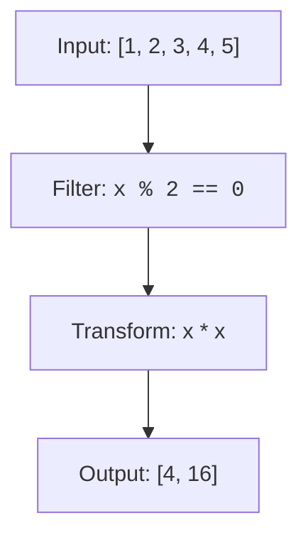

A **comprehension** is a compact way to build a list, dict, set, or generator by transforming and filtering an iterable. Comprehensions are arguably the most Pythonic feature in the language. They turn "loop over this, filter that, transform these" into a single readable expression. Once you internalize the pattern, you will reach for them constantly in data pipelines, API response shaping, config munging, and anywhere you transform collections.

<Figure
  slug="python-basics-comprehensions-cutout"
  alt="An isometric assembly press folding a row of loose blocks into one stacked tray"
/>

Every snippet on this page runs in your browser, no setup required.

## Real-world impact

Comprehensions are everywhere in production Python. Every data pipeline maps and filters rows with comprehensions. Every web API shapes JSON responses with dict comprehensions. Every script that processes files uses comprehensions to filter and transform lines. Mastering comprehensions means writing clearer, faster, more maintainable code.



## List comprehensions: basics

The general form:

```text
[expression for item in iterable if condition]
```

<CodeBlock
  adapter="python"
  files={[
    {
      filename: "main.py",
      starterCode: `squares = [x * x for x in range(1, 6)]
print(squares)
`,
    },
  ]}
/>

<CodeBlock
  adapter="python"
  files={[
    {
      filename: "main.py",
      starterCode: `evens = [x for x in range(20) if x % 2 == 0]
print(evens)
`,
    },
  ]}
/>

<CodeBlock
  adapter="python"
  files={[
    {
      filename: "main.py",
      starterCode: `upper = [w.upper() for w in ["a", "b", "c"]]
print(upper)
`,
    },
  ]}
/>

A list comprehension is equivalent to:

```python
result = []
for x in iterable:
    if condition:
        result.append(expression)
```

The comprehension is usually preferable because it states *what* you want rather than *how*. It is also often faster because the loop is optimized at the C level.

<Figure
  slug="python-comprehensions-list-comprehensions-basics-inline-cutout"
  alt="One compact machine taking a rail of blocks and returning a new rail in a single pass"
  caption="A comprehension states the whole transformation in one pass, not step by step."
/>

## List comprehensions: with filter

The `if` clause is optional.

<CodeBlock
  adapter="python"
  files={[
    {
      filename: "main.py",
      starterCode: `nums = [1, 2, 3, 4, 5, 6, 7, 8, 9, 10]
evens = [x for x in nums if x % 2 == 0]
print(evens)
`,
    },
  ]}
/>

<CodeBlock
  adapter="python"
  files={[
    {
      filename: "main.py",
      starterCode: `words = ["apple", "banana", "cherry", "date"]
long_words = [w for w in words if len(w) > 5]
print(long_words)
`,
    },
  ]}
/>

You can combine transformation and filtering.

<CodeBlock
  adapter="python"
  files={[
    {
      filename: "main.py",
      starterCode: `nums = [1, 2, 3, 4, 5]
doubled_evens = [x * 2 for x in nums if x % 2 == 0]
print(doubled_evens)
`,
    },
  ]}
/>

## List comprehensions: nested loops

Multiple `for` clauses behave like nested loops, left to right.

<Figure
  slug="python-comprehensions-inline-cutout"
  alt="A long assembly of three separate machines on the left collapsing into one compact machine on the right doing the same job"
  caption="Nested loops that build a list collapse into a single comprehension."
/>

<CodeBlock
  adapter="python"
  files={[
    {
      filename: "main.py",
      starterCode: `pairs = [(x, y) for x in range(3) for y in range(3)]
print(pairs)
`,
    },
  ]}
/>

<CodeBlock
  adapter="python"
  files={[
    {
      filename: "main.py",
      starterCode: `pairs = [(x, y) for x in range(3) for y in range(3) if x != y]
print(pairs)
`,
    },
  ]}
/>

Nested comprehensions are useful for flattening lists.

<CodeBlock
  adapter="python"
  files={[
    {
      filename: "main.py",
      starterCode: `nested = [[1, 2], [3, 4], [5, 6]]
flat = [n for row in nested for n in row]
print(flat)
`,
    },
  ]}
/>

<Callout type="warn" title="Readability ceiling">
Comprehensions are powerful, but stacking too much logic into one makes for unreadable code. Rule of thumb: up to one `for` and one `if` is usually fine. More than that, or a complex expression, and you should write a loop. Comprehensions are for clarity, not cleverness.
</Callout>

## Dict comprehensions

Use `{key: value for ...}` to build a dict.

<CodeBlock
  adapter="python"
  files={[
    {
      filename: "main.py",
      starterCode: `squares_map = {x: x * x for x in range(1, 6)}
print(squares_map)
`,
    },
  ]}
/>

<CodeBlock
  adapter="python"
  files={[
    {
      filename: "main.py",
      starterCode: `prices = {"apple": 1.0, "banana": 0.5, "cherry": 3.0}
expensive = {fruit: price for fruit, price in prices.items() if price >= 1.0}
print(expensive)
`,
    },
  ]}
/>

Inverting a dict is a one-liner.

<CodeBlock
  adapter="python"
  files={[
    {
      filename: "main.py",
      starterCode: `prices = {"apple": 1.0, "banana": 0.5, "cherry": 3.0}
inverted = {v: k for k, v in prices.items()}
print(inverted)
`,
    },
  ]}
/>

Dict comprehensions are especially useful when reshaping API responses or config files.

<CodeBlock
  adapter="python"
  files={[
    {
      filename: "main.py",
      starterCode: `# Normalize keys to lowercase
raw = {"Name": "Ada", "Year": 1815}
normalized = {k.lower(): v for k, v in raw.items()}
print(normalized)
`,
    },
  ]}
/>

## Set comprehensions

Use `{expression for ...}` to build a set.

<Figure
  slug="python-comprehensions-real-world-impact-inline-cutout"
  alt="A long assembly of three machines collapsing into one compact machine doing the same job"
  caption="The same collapse works for sets and dicts, not only for lists."
/>

<CodeBlock
  adapter="python"
  files={[
    {
      filename: "main.py",
      starterCode: `vowels = {c for c in "hello world" if c in "aeiou"}
print(vowels)
`,
    },
  ]}
/>

<CodeBlock
  adapter="python"
  files={[
    {
      filename: "main.py",
      starterCode: `nums = [1, 2, 2, 3, 3, 3]
unique = {x for x in nums}
print(unique)
`,
    },
  ]}
/>

Set comprehensions automatically deduplicate, just like constructing `set([...])` would.

## Generator expressions

Drop the brackets and you get a **generator expression** instead. It produces items lazily, one at a time, which is great for memory efficiency.

<CodeBlock
  adapter="python"
  files={[
    {
      filename: "main.py",
      starterCode: `# List comprehension allocates the full list up front.
list_total = sum([x * x for x in range(1_000_000)])
print("list total:", list_total)
`,
    },
  ]}
/>

<CodeBlock
  adapter="python"
  files={[
    {
      filename: "main.py",
      starterCode: `# Generator expression streams one square at a time.
gen_total = sum(x * x for x in range(1_000_000))
print("gen total:", gen_total)
`,
    },
  ]}
/>

The results are identical, but the generator uses O(1) memory while the list uses O(n).

<Callout type="info" title="Generator vs list memory">
A list comprehension builds the entire list in memory before you can use it. A generator expression produces values on demand, one at a time. If you only need to iterate once (e.g., in `sum`, `max`, `any`, `all`), use a generator. If you need to iterate multiple times or slice the result, use a list.
</Callout>

When a generator expression is the only argument to a function, the inner parentheses can be dropped:

<CodeBlock
  adapter="python"
  files={[
    {
      filename: "main.py",
      starterCode: `total = sum(x * x for x in range(10))
print(total)
`,
    },
  ]}
/>

This is equivalent to `sum((x * x for x in range(10)))` but cleaner.

## When to use each form

| Form | Use when |
| --- | --- |
| List comprehension `[...]` | You need the full list, or will iterate multiple times |
| Dict comprehension `{k: v ...}` | Building or transforming dicts |
| Set comprehension `{...}` | Building a set, deduplication is important |
| Generator expression `(...)` | One-time iteration, memory efficiency matters |

## Challenges

<ChallengeCard
  adapter="python"
  title="Squares of even numbers"
  instructions={`Define \`even_squares(n)\` that returns a list of the squares of every even number from 0 to \`n-1\`, in order. Use a single list comprehension.`}
  files={[
    {
      filename: "main.py",
      starterCode: `def even_squares(n):
    # your code here
    return []
`,
      solutionCode: `def even_squares(n):
    return [x * x for x in range(n) if x % 2 == 0]
`,
    },
  ]}
  tests={[
    {
      id: "ten",
      name: "even_squares(10)",
      code: `assert even_squares(10) == [0, 4, 16, 36, 64]`,
    },
    {
      id: "zero",
      name: "even_squares(0)",
      code: `assert even_squares(0) == []`,
    },
    {
      id: "one",
      name: "even_squares(1)",
      code: `assert even_squares(1) == [0]`,
    },
  ]}
/>

<ChallengeCard
  adapter="python"
  title="Group words by length"
  instructions={`Define \`group_by_length(words)\` that returns a dict mapping each word length to a list of words with that length, preserving the input order within each group.

For example, \`group_by_length(["a", "bb", "cc", "d"])\` returns \`{1: ["a", "d"], 2: ["bb", "cc"]}\`.

A regular loop is fine here; you do not have to use a single comprehension.`}
  files={[
    {
      filename: "main.py",
      starterCode: `def group_by_length(words):
    # your code here
    return {}
`,
      solutionCode: `def group_by_length(words):
    out = {}
    for w in words:
        out.setdefault(len(w), []).append(w)
    return out
`,
    },
  ]}
  tests={[
    {
      id: "basic",
      name: "Basic case",
      code: `assert group_by_length(["a", "bb", "cc", "d"]) == {1: ["a", "d"], 2: ["bb", "cc"]}`,
    },
    {
      id: "empty",
      name: "Empty input",
      code: `assert group_by_length([]) == {}`,
    },
    {
      id: "single_group",
      name: "All same length",
      code: `assert group_by_length(["ab", "cd", "ef"]) == {2: ["ab", "cd", "ef"]}`,
    },
  ]}
/>

<ChallengeCard
  adapter="python"
  title="Cartesian product pairs"
  instructions={`Define \`cartesian(a, b)\` that returns a list of all \`(x, y)\` pairs where \`x\` is from list \`a\` and \`y\` is from list \`b\`, in the order produced by nested loops. Use a single list comprehension with two \`for\` clauses.

For example, \`cartesian([1, 2], ["a", "b"])\` returns \`[(1, "a"), (1, "b"), (2, "a"), (2, "b")]\`.`}
  files={[
    {
      filename: "main.py",
      starterCode: `def cartesian(a, b):
    # your code here
    return []
`,
      solutionCode: `def cartesian(a, b):
    return [(x, y) for x in a for y in b]
`,
    },
  ]}
  tests={[
    {
      id: "basic",
      name: "Basic case",
      code: `assert cartesian([1, 2], ["a", "b"]) == [(1, "a"), (1, "b"), (2, "a"), (2, "b")]`,
    },
    {
      id: "empty_a",
      name: "Empty first list",
      code: `assert cartesian([], ["a"]) == []`,
    },
    {
      id: "empty_b",
      name: "Empty second list",
      code: `assert cartesian([1], []) == []`,
    },
  ]}
/>

<MultipleChoice
  markdown={`What does \`[x * 2 for x in range(4) if x % 2]\` evaluate to?

- \`[1, 3]\`
  > The expression is \`x * 2\`, not \`x\`.
- [o] \`[2, 6]\`
  > \`x % 2\` is truthy for odd \`x\` (1, 3), so we keep \`2*1\` and \`2*3\`.
- \`[0, 2, 4, 6]\`
  > That would be without the \`if\`.
- \`[0, 4]\`
  > The \`if x % 2\` filters for odd numbers, not even.`}
/>

<MultipleChoice
  markdown={`Which of the following produces the same result as \`[x*x for x in range(5)]\`?

- [o] \`list(x*x for x in range(5))\`
  > Converting the generator to a list gives the same result.
- \`{x: x*x for x in range(5)}\`
  > That is a dict comprehension, not a list.
- \`{x*x for x in range(5)}\`
  > That is a set comprehension, not a list.
- \`(x*x for x in range(5))\`
  > That is a generator expression, not a list.`}
/>

<MultipleChoice
  markdown={`What is the key advantage of a generator expression over a list comprehension?

- [o] Generators use O(1) memory regardless of input size.
  > Generators produce items lazily, one at a time.
- Generators automatically deduplicate.
  > Generators do not deduplicate; that is what sets do.
- Generators are always faster.
  > Not always, list access is O(1), generator iteration has per-item overhead.
- Generators support slicing.
  > Generators do **not** support slicing; lists do.`}
/>

<MultipleChoice
  markdown={`What does this nested comprehension produce?

\`\`\`python
[x + y for x in [1, 2] for y in [10, 20]]
\`\`\`

- \`[11, 22]\`
  > That would pair the lists element-wise (like \`zip\`), not form every combination.
- \`[11, 12, 21, 22]\`
  > That would be if \`y\` were the outer loop.
- [o] \`[11, 21, 12, 22]\`
  > The outer loop is \`x\`, the inner loop is \`y\`.
- \`[30, 40]\`
  > That would be summing the lists, not the Cartesian product.`}
/>

You can now turn raw iterables into shaped data in one line. Functions are next.
