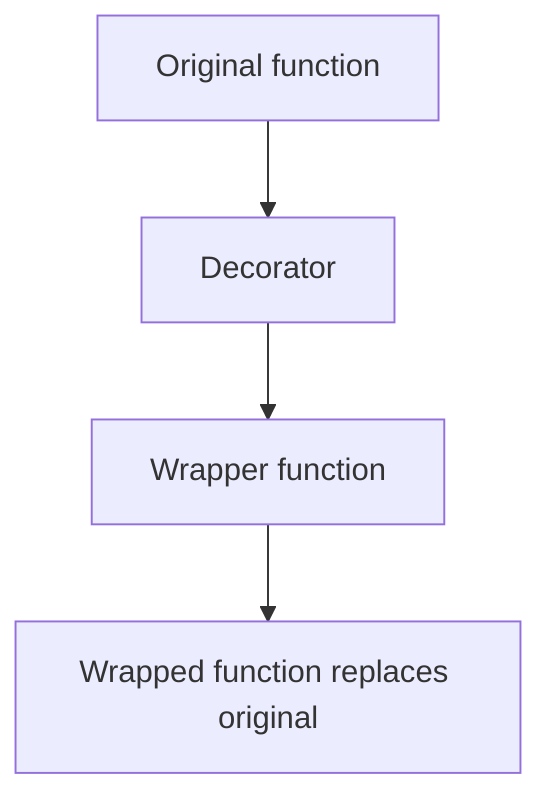

A **decorator** is just a function that takes another function and returns a new one. The `@decorator` syntax is sugar for that pattern. Decorators power Flask's `@app.route`, Django's `@login_required`, dataclasses, `@property`, caching, logging, retry logic, and countless other patterns in production Python.

<Figure
  slug="python-basics-decorators-cutout"
  alt="The Dataslope marmot tying a ribbon and bow around a gift box that contains a smaller box"
/>

<Callout type="info" title="Real-world ubiquity">
Open any modern Python codebase and you'll see decorators everywhere: \`@app.route("/users")\` in Flask/FastAPI, \`@cache\` for memoization, \`@dataclass\` to auto-generate boilerplate, \`@staticmethod\` and \`@classmethod\` in classes, \`@timing\` and \`@retry\` in production services. Understanding decorators means understanding how most Python frameworks work under the hood.
</Callout>

## Closures recap

Before decorators, a quick reminder: a **closure** is a function that captures variables from its enclosing scope:

<CodeBlock
  adapter="python"
  files={[
    {
      filename: "main.py",
      starterCode: `def outer(x):
    def inner(y):
        return x + y

    return inner

add_five = outer(5)
print(add_five(10))  # 15
print(add_five(20))  # 25
`,
    },
  ]}
/>

`inner` "closes over" `x` from `outer`. Even after `outer` returns, `inner` remembers `x=5`. Decorators use this pattern to wrap functions.

## The minimal decorator

<CodeBlock
  adapter="python"
  files={[
    {
      filename: "main.py",
      starterCode: `def shout(fn):
    def wrapper(*args, **kwargs):
        result = fn(*args, **kwargs)
        return result.upper()

    return wrapper

@shout
def greet(name):
    return f"hello, {name}"

print(greet("Ada"))
`,
    },
  ]}
/>

The `@shout` line is syntactic sugar for:

```python
def greet(name):
    return f"hello, {name}"

greet = shout(greet)
```

The decorator `shout` takes the original `greet`, wraps it in a new function that uppercases the result, and replaces `greet` with that wrapper.



## Preserve metadata with `functools.wraps`

Without `wraps`, the wrapped function loses its name, docstring, and signature:

<CodeBlock
  adapter="python"
  files={[
    {
      filename: "main.py",
      starterCode: `def shout(fn):
    def wrapper(*args, **kwargs):
        return fn(*args, **kwargs).upper()

    return wrapper

@shout
def greet(name):
    """Return a greeting."""
    return f"hello, {name}"

print(greet.__name__)  # 'wrapper' -- wrong!
print(greet.__doc__)  # None -- lost!
`,
    },
  ]}
/>

<Figure
  slug="python-decorators-preserve-metadata-functools-inline-cutout"
  alt="A machine wrapped in a frame with its original blank name plate carried through onto the frame's face"
  caption="`functools.wraps()` carries the original function's name onto the wrapper."
/>

**Always** use `functools.wraps` in real decorators:

<CodeBlock
  adapter="python"
  files={[
    {
      filename: "main.py",
      starterCode: `from functools import wraps

def shout(fn):
    @wraps(fn)
    def wrapper(*args, **kwargs):
        return fn(*args, **kwargs).upper()

    return wrapper

@shout
def greet(name):
    """Return a greeting."""
    return f"hello, {name}"

print(greet.__name__)  # 'greet' -- correct!
print(greet.__doc__)  # 'Return a greeting.' -- preserved!
`,
    },
  ]}
/>

<Callout type="warn" title="ALWAYS use functools.wraps">
Tools, debuggers, and stack traces rely on \`__name__\`, \`__doc__\`, and \`__module__\`. Without \`@wraps(fn)\`, your wrapper will show up as "wrapper" in tracebacks, and introspection tools (like \`help()\`) will fail. This is the #1 decorator mistake beginners make.
</Callout>

## A useful example: timing

<CodeBlock
  adapter="python"
  files={[
    {
      filename: "main.py",
      starterCode: `import time
from functools import wraps

def timed(fn):
    @wraps(fn)
    def wrapper(*args, **kwargs):
        start = time.perf_counter()
        result = fn(*args, **kwargs)
        elapsed_ms = (time.perf_counter() - start) * 1000
        print(f"{fn.__name__} took {elapsed_ms:.2f} ms")
        return result

    return wrapper

@timed
def slow_square(n):
    total = 0
    for i in range(n):
        total += i * i
    return total

print(slow_square(100_000))
`,
    },
  ]}
/>

This pattern is everywhere in production: timing, logging arguments, checking permissions, retrying on failure, caching results.

## Decorators with arguments (decorator factories)

If your decorator needs parameters, you need **three** levels of nesting. The outermost function takes the decorator's arguments and returns the real decorator:

<CodeBlock
  adapter="python"
  files={[
    {
      filename: "main.py",
      starterCode: `from functools import wraps

def repeat(times):
    def decorator(fn):
        @wraps(fn)
        def wrapper(*args, **kwargs):
            result = None
            for _ in range(times):
                result = fn(*args, **kwargs)
            return result

        return wrapper

    return decorator

@repeat(times=3)
def hi():
    print("hi")

hi()
`,
    },
  ]}
/>

Let's unpack what happens:

1. `@repeat(times=3)` **calls** `repeat(3)`, which returns `decorator`.
2. That `decorator` is applied to `hi`, wrapping it in `wrapper`.
3. `hi` is now bound to `wrapper`, which calls the original `hi` three times.

<Callout type="error" title="Decorator-with-args gotcha">
A decorator with arguments is a **factory** that returns a decorator. The nesting is:

\`\`\`
repeat(times) → decorator → wrapper
\`\`\`

Forgetting the middle layer is a common mistake. If you see "TypeError: decorator() takes 1 positional argument but 2 were given", you likely forgot the factory pattern.
</Callout>

Here's the desugared equivalent:

```python
def hi():
    print("hi")

decorator_instance = repeat(times=3)  # Step 1: call the factory
hi = decorator_instance(hi)           # Step 2: apply the decorator
```

## Stacking decorators

You can apply multiple decorators. They nest bottom-up (the closest to the function runs first):

<CodeBlock
  adapter="python"
  files={[
    {
      filename: "main.py",
      starterCode: `from functools import wraps

def bracketed(fn):
    @wraps(fn)
    def wrapper(*a, **kw):
        return f"[{fn(*a, **kw)}]"

    return wrapper

def excited(fn):
    @wraps(fn)
    def wrapper(*a, **kw):
        return f"{fn(*a, **kw)}!"

    return wrapper

@bracketed
@excited
def greet(name):
    return f"hello {name}"

print(greet("Ada"))
`,
    },
  ]}
/>

Equivalent to:

```python
greet = bracketed(excited(greet))
```

The call stack is: `bracketed wrapper` → `excited wrapper` → original `greet`. So `greet("Ada")` returns `"hello Ada"`, then `excited` adds `!`, then `bracketed` adds `[]`, producing `"[hello Ada!]"`.

<Figure
  slug="python-decorators-inline-cutout"
  alt="A small machine being lifted into a surrounding frame that wraps it, the wrapped unit doing the original job plus one extra stamp"
  caption="Each decorator adds another layer around the function underneath it."
/>

<Callout type="info" title="Order matters">
Stacking decorators bottom-up can be counterintuitive. The decorator **closest** to the function definition runs **first** (wraps the original function), and decorators above it wrap the result. If order matters (e.g., a \`@cache\` decorator should wrap \`@retry\`, not the other way around), pay attention to the order.
</Callout>

## Class-based decorators

Sometimes you need state that survives across calls. A class with `__call__` can act as a decorator:

<CodeBlock
  adapter="python"
  files={[
    {
      filename: "main.py",
      starterCode: `from functools import wraps

class CountCalls:
    def __init__(self, fn):
        wraps(fn)(self)
        self.fn = fn
        self.count = 0

    def __call__(self, *args, **kwargs):
        self.count += 1
        print(f"Call {self.count} to {self.fn.__name__}")
        return self.fn(*args, **kwargs)

@CountCalls
def greet(name):
    return f"hello, {name}"

print(greet("Alice"))
print(greet("Bob"))
print(f"Total calls: {greet.count}")
`,
    },
  ]}
/>

The class instance replaces the original function. `greet` is now a `CountCalls` object, and calling it invokes `__call__`.

## Decorating methods (mind `self`)

When decorating class methods, remember that the first argument is `self`:

<CodeBlock
  adapter="python"
  files={[
    {
      filename: "main.py",
      starterCode: `from functools import wraps

def logged(fn):
    @wraps(fn)
    def wrapper(*args, **kwargs):
        print(f"Calling {fn.__name__}")
        return fn(*args, **kwargs)

    return wrapper

class Calculator:
    @logged
    def add(self, a, b):
        return a + b

calc = Calculator()
print(calc.add(2, 3))
`,
    },
  ]}
/>

The decorator sees `self` as the first positional argument in `*args`. This works fine for simple decorators. For more advanced patterns (like caching with `self` awareness), use libraries like `functools.lru_cache` or `cachetools`.

<Callout type="warn" title="@staticmethod and @classmethod order">
If you stack \`@staticmethod\` or \`@classmethod\` with other decorators, they must be **outermost** (applied last):

\`\`\`python
class Foo:
    @staticmethod
    @logged
    def bar():
        pass
\`\`\`

Applying \`@staticmethod\` first (closest to the function) can cause errors because \`@staticmethod\` returns a descriptor, not a callable function.
</Callout>

## Built-in decorators worth knowing

- `@functools.wraps`, use inside your own decorators to preserve metadata.
- `@functools.cache` (3.9+), memoize function results indefinitely.
- `@functools.lru_cache(maxsize=128)`, least-recently-used cache with a size limit.
- `@staticmethod`, `@classmethod`, `@property`, for classes (covered in the Classes page).
- `@dataclass` (from `dataclasses`), auto-generates `__init__`, `__repr__`, etc.

<CodeBlock
  adapter="python"
  files={[
    {
      filename: "main.py",
      starterCode: `from functools import cache

@cache
def fib(n):
    return n if n < 2 else fib(n - 1) + fib(n - 2)

print(fib(100))
`,
    },
  ]}
/>

Without `@cache`, computing `fib(100)` recursively would take millions of years. With it, every result is memoized, and the answer is instant.

## Challenges

<ChallengeCard
  adapter="python"
  title="@timing decorator"
  instructions={`Define a decorator \`timing\` that prints how long a function took to run (in milliseconds) and returns the result. Use \`time.perf_counter()\` for timing and \`functools.wraps\` to preserve metadata.

Example output: \`add took 0.05 ms\``}
  files={[
    {
      filename: "main.py",
      starterCode: `import time
from functools import wraps

def timing(fn):
    # your code here
    return fn
`,
      solutionCode: `import time
from functools import wraps

def timing(fn):
    @wraps(fn)
    def wrapper(*args, **kwargs):
        start = time.perf_counter()
        result = fn(*args, **kwargs)
        elapsed = (time.perf_counter() - start) * 1000
        print(f"{fn.__name__} took {elapsed:.2f} ms")
        return result

    return wrapper
`,
    },
  ]}
  tests={[
    {
      id: "returns_result",
      name: "Returns the function result",
      code: `@timing
def add(a, b):
    return a + b
assert add(2, 3) == 5`,
    },
    {
      id: "preserves_name",
      name: "Preserves function name",
      code: `@timing
def foo(): pass
assert foo.__name__ == "foo"`,
    },
    {
      id: "prints_timing",
      name: "Prints timing message",
      code: `import io
import sys
@timing
def fast(): return 42
captured = io.StringIO()
sys.stdout = captured
fast()
sys.stdout = sys.__stdout__
output = captured.getvalue()
assert "fast took" in output and "ms" in output`,
    },
  ]}
/>

<ChallengeCard
  adapter="python"
  title="@retry(n) decorator factory"
  instructions={`Define a decorator factory \`retry(n)\` that retries a function up to \`n\` times if it raises an exception. If all attempts fail, let the exception propagate. Use \`functools.wraps\`.

Example: \`@retry(3)\` tries the function up to 3 times.`}
  files={[
    {
      filename: "main.py",
      starterCode: `from functools import wraps

def retry(n):
    # your code here
    def decorator(fn):
        return fn

    return decorator
`,
      solutionCode: `from functools import wraps

def retry(n):
    def decorator(fn):
        @wraps(fn)
        def wrapper(*args, **kwargs):
            for attempt in range(n):
                try:
                    return fn(*args, **kwargs)
                except Exception as e:
                    if attempt == n - 1:
                        raise

        return wrapper

    return decorator
`,
    },
  ]}
  tests={[
    {
      id: "succeeds_first_try",
      name: "Succeeds on first try",
      code: `@retry(3)
def ok():
    return 42
assert ok() == 42`,
    },
    {
      id: "retries_on_failure",
      name: "Retries on failure",
      code: `counter = [0]
@retry(3)
def flaky():
    counter[0] += 1
    if counter[0] < 3:
        raise ValueError("nope")
    return "ok"
assert flaky() == "ok"
assert counter[0] == 3`,
    },
    {
      id: "gives_up_after_n",
      name: "Raises after n attempts",
      code: `@retry(2)
def always_fails():
    raise ValueError("fail")
try:
    always_fails()
    assert False, "should have raised"
except ValueError:
    pass`,
    },
    {
      id: "preserves_name",
      name: "Preserves function name",
      code: `@retry(3)
def my_func(): pass
assert my_func.__name__ == "my_func"`,
    },
  ]}
/>

<ChallengeCard
  adapter="python"
  title="@memoize cache decorator"
  instructions={`Define a decorator \`memoize\` that caches function results based on arguments. Store the cache in a dict on the wrapper. Use \`functools.wraps\`.

Assume all arguments are hashable. The cache should persist across calls.`}
  files={[
    {
      filename: "main.py",
      starterCode: `from functools import wraps

def memoize(fn):
    # your code here
    return fn
`,
      solutionCode: `from functools import wraps

def memoize(fn):
    cache = {}

    @wraps(fn)
    def wrapper(*args):
        if args not in cache:
            cache[args] = fn(*args)
        return cache[args]

    return wrapper
`,
    },
  ]}
  tests={[
    {
      id: "caches_result",
      name: "Caches result",
      code: `call_count = [0]
@memoize
def expensive(x):
    call_count[0] += 1
    return x * 2
assert expensive(5) == 10
assert expensive(5) == 10
assert call_count[0] == 1`,
    },
    {
      id: "different_args",
      name: "Different args call function again",
      code: `call_count = [0]
@memoize
def add(a, b):
    call_count[0] += 1
    return a + b
assert add(1, 2) == 3
assert add(1, 3) == 4
assert call_count[0] == 2`,
    },
    {
      id: "preserves_name",
      name: "Preserves function name",
      code: `@memoize
def foo(): return 1
assert foo.__name__ == "foo"`,
    },
  ]}
/>

<ChallengeCard
  adapter="python"
  title="@only_positive decorator"
  instructions={`Define a decorator \`only_positive\` that raises \`ValueError\` if any positional argument is not a positive number (> 0). Use \`functools.wraps\`.

Example: \`@only_positive\` on \`add(a, b)\` should raise if \`a <= 0\` or \`b <= 0\`.`}
  files={[
    {
      filename: "main.py",
      starterCode: `from functools import wraps

def only_positive(fn):
    # your code here
    return fn
`,
      solutionCode: `from functools import wraps

def only_positive(fn):
    @wraps(fn)
    def wrapper(*args, **kwargs):
        for arg in args:
            if not isinstance(arg, (int, float)) or arg <= 0:
                raise ValueError("All positional arguments must be positive numbers")
        return fn(*args, **kwargs)

    return wrapper
`,
    },
  ]}
  tests={[
    {
      id: "accepts_positive",
      name: "Accepts positive numbers",
      code: `@only_positive
def add(a, b):
    return a + b
assert add(2, 3) == 5`,
    },
    {
      id: "rejects_zero",
      name: "Rejects zero",
      code: `@only_positive
def add(a, b):
    return a + b
try:
    add(0, 5)
    assert False, "should raise"
except ValueError:
    pass`,
    },
    {
      id: "rejects_negative",
      name: "Rejects negative",
      code: `@only_positive
def add(a, b):
    return a + b
try:
    add(5, -1)
    assert False, "should raise"
except ValueError:
    pass`,
    },
    {
      id: "preserves_name",
      name: "Preserves function name",
      code: `@only_positive
def foo(x): return x
assert foo.__name__ == "foo"`,
    },
  ]}
/>

## Multiple-choice questions

<MultipleChoice
  markdown={`What is the effect of \`@functools.wraps(fn)\` on a wrapper function?

- It prevents the wrapper from accepting \`*args\` and \`**kwargs\`.
  > \`wraps\` does not change the wrapper's signature, you still need \`*args, **kwargs\`.
- It is required syntax for the \`@\` decorator notation to work.
  > The \`@\` syntax works fine without \`wraps\`, but metadata is lost.
- [o] It copies metadata (name, docstring, signature) from \`fn\` onto the wrapper.
  > Without it, tools and tracebacks see the wrapper's name instead of the real function's.
- It makes the wrapper run faster.
  > \`wraps\` has no effect on performance.`}
/>

<MultipleChoice
  markdown={`Given:

\`\`\`python
@a
@b
def f(): ...
\`\`\`

Which is equivalent?

- [o] \`f = a(b(f))\`
  > Decorators apply bottom-up: \`b\` wraps \`f\` first, then \`a\` wraps the result.
- \`f = a(b)(f)\`
  > This would be the case if \`a\` were a decorator factory, but here both \`a\` and \`b\` are decorators.
- \`f = b(a(f))\`
  > This is top-down, which is not how stacking works.
- \`f = a(f) + b(f)\`
  > Decorators nest, they don't add.`}
/>

<MultipleChoice
  markdown={`What is a "decorator factory"?

- A built-in Python module for generating decorators.
  > There is no such module. "Factory" refers to the three-layer nesting pattern.
- [o] A function that takes arguments and returns a decorator.
  > The pattern is \`factory(args) → decorator → wrapper\`. This is how \`@retry(3)\` or \`@app.route("/path")\` work.
- A decorator that only works on factory functions.
  > "Decorator factory" is a design pattern, not a restriction on what the decorator can decorate.
- A function that creates multiple decorators at once.
  > A factory returns one decorator per call, not multiple.`}
/>

<MultipleChoice
  markdown={`Why should you always use \`*args, **kwargs\` in a decorator wrapper?

- To make the wrapper run faster.
  > \`*args, **kwargs\` has no performance impact.
- It is required syntax for decorators to work.
  > You can write a decorator without \`*args, **kwargs\`, but it will only work on functions with a specific signature.
- [o] To accept any arguments the wrapped function expects, without knowing them in advance.
  > Decorators are generic, they should work on any function signature.
- To prevent the function from being called with keyword arguments.
  > \`**kwargs\` enables keyword arguments; it doesn't prevent them.`}
/>

<MultipleChoice
  markdown={`What happens if you forget to return \`fn(*args, **kwargs)\` in a decorator wrapper?

- Python raises a \`DecoratorError\`.
  > No such error exists. The code runs but behaves incorrectly.
- The decorator is ignored and the original function is used.
  > The decorator still wraps the function; it just breaks the return value.
- [o] The wrapped function always returns \`None\`, breaking its behavior.
  > The wrapper implicitly returns \`None\` if you don't return the result of \`fn(*args, **kwargs)\`.
- The original function is called anyway.
  > No, if you don't call it explicitly, it is not called at all.`}
/>

<MultipleChoice
  markdown={`In a class-based decorator, what does \`__call__\` do?

- It is called when the decorator is applied to a function.
  > \`__init__\` is called when the decorator is applied. \`__call__\` is called when the wrapped function is invoked.
- It registers the class as a decorator in Python's internal registry.
  > No such registry exists. \`__call__\` is a standard dunder method for making objects callable.
- It is required syntax for class decorators to work.
  > If you don't define \`__call__\`, the class instance is not callable, and the decorator will fail.
- [o] It is called each time the wrapped function is invoked, making the instance callable.
  > \`__call__\` lets the class instance act like a function.`}
/>

You can now write any function you can imagine and bolt extra behavior onto it. Time to talk about how to ship that code: virtual environments and pip.
