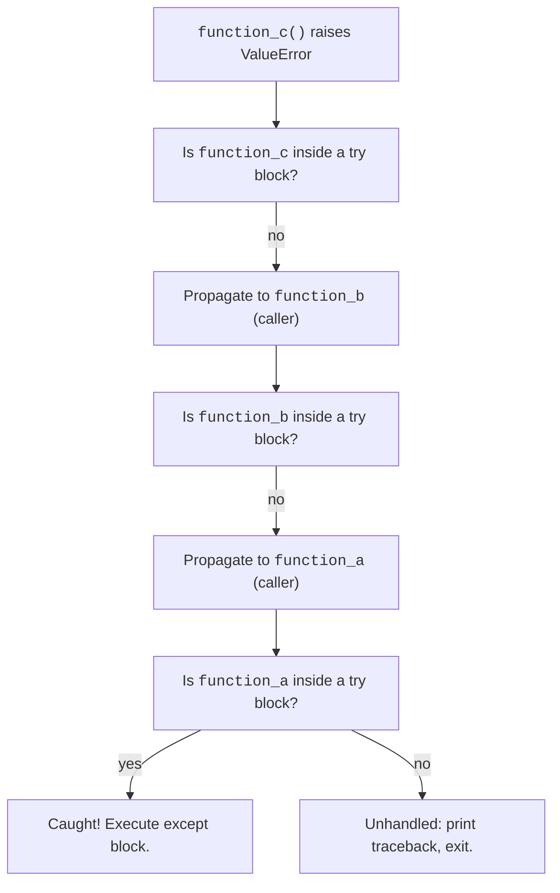

When something goes wrong, Python raises an **exception**. If nothing catches it, the program prints a traceback and exits. Catching is done with `try` / `except`.

Exceptions are Python's way of encoding **expected failure paths**: file not found, network down, invalid input, permission denied. They let you separate "happy path" logic from error handling.

<Figure
  slug="python-basics-exceptions-cutout"
  alt="A safety net catching a falling object mid-air, with a soft burst where it lands"
/>

## What happens when exceptions are not handled?

If an exception is raised and **no** `try`/`except` catches it, Python does three things:

1. **Prints a traceback** showing the call stack (which function called which).
2. **Exits the program** with a non-zero exit code (signals failure to the shell).
3. (In a web context) Returns a **500 Internal Server Error** to the client (or crashes the worker process, depending on the framework).

<CodeBlock
  adapter="python"
  files={[
    {
      filename: "main.py",
      starterCode: `def divide(a, b):
    return a / b

def main():
    result = divide(10, 0)
    print("result:", result)

try:
    main()
except ZeroDivisionError as e:
    print("Unhandled exception propagated up:")
    print(f"  {type(e).__name__}: {e}")
`,
    },
  ]}
/>

The traceback shows the **exception propagation** up the call stack: `main()` called `divide()`, which raised `ZeroDivisionError`. Since `main()` didn't catch it, it propagated up to the caller (in this case, our outer `try` block).

In production, **unhandled exceptions are bugs**. Your job is to anticipate failure modes (`try` opening a file; it might not exist) and handle them gracefully.

## Real-world: exceptions encode expected failures

Exceptions are **not** like Java checked exceptions (which force you to declare every possible error). They are Python's way of saying "this can fail, and you should decide what to do."

Common patterns:

- **File I/O**: `FileNotFoundError`, `PermissionError`, `OSError`
- **Network**: `requests.ConnectionError`, `requests.Timeout`, `socket.timeout`
- **Parsing**: `json.JSONDecodeError`, `ValueError` (from `int("oops")`)
- **APIs**: Custom exceptions like `stripe.error.RateLimitError`

You **choose** which to catch. If you catch `FileNotFoundError`, you're saying "I expect this file might not exist, and I know what to do." If you don't catch it, you're saying "if the file doesn't exist, the program should crash."

This is the **EAFP** philosophy: **Easier to Ask for Forgiveness than Permission**.

```python
# LBYL (Look Before You Leap), Pythonic but verbose
if os.path.exists(path):
    with open(path) as f:
        data = f.read()
else:
    data = None

# EAFP (Easier to Ask for Forgiveness than Permission), Pythonic
try:
    with open(path) as f:
        data = f.read()
except FileNotFoundError:
    data = None
```

The second is more concise and handles race conditions (file deleted between `exists` check and `open` call).

## Exception propagation up the call stack

When an exception is raised, Python **unwinds the stack**, looking for a `try`/`except` that handles it.



Each frame in the traceback is one step in this unwinding.

## The simplest form

<CodeBlock
  adapter="python"
  files={[
    {
      filename: "main.py",
      starterCode: `try:
    n = int("not a number")
except ValueError as e:
    print("could not parse:", e)
`,
    },
  ]}
/>

`as e` binds the exception instance so you can inspect it (type, message, attributes).

<Callout type="info" title="Exception objects have attributes">
Every exception is an object. You can inspect its type (`type(e)`), its message (`str(e)`), and sometimes custom attributes (like `e.errno` for `OSError`).
</Callout>

## Catching multiple types

<CodeBlock
  adapter="python"
  files={[
    {
      filename: "main.py",
      starterCode: `def safe_div(a, b):
    try:
        return a / b
    except (TypeError, ZeroDivisionError) as e:
        return f"error: {type(e).__name__}: {e}"

print(safe_div(10, 2))
print(safe_div(10, 0))
print(safe_div("10", 2))
`,
    },
  ]}
/>

Parentheses group multiple exception types. The first matching `except` block wins.

<Callout type="tip" title="Order matters">
If you have multiple `except` blocks, **put the most specific first**. `except Exception` will catch everything, so if you put it first, more specific blocks below are unreachable.
</Callout>

## `else` and `finally`

The full shape of the statement is:

```text
try:
    ...                    # the risky operation
except SomeError as e:
    ...                    # runs if SomeError is raised
else:
    ...                    # runs only if NO exception was raised
finally:
    ...                    # always runs, error or not
```

`else` is useful when you only want code to run when the `try` block **succeeded**. `finally` is for cleanup that must happen either way (closing files, releasing locks, restoring state).

<CodeBlock
  adapter="python"
  files={[
    {
      filename: "main.py",
      starterCode: `def parse_int(text):
    try:
        n = int(text)
    except ValueError:
        print("not an int:", text)
    else:
        print("parsed:", n)
    finally:
        print("done with", repr(text))
    print()

parse_int("42")
parse_int("oops")
`,
    },
  ]}
/>

<Callout type="info" title="finally always runs">
**`finally` runs no matter what**: success, exception, `return`, `break`, `continue`, even `sys.exit()`. It is the only way to guarantee cleanup. Use it for closing files, releasing locks, restoring state, etc.
</Callout>

## Raising exceptions

Use `raise` to signal an error from your own code. Use a specific built-in type when one fits; otherwise create your own.

<CodeBlock
  adapter="python"
  files={[
    {
      filename: "main.py",
      starterCode: `def withdraw(balance, amount):
    if amount < 0:
        raise ValueError("amount must be non-negative")
    if amount > balance:
        raise ValueError(f"insufficient funds: balance={balance}, amount={amount}")
    return balance - amount

print(withdraw(100, 30))
try:
    print(withdraw(100, 200))
except ValueError as e:
    print("caught:", e)
`,
    },
  ]}
/>

<Callout type="tip" title="Which exception type to raise?">
- `ValueError`, Right type, wrong value (`int("oops")`, `math.sqrt(-1)`)
- `TypeError`, Wrong type entirely (`len(5)`)
- `KeyError` / `IndexError`, Missing dict key / list index
- `AttributeError`, Missing attribute
- `FileNotFoundError` / `PermissionError`, Filesystem trouble
- `RuntimeError`, Generic "something else went wrong"
- Custom exception, Domain-specific error (`InsufficientFundsError`, `RateLimitExceeded`)
</Callout>

## `raise ... from ...` to preserve cause

When you wrap a lower-level error in a higher-level one, use `from` to keep the chain visible in the traceback.

<CodeBlock
  adapter="python"
  files={[
    {
      filename: "main.py",
      starterCode: `class ConfigError(Exception):
    pass

def load_config(text):
    try:
        return int(text)
    except ValueError as e:
        raise ConfigError("bad config value") from e

try:
    load_config("not a number")
except ConfigError as e:
    print("ConfigError:", e)
    print("cause:", e.__cause__)
`,
    },
  ]}
/>

Without `from`, the original `ValueError` is hidden. With `from`, the traceback shows both exceptions and their relationship.

<Callout type="tip" title="raise from vs bare raise">
- `raise NewError(...) from e`, Wraps `e` in a higher-level error. Both appear in the traceback, with `from` marking the causal relationship.
- `raise NewError(...)`, Replaces `e` with a new error. The original is lost (unless you manually include its message).
- `raise` (no arguments), Re-raises the current exception. Useful in `except` blocks when you want to log and re-raise.
</Callout>

## Custom exception classes

Make your own exception types by subclassing `Exception` (or a more specific built-in). This lets callers catch your errors precisely.

<CodeBlock
  adapter="python"
  files={[
    {
      filename: "main.py",
      starterCode: `class InsufficientFundsError(Exception):
    """Raised when a withdrawal exceeds the available balance."""

class Account:
    def __init__(self, balance):
        self.balance = balance

    def withdraw(self, amount):
        if amount > self.balance:
            raise InsufficientFundsError(f"requested {amount}, have {self.balance}")
        self.balance -= amount

acct = Account(50)
try:
    acct.withdraw(100)
except InsufficientFundsError as e:
    print("nope:", e)
`,
    },
  ]}
/>

Custom exceptions make your code **self-documenting**: `except InsufficientFundsError` is clearer than `except ValueError` (which could mean anything).

## Exception hierarchy

Every exception inherits from `BaseException`. The ones you usually care about inherit from `Exception` (which itself inherits from `BaseException`). A few useful built-ins:

- `ValueError`, right type, wrong value (`int("oops")`)
- `TypeError`, wrong type entirely (`len(5)`)
- `KeyError` / `IndexError`, missing dict key / list index
- `AttributeError`, missing attribute
- `FileNotFoundError` / `OSError`, filesystem trouble
- `RuntimeError`, generic, "something else went wrong"
- `StopIteration`, an iterator is exhausted

`Exception` catches "every normal error". **Do not** catch `BaseException` casually; it includes `KeyboardInterrupt` and `SystemExit`, which you usually want to let through.

<CodeBlock
  adapter="python"
  files={[
    {
      filename: "main.py",
      starterCode: `import sys

# Built-in exception hierarchy (simplified)
hierarchy = """
BaseException
├── KeyboardInterrupt (Ctrl+C)
├── SystemExit (sys.exit())
└── Exception
    ├── ValueError
    ├── TypeError
    ├── KeyError
    ├── IndexError
    ├── AttributeError
    ├── FileNotFoundError
    └── ... (many more)
"""
print(hierarchy)
`,
    },
  ]}
/>

<Callout type="danger" title="Never catch BaseException casually">
`except BaseException` will catch `KeyboardInterrupt` (Ctrl+C) and `SystemExit` (from `sys.exit()`), making your program impossible to kill. **Always catch `Exception` or more specific types.**
</Callout>

## Bare `except:` is almost always a bug

```python
try:
    ...
except:        # catches everything, including KeyboardInterrupt
    pass
```

This silences errors you did not intend to handle and makes debugging miserable. Always be specific.

<Callout type="danger" title="Bare except: antipattern">
**Never write `except:` without a type.** It catches **everything**, including `KeyboardInterrupt`, `SystemExit`, and `MemoryError`. If you truly want to catch all normal errors, use `except Exception:`. But even that is usually too broad; prefer specific types.
</Callout>

## EAFP vs LBYL philosophy

Python culture strongly prefers **EAFP** (Easier to Ask for Forgiveness than Permission) over **LBYL** (Look Before You Leap):

<CodeBlock
  adapter="python"
  files={[
    {
      filename: "main.py",
      starterCode: `# LBYL: check first
data = {"key": "value"}
if "key" in data:
    print(data["key"])
else:
    print("key not found")

# EAFP: just try it
try:
    print(data["key"])
except KeyError:
    print("key not found")
`,
    },
  ]}
/>

EAFP is often faster (one operation instead of two) and handles race conditions (state can change between check and use).

<Callout type="tip" title="When to use LBYL">
Use **LBYL** when the check is cheap and the exception is expensive (rare). Use **EAFP** when the happy path is common and exceptions are the exception. For most Python code, EAFP is idiomatic.
</Callout>

## Challenges

<ChallengeCard
  adapter="python"
  title="Safer integer parsing"
  instructions={`Define a function \`to_int(text, default=0)\` that returns \`int(text)\` if possible, otherwise \`default\`. It should not propagate any exception to the caller.`}
  files={[
    {
      filename: "main.py",
      starterCode: `def to_int(text, default=0):
    # your code here
    return default
`,
      solutionCode: `def to_int(text, default=0):
    try:
        return int(text)
    except (ValueError, TypeError):
        return default
`,
    },
  ]}
  tests={[
    {
      id: "ok",
      name: "Valid int string",
      code: `assert to_int("42") == 42`,
    },
    {
      id: "bad",
      name: "Bad string returns default",
      code: `assert to_int("hello", default=-1) == -1`,
    },
    {
      id: "none",
      name: "None returns default (no TypeError)",
      code: `assert to_int(None, default=99) == 99`,
    },
    {
      id: "default_zero",
      name: "Default is zero",
      code: `assert to_int("oops") == 0`,
    },
  ]}
/>

<ChallengeCard
  adapter="python"
  title="Withdraw with a custom exception"
  instructions={`Define a class \`InsufficientFundsError\` that inherits from \`Exception\`, then define a function \`withdraw(balance, amount)\` that returns the new balance after withdrawing \`amount\`, or raises \`InsufficientFundsError\` if \`amount > balance\`. \`amount\` must be non-negative; raise \`ValueError\` otherwise.`}
  files={[
    {
      filename: "main.py",
      starterCode: `class InsufficientFundsError(Exception):
    pass

def withdraw(balance, amount):
    # your code here
    return balance
`,
      solutionCode: `class InsufficientFundsError(Exception):
    pass

def withdraw(balance, amount):
    if amount < 0:
        raise ValueError("amount must be non-negative")
    if amount > balance:
        raise InsufficientFundsError(f"requested {amount}, have {balance}")
    return balance - amount
`,
    },
  ]}
  tests={[
    {
      id: "ok",
      name: "Normal withdrawal",
      code: `assert withdraw(100, 30) == 70`,
    },
    {
      id: "too_much",
      name: "InsufficientFundsError when amount > balance",
      code: `try:
    withdraw(50, 100)
except InsufficientFundsError:
    pass
else:
    raise AssertionError("expected InsufficientFundsError")`,
    },
    {
      id: "negative",
      name: "ValueError when amount is negative",
      code: `try:
    withdraw(100, -5)
except ValueError:
    pass
else:
    raise AssertionError("expected ValueError")`,
    },
  ]}
/>

<ChallengeCard
  adapter="python"
  title="Safe divide with default"
  instructions={`Define a function \`safe_divide(a, b, default=None)\` that returns \`a / b\` if possible, otherwise \`default\`. Catch both \`ZeroDivisionError\` and \`TypeError\`.`}
  files={[
    {
      filename: "main.py",
      starterCode: `def safe_divide(a, b, default=None):
    # your code here
    return default
`,
      solutionCode: `def safe_divide(a, b, default=None):
    try:
        return a / b
    except (ZeroDivisionError, TypeError):
        return default
`,
    },
  ]}
  tests={[
    {
      id: "ok",
      name: "Normal division",
      code: `assert safe_divide(10, 2) == 5`,
    },
    {
      id: "zero",
      name: "Divide by zero returns default",
      code: `assert safe_divide(10, 0, default=-1) == -1`,
    },
    {
      id: "type",
      name: "Type error returns default",
      code: `assert safe_divide("10", 2, default=0) == 0`,
    },
  ]}
/>

<ChallengeCard
  adapter="python"
  title="Rate-limit retry decorator"
  instructions={`Define a decorator \`retry_on_rate_limit(max_retries=3)\` that catches a custom \`RateLimitError\` exception and retries the function up to \`max_retries\` times. If all retries fail, re-raise the exception.

Define \`RateLimitError\` as a custom exception class.

For testing, assume a function that raises \`RateLimitError\` on the first \`n-1\` calls and succeeds on the \`n\`th call.`}
  files={[
    {
      filename: "main.py",
      starterCode: `class RateLimitError(Exception):
    pass

def retry_on_rate_limit(max_retries=3):
    def decorator(func):
        def wrapper(*args, **kwargs):
            # your code here
            return func(*args, **kwargs)

        return wrapper

    return decorator
`,
      solutionCode: `class RateLimitError(Exception):
    pass

def retry_on_rate_limit(max_retries=3):
    def decorator(func):
        def wrapper(*args, **kwargs):
            for attempt in range(max_retries):
                try:
                    return func(*args, **kwargs)
                except RateLimitError:
                    if attempt == max_retries - 1:
                        raise
            # unreachable, but for clarity
            return func(*args, **kwargs)

        return wrapper

    return decorator
`,
    },
  ]}
  tests={[
    {
      id: "succeeds_on_first",
      name: "Function that succeeds immediately",
      code: `@retry_on_rate_limit(max_retries=3)
def f():
    return "ok"
assert f() == "ok"`,
    },
    {
      id: "succeeds_on_second",
      name: "Function that succeeds on second try",
      code: `calls = []
@retry_on_rate_limit(max_retries=3)
def f():
    calls.append(1)
    if len(calls) < 2:
        raise RateLimitError("rate limited")
    return "ok"
assert f() == "ok"
assert len(calls) == 2`,
    },
    {
      id: "fails_after_max",
      name: "Exhausts retries and raises",
      code: `@retry_on_rate_limit(max_retries=2)
def f():
    raise RateLimitError("always fails")
try:
    f()
except RateLimitError:
    pass
else:
    raise AssertionError("expected RateLimitError")`,
    },
  ]}
/>

## Multiple choice questions

<MultipleChoice
  markdown={`Which block runs **only** when the \`try\` block raises no exception?

- \`finally\`
  > No, \`finally\` **always** runs, whether there's an exception or not.
- [o] \`else\`
  > \`else\` is for code that should run on success (no exception).
- The block after the \`try\` statement entirely
  > No, code after the entire \`try/except/else/finally\` runs regardless, but \`else\` is specifically for success.
- \`except\`
  > No, \`except\` runs when an exception **is** raised.`}
/>

<MultipleChoice
  markdown={`What is wrong with \`except:\` (bare except)?

- It is invalid syntax.
  > No, it is valid Python, but it is an anti-pattern.
- It only catches \`Exception\`, which is too broad.
  > No, it catches **BaseException**, which is even broader than \`Exception\`.
- [o] It catches \`KeyboardInterrupt\` and \`SystemExit\`, making the program hard to kill.
  > Bare \`except:\` catches **everything**, including signals you want to let through.
- It requires an \`as e\` clause.
  > No, \`as e\` is optional.`}
/>

<MultipleChoice
  markdown={`When should you use \`raise ... from e\`?

- [o] When wrapping a lower-level exception in a higher-level one, to preserve the cause.
  > \`raise ConfigError(...) from e\` shows both the \`ConfigError\` and the underlying \`ValueError\`, with a causal link.
- When you want to suppress the original exception.
  > No, \`raise ... from None\` suppresses context, not \`raise ... from e\`.
- When re-raising the same exception.
  > No, just write \`raise\` with no arguments to re-raise.
- When you want to catch multiple exception types.
  > No, that is done with \`except (TypeError, ValueError):\`.`}
/>

<MultipleChoice
  markdown={`What does \`finally\` do?

- [o] Runs no matter what: success, exception, return, or even sys.exit().
  > \`finally\` is guaranteed cleanup. Use it for closing files, releasing locks, etc.
- Suppresses the exception.
  > No, \`finally\` does not suppress exceptions; it just runs before the exception propagates.
- Runs only if an exception is raised.
  > No, that is what \`except\` does.
- Runs only if no exception is raised.
  > No, that is what \`else\` does.`}
/>

<MultipleChoice
  markdown={`What is the EAFP philosophy?

- Always check if a file exists before opening it.
  > No, that is LBYL (Look Before You Leap). EAFP is the opposite.
- [o] Try the operation and catch the exception if it fails.
  > EAFP stands for "Easier to Ask for Forgiveness than Permission." It is idiomatic Python.
- Never use exceptions; they are expensive.
  > No, exceptions are cheap in Python (when not raised), and EAFP is the Pythonic way.
- Use assertions instead of exceptions.
  > No, assertions are for invariants (bugs), not expected failures.`}
/>

<MultipleChoice
  markdown={`What happens if an exception is raised and not caught?

- The exception is logged but the program continues.
  > No, the program exits unless the exception is caught.
- The exception is converted to a warning.
  > No, exceptions and warnings are separate systems.
- [o] Python prints a traceback and exits with a non-zero exit code.
  > Unhandled exceptions terminate the program (or return 500 in a web context).
- The exception is silently ignored.
  > No, unhandled exceptions are never ignored.`}
/>

Many exceptions come from I/O. Files are next.
