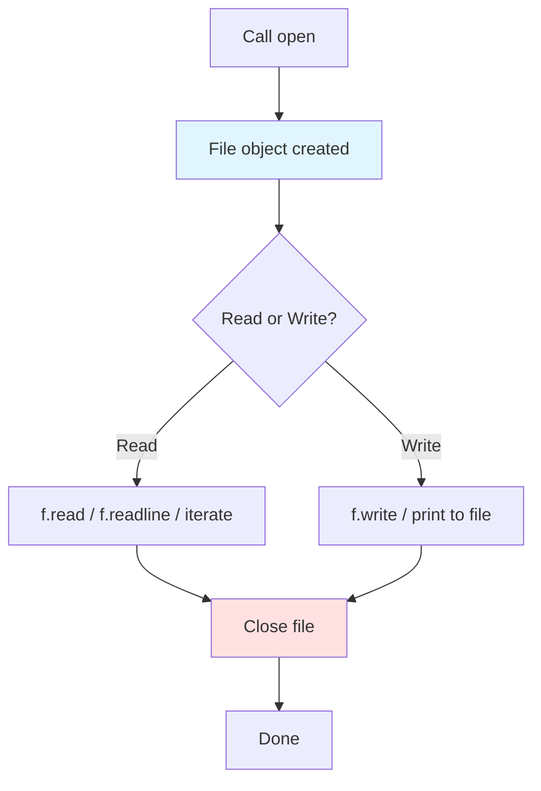
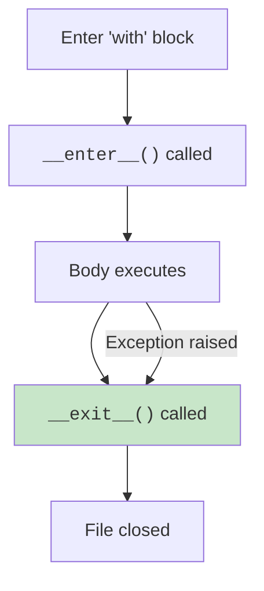

Every real program touches files, reading config, writing logs, parsing CSV data, fetching JSON from an API, exporting reports. Python's file API is small, consistent, and powerful.

<Figure
  slug="python-basics-files-cutout"
  alt="An open filing drawer with a document lifted out and resting on top, a folder standing beside it"
/>

The two core ideas: **`open()` returns a file object**, and **the `with` statement closes it for you**.

<Figure
  slug="python-files-inline-cutout"
  alt="A drawer opened, a strip of tape drawn out and read, then wound back and the drawer closed"
/>

## Why file I/O matters: the real world

File operations are everywhere in production code:

- **Configuration**, `.env` files, `config.json`, YAML settings
- **Logging**, Persistent debug and error trails
- **Data ingestion**, CSV exports from Excel, JSON from APIs, XML from legacy systems
- **Persistence**, Storing application state, caching expensive computations
- **Interprocess communication**, Unix sockets, named pipes, temp files

Mastering file I/O means you can build scripts that process data, integrate with other tools, and persist state across runs.



<Callout type="info" title="The 'with' statement: always use it">
The `with` statement is Python's **context manager** protocol. For files, it guarantees the file is closed when the block exits, even if an exception is raised. **Always** open files in a `with` block unless you have a very specific reason not to.
</Callout>

## Opening a file

Every snippet on this page runs in your browser, no setup required.

<CodeBlock
  adapter="python"
  files={[
    {
      filename: "main.py",
      starterCode: `# Write a small text file
with open("poem.txt", "w") as f:
    f.write("Beautiful is better than ugly.\\n")
    f.write("Explicit is better than implicit.\\n")
    f.write("Simple is better than complex.\\n")

# Read it back
with open("poem.txt", "r") as f:
    contents = f.read()
print(contents)
`,
    },
  ]}
/>

`open(path, mode)` returns a file object. The mode string controls what you can do:

| Mode | Meaning |
| --- | --- |
| `"r"` | Read text (default) |
| `"w"` | Write text, **truncates** existing file |
| `"a"` | Append text to end |
| `"x"` | Write text, **fails** if file exists |
| `"rb"`, `"wb"`, `"ab"` | Binary versions of the above |
| `"r+"` | Read and write |

<Callout type="warn" title="Text mode vs binary mode">
Text mode (`"r"`, `"w"`) assumes the file contains text and handles encoding/decoding. Binary mode (`"rb"`, `"wb"`) gives you raw bytes. **Use text mode for `.txt`, `.csv`, `.json`, etc.** Use binary mode for images, executables, pickle files, etc.
</Callout>

## Reading from a file

<CodeBlock
  adapter="python"
  files={[
    {
      filename: "main.py",
      starterCode: `# Create a file first
with open("data.txt", "w") as f:
    f.write("line one\\nline two\\nline three\\n")

# Read the entire file as one string
with open("data.txt", "r") as f:
    contents = f.read()
print("Full contents:")
print(contents)
`,
    },
  ]}
/>

Other reading methods:

- `f.read()`, Reads the **entire file** as one string
- `f.read(n)`, Reads up to `n` characters
- `f.readline()`, Reads **one line** (including the trailing `\n`)
- `f.readlines()`, Returns a **list of all lines** (avoid for huge files)

<CodeBlock
  adapter="python"
  files={[
    {
      filename: "main.py",
      starterCode: `with open("data.txt", "w") as f:
    f.write("first\\nsecond\\nthird\\n")

with open("data.txt") as f:
    line1 = f.readline()
    line2 = f.readline()
print("First:", repr(line1))
print("Second:", repr(line2))
`,
    },
  ]}
/>

## Reading line by line

Iterating over a file object yields one line at a time. This is **memory-efficient** for large files because only one line is in memory at a time.

<CodeBlock
  adapter="python"
  files={[
    {
      filename: "main.py",
      starterCode: `with open("poem.txt", "w") as f:
    f.write("alpha\\nbeta\\ngamma\\ndelta\\n")

with open("poem.txt") as f:
    for i, line in enumerate(f, start=1):
        print(f"{i}: {line.rstrip()}")
`,
    },
  ]}
/>

<Callout type="tip" title="Use .rstrip() to remove trailing newlines">
When iterating over lines, each line includes the trailing `\n`. Use `.rstrip()` to strip trailing whitespace (including newlines) for cleaner output.
</Callout>

## Writing to a file

<CodeBlock
  adapter="python"
  files={[
    {
      filename: "main.py",
      starterCode: `with open("output.txt", "w") as f:
    f.write("Hello, world!\\n")
    f.write("This is line two.\\n")

# Read it back to verify
with open("output.txt") as f:
    print(f.read())
`,
    },
  ]}
/>

`f.write(s)` writes the string `s` and returns the number of characters written. It does **not** add a newline automatically, you must include `\n` yourself.

<CodeBlock
  adapter="python"
  files={[
    {
      filename: "main.py",
      starterCode: `# Use print(..., file=f) for auto-newline behavior
with open("numbers.txt", "w") as f:
    for n in range(5):
        print(n, n**2, file=f, sep=" -> ")

with open("numbers.txt") as f:
    print(f.read())
`,
    },
  ]}
/>

## Append mode

<CodeBlock
  adapter="python"
  files={[
    {
      filename: "main.py",
      starterCode: `# Create a file
with open("log.txt", "w") as f:
    f.write("Program started\\n")

# Append to it
with open("log.txt", "a") as f:
    f.write("Processing data...\\n")
    f.write("Done!\\n")

with open("log.txt") as f:
    print(f.read())
`,
    },
  ]}
/>

Mode `"a"` opens the file for **appending**. All writes go to the end; the file is created if it doesn't exist.

<Callout type="info" title="Always specify encoding='utf-8' for portability">
The default encoding is platform-dependent: UTF-8 on macOS/Linux, often CP1252 on Windows. **Explicitly pass `encoding="utf-8"`** to avoid cross-platform bugs, especially when your code runs in CI or Docker containers.
</Callout>

## The context manager protocol (why 'with' works)

Under the hood, `with open(...) as f:` calls `f.__enter__()` at the start and `f.__exit__(...)` at the end, even if an exception is raised. Compare:

```python
# Manual close (FRAGILE, f.close() never runs if read() raises)
f = open("data.txt")
data = f.read()
f.close()

# Context manager (ROBUST, f is always closed)
with open("data.txt") as f:
    data = f.read()
# f is now closed, guaranteed
```

You can write your own context managers with `__enter__` and `__exit__`, or use the `contextlib` module.



<Callout type="warn" title="Leaking file descriptors">
Forgetting to close files (or only closing them manually) can **leak file descriptors**, which are a limited OS resource. On Linux you typically have a limit of ~1024 open file descriptors per process. If you leak them, `open()` will eventually raise `OSError: Too many open files`.
</Callout>

## pathlib: the modern way to handle paths

`pathlib.Path` wraps filesystem paths with helpful methods. It's cleaner than string manipulation or the older `os.path` module.

<CodeBlock
  adapter="python"
  files={[
    {
      filename: "main.py",
      starterCode: `from pathlib import Path

p = Path("note.txt")
p.write_text("hello from pathlib\\n", encoding="utf-8")

print("Exists:", p.exists())
print("Suffix:", p.suffix)
print("Name:", p.name)
print("Contents:", p.read_text(encoding="utf-8"))
`,
    },
  ]}
/>

`Path` supports the `/` operator for joining paths, which is unusually elegant:

<CodeBlock
  adapter="python"
  files={[
    {
      filename: "main.py",
      starterCode: `from pathlib import Path

base = Path("logs")
nested = base / "2024" / "january.log"
print(nested)
print("Parts:", nested.parts)
`,
    },
  ]}
/>

<Callout type="tip" title="Prefer pathlib over os.path in modern code">
`pathlib.Path` is object-oriented, chainable, and cross-platform. It's been in the standard library since Python 3.4. Use it instead of `os.path.join`, `os.path.dirname`, etc. unless you're maintaining legacy code.
</Callout>

Other useful `Path` methods:

- `p.exists()`, True if the path exists
- `p.is_file()`, `p.is_dir()`, Type checks
- `p.mkdir(parents=True, exist_ok=True)`, Create directories
- `p.glob("*.txt")`, Find files matching a pattern
- `p.read_text(encoding="utf-8")`, Read entire file
- `p.write_text(s, encoding="utf-8")`, Write entire file

## Working with JSON

JSON is ubiquitous in web APIs and config files. Python's `json` module makes it trivial.

<CodeBlock
  adapter="python"
  files={[
    {
      filename: "main.py",
      starterCode: `import json
from pathlib import Path

people = [
    {"name": "Ada", "year": 1815},
    {"name": "Grace", "year": 1906},
]

# Serialize to JSON string
json_str = json.dumps(people, indent=2)
print(json_str)

# Write to file
Path("people.json").write_text(json_str, encoding="utf-8")

# Read and parse
restored = json.loads(Path("people.json").read_text(encoding="utf-8"))
print("First name:", restored[0]["name"])
`,
    },
  ]}
/>

<Callout type="info" title="json.dump vs json.dumps">
`json.dumps(obj)` returns a JSON **string**. `json.dump(obj, file)` writes directly to a file object. Same for `json.loads` (string) vs `json.load` (file).
</Callout>

## Working with CSV

CSV (Comma-Separated Values) is the universal data interchange format. Python's `csv` module handles quoting, escaping, and dialect differences.

<CodeBlock
  adapter="python"
  files={[
    {
      filename: "main.py",
      starterCode: `import csv

# Write a CSV
with open("data.csv", "w", newline="") as f:
    writer = csv.writer(f)
    writer.writerow(["name", "year"])
    writer.writerow(["Ada", 1815])
    writer.writerow(["Grace", 1906])

# Read it back with DictReader
with open("data.csv") as f:
    reader = csv.DictReader(f)
    for row in reader:
        print(row["name"], "was born in", row["year"])
`,
    },
  ]}
/>

<Callout type="warn" title="Always pass newline='' when opening CSV files for writing">
On Windows, the default text mode translates `\n` to `\r\n`, which doubles the line endings in CSV files. Pass `newline=""` to `open()` to disable this translation. The CSV module handles line endings correctly when you do.
</Callout>

### Reading a real CSV file

Writing your own three-row CSV is one thing. Most of the time, though, the file
already exists, someone else exported it, and your job is to read it. The block
below does exactly that with a real dataset: **344 records of Antarctic penguins**
from the Palmer Station research program in Antarctica. The `datasets` setting
hands the file to your program as `penguins.csv`, so your code just opens it like
any local file.

<CodeBlock
  adapter="python"
  datasets={[{ path: "palmer-penguins.csv", stageAs: "penguins.csv" }]}
  files={[
    {
      filename: "main.py",
      starterCode: `import csv

with open("penguins.csv", newline="") as f:
    reader = csv.DictReader(f)
    rows = list(reader)

print("Total penguins:", len(rows))
print("Columns:", reader.fieldnames)
print("First row:", rows[0]["species"], "on", rows[0]["island"])
`,
    },
  ]}
/>

Notice that every value `csv` hands back is a **string**, even the numeric
columns like `body_mass_g`. That is true of CSV everywhere: a CSV file is just
text, so converting fields to numbers is your responsibility. Here we read the
body-mass column, skip the missing cells that real data always contains, and
average what's left. Note that "missing" here is the literal text `NA`, not an
empty cell: every dataset picks its own marker, and you have to look before
you can skip it.

<CodeBlock
  adapter="python"
  datasets={[{ path: "palmer-penguins.csv", stageAs: "penguins.csv" }]}
  files={[
    {
      filename: "main.py",
      starterCode: `import csv

masses = []
with open("penguins.csv", newline="") as f:
    for row in csv.DictReader(f):
        value = row["body_mass_g"]
        if value and value != "NA":    # this file marks missing cells "NA"
            masses.append(float(value))

print("Penguins with a known mass:", len(masses))
print("Average body mass (g):", round(sum(masses) / len(masses), 1))
`,
    },
  ]}
/>

<Callout type="info" title="When the file is really tabular, reach for pandas">
The `csv` module is perfect for simple, row-by-row work and ships with Python.
Once you start filtering, grouping, and aggregating tabular data, the
[pandas](https://pandas.pydata.org/) library (`pd.read_csv("penguins.csv")`) does
all of this in a line or two. You will meet it on the *Next Steps* page.
</Callout>

## Binary mode

Use `"rb"` or `"wb"` for binary files (images, executables, pickle files, etc.). Binary mode gives you `bytes` instead of `str`.

<CodeBlock
  adapter="python"
  files={[
    {
      filename: "main.py",
      starterCode: `# Write binary data
with open("data.bin", "wb") as f:
    f.write(b"\\x89PNG\\r\\n\\x1a\\n")  # PNG magic bytes
    f.write(b"\\x00" * 10)

# Read it back
with open("data.bin", "rb") as f:
    data = f.read()
print("Read", len(data), "bytes:", data[:8])
`,
    },
  ]}
/>

## Multi-file challenges

<ChallengeCard
  adapter="python"
  title="Parse a CSV file"
  instructions={`A CSV file \`sales.csv\` contains sales data. Open \`parser.py\` and implement \`parse_sales(filename)\` that:

1. Opens the CSV file
2. Reads it as a list of dicts (hint: use \`csv.DictReader\`)
3. Returns a list of dicts

\`main.py\` calls your function and prints the results. Do not edit \`main.py\` or \`sales.csv\`.`}
  entryFilename="main.py"
  files={[
    {
      filename: "main.py",
      starterCode: `from parser import parse_sales

data = parse_sales("sales.csv")
for row in data:
    print(f"{row['product']}: \${row['amount']}")
`,
    },
    {
      filename: "sales.csv",
      starterCode: `product,amount
Laptop,1200
Mouse,25
Keyboard,75
Monitor,300
`,
    },
    {
      filename: "parser.py",
      starterCode: `import csv

def parse_sales(filename):
    # your code here
    return []
`,
      solutionCode: `import csv

def parse_sales(filename):
    with open(filename) as f:
        reader = csv.DictReader(f)
        return list(reader)
`,
    },
  ]}
  tests={[
    {
      id: "basic",
      name: "parse_sales returns list of dicts",
      code: `from parser import parse_sales
data = parse_sales("sales.csv")
assert isinstance(data, list)
assert len(data) == 4
assert data[0]["product"] == "Laptop"
assert data[0]["amount"] == "1200"`,
    },
    {
      id: "all_rows",
      name: "All rows parsed correctly",
      code: `from parser import parse_sales
data = parse_sales("sales.csv")
products = [row["product"] for row in data]
assert products == ["Laptop", "Mouse", "Keyboard", "Monitor"]`,
    },
  ]}
/>

<ChallengeCard
  adapter="python"
  title="Load JSON config"
  instructions={`A \`config.json\` file contains app configuration. Open \`config_loader.py\` and implement \`load_config(filename)\` that:

1. Opens and reads the JSON file
2. Returns the parsed dict

\`main.py\` calls your function. Do not edit \`main.py\` or \`config.json\`.`}
  entryFilename="main.py"
  files={[
    {
      filename: "main.py",
      starterCode: `from config_loader import load_config

config = load_config("config.json")
print(f"App: {config['app_name']}")
print(f"Debug: {config['debug']}")
print(f"Port: {config['server']['port']}")
`,
    },
    {
      filename: "config.json",
      starterCode: `{"app_name": "DataSlope", "debug": true, "server": {"host": "localhost", "port": 8000}}
`,
    },
    {
      filename: "config_loader.py",
      starterCode: `import json

def load_config(filename):
    # your code here
    return {}
`,
      solutionCode: `import json

def load_config(filename):
    with open(filename) as f:
        return json.load(f)
`,
    },
  ]}
  tests={[
    {
      id: "basic",
      name: "load_config returns dict",
      code: `from config_loader import load_config
config = load_config("config.json")
assert isinstance(config, dict)
assert config["app_name"] == "DataSlope"`,
    },
    {
      id: "nested",
      name: "Nested values accessible",
      code: `from config_loader import load_config
config = load_config("config.json")
assert config["server"]["port"] == 8000
assert config["debug"] is True`,
    },
  ]}
/>

<ChallengeCard
  adapter="python"
  title="Append to a log file"
  instructions={`Open \`logger.py\` and implement a \`log(message)\` function that appends \`message\` (with a newline) to \`app.log\`.

\`main.py\` calls your function multiple times. Do not edit \`main.py\`.`}
  entryFilename="main.py"
  files={[
    {
      filename: "main.py",
      starterCode: `from logger import log

log("Application started")
log("User logged in")
log("Data saved")

# Read back the log
with open("app.log") as f:
    print(f.read())
`,
    },
    {
      filename: "logger.py",
      starterCode: `def log(message):
    # your code here
    pass
`,
      solutionCode: `def log(message):
    with open("app.log", "a") as f:
        f.write(message + "\\n")
`,
    },
  ]}
  tests={[
    {
      id: "basic",
      name: "log appends to app.log",
      code: `import os
if os.path.exists("app.log"):
    os.remove("app.log")
from logger import log
log("test message")
with open("app.log") as f:
    content = f.read()
assert "test message" in content`,
    },
    {
      id: "multiple",
      name: "Multiple log calls append",
      code: `import os
if os.path.exists("app.log"):
    os.remove("app.log")
from logger import log
log("first")
log("second")
log("third")
with open("app.log") as f:
    lines = f.readlines()
assert len(lines) == 3
assert lines[0].strip() == "first"
assert lines[2].strip() == "third"`,
    },
  ]}
/>

<ChallengeCard
  adapter="python"
  title="Count lines in a file"
  instructions={`Define a function \`count_lines(path)\` that opens the text file at \`path\` and returns the number of lines in it. Use a \`with\` block. Empty files should return 0.`}
  files={[
    {
      filename: "main.py",
      starterCode: `def count_lines(path):
    # your code here
    return 0
`,
      solutionCode: `def count_lines(path):
    with open(path) as f:
        return sum(1 for _ in f)
`,
    },
  ]}
  tests={[
    {
      id: "three_lines",
      name: "Three-line file",
      code: `with open("cl3.txt", "w") as f:
    f.write("a\\nb\\nc\\n")
assert count_lines("cl3.txt") == 3`,
    },
    {
      id: "empty",
      name: "Empty file is 0",
      code: `with open("cl0.txt", "w") as f:
    pass
assert count_lines("cl0.txt") == 0`,
    },
    {
      id: "one_line",
      name: "Single line without trailing newline",
      code: `with open("cl1.txt", "w") as f:
    f.write("only")
assert count_lines("cl1.txt") == 1`,
    },
  ]}
/>

## Multiple choice questions

<MultipleChoice
  markdown={`Which of the following is the **primary** reason to use a \`with\` block when opening files?

- It speeds up file I/O by buffering writes.
  > Buffering happens regardless of \`with\`. This is about resource cleanup.
- It is required syntax in Python 3.
  > No, \`open(...)\` without \`with\` is still legal, just fragile.
- [o] It automatically closes the file when the block exits, even if an exception is raised.
  > The context manager protocol guarantees cleanup.
- It makes the file read-only.
  > No, \`with\` works with any mode (\`"r"\`, \`"w"\`, etc.).`}
/>

<MultipleChoice
  markdown={`What does \`Path("logs") / "2024" / "jan.log"\` evaluate to?

- The string \`"logs/2024/jan.log"\`
  > Close, but it returns a \`Path\` object, not a plain string.
- [o] A \`Path\` object representing \`logs/2024/jan.log\`
  > \`Path\` overloads \`/\` for path joining.
- A list of three path components.
  > No, it is a single \`Path\` object. Use \`.parts\` to get components.
- A \`TypeError\` because you cannot divide a path.
  > No, \`Path.__truediv__\` is defined to handle \`/\`.`}
/>

<MultipleChoice
  markdown={`When should you open a file in binary mode (\`"rb"\` or \`"wb"\`)?

- When you want to read a text file faster.
  > No, binary mode does not speed up text reading; it just skips encoding.
- When you need to append to a file.
  > Append mode is \`"a"\` or \`"ab"\`; binary vs text is orthogonal.
- When the file is very large.
  > File size does not determine text vs binary mode; content type does.
- [o] When working with non-text files like images, executables, or pickle files.
  > Binary mode gives you raw bytes without text encoding.`}
/>

<MultipleChoice
  markdown={`Why should you explicitly pass \`encoding="utf-8"\` when opening text files?

- [o] The default encoding is platform-dependent, which can cause bugs on different systems.
  > macOS/Linux default to UTF-8; Windows often defaults to CP1252. Explicit is better than implicit.
- UTF-8 is faster than the default encoding.
  > No, performance is not the reason.
- \`encoding="utf-8"\` is required for \`with\` blocks.
  > No, \`encoding\` is optional; the issue is portability, not syntax.
- Python 3 does not have a default encoding.
  > Python 3 has a default (from \`locale.getpreferredencoding()\`), but it varies by platform.`}
/>

<MultipleChoice
  markdown={`What is the difference between \`json.dump\` and \`json.dumps\`?

- They are aliases; both do the same thing.
  > No, one writes to a file, the other returns a string.
- \`json.dump\` is deprecated in Python 3.
  > No, both are current and widely used.
- \`json.dumps\` is for serializing; \`json.dump\` is for deserializing.
  > Both are for serializing (Python → JSON). Deserializing is \`json.load\` / \`json.loads\`.
- [o] \`json.dumps\` returns a JSON string; \`json.dump\` writes directly to a file object.
  > The \`s\` suffix conventionally means "string" in Python APIs.`}
/>

<MultipleChoice
  markdown={`When reading a CSV file for writing with the \`csv\` module, why should you pass \`newline=""\` to \`open()\`?

- It prevents Unicode errors.
  > No, \`newline=""\` is about line-ending translation, not encoding.
- It is required by the CSV spec.
  > Not by the spec, but by Python's CSV module on Windows.
- It makes the CSV parser faster.
  > No, it is about correctness, not performance.
- [o] On Windows, the default text mode translates \`\\n\` to \`\\r\\n\`, doubling line endings. \`newline=""\` disables this.
  > The CSV module handles line endings itself; you must disable the OS translation.`}
/>

We have collections, control flow, functions, modules, and I/O. The next chunk is about packaging *behavior with data*, which means classes.
