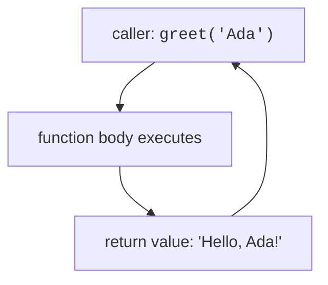

Functions package code so it can be reused, named, and tested. Every program is a tree of function calls. The keyword is `def`, the body is indented, and a function ends as soon as its indentation does.

<Figure
  slug="python-basics-functions-cutout"
  alt="A machine with an input funnel on top and an output chute below, plain shapes going in and finished shapes coming out"
/>

## Where are functions used?

Functions are **the** fundamental building block of modern programs:

- **Every API**, whether it's a web endpoint, a library method, or a command-line tool, is ultimately a function call with inputs and outputs.
- **Testing**, Unit tests verify one function at a time. Your test suite is only as good as your functions are isolated.
- **Functional programming**, Pure functions (same input → same output, no side effects) make code easier to reason about, parallelize, and debug.
- **The call stack**, Your entire program is a tree of function calls. When you see a traceback, each line is a function that called the next.

Think of every `import requests; requests.get(url)` or `df.groupby("category").mean()`, each is a function doing one job well, composed with others.

## Etymology: functions vs mathematical functions

The term **function** comes from mathematics: **f(x) = y** means "given input x, produce output y."

<Figure
  slug="python-functions-inline-cutout"
  alt="A hopper taking blocks, a boxed machine below it, and a chute returning one finished block, the machine's inside hidden"
  caption="A function maps inputs to an output; the caller does not need to see inside."
/>

In math, functions are **pure**:
- `f(3)` always returns the same value.
- `f` doesn't modify anything; it just computes.

Python functions **can** behave this way (and should, when possible):

```python
def square(x):
    return x * x
```

But Python functions can also have **side effects** (printing, writing files, mutating arguments, maintaining state). This makes them more powerful but also harder to test:

```python
def log_and_square(x):
    print(f"computing square of {x}")  # side effect: I/O
    return x * x
```

When you hear "functional programming," it means **prefer pure functions**: no side effects, same input → same output, every time.

## Anatomy of a function call



A function is **defined once** with `def`, then **called many times**. Each call creates a new local scope, binds arguments to parameters, executes the body, and returns a value (or `None` if no `return` is hit).

<Figure
  slug="python-functions-anatomy-function-call-inline-cutout"
  alt="A block entering a machine's hopper, the machine working, and a different block leaving its chute"
  caption="One call: arguments go in, the body runs, a value comes back out."
/>

## Defining a function

A definition is four pieces on one line, plus an indented body:

<SyntaxBreakdown
  parts={[
    { text: "def", label: "start a definition" },
    { text: "greet", label: "the name callers use" },
    { text: "(name)", label: "parameters, filled in per call" },
    { text: ":", label: "the indented body follows" },
  ]}
/>

<CodeBlock
  adapter="python"
  files={[
    {
      filename: "main.py",
      starterCode: `def greet(name):
    """Return a friendly greeting."""
    return f"Hello, {name}!"

print(greet("Ada"))
`,
    },
  ]}
/>

A function that does not explicitly `return` returns `None`.

<Figure
  slug="python-functions-defining-function-inline-cutout"
  alt="A machine assembled on a bench but not yet switched on, its hopper empty"
  caption="`def` only builds the function; nothing runs until you call it."
/>

<CodeBlock
  adapter="python"
  files={[
    {
      filename: "main.py",
      starterCode: `def say_hello():
    print("Hello!")

result = say_hello()
print("returned:", result)
`,
    },
  ]}
/>

<Callout type="info" title="Docstrings are your friend">
The triple-quoted string right after `def` is the **docstring**. `help(greet)` will show it. Write them for any function someone else (or future you) will call.
</Callout>

## Parameters and arguments

Python distinguishes between **positional** and **keyword** arguments.

<CodeBlock
  adapter="python"
  files={[
    {
      filename: "main.py",
      starterCode: `def deposit(account, amount, currency="USD"):
    return f"Deposited {amount} {currency} into {account}"

# positional
print(deposit("acct-1", 100))

# keyword
print(deposit("acct-1", 100, currency="EUR"))

# all keywords (order doesn't matter)
print(deposit(amount=50, account="acct-2", currency="GBP"))
`,
    },
  ]}
/>

<Callout type="tip" title="When to use keyword arguments">
Use **positional** for the 1–2 obvious arguments (`open(filename)`, `range(10)`). Use **keyword** for everything else, especially booleans and numbers whose meaning isn't clear from position alone: `retry(url, timeout=30, retries=3)`.
</Callout>

## Default values

Defaults are evaluated **once**, when the function is **defined** (not when it's called). A mutable default value is the most famous Python footgun:

<CodeBlock
  adapter="python"
  files={[
    {
      filename: "main.py",
      starterCode: `# WRONG: the same list is reused across calls!
def add_item_bad(item, items=[]):
    items.append(item)
    return items

print(add_item_bad("a"))
print(add_item_bad("b"))  # surprise: ["a", "b"]
print(add_item_bad("c"))  # surprise: ["a", "b", "c"]
`,
    },
  ]}
/>

<Callout type="danger" title="Mutable default argument gotcha">
**Never use a mutable object** (`[]`, `{}`, custom class) as a default. Use `None` as a sentinel and create the object inside the function.
</Callout>

<CodeBlock
  adapter="python"
  files={[
    {
      filename: "main.py",
      starterCode: `# RIGHT: use None as the sentinel
def add_item(item, items=None):
    if items is None:
        items = []
    items.append(item)
    return items

print(add_item("a"))
print(add_item("b"))  # ["b"]
print(add_item("c"))  # ["c"]
`,
    },
  ]}
/>

## `*args` and `**kwargs`

The stars are the whole syntax: one collects positional arguments, two collect keyword ones.

<SyntaxBreakdown
  parts={[
    { text: "def f(" },
    { text: "*args,", label: "extra positionals, as a tuple" },
    { text: "**kwargs", label: "extra keywords, as a dict" },
    { text: "):" },
  ]}
/>

`*args` captures any extra **positional** arguments as a **tuple**; `**kwargs` captures any extra **keyword** arguments as a **dict**.

<CodeBlock
  adapter="python"
  files={[
    {
      filename: "main.py",
      starterCode: `def log_event(name, *tags, **metadata):
    print("event:", name)
    print("tags:", tags)  # tuple
    print("metadata:", metadata)  # dict

log_event("login", "web", "production", user_id=42, latency_ms=120)
`,
    },
  ]}
/>

When **calling** a function, `*` and `**` **unpack** iterables/dicts back into arguments:

<CodeBlock
  adapter="python"
  files={[
    {
      filename: "main.py",
      starterCode: `def add3(a, b, c):
    return a + b + c

nums = [1, 2, 3]
print(add3(*nums))  # unpacks list into a=1, b=2, c=3

opts = {"a": 10, "b": 20, "c": 30}
print(add3(**opts))  # unpacks dict into keyword arguments
`,
    },
  ]}
/>

<Callout type="info" title="Why *args, **kwargs?">
The names `args` and `kwargs` are just convention; the `*` and `**` are the syntax. You can write `*numbers, **options` if you prefer. But `*args, **kwargs` is so ubiquitous that everyone recognizes it instantly.
</Callout>

## Positional-only and keyword-only parameters

Modern Python lets you control exactly how callers may pass each argument:

```python
def func(pos_only, /, pos_or_kw, *, kw_only):
    ...
```

- Parameters **before** `/` are **positional-only**.
- Parameters **after** `*` are **keyword-only**.
- Parameters **between** `/` and `*` can be passed either way.

<CodeBlock
  adapter="python"
  files={[
    {
      filename: "main.py",
      starterCode: `def divide(a, b, /, *, rounded=False):
    # 'a' and 'b' are positional-only (left of /).
    # 'rounded' is keyword-only (right of *).
    result = a / b
    return round(result) if rounded else result

print(divide(7, 2))
print(divide(7, 2, rounded=True))

try:
    print(divide(a=7, b=2))  # TypeError: a and b are positional-only
except TypeError as e:
    print("TypeError:", e)
`,
    },
  ]}
/>

<Callout type="tip" title="When to use / and *">
Use **positional-only** (`/`) when the parameter name is an implementation detail and you want freedom to rename it later (e.g., `len(obj)`, who cares what the parameter is called?). Use **keyword-only** (`*`) when you have many parameters or when the meaning isn't obvious from position alone (`open(file, *, encoding="utf-8")`).
</Callout>

## Return values

A `return` statement exits the function immediately and sends a value back to the caller.

<CodeBlock
  adapter="python"
  files={[
    {
      filename: "main.py",
      starterCode: `def absolute(x):
    if x < 0:
        return -x
    return x

print(absolute(-5))
print(absolute(3))
`,
    },
  ]}
/>

You can return **multiple values** by separating them with commas. Python packs them into a **tuple**:

<CodeBlock
  adapter="python"
  files={[
    {
      filename: "main.py",
      starterCode: `def divmod_custom(a, b):
    quotient = a // b
    remainder = a % b
    return quotient, remainder

q, r = divmod_custom(17, 5)
print(f"17 = 5 * {q} + {r}")
`,
    },
  ]}
/>

Use **early return** to avoid deep nesting:

<CodeBlock
  adapter="python"
  files={[
    {
      filename: "main.py",
      starterCode: `def process(value):
    if value is None:
        return "nothing to do"
    if value < 0:
        return "negative"
    # main logic here
    return f"processed {value}"

print(process(None))
print(process(-5))
print(process(10))
`,
    },
  ]}
/>

## Lambdas

A `lambda` is an **anonymous, single-expression function**. They are useful as `key=` arguments to `sorted`, `min`, `max`, and similar higher-order functions.

<CodeBlock
  adapter="python"
  files={[
    {
      filename: "main.py",
      starterCode: `words = ["banana", "apple", "cherry"]
print(sorted(words, key=lambda w: w[-1]))  # sort by last letter

doubler = lambda x: x * 2
print(doubler(7))
`,
    },
  ]}
/>

<Callout type="tip" title="lambda vs def">
For anything beyond a one-liner, prefer `def`. **Named functions show up in tracebacks; lambdas do not.** A named function also gets a docstring and is easier to test in isolation.
</Callout>

## Type hints

Type hints (PEP 484+) are **optional annotations**. Python itself does not enforce them at runtime; tools like `mypy`, `pyright`, and editors use them to catch bugs and power autocompletion.

<CodeBlock
  adapter="python"
  files={[
    {
      filename: "main.py",
      starterCode: `def total(prices: list[float], tax_rate: float = 0.07) -> float:
    """Compute total price including tax."""
    return sum(prices) * (1 + tax_rate)

print(total([10.0, 20.0, 30.0]))
`,
    },
  ]}
/>

You can put them on plain variables too:

```python
count: int = 0
names: list[str] = []
cache: dict[str, int] = {}
```

<Callout type="info" title="Type hints as documentation">
Type hints are **living documentation** that stays in sync with the code (unlike a comment, which can drift). They also unlock powerful editor features: jump-to-definition, find-all-references, refactor-rename, etc.
</Callout>

## First-class functions

In Python, functions are **first-class objects**: you can pass them as arguments, store them in data structures, and return them from other functions.

<CodeBlock
  adapter="python"
  files={[
    {
      filename: "main.py",
      starterCode: `def apply_twice(func, x):
    return func(func(x))

def add_one(n):
    return n + 1

print(apply_twice(add_one, 3))  # 5

# store functions in a dict (dispatch table)
ops = {
    "double": lambda x: x * 2,
    "square": lambda x: x * x,
    "negate": lambda x: -x,
}
print(ops["square"](7))
`,
    },
  ]}
/>

This is the foundation of **decorators**, **callbacks**, and many design patterns.

## Higher-order functions: `map`, `filter`, `sorted`

These built-ins take a function and an iterable.

<CodeBlock
  adapter="python"
  files={[
    {
      filename: "main.py",
      starterCode: `nums = [1, 2, 3, 4, 5]

print(list(map(lambda x: x * x, nums)))
print(list(filter(lambda x: x % 2 == 0, nums)))
print(sorted(nums, reverse=True))

# Most Pythonistas prefer comprehensions over map/filter:
print([x * x for x in nums])
print([x for x in nums if x % 2 == 0])
`,
    },
  ]}
/>

<Callout type="tip" title="Comprehensions vs map/filter">
**Comprehensions** are usually clearer and faster in Python. Use `map`/`filter` when you already have a named function and applying it is a one-liner (`map(str.upper, words)`). Otherwise, reach for a list comprehension.
</Callout>

## Real-world patterns

**Pure functions** (no side effects) are easier to test and parallelize:

```python
# pure: always returns same output for same input
def tax(amount, rate):
    return amount * rate

# impure: prints (side effect)
def log_tax(amount, rate):
    result = amount * rate
    print(f"tax on {amount} at {rate}: {result}")
    return result
```

**Higher-order functions** (functions that take or return functions) are everywhere in Python:

```python
from functools import lru_cache

@lru_cache(maxsize=128)
def fibonacci(n):
    if n < 2:
        return n
    return fibonacci(n - 1) + fibonacci(n - 2)
```

Here, `lru_cache` is a **decorator**, a function that takes a function and returns a wrapped version with caching.

## Challenges

<ChallengeCard
  adapter="python"
  title="Compose two functions"
  instructions={`Define a function \`compose(f, g)\` that takes two single-argument functions and returns a new function \`h\` such that \`h(x) == f(g(x))\` for any \`x\`.`}
  files={[
    {
      filename: "main.py",
      starterCode: `def compose(f, g):
    # your code here
    return lambda x: x
`,
      solutionCode: `def compose(f, g):
    return lambda x: f(g(x))
`,
    },
  ]}
  tests={[
    {
      id: "math",
      name: "compose with simple math",
      code: `f = lambda x: x + 1
g = lambda x: x * 2
assert compose(f, g)(3) == 7`,
    },
    {
      id: "string",
      name: "compose with strings",
      code: `assert compose(str.upper, str.strip)("  hi  ") == "HI"`,
    },
  ]}
/>

<ChallengeCard
  adapter="python"
  title="Flexible greeter"
  instructions={`Define \`greet_all(*names, greeting="Hello")\` that returns a single string greeting each name on its own line, in the form \`"<greeting>, <name>!"\`. If no names are passed, return the empty string.

Example:

\`\`\`python
greet_all("Ada", "Grace", greeting="Hi")
# -> "Hi, Ada!\\nHi, Grace!"
\`\`\``}
  files={[
    {
      filename: "main.py",
      starterCode: `def greet_all(*names, greeting="Hello"):
    # your code here
    return ""
`,
      solutionCode: `def greet_all(*names, greeting="Hello"):
    return "\\n".join(f"{greeting}, {name}!" for name in names)
`,
    },
  ]}
  tests={[
    {
      id: "two_names",
      name: "Two names, custom greeting",
      code: `assert greet_all("Ada", "Grace", greeting="Hi") == "Hi, Ada!\\nHi, Grace!"`,
    },
    {
      id: "no_names",
      name: "No names returns empty string",
      code: `assert greet_all() == ""`,
    },
    {
      id: "default_greeting",
      name: "Default greeting is Hello",
      code: `assert greet_all("Ada") == "Hello, Ada!"`,
    },
  ]}
/>

<ChallengeCard
  adapter="python"
  title="Fix the mutable default"
  instructions={`The function below has a mutable default argument bug. Fix it by using \`None\` as a sentinel and creating a new list inside the function when needed.`}
  files={[
    {
      filename: "main.py",
      starterCode: `def collect_events(event, log=[]):
    log.append(event)
    return log
`,
      solutionCode: `def collect_events(event, log=None):
    if log is None:
        log = []
    log.append(event)
    return log
`,
    },
  ]}
  tests={[
    {
      id: "independent_calls",
      name: "Each call with no log gets a fresh list",
      code: `assert collect_events("a") == ["a"]
assert collect_events("b") == ["b"]`,
    },
    {
      id: "existing_log",
      name: "Can pass an existing log",
      code: `my_log = ["x"]
result = collect_events("y", log=my_log)
assert result == ["x", "y"]
assert my_log is result`,
    },
  ]}
/>

<ChallengeCard
  adapter="python"
  title="Recursive factorial"
  instructions={`Define a function \`factorial(n)\` that computes \`n!\` recursively. \`factorial(0)\` should return \`1\`.`}
  files={[
    {
      filename: "main.py",
      starterCode: `def factorial(n):
    # your code here
    return 1
`,
      solutionCode: `def factorial(n):
    if n == 0:
        return 1
    return n * factorial(n - 1)
`,
    },
  ]}
  tests={[
    {
      id: "base",
      name: "factorial(0) is 1",
      code: `assert factorial(0) == 1`,
    },
    {
      id: "small",
      name: "factorial(5) is 120",
      code: `assert factorial(5) == 120`,
    },
    {
      id: "one",
      name: "factorial(1) is 1",
      code: `assert factorial(1) == 1`,
    },
  ]}
/>

## Multiple choice questions

<MultipleChoice
  markdown={`What does this print?

\`\`\`python
def f(x, items=[]):
    items.append(x)
    return items

print(f(1))
print(f(2))
\`\`\`

- \`[1]\\n[2]\`
  > A new \`[]\` is **not** created on each call when the default is a literal. The default is evaluated once at function definition time.
- \`[1, 2]\\n[1, 2]\`
  > The second call does not create a new list; it appends to the same one from the first call.
- [o] \`[1]\\n[1, 2]\`
  > The default list is evaluated once at \`def\` time and shared across calls. This is the classic mutable-default footgun.
- A \`TypeError\`
  > No type error occurs; the code runs, but with surprising behavior.`}
/>

<MultipleChoice
  markdown={`Given \`def f(a, b, /, c, *, d): ...\`, which call is valid?

- [o] \`f(1, 2, 3, d=4)\`
  > \`a\` and \`b\` are positional-only, \`c\` can be positional or keyword, \`d\` must be keyword.
- \`f(1, b=2, c=3, d=4)\`
  > \`b\` is positional-only, so it cannot be passed by name.
- \`f(a=1, b=2, c=3, d=4)\`
  > \`a\` and \`b\` are positional-only (left of \`/\`), so they cannot be passed by name.
- \`f(1, 2, 3, 4)\`
  > \`d\` is keyword-only (right of \`*\`), so it must be passed as \`d=4\`.`}
/>

<MultipleChoice
  markdown={`What is the return value of a function that has no \`return\` statement?

- An empty string \`""\`
  > No, the default return value is not an empty string.
- [o] \`None\`
  > A function without an explicit \`return\` returns \`None\`.
- \`0\`
  > No, the default return value is not zero.
- It raises a \`SyntaxError\`
  > No error is raised; the function simply returns \`None\`.`}
/>

<MultipleChoice
  markdown={`Which statement about \`lambda\` is true?

- \`lambda\` functions are faster than \`def\` functions.
  > No, there is no performance difference.
- \`lambda\` functions can contain multiple statements.
  > No, a \`lambda\` is limited to a single expression.
- \`lambda\` functions cannot take arguments.
  > No, \`lambda x, y: x + y\` is perfectly valid.
- [o] \`lambda\` functions are anonymous and show up as \`<lambda>\` in tracebacks.
  > Unlike \`def\`, a \`lambda\` has no name and appears as \`<lambda>\` in error messages.`}
/>

<MultipleChoice
  markdown={`What does unpacking with \`*\` do when calling a function?

- It creates a pointer to the iterable.
  > No, it unpacks the iterable into separate arguments.
- It makes the argument keyword-only.
  > No, that is what \`*\` does in the function signature when placed before parameter names.
- It captures extra positional arguments into a tuple.
  > That is what \`*args\` does in the **function definition**. In a **function call**, \`*\` does the opposite.
- [o] It expands an iterable into separate positional arguments.
  > \`func(*[1, 2, 3])\` is equivalent to \`func(1, 2, 3)\`.`}
/>

<MultipleChoice
  markdown={`Why are type hints useful in Python?

- They make the code run faster.
  > No, type hints have zero runtime impact on performance.
- They are enforced by the Python interpreter at runtime.
  > No, the Python interpreter ignores type hints at runtime.
- [o] They help tools like \`mypy\` catch bugs and improve IDE autocompletion.
  > Type hints are for static analysis tools and IDEs, not the runtime.
- They are required for all functions in Python 3.10+.
  > No, type hints remain optional in all Python versions.`}
/>

Next: where Python looks for names when you use them.
