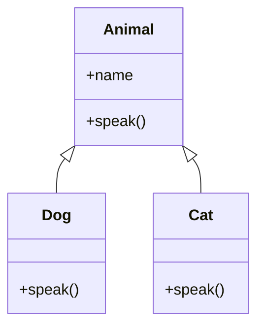
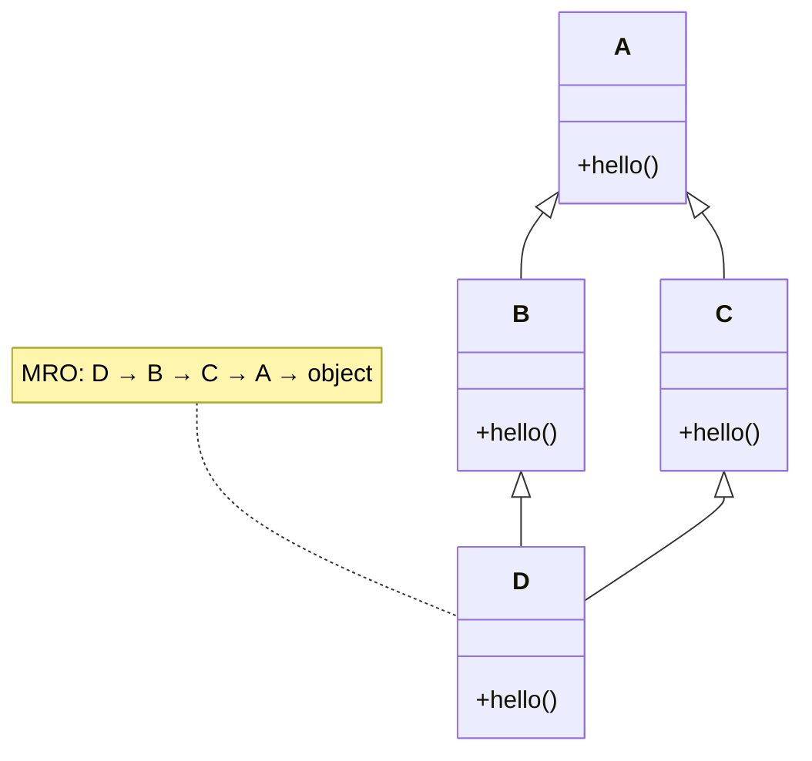

A class can **inherit** from another, getting all its attributes and methods for free. The new class can add behavior, override behavior, or both. Inheritance is one of the pillars of object-oriented programming, but it's also easy to overuse.

<Figure
  slug="python-basics-inheritance-cutout"
  alt="A larger robot beside a smaller robot built from the same shapes, joined by a short line"
/>

## Why inheritance matters: the real world

Inheritance shows up everywhere in Python:

- **Framework base classes**, `unittest.TestCase`, `django.db.models.Model`, `flask.views.MethodView`, `http.server.BaseHTTPRequestHandler`
- **Abstract base classes**, `collections.abc.Iterable`, `numbers.Number`, `abc.ABC`
- **Exception hierarchies**, `BaseException → Exception → ValueError`
- **Mixins**, Small classes that add a single behavior (logging, serialization, access control)
- **Liskov Substitution Principle**, A subclass should be usable anywhere the parent is

Understanding inheritance is essential for working with frameworks and designing extensible systems. But remember: **composition is often better than inheritance**. We'll cover that too.

<Callout type="info" title="Real-world example: Django models">
Every Django model inherits from \`django.db.models.Model\`. That base class provides the entire ORM machinery: \`save()\`, \`delete()\`, \`objects.filter(...)\`, etc. You just define fields and optionally override methods. This is inheritance done right: the base class provides infrastructure, subclasses provide domain logic.
</Callout>

## Single inheritance

<CodeBlock
  adapter="python"
  files={[
    {
      filename: "main.py",
      starterCode: `class Animal:
    def __init__(self, name):
        self.name = name

    def speak(self):
        return f"{self.name} makes a sound"

class Dog(Animal):
    def speak(self):
        return f"{self.name} says woof!"

class Cat(Animal):
    def speak(self):
        return f"{self.name} says meow!"

for animal in [Dog("Rex"), Cat("Luna"), Animal("Thing")]:
    print(animal.speak())
`,
    },
  ]}
/>

`Dog(Animal)` reads as "Dog inherits from Animal" or "Dog is a subclass of Animal". Calling `Dog("Rex")` runs `Animal.__init__` because `Dog` does not define its own `__init__`.

<Figure
  slug="python-inheritance-single-inheritance-inline-cutout"
  alt="One base cabinet with a single cabinet behind it built on the same frame"
/>



## Method overriding

When a subclass defines a method with the same name as a parent method, the subclass version **overrides** the parent.

<Figure
  slug="python-inheritance-method-overriding-inline-cutout"
  alt="A cabinet built on a base frame with one of the base's panels replaced by a different one"
/>

<CodeBlock
  adapter="python"
  files={[
    {
      filename: "main.py",
      starterCode: `class Animal:
    def speak(self):
        return "some sound"

class Dog(Animal):
    def speak(self):
        return "woof!"

d = Dog()
print(d.speak())  # calls Dog.speak, not Animal.speak
`,
    },
  ]}
/>

<Callout type="tip" title="When to override">
Override a method when you need **different behavior** for the subclass. If you want to **extend** the parent's behavior (call the parent's version first, then add more), use \`super()\` (next section).
</Callout>

## `super()`: calling parent methods

`super()` gives you access to the parent class's methods. The canonical use is to **extend** an inherited method rather than replace it entirely.

<CodeBlock
  adapter="python"
  files={[
    {
      filename: "main.py",
      starterCode: `class Animal:
    def __init__(self, name):
        self.name = name

class Dog(Animal):
    def __init__(self, name, breed):
        super().__init__(name)  # call Animal.__init__
        self.breed = breed  # then add Dog-specific logic

    def describe(self):
        return f"{self.name} is a {self.breed}"

print(Dog("Rex", "Labrador").describe())
`,
    },
  ]}
/>

Without `super().__init__(name)`, `self.name` would never be set. `super()` lets you **reuse** the parent's initialization logic.

When you write `Dog("Rex", "Labrador")`, initialization runs in order:

1. `Dog.__init__` runs.
2. **`super().__init__("Rex")`** hands off to the parent.
3. `Animal.__init__` sets `self.name`.
4. Control returns to `Dog.__init__`, which sets `self.breed`.
5. The fully initialized `Dog` instance is returned.

<Callout type="info" title="super() in multiple inheritance">
In single inheritance, \`super()\` just calls the parent. In multiple inheritance, \`super()\` follows the **Method Resolution Order (MRO)**, which is computed by the C3 linearization algorithm. This ensures every class is called exactly once in a consistent order. See the MRO section below.
</Callout>

## Polymorphism: same interface, different behavior

**Polymorphism** means "many shapes". In programming, it means you can call the same method on different types and get type-appropriate behavior.

<CodeBlock
  adapter="python"
  files={[
    {
      filename: "main.py",
      starterCode: `class Dog:
    def speak(self):
        return "woof!"

class Cat:
    def speak(self):
        return "meow!"

class Duck:
    def speak(self):
        return "quack!"

animals = [Dog(), Cat(), Duck()]
for animal in animals:
    print(animal.speak())
`,
    },
  ]}
/>

None of these classes inherit from a common base, but they all work with `for animal in animals: animal.speak()` because they all implement `speak()`. This is **duck typing**.

<Callout type="tip" title="Duck typing: 'If it walks like a duck...'">
"If it walks like a duck and quacks like a duck, it's a duck." In Python, you don't need inheritance for polymorphism. Two unrelated classes are **substitutable** if they expose the same methods. This is why Python's \`open()\` works with files, sockets, and in-memory buffers: they all have \`.read()\` and \`.write()\`.
</Callout>

## `isinstance` and `issubclass`

Use these instead of `type(x) is SomeClass` when you want to allow subclasses.

<CodeBlock
  adapter="python"
  files={[
    {
      filename: "main.py",
      starterCode: `class Animal:
    pass

class Dog(Animal):
    pass

d = Dog()
print(isinstance(d, Dog))  # True
print(isinstance(d, Animal))  # True (d is also an Animal)
print(type(d) is Animal)  # False (d's type is Dog, not Animal)
print(issubclass(Dog, Animal))  # True
`,
    },
  ]}
/>

`isinstance(obj, Class)` returns `True` if `obj` is an instance of `Class` **or any subclass**. `type(obj) is Class` only returns `True` for exact type matches.

<Callout type="warn" title="Prefer isinstance over type checks">
Use \`isinstance(x, int)\` instead of \`type(x) is int\`. The former allows subclasses (e.g., \`bool\` is a subclass of \`int\`); the latter does not. In general, checking types at all is un-Pythonic, prefer duck typing and "ask forgiveness, not permission" (EAFP).
</Callout>

## Multiple inheritance and the MRO

Python allows a class to inherit from **multiple** parents. Method lookup uses the **Method Resolution Order (MRO)**, which is computed with the **C3 linearization** algorithm.

<Figure
  slug="python-inheritance-inline-cutout"
  alt="A base cabinet with two cabinets behind it built on the same frame, each adding one part of its own"
/>

<CodeBlock
  adapter="python"
  files={[
    {
      filename: "main.py",
      starterCode: `class A:
    def hello(self):
        return "A"

class B(A):
    def hello(self):
        return "B -> " + super().hello()

class C(A):
    def hello(self):
        return "C -> " + super().hello()

class D(B, C):
    def hello(self):
        return "D -> " + super().hello()

print(D().hello())
print([cls.__name__ for cls in D.__mro__])
`,
    },
  ]}
/>

The MRO for `D` is `[D, B, C, A, object]`. `super()` walks this list, so `D.hello()` calls `B.hello()`, which calls `C.hello()`, which calls `A.hello()`.



<Callout type="warn" title="Multiple inheritance is powerful but tricky">
Most well-designed codebases either **avoid multiple inheritance** or restrict it to **mixins**, small classes that add a single piece of behavior (e.g., \`LoggingMixin\`, \`JSONSerializableMixin\`). Deep multiple-inheritance hierarchies are hard to reason about and debug.
</Callout>

## Abstract base classes

An **abstract base class (ABC)** is a class that cannot be instantiated directly. Subclasses **must** implement certain methods marked `@abstractmethod`.

<CodeBlock
  adapter="python"
  files={[
    {
      filename: "main.py",
      starterCode: `from abc import ABC, abstractmethod

class Shape(ABC):
    @abstractmethod
    def area(self): ...

class Square(Shape):
    def __init__(self, side):
        self.side = side

    def area(self):
        return self.side**2

print(Square(3).area())

try:
    Shape()
except TypeError as e:
    print("TypeError:", e)
`,
    },
  ]}
/>

Use ABCs when you want to **enforce a contract**: "any subclass must implement these methods". This is common in framework design.

<Callout type="info" title="ABCs in the standard library">
Python's \`collections.abc\` module defines many useful ABCs: \`Iterable\`, \`Sequence\`, \`Mapping\`, \`Set\`, etc. If you want to check "does this object behave like a list?", use \`isinstance(obj, collections.abc.Sequence)\` instead of \`isinstance(obj, list)\`, it allows any list-like object, not just \`list\`.
</Callout>

## Composition over inheritance

A common design principle: **prefer composition** (a class holds another as an attribute) over deep inheritance hierarchies.

```python
# Composition: an Engine is PART OF a Car
class Engine:
    def start(self):
        return "vroom"

class Car:
    def __init__(self):
        self.engine = Engine()

    def start(self):
        return self.engine.start()

# vs. inheritance: a Car IS AN Engine? That makes no sense.
class Car(Engine):  # bad!
    ...
```

Why prefer composition?

- **Flexibility**, You can swap out components (e.g., `ElectricEngine` vs `GasEngine`) without changing the `Car` class hierarchy.
- **Easier to understand**, "a Car has an Engine" is clearer than "a Car is an Engine".
- **Avoids fragile base class problem**, Changes to a base class can break subclasses in surprising ways.

<Callout type="tip" title="When to use inheritance">
Use inheritance when:
1. The subclass truly **is a** specialized version of the parent (Liskov Substitution Principle).
2. You need to plug into a framework that requires subclassing (e.g., Django models, Flask views).
3. You're using a mixin to add a single, orthogonal behavior.

Otherwise, prefer composition.
</Callout>

## The Liskov Substitution Principle

Named after Barbara Liskov, the LSP states: **a subclass should be usable anywhere the parent is**. In other words, substituting a `Dog` for an `Animal` should not break code that expects an `Animal`.

```python
class Bird:
    def fly(self):
        return "flying"

class Penguin(Bird):
    def fly(self):
        raise NotImplementedError("Penguins can't fly!")

def make_it_fly(bird):
    return bird.fly()

# This breaks the LSP: Penguin is-a Bird, but it can't fly.
# The type hierarchy is wrong.
```

Better: don't make `Penguin` inherit from `Bird` if the `fly()` contract is core to `Bird`. Or use composition.

## Multi-file challenges

<ChallengeCard
  adapter="python"
  title="Abstract shapes with area"
  instructions={`Open \`shapes.py\` and define an abstract base class \`Shape\` with an abstract \`area()\` method. Then implement two concrete subclasses:

- \`Rectangle(width, height)\` with rectangle area.
- \`Circle(radius)\` using \`math.pi * radius ** 2\`.

\`main.py\` uses your classes. Do not edit \`main.py\`.`}
  entryFilename="main.py"
  files={[
    {
      filename: "main.py",
      starterCode: `from shapes import Rectangle, Circle

r = Rectangle(3, 4)
c = Circle(2)

print(f"Rectangle area: {r.area()}")
print(f"Circle area: {c.area():.2f}")
`,
    },
    {
      filename: "shapes.py",
      starterCode: `from abc import ABC, abstractmethod
import math

class Shape(ABC):
    @abstractmethod
    def area(self): ...

# Define Rectangle and Circle here
`,
      solutionCode: `from abc import ABC, abstractmethod
import math

class Shape(ABC):
    @abstractmethod
    def area(self): ...

class Rectangle(Shape):
    def __init__(self, width, height):
        self.width = width
        self.height = height

    def area(self):
        return self.width * self.height

class Circle(Shape):
    def __init__(self, radius):
        self.radius = radius

    def area(self):
        return math.pi * self.radius**2
`,
    },
  ]}
  tests={[
    {
      id: "rectangle",
      name: "Rectangle area",
      code: `from shapes import Rectangle
assert Rectangle(3, 4).area() == 12`,
    },
    {
      id: "circle",
      name: "Circle area",
      code: `from shapes import Circle
import math
assert math.isclose(Circle(2).area(), math.pi * 4)`,
    },
    {
      id: "isinstance",
      name: "Both are Shape instances",
      code: `from shapes import Shape, Rectangle, Circle
assert isinstance(Rectangle(1, 1), Shape)
assert isinstance(Circle(1), Shape)`,
    },
    {
      id: "abstract",
      name: "Shape is abstract",
      code: `from shapes import Shape
try:
    Shape()
    raise AssertionError("Shape should be abstract")
except TypeError:
    pass`,
    },
  ]}
/>

<ChallengeCard
  adapter="python"
  title="Polymorphic animals"
  instructions={`Open \`animals.py\` and define:

- \`Animal\` base class with \`__init__(self, name)\` and a \`speak()\` method that returns \`f"{self.name} makes a sound"\`.
- \`Dog(Animal)\` that overrides \`speak()\` to return \`f"{self.name} says woof!"\`.
- \`Cat(Animal)\` that overrides \`speak()\` to return \`f"{self.name} says meow!"\`.

\`main.py\` uses your classes polymorphically. Do not edit \`main.py\`.`}
  entryFilename="main.py"
  files={[
    {
      filename: "main.py",
      starterCode: `from animals import Dog, Cat, Animal

animals = [Dog("Rex"), Cat("Luna"), Animal("Thing")]
for animal in animals:
    print(animal.speak())
`,
    },
    {
      filename: "animals.py",
      starterCode: `class Animal:
    # your code here
    pass

class Dog(Animal):
    # your code here
    pass

class Cat(Animal):
    # your code here
    pass
`,
      solutionCode: `class Animal:
    def __init__(self, name):
        self.name = name

    def speak(self):
        return f"{self.name} makes a sound"

class Dog(Animal):
    def speak(self):
        return f"{self.name} says woof!"

class Cat(Animal):
    def speak(self):
        return f"{self.name} says meow!"
`,
    },
  ]}
  tests={[
    {
      id: "dog",
      name: "Dog speaks correctly",
      code: `from animals import Dog
d = Dog("Rex")
assert d.speak() == "Rex says woof!"`,
    },
    {
      id: "cat",
      name: "Cat speaks correctly",
      code: `from animals import Cat
c = Cat("Luna")
assert c.speak() == "Luna says meow!"`,
    },
    {
      id: "animal",
      name: "Animal base class works",
      code: `from animals import Animal
a = Animal("Thing")
assert a.speak() == "Thing makes a sound"`,
    },
    {
      id: "inheritance",
      name: "Dog and Cat inherit from Animal",
      code: `from animals import Animal, Dog, Cat
assert isinstance(Dog("Rex"), Animal)
assert isinstance(Cat("Luna"), Animal)`,
    },
  ]}
/>

<ChallengeCard
  adapter="python"
  title="Employee and Manager with super()"
  instructions={`Open \`employees.py\` and define:

- \`Employee\` with \`__init__(self, name, base_salary)\` and a \`salary()\` method that returns \`self.base_salary\`.
- \`Manager(Employee)\` with \`__init__(self, name, base_salary, bonus)\` that calls \`super().__init__\` and stores the bonus. Override \`salary()\` to return \`self.base_salary + self.bonus\`.

\`main.py\` uses your classes. Do not edit \`main.py\`.`}
  entryFilename="main.py"
  files={[
    {
      filename: "main.py",
      starterCode: `from employees import Employee, Manager

e = Employee("Alice", 50000)
m = Manager("Bob", 60000, 10000)

print(f"{e.name}: \${e.salary()}")
print(f"{m.name}: \${m.salary()}")
`,
    },
    {
      filename: "employees.py",
      starterCode: `class Employee:
    # your code here
    pass

class Manager(Employee):
    # your code here
    pass
`,
      solutionCode: `class Employee:
    def __init__(self, name, base_salary):
        self.name = name
        self.base_salary = base_salary

    def salary(self):
        return self.base_salary

class Manager(Employee):
    def __init__(self, name, base_salary, bonus):
        super().__init__(name, base_salary)
        self.bonus = bonus

    def salary(self):
        return self.base_salary + self.bonus
`,
    },
  ]}
  tests={[
    {
      id: "employee",
      name: "Employee salary is base_salary",
      code: `from employees import Employee
e = Employee("Alice", 50000)
assert e.salary() == 50000`,
    },
    {
      id: "manager",
      name: "Manager salary is base + bonus",
      code: `from employees import Manager
m = Manager("Bob", 60000, 10000)
assert m.salary() == 70000`,
    },
    {
      id: "inheritance",
      name: "Manager inherits from Employee",
      code: `from employees import Employee, Manager
assert isinstance(Manager("Bob", 60000, 10000), Employee)`,
    },
    {
      id: "super",
      name: "Manager.__init__ sets name via super",
      code: `from employees import Manager
m = Manager("Bob", 60000, 10000)
assert m.name == "Bob"
assert m.base_salary == 60000`,
    },
  ]}
/>

<ChallengeCard
  adapter="python"
  title="Override a method"
  instructions={`Define a base class \`Vehicle\` with a method \`start()\` that returns \`"Vehicle starting"\`. Then define a subclass \`Car(Vehicle)\` that overrides \`start()\` to return \`"Car engine starting"\`.`}
  files={[
    {
      filename: "main.py",
      starterCode: `class Vehicle:
    pass

class Car(Vehicle):
    pass
`,
      solutionCode: `class Vehicle:
    def start(self):
        return "Vehicle starting"

class Car(Vehicle):
    def start(self):
        return "Car engine starting"
`,
    },
  ]}
  tests={[
    {
      id: "vehicle",
      name: "Vehicle.start works",
      code: `v = Vehicle()
assert v.start() == "Vehicle starting"`,
    },
    {
      id: "car",
      name: "Car.start overrides",
      code: `c = Car()
assert c.start() == "Car engine starting"`,
    },
    {
      id: "inheritance",
      name: "Car inherits from Vehicle",
      code: `assert isinstance(Car(), Vehicle)`,
    },
  ]}
/>

## Multiple choice questions

<MultipleChoice
  markdown={`What does \`super().__init__(name)\` do inside a subclass?

- Replaces the parent class's constructor entirely.
  > No, it **calls** the parent, not replaces it.
- Skips the parent class's constructor.
  > No, \`super()\` explicitly calls the parent.
- [o] Calls the parent class's \`__init__\` with \`name\`.
  > \`super()\` walks up the MRO so you can extend parent behavior.
- Creates a new instance of the parent class.
  > No, the instance already exists; \`super()\` just calls a method on it.`}
/>

<MultipleChoice
  markdown={`What is duck typing in Python?

- A way to convert one type to another implicitly.
  > No, that is coercion or casting.
- A type system where every variable must declare its type.
  > No, that is static typing. Python is dynamically typed.
- [o] If two objects expose the same methods, they can be used interchangeably, regardless of inheritance.
  > "If it walks like a duck and quacks like a duck, it's a duck." You don't need a common base class.
- A design pattern for creating families of related objects.
  > No, that is the Abstract Factory pattern.`}
/>

<MultipleChoice
  markdown={`When should you use \`isinstance(obj, Class)\` instead of \`type(obj) is Class\`?

- When you need better performance.
  > \`type(obj) is Class\` is slightly faster, but the difference is negligible. Use \`isinstance\` for correctness.
- When you want to check for **exact** type match, disallowing subclasses.
  > That is the opposite: \`type(obj) is Class\` is for exact matches; \`isinstance\` allows subclasses.
- When \`obj\` might be \`None\`.
  > Both \`isinstance(None, SomeClass)\` and \`type(None) is SomeClass\` return \`False\`.
- [o] When you want to allow subclasses (e.g., \`bool\` is a subclass of \`int\`).
  > \`isinstance\` returns \`True\` for the class and all subclasses.`}
/>

<MultipleChoice
  markdown={`What is the Method Resolution Order (MRO)?

- The order in which \`__init__\` methods are called.
  > \`__init__\` calls follow the MRO if you use \`super()\`, but the MRO itself is a general lookup order.
- The order in which instance attributes are initialized.
  > No, attributes are not part of the MRO; it is about method lookup.
- The order in which methods are defined in a class.
  > No, it is about **lookup order**, not definition order.
- [o] The order Python searches for methods when a class has multiple inheritance.
  > The MRO is computed with the C3 linearization algorithm and stored in \`Class.__mro__\`.`}
/>

<MultipleChoice
  markdown={`What is an abstract base class (ABC)?

- A class that has no methods, only attributes.
  > No, ABCs typically define **abstract methods** that subclasses must implement.
- A class that uses \`@staticmethod\` for all methods.
  > No, static methods are unrelated to abstract base classes.
- [o] A class that cannot be instantiated directly; subclasses must implement abstract methods.
  > Use \`abc.ABC\` and \`@abstractmethod\` to enforce contracts.
- A class that is automatically generated by Python.
  > No, you define ABCs explicitly.`}
/>

<MultipleChoice
  markdown={`Why is "composition over inheritance" often recommended?

- [o] Composition is more flexible, easier to understand, and avoids fragile base class problems.
  > Composition ("has a") is clearer than inheritance ("is a") in many cases.
- Composition is faster at runtime.
  > Performance is rarely the reason. It is about design clarity and flexibility.
- Composition allows multiple inheritance; inheritance does not.
  > Both allow multiple inheritance, but composition sidesteps the complexity.
- Inheritance is deprecated in Python 3.
  > No, inheritance is alive and well; composition is just often a better choice.`}
/>

Next we will look at how `for` loops actually iterate, and how `yield` turns a function into a generator.
