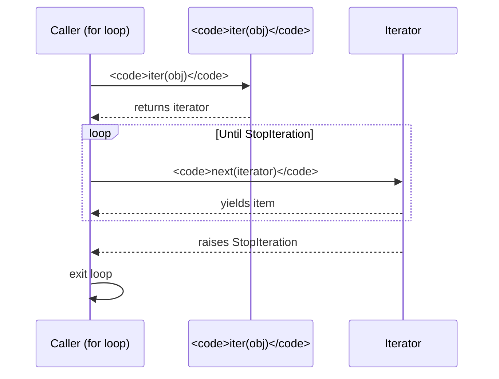

Every `for` loop in Python is powered by the **iterator protocol**. Understanding it unlocks generators, infinite sequences, and memory-efficient pipelines that power everything from streaming giant log files to building data processing frameworks.

<Figure
  slug="python-basics-iterators-cutout"
  alt="A hand-cranked dispenser releasing one cube at a time onto a short track"
/>

<Callout type="info" title="Real-world impact">
Iterators and generators are everywhere in production Python. They enable streaming HTTP responses without loading gigabytes into RAM, processing database result sets one row at a time, tailing logs indefinitely, and building lazy data pipelines with `itertools`. Mastering them means writing code that scales.
</Callout>

## What `for` really does

When Python sees `for item in collection:`, it calls `iter(collection)` to get an **iterator**, then calls `next()` on that iterator until it raises `StopIteration`. Let's see that machinery by hand:

<CodeBlock
  adapter="python"
  files={[
    {
      filename: "main.py",
      starterCode: `xs = [10, 20, 30]
it = iter(xs)

print(next(it))
print(next(it))
print(next(it))

try:
    print(next(it))
except StopIteration:
    print("exhausted")
`,
    },
  ]}
/>

The `for` loop does exactly this, catching `StopIteration` invisibly.

<Figure
  slug="python-iterators-and-generators-really-does-inline-cutout"
  alt="A smooth handle on a drum's outside with its cover lifted to show a crank and pointer within"
  caption="A `for` loop is the smooth handle; underneath it is still `iter()` and `next()`."
/>



<Callout type="warn" title="Iterables vs Iterators">
An **iterable** is anything with an `__iter__` method: lists, tuples, strings, dicts, files, generators, your own classes. An **iterator** is what `iter()` returns, it has both `__iter__` (returning self) and `__next__`. Many beginners confuse the two. A list is iterable but not an iterator. Calling `iter(list)` gives you an iterator.
</Callout>

## Manually driving an iterator

You rarely call `next()` by hand, but understanding it clarifies how generators work:

<CodeBlock
  adapter="python"
  files={[
    {
      filename: "main.py",
      starterCode: `data = ["alpha", "beta", "gamma"]
it = iter(data)

# Pull one item
first = next(it)
print(first)

# Iterate over the rest
for item in it:
    print(item)
`,
    },
  ]}
/>

Notice that after pulling `"alpha"` with `next()`, the `for` loop sees only what remains. Iterators are **stateful** and **single-pass**.

<Figure
  slug="python-iterators-and-generators-manually-driving-iterator-inline-cutout"
  alt="A hand turning a drum's crank one notch at a time, one block leaving per turn"
  caption="Each `next()` call turns the crank once and hands back a single item."
/>

## Custom iterator class

If you need complex state, write your own iterator with `__iter__` and `__next__`:

<CodeBlock
  adapter="python"
  files={[
    {
      filename: "main.py",
      starterCode: `class Countdown:
    def __init__(self, start):
        self.current = start

    def __iter__(self):
        return self

    def __next__(self):
        if self.current <= 0:
            raise StopIteration
        self.current -= 1
        return self.current + 1

for n in Countdown(5):
    print(n)
`,
    },
  ]}
/>

The class returns `self` from `__iter__` because it *is* its own iterator. This pattern works but is verbose.

## Generators with `yield`

Writing `__iter__` and `__next__` by hand is tedious. A function that uses `yield` becomes a **generator** automatically:

<CodeBlock
  adapter="python"
  files={[
    {
      filename: "main.py",
      starterCode: `def countdown(n):
    while n > 0:
        yield n
        n -= 1

for x in countdown(5):
    print(x)
`,
    },
  ]}
/>

Each `yield` **pauses** the function and hands a value to the caller. The next `next()` call resumes the function right after that `yield`, with all local state (variables, the instruction pointer) intact.

<Figure
  slug="python-iterators-and-generators-inline-cutout"
  alt="A dispenser handing out one block at a time on request, with a long roll still coiled inside it rather than laid out on the bench"
  caption="A generator keeps the sequence coiled up and yields one value at a time."
/>

<Callout type="info" title="Generators are lazy">
Calling a generator function does NOT run any code. It returns a generator object. Code runs only when you iterate, pulling one value at a time. This is why generators can represent infinite sequences, you never build the whole thing in memory.
</Callout>

## Generator state is preserved

Here's proof that local variables survive across `yield` calls:

<CodeBlock
  adapter="python"
  files={[
    {
      filename: "main.py",
      starterCode: `def stateful():
    count = 0
    while count < 3:
        count += 1
        yield f"call {count}"

gen = stateful()
print(next(gen))
print(next(gen))
print(next(gen))
`,
    },
  ]}
/>

The `count` variable increments each time we resume. This is the superpower of generators: cheap, lazy iteration with arbitrary local state.

## Infinite generators

Generators can run forever. You take as much as you need and stop:

<CodeBlock
  adapter="python"
  files={[
    {
      filename: "main.py",
      starterCode: `def naturals():
    n = 1
    while True:
        yield n
        n += 1

from itertools import islice

print(list(islice(naturals(), 10)))
`,
    },
  ]}
/>

Calling `list(naturals())` would hang forever. The `islice` adapter takes a finite slice, so it's safe. Infinite generators power `itertools.count`, `itertools.cycle`, and many streaming pipelines.

<Callout type="error" title="Never materialize an infinite generator">
Writing `list(infinite_gen())` or `sum(infinite_gen())` without a limit will run until you kill the process or run out of memory. Always consume infinite generators with tools that know when to stop: `islice`, `takewhile`, or manual `next()` calls.
</Callout>

## Generator expressions

You've met list comprehensions. A **generator expression** uses `()` instead of `[]` and returns a generator, not a list:

<CodeBlock
  adapter="python"
  files={[
    {
      filename: "main.py",
      starterCode: `squares = (x * x for x in range(1_000_000))
print(sum(squares))
`,
    },
  ]}
/>

No million-item list is built. Each square is computed, added to the sum, and discarded. Memory usage is constant.

When a generator expression is the sole argument to a function, the inner parens are optional:

<CodeBlock
  adapter="python"
  files={[
    {
      filename: "main.py",
      starterCode: `# These are equivalent:
total1 = sum((x * x for x in range(10)))
total2 = sum(x * x for x in range(10))
print(total1, total2)
`,
    },
  ]}
/>

## Streaming pipelines

Generators chain naturally. Each stage processes one item at a time:

<CodeBlock
  adapter="python"
  files={[
    {
      filename: "main.py",
      starterCode: `def read_lines():
    """Simulate reading lines from a huge file."""
    for line in ["alpha", "  beta  ", "", "gamma", "  ", "delta", "zeta"]:
        yield line

def clean(stream):
    for line in stream:
        cleaned = line.strip()
        if cleaned:
            yield cleaned

def uppercase(stream):
    for line in stream:
        yield line.upper()

# Compose the pipeline
pipeline = uppercase(clean(read_lines()))

for item in pipeline:
    print(item)
`,
    },
  ]}
/>

No intermediate lists are built. Memory usage is $O(1)$ regardless of how many lines flow through. This pattern is the backbone of big-data tools like Apache Spark's lazy transformations.

<Callout type="success" title="Real-world streaming">
In production, you might chain generators to process log files too large for RAM, stream JSON from an API endpoint, or apply transformations to database cursors. The pattern is always the same: small composable stages that yield one item at a time.
</Callout>

## `yield from`

`yield from` delegates the whole of another iterable, which is what saves writing a loop that just re-yields:

<SyntaxBreakdown
  parts={[
    { text: "yield from", label: "delegate to another iterable" },
    { text: "inner()", label: "every value it yields comes out of here" },
  ]}
/>

`yield from iterable` is shorthand for "yield every item from that iterable":

<CodeBlock
  adapter="python"
  files={[
    {
      filename: "main.py",
      starterCode: `def chain(*iterables):
    for it in iterables:
        yield from it

for x in chain([1, 2], (3, 4), "ab"):
    print(x)
`,
    },
  ]}
/>

Without `yield from`, you'd write:

```python
for item in it:
    yield item
```

`yield from` is both cleaner and faster. It also correctly delegates sub-generator methods (`.send()`, `.throw()`) for advanced use cases.

## `itertools`, generator building blocks

The `itertools` module is a treasure chest of lazy functions. A small sample:

<CodeBlock
  adapter="python"
  files={[
    {
      filename: "main.py",
      starterCode: `from itertools import (
    count,
    cycle,
    repeat,
    chain,
    islice,
    takewhile,
    accumulate,
    combinations,
    product,
)

# Infinite counters
print(list(islice(count(10), 5)))  # [10, 11, 12, 13, 14]

# Cycle through a sequence forever
print(list(islice(cycle("abc"), 7)))  # ['a','b','c','a','b','c','a']

# Repeat a value
print(list(repeat("hi", 3)))  # ['hi', 'hi', 'hi']

# Chain multiple iterables
print(list(chain([1, 2], [3, 4])))  # [1, 2, 3, 4]

# Take while condition is true
print(list(takewhile(lambda x: x < 5, count())))  # [0, 1, 2, 3, 4]

# Running totals
print(list(accumulate([1, 2, 3, 4])))  # [1, 3, 6, 10]

# Combinatorics
print(list(combinations("abcd", 2)))  # [('a','b'), ('a','c'), ...]
print(list(product("ab", "12")))  # [('a','1'), ('a','2'), ...]
`,
    },
  ]}
/>

<Callout type="info" title="itertools is your friend">
Before writing a generator from scratch, check if `itertools` already has what you need. `itertools.groupby`, `itertools.compress`, `itertools.pairwise` (3.10+), and others save you from reinventing the wheel.
</Callout>

## Generators are one-shot

Once exhausted, a generator cannot be restarted:

<CodeBlock
  adapter="python"
  files={[
    {
      filename: "main.py",
      starterCode: `def gen():
    yield 1
    yield 2

g = gen()
print(list(g))  # [1, 2]
print(list(g))  # [], already exhausted
`,
    },
  ]}
/>

If you need to iterate multiple times, either call the generator function again or materialize the result into a list (defeating laziness).

## Challenges

<ChallengeCard
  adapter="python"
  title="take(n, iterable)"
  instructions={`Define a generator function \`take(n, iterable)\` that yields the first \`n\` items from \`iterable\`. If \`iterable\` has fewer than \`n\` items, yield all of them.

Example: \`list(take(3, [1, 2, 3, 4, 5]))\` returns \`[1, 2, 3]\`.`}
  files={[
    {
      filename: "main.py",
      starterCode: `def take(n, iterable):
    # your code here
    if False:
        yield None
`,
      solutionCode: `def take(n, iterable):
    for i, item in enumerate(iterable):
        if i >= n:
            break
        yield item
`,
    },
  ]}
  tests={[
    {
      id: "basic",
      name: "First 3 items",
      code: `assert list(take(3, [1, 2, 3, 4, 5])) == [1, 2, 3]`,
    },
    {
      id: "fewer_items",
      name: "Fewer items than n",
      code: `assert list(take(5, [1, 2])) == [1, 2]`,
    },
    {
      id: "zero",
      name: "n=0",
      code: `assert list(take(0, [1, 2, 3])) == []`,
    },
    {
      id: "is_generator",
      name: "Returns a generator",
      code: `import types
assert isinstance(take(3, [1, 2, 3]), types.GeneratorType)`,
    },
  ]}
/>

<ChallengeCard
  adapter="python"
  title="Infinite Fibonacci generator"
  instructions={`Define a generator function \`fib()\` that yields the Fibonacci sequence indefinitely, starting with \`0, 1, 1, 2, 3, 5, 8, ...\`. The tests will take a finite slice.`}
  files={[
    {
      filename: "main.py",
      starterCode: `def fib():
    # your code here
    yield 0
`,
      solutionCode: `def fib():
    a, b = 0, 1
    while True:
        yield a
        a, b = b, a + b
`,
    },
  ]}
  tests={[
    {
      id: "is_generator",
      name: "fib() is a generator",
      code: `import types
assert isinstance(fib(), types.GeneratorType)`,
    },
    {
      id: "first_ten",
      name: "First 10 Fibonacci numbers",
      code: `from itertools import islice
assert list(islice(fib(), 10)) == [0, 1, 1, 2, 3, 5, 8, 13, 21, 34]`,
    },
    {
      id: "twentieth",
      name: "20th Fibonacci is 6765",
      code: `from itertools import islice
f = list(islice(fib(), 21))
assert f[20] == 6765`,
    },
  ]}
/>

<ChallengeCard
  adapter="python"
  title="Running average generator"
  instructions={`Define a generator function \`running_avg(iterable)\` that yields the running average of the items seen so far.

Example: \`list(running_avg([10, 20, 30]))\` returns \`[10.0, 15.0, 20.0]\`.`}
  files={[
    {
      filename: "main.py",
      starterCode: `def running_avg(iterable):
    # your code here
    if False:
        yield 0.0
`,
      solutionCode: `def running_avg(iterable):
    total = 0
    count = 0
    for item in iterable:
        total += item
        count += 1
        yield total / count
`,
    },
  ]}
  tests={[
    {
      id: "basic",
      name: "Basic running average",
      code: `assert list(running_avg([10, 20, 30])) == [10.0, 15.0, 20.0]`,
    },
    {
      id: "single_item",
      name: "Single item",
      code: `assert list(running_avg([42])) == [42.0]`,
    },
    {
      id: "empty",
      name: "Empty iterable",
      code: `assert list(running_avg([])) == []`,
    },
    {
      id: "larger",
      name: "Larger sequence",
      code: `result = list(running_avg([1, 2, 3, 4, 5]))
expected = [1.0, 1.5, 2.0, 2.5, 3.0]
assert result == expected`,
    },
  ]}
/>

<ChallengeCard
  adapter="python"
  title="Batched iterable"
  instructions={`Define a generator function \`batched(iterable, n)\` that yields tuples of \`n\` consecutive items from \`iterable\`. If the final batch has fewer than \`n\` items, yield it as-is.

Example: \`list(batched([1, 2, 3, 4, 5], 2))\` returns \`[(1, 2), (3, 4), (5,)]\`.`}
  files={[
    {
      filename: "main.py",
      initCode: `from itertools import islice
`,
      starterCode: `def batched(iterable, n):
    # your code here. Hint: islice(iterator, n) takes the next n items.
    if False:
        yield ()
`,
      solutionCode: `def batched(iterable, n):
    it = iter(iterable)
    while True:
        batch = tuple(islice(it, n))
        if not batch:
            break
        yield batch
`,
    },
  ]}
  tests={[
    {
      id: "basic",
      name: "Batch of 2",
      code: `assert list(batched([1, 2, 3, 4, 5], 2)) == [(1, 2), (3, 4), (5,)]`,
    },
    {
      id: "exact_batches",
      name: "Exact multiple",
      code: `assert list(batched([1, 2, 3, 4], 2)) == [(1, 2), (3, 4)]`,
    },
    {
      id: "size_three",
      name: "Batch of 3",
      code: `assert list(batched(range(10), 3)) == [(0,1,2), (3,4,5), (6,7,8), (9,)]`,
    },
    {
      id: "empty",
      name: "Empty iterable",
      code: `assert list(batched([], 2)) == []`,
    },
  ]}
/>

## Multiple-choice questions

<MultipleChoice
  markdown={`What happens when a generator function is called?

- The body runs immediately and returns the first value.
  > Calling a generator function runs none of the body; it just builds the generator object.
- It returns a list of every value the function yields.
  > Generators do not build lists. They yield one item at a time.
- [o] No code in the body runs; you get back a generator object, and the body runs lazily as you iterate.
  > \`yield\` makes the function lazy, nothing runs until you call \`next()\` or loop over it.
- It raises \`StopIteration\` if the body is empty.
  > \`StopIteration\` is raised when iteration is exhausted, not when the generator is created.`}
/>

<MultipleChoice
  markdown={`Why are generators more memory-efficient than lists for large datasets?

- Generators use a special Python data structure that is smaller.
  > Generators don't store data at all, so no special structure is needed.
- Python automatically writes generator output to disk.
  > No disk I/O is involved unless you explicitly write code to do so.
- [o] Generators produce items one at a time, never holding the entire sequence in memory.
  > Only the current item and the generator's local state exist in memory.
- Generators are stored in compressed form.
  > No compression happens. Generators simply don't store items.`}
/>

<MultipleChoice
  markdown={`What does \`yield from iterable\` do?

- It imports all items from \`iterable\` into the current scope.
  > \`yield from\` is not an import statement.
- It returns \`iterable\` as a single yielded value.
  > That would be \`yield iterable\`. \`yield from\` unpacks the iterable.
- It raises \`StopIteration\` immediately.
  > \`yield from\` forwards items until the sub-iterable is exhausted, then continues.
- [o] It yields every item from \`iterable\`, delegating iteration to that iterable.
  > It's shorthand for \`for x in iterable: yield x\` and correctly delegates sub-generator methods.`}
/>

<MultipleChoice
  markdown={`Which statement about generators is true?

- \`list(infinite_generator())\` is safe because Python auto-detects infinite loops.
  > Python does NOT detect infinite loops. Materializing an infinite generator hangs forever.
- You can restart a generator after it is exhausted by calling \`reset()\`.
  > Generators cannot be reset. Once exhausted, they stay exhausted.
- Generators store all yielded values in a hidden list.
  > Generators do not store previous values. They are purely lazy.
- [o] Once a generator is exhausted, iterating over it again yields nothing.
  > Generators are single-pass. To iterate again, call the generator function again.`}
/>

<MultipleChoice
  markdown={`What does \`iter(iterator)\` return?

- A list of all remaining items.
  > \`iter()\` does not consume or materialize items.
- [o] The same iterator object (iterator.__iter__ returns self).
  > Iterators return themselves from \`__iter__\`, so they are their own iterables.
- A new, independent iterator starting from the beginning.
  > \`iter(iterator)\` does NOT reset or clone the iterator.
- It raises \`TypeError\` because you cannot call \`iter()\` on an iterator.
  > Iterators implement \`__iter__\`, so \`iter(iterator)\` is valid (and returns \`self\`).`}
/>

<MultipleChoice
  markdown={`Which of these is a valid use case for an infinite generator?

- [o] Modeling a stream of events that never ends, consuming only what is needed.
  > Infinite generators are perfect for unbounded streams where you pull items as needed.
- Raising \`StopIteration\` after the first item.
  > An infinite generator never raises \`StopIteration\` (unless you explicitly break out of the loop).
- Pre-computing every prime number up to infinity and storing them in RAM.
  > Infinity cannot be stored. Infinite generators are for lazy, on-demand production.
- Building a complete list of all natural numbers.
  > Infinite sequences cannot be fully materialized.`}
/>

Functions that decorate other functions are next.
