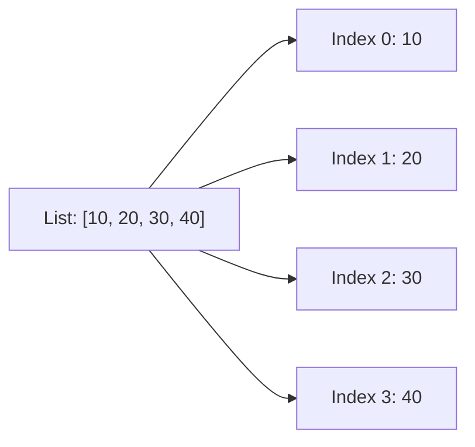

A `list` is Python's workhorse collection: an ordered, mutable sequence that can hold values of any type. Lists are everywhere in real-world Python, search results from an API, user records from a database, file paths for batch processing, task queues, log messages, and more. If you need to store multiple things and might change them later, a list is usually your first choice.

<Figure
  slug="python-basics-lists-cutout"
  alt="An isometric train of connected open boxcars on a curved track, each carrying a different coloured parcel in sequence"
/>

Every snippet on this page runs in your browser, no setup required.

<Figure
  slug="python-lists-inline-cutout"
  alt="A numbered rail holding five blocks in order, one being lifted out of the middle and the rest sliding along to close the gap"
/>

## Creating a list

The simplest list is written with square brackets, separating items with commas.

<CodeBlock
  adapter="python"
  files={[
    {
      filename: "main.py",
      starterCode: `empty = []
print(empty)
`,
    },
  ]}
/>

<CodeBlock
  adapter="python"
  files={[
    {
      filename: "main.py",
      starterCode: `nums = [1, 2, 3]
print(nums)
`,
    },
  ]}
/>

Lists are **heterogeneous**: they can mix types freely.

<CodeBlock
  adapter="python"
  files={[
    {
      filename: "main.py",
      starterCode: `mixed = [1, "two", 3.0, [4, 5]]
print(mixed)
`,
    },
  ]}
/>

The `list()` constructor converts any iterable into a list.

<CodeBlock
  adapter="python"
  files={[
    {
      filename: "main.py",
      starterCode: `from_range = list(range(5))
print(from_range)

from_str = list("hello")
print(from_str)
`,
    },
  ]}
/>

## How lists work under the hood

Lists are implemented as **dynamic arrays**: a contiguous block of memory holding references to objects. This gives O(1) random access by index but O(n) insertion/deletion in the middle. Think of a list as a row of numbered parking spots, where each spot points to the actual object.

<Callout type="info" title="Lists in the wild">
Every web framework returns search results as a list. Every database driver gives you rows as a list. Every file system walk yields paths in a list. Lists are *the* default sequence type in Python, and understanding them deeply pays off constantly.
</Callout>

## Indexing

Lists support zero-based indexing. Negative indices count from the end.

<CodeBlock
  adapter="python"
  files={[
    {
      filename: "main.py",
      starterCode: `xs = [10, 20, 30, 40, 50]
print(xs[0])
`,
    },
  ]}
/>

<CodeBlock
  adapter="python"
  files={[
    {
      filename: "main.py",
      starterCode: `xs = [10, 20, 30, 40, 50]
print(xs[-1])
print(xs[-2])
`,
    },
  ]}
/>

Out-of-range access raises an `IndexError`.

<CodeBlock
  adapter="python"
  files={[
    {
      filename: "main.py",
      starterCode: `xs = [10, 20, 30]
try:
    print(xs[10])
except IndexError as e:
    print("IndexError:", e)
`,
    },
  ]}
/>

## Slicing

Slices let you extract a sublist with `[start:stop:step]`. The `stop` index is **exclusive**.

<CodeBlock
  adapter="python"
  files={[
    {
      filename: "main.py",
      starterCode: `xs = [10, 20, 30, 40, 50]
print(xs[1:4])
`,
    },
  ]}
/>

<CodeBlock
  adapter="python"
  files={[
    {
      filename: "main.py",
      starterCode: `xs = [10, 20, 30, 40, 50]
print(xs[:3])
print(xs[2:])
`,
    },
  ]}
/>

The `step` parameter lets you skip items or reverse.

<CodeBlock
  adapter="python"
  files={[
    {
      filename: "main.py",
      starterCode: `xs = [10, 20, 30, 40, 50]
print(xs[::2])
print(xs[::-1])
`,
    },
  ]}
/>

## Mutation via assignment

Unlike strings (which are immutable), you can assign directly through an index or slice.

<CodeBlock
  adapter="python"
  files={[
    {
      filename: "main.py",
      starterCode: `xs = [10, 20, 30, 40, 50]
xs[0] = 99
print(xs)
`,
    },
  ]}
/>

Slice assignment can change the list's length.

<CodeBlock
  adapter="python"
  files={[
    {
      filename: "main.py",
      starterCode: `xs = [10, 20, 30, 40, 50]
xs[1:3] = ["a", "b", "c"]
print(xs)
`,
    },
  ]}
/>

<Callout type="warn" title="Slice assignment replaces, not item-by-item">
When you write `xs[1:4] = [9]`, Python removes indices 1 through 3 and inserts the single item `9`. The lengths do not need to match. This trips up newcomers who expect element-by-element replacement.
</Callout>

## Common methods: adding items

The three main ways to grow a list:

<CodeBlock
  adapter="python"
  files={[
    {
      filename: "main.py",
      starterCode: `xs = [1, 2, 3]
xs.append(4)
print(xs)
`,
    },
  ]}
/>

<CodeBlock
  adapter="python"
  files={[
    {
      filename: "main.py",
      starterCode: `xs = [1, 2, 3]
xs.extend([4, 5, 6])
print(xs)
`,
    },
  ]}
/>

<CodeBlock
  adapter="python"
  files={[
    {
      filename: "main.py",
      starterCode: `xs = [1, 2, 3]
xs.insert(0, "start")
print(xs)
`,
    },
  ]}
/>

<Callout type="info">
`append` and `extend` are O(1) amortized, so they are fast. `insert` at the front or middle is O(n) because it shifts all subsequent elements.
</Callout>

## Common methods: removing items

<CodeBlock
  adapter="python"
  files={[
    {
      filename: "main.py",
      starterCode: `xs = [3, 1, 4, 1, 5]
xs.remove(1)
print(xs)
`,
    },
  ]}
/>

`remove` deletes the **first** occurrence and raises `ValueError` if the item is missing.

<CodeBlock
  adapter="python"
  files={[
    {
      filename: "main.py",
      starterCode: `xs = [3, 1, 4, 1, 5]
last = xs.pop()
print("popped:", last)
print("remaining:", xs)
`,
    },
  ]}
/>

<CodeBlock
  adapter="python"
  files={[
    {
      filename: "main.py",
      starterCode: `xs = [3, 1, 4, 1, 5]
second = xs.pop(1)
print("popped xs[1]:", second)
print("remaining:", xs)
`,
    },
  ]}
/>

<CodeBlock
  adapter="python"
  files={[
    {
      filename: "main.py",
      starterCode: `xs = [3, 1, 4, 1, 5]
xs.clear()
print(xs)
`,
    },
  ]}
/>

## Common methods: searching and counting

<CodeBlock
  adapter="python"
  files={[
    {
      filename: "main.py",
      starterCode: `xs = [3, 1, 4, 1, 5, 9, 2, 6]
print(xs.index(4))
`,
    },
  ]}
/>

<CodeBlock
  adapter="python"
  files={[
    {
      filename: "main.py",
      starterCode: `xs = [3, 1, 4, 1, 5, 9, 2, 6]
print(xs.count(1))
`,
    },
  ]}
/>

## Sorting and reversing

`sort()` and `reverse()` modify the list **in place** and return `None`.

<CodeBlock
  adapter="python"
  files={[
    {
      filename: "main.py",
      starterCode: `nums = [3, 1, 4, 1, 5, 9, 2, 6]
nums.sort()
print(nums)
`,
    },
  ]}
/>

<CodeBlock
  adapter="python"
  files={[
    {
      filename: "main.py",
      starterCode: `nums = [3, 1, 4, 1, 5, 9, 2, 6]
nums.reverse()
print(nums)
`,
    },
  ]}
/>

For case-insensitive string sorting, pass a `key` function.

<CodeBlock
  adapter="python"
  files={[
    {
      filename: "main.py",
      starterCode: `words = ["banana", "Apple", "cherry"]
words.sort(key=str.lower)
print(words)
`,
    },
  ]}
/>

If you want a **new** sorted list without modifying the original, use the built-in `sorted()`.

<CodeBlock
  adapter="python"
  files={[
    {
      filename: "main.py",
      starterCode: `original = [3, 1, 2]
new = sorted(original)
print("original:", original)
print("sorted:", new)
`,
    },
  ]}
/>

## Iteration

The `for` loop is the canonical way to visit each item.

<CodeBlock
  adapter="python"
  files={[
    {
      filename: "main.py",
      starterCode: `fruits = ["apple", "banana", "cherry"]
for fruit in fruits:
    print(fruit)
`,
    },
  ]}
/>

When you also need the index, use `enumerate`.

<CodeBlock
  adapter="python"
  files={[
    {
      filename: "main.py",
      starterCode: `fruits = ["apple", "banana", "cherry"]
for i, fruit in enumerate(fruits, start=1):
    print(i, fruit)
`,
    },
  ]}
/>

To iterate two lists in parallel, use `zip`.

<CodeBlock
  adapter="python"
  files={[
    {
      filename: "main.py",
      starterCode: `fruits = ["apple", "banana", "cherry"]
prices = [1.0, 0.5, 2.0]
for fruit, price in zip(fruits, prices):
    print(f"{fruit}: \${price:.2f}")
`,
    },
  ]}
/>

## Membership and aggregates

<CodeBlock
  adapter="python"
  files={[
    {
      filename: "main.py",
      starterCode: `xs = [3, 1, 4, 1, 5, 9, 2, 6]
print(3 in xs)
print(99 in xs)
`,
    },
  ]}
/>

<Callout type="warn" title="Membership testing is O(n)">
`item in list` scans the entire list in the worst case. If you are doing frequent membership checks, consider converting to a `set`, where `in` is O(1).
</Callout>

<CodeBlock
  adapter="python"
  files={[
    {
      filename: "main.py",
      starterCode: `xs = [3, 1, 4, 1, 5, 9, 2, 6]
print("length:", len(xs))
print("sum:   ", sum(xs))
print("min:   ", min(xs))
print("max:   ", max(xs))
`,
    },
  ]}
/>

## Copying lists: shallow vs deep

Assignment does **not** copy. Both names point to the same list.

<CodeBlock
  adapter="python"
  files={[
    {
      filename: "main.py",
      starterCode: `a = [1, 2, 3]
b = a
b.append(4)
print("a:", a)
print("b:", b)
`,
    },
  ]}
/>

Use `.copy()` or slicing `[:]` for a **shallow copy**.

<CodeBlock
  adapter="python"
  files={[
    {
      filename: "main.py",
      starterCode: `a = [1, 2, 3]
b = a.copy()
b.append(4)
print("a:", a)
print("b:", b)
`,
    },
  ]}
/>

Shallow means nested structures are still shared.

<CodeBlock
  adapter="python"
  files={[
    {
      filename: "main.py",
      starterCode: `a = [1, [2, 3]]
b = a.copy()
b[1].append(4)
print("a:", a)
print("b:", b)
`,
    },
  ]}
/>

For true independence, use `copy.deepcopy`.

<CodeBlock
  adapter="python"
  files={[
    {
      filename: "main.py",
      starterCode: `import copy

a = [1, [2, 3]]
b = copy.deepcopy(a)
b[1].append(4)
print("a:", a)
print("b:", b)
`,
    },
  ]}
/>

<Callout type="warn" title="Modifying while iterating">
Changing a list's length during iteration invalidates the iterator and leads to skipped items or infinite loops. If you must remove items, iterate over a **copy**: `for x in xs[:]` or build a new list with a comprehension.
</Callout>

## Stacks and queues

Lists make excellent **stacks** because `append` and `pop` at the end are both O(1).

<CodeBlock
  adapter="python"
  files={[
    {
      filename: "main.py",
      starterCode: `stack = []
stack.append("a")
stack.append("b")
stack.append("c")
print(stack.pop())
print(stack.pop())
print(stack)
`,
    },
  ]}
/>

For **queues** (FIFO), prefer `collections.deque`, which supports O(1) operations at both ends. Using a list as a queue means O(n) `pop(0)` every time you dequeue.

<CodeBlock
  adapter="python"
  files={[
    {
      filename: "main.py",
      starterCode: `from collections import deque

q = deque(["a", "b", "c"])
q.append("d")
print(q.popleft())
print(q)
`,
    },
  ]}
/>

## Challenges

<ChallengeCard
  adapter="python"
  title="Rotate a list"
  instructions={`Define a function \`rotate(items, n)\` that returns a new list with the items rotated left by \`n\` positions. For example, \`rotate([1, 2, 3, 4, 5], 2)\` returns \`[3, 4, 5, 1, 2]\`.

Hint: slicing makes this one-liner.`}
  files={[
    {
      filename: "main.py",
      starterCode: `def rotate(items, n):
    # your code here
    return []
`,
      solutionCode: `def rotate(items, n):
    n = n % len(items) if items else 0
    return items[n:] + items[:n]
`,
    },
  ]}
  tests={[
    {
      id: "basic",
      name: "Rotate by 2",
      code: `assert rotate([1, 2, 3, 4, 5], 2) == [3, 4, 5, 1, 2]`,
    },
    {
      id: "full_rotation",
      name: "Rotate by length is identity",
      code: `assert rotate([1, 2, 3], 3) == [1, 2, 3]`,
    },
    {
      id: "empty",
      name: "Empty list",
      code: `assert rotate([], 5) == []`,
    },
    {
      id: "over_length",
      name: "n > length wraps around",
      code: `assert rotate([1, 2, 3], 5) == [3, 1, 2]`,
    },
  ]}
/>

<ChallengeCard
  adapter="python"
  title="Remove duplicates, preserving order"
  instructions={`Define \`dedupe(items)\` that returns a list of the items in \`items\` with duplicates removed, keeping the **first** occurrence of each. For example, \`dedupe([3, 1, 3, 2, 1, 4])\` returns \`[3, 1, 2, 4]\`.

Hint: a \`set\` of "already seen" items is a great fit.`}
  files={[
    {
      filename: "main.py",
      starterCode: `def dedupe(items):
    # your code here
    return []
`,
      solutionCode: `def dedupe(items):
    seen = set()
    out = []
    for x in items:
        if x not in seen:
            seen.add(x)
            out.append(x)
    return out
`,
    },
  ]}
  tests={[
    {
      id: "basic",
      name: "Removes duplicates and preserves order",
      code: `assert dedupe([3, 1, 3, 2, 1, 4]) == [3, 1, 2, 4]`,
    },
    {
      id: "no_dupes",
      name: "Already unique passes through",
      code: `assert dedupe([1, 2, 3]) == [1, 2, 3]`,
    },
    {
      id: "all_same",
      name: "All same -> one item",
      code: `assert dedupe(["a", "a", "a"]) == ["a"]`,
    },
    {
      id: "empty",
      name: "Empty list",
      code: `assert dedupe([]) == []`,
    },
  ]}
/>

<ChallengeCard
  adapter="python"
  title="Flatten a nested list"
  instructions={`Define a function \`flatten(nested)\` that takes a list of lists and returns a single flat list. For example, \`flatten([[1, 2], [3], [4, 5]])\` returns \`[1, 2, 3, 4, 5]\`.

You may assume the list is only one level deep.`}
  files={[
    {
      filename: "main.py",
      starterCode: `def flatten(nested):
    # your code here
    return []
`,
      solutionCode: `def flatten(nested):
    out = []
    for sublist in nested:
        out.extend(sublist)
    return out
`,
    },
  ]}
  tests={[
    {
      id: "basic",
      name: "Flattens nested lists",
      code: `assert flatten([[1, 2], [3], [4, 5]]) == [1, 2, 3, 4, 5]`,
    },
    {
      id: "empty_sublists",
      name: "Handles empty sublists",
      code: `assert flatten([[], [1], [], [2, 3]]) == [1, 2, 3]`,
    },
    {
      id: "empty",
      name: "Empty input",
      code: `assert flatten([]) == []`,
    },
  ]}
/>

<MultipleChoice
  markdown={`What is the value of \`xs\` after this code runs?

\`\`\`python
xs = [1, 2, 3, 4, 5]
xs[1:4] = [9]
\`\`\`

- [o] \`[1, 9, 5]\`
  > The slice \`xs[1:4]\` (items 2, 3, 4) is replaced by the single element \`9\`.
- \`[1, 9, 2, 3, 4, 5]\`
  > That would be insertion, not slice assignment.
- A \`ValueError\` because lengths differ
  > Slice assignment works with any length; no error is raised.
- \`[1, 9, 4, 5]\`
  > Slice assignment replaces the entire slice, not item-by-item.`}
/>

<MultipleChoice
  markdown={`Which operation modifies the list in place?

- \`xs + [9]\`
  > \`+\` returns a new list; it does not modify either operand.
- \`list(xs)\`
  > \`list(xs)\` creates a new list copy.
- \`sorted(xs)\`
  > \`sorted\` returns a new list and leaves \`xs\` untouched.
- [o] \`xs.sort()\`
  > \`.sort()\` modifies \`xs\` directly and returns \`None\`.`}
/>

<MultipleChoice
  markdown={`What does \`xs.pop()\` return if \`xs = [1, 2, 3]\`?

- \`1\`
  > \`pop()\` with no argument removes the **last** item, not the first.
- \`None\`
  > \`pop\` returns the removed item, not \`None\`.
- \`[1, 2]\`
  > \`pop\` returns the removed item, not the remaining list.
- [o] \`3\`
  > \`pop()\` removes and returns the last item.`}
/>

<MultipleChoice
  markdown={`What is the time complexity of \`item in xs\` where \`xs\` is a list?

- O(n²)
  > Membership testing is linear, not quadratic.
- [o] O(n)
  > Python scans the list from start to finish in the worst case.
- O(1)
  > That would be true for a set or dict, not a list.
- O(log n)
  > Lists are not sorted by default, so binary search does not apply.`}
/>

Lists are mutable. Their immutable cousin, the tuple, is next.
