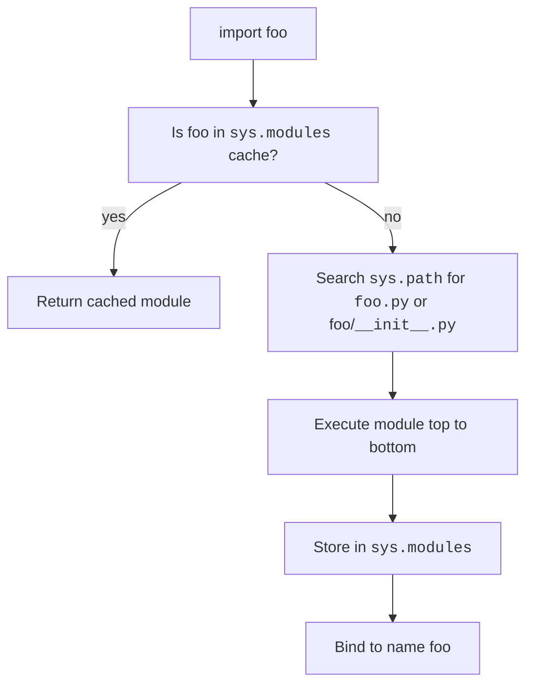

A **module** is just a `.py` file. A **package** is a directory of modules (usually marked by an `__init__.py`). `import` is how you pull them in.

Modules are the backbone of Python's ecosystem: every library you `pip install`, **requests**, **numpy**, **pandas**, is a package made of modules.

<Figure
  slug="python-basics-modules-cutout"
  alt="The Dataslope marmot slotting modular crates together into an interlocking shelf"
/>

## Why modules matter: the real-world impact

Python's module system is the foundation of its success:

- **Code reuse**, Write once, import everywhere.
- **PyPI ecosystem**, Over 500,000 packages available. `pip install requests` gives you a production-grade HTTP client in one line.
- **Testability**, Each module can be tested in isolation.
- **Namespace isolation**, `foo.bar` and `baz.bar` don't collide.

When you do `import pandas as pd`, you're pulling in hundreds of modules, all organized into a single namespace. Understanding how `import` works is critical for debugging import errors, managing dependencies, and organizing your own code.

## Importing

<CodeBlock
  adapter="python"
  files={[
    {
      filename: "main.py",
      starterCode: `import math

print(math.pi)
print(math.sqrt(2))

# Import a specific name.
from math import pi, sqrt

print(pi, sqrt(2))

# Rename on import.
import math as m

print(m.cos(0))
`,
    },
  ]}
/>

<Callout type="tip" title="When to use each import style">
- `import math`, Use when you call multiple functions (`math.sqrt`, `math.cos`, ...). Keeps the namespace clean.
- `from math import sqrt`, Use when you call one or two functions repeatedly. But don't overdo it; `sqrt(x)` is less clear than `math.sqrt(x)` to a reader who doesn't know where `sqrt` comes from.
- `import numpy as np`, Use for libraries with established conventions. Everyone knows `np`, `pd`, `plt`.
</Callout>

## The standard library

Python comes with a famously rich standard library. A small tour:

<CodeBlock
  adapter="python"
  files={[
    {
      filename: "main.py",
      starterCode: `import json
import datetime
import random
import collections
import itertools
import statistics

print(json.dumps({"a": 1, "b": [1, 2]}))
print(datetime.date.today())
print(random.choice("abcde"))
print(collections.Counter("banana"))
print(list(itertools.combinations("abc", 2)))
print(statistics.mean([1, 2, 3, 4, 5]))
`,
    },
  ]}
/>

The standard library has modules for **everything**: file I/O, networking, threading, regular expressions, unit testing, profiling, etc. Always check the standard library before reaching for a third-party package.

## What `import` actually does

When you write `import foo`:

1. **Check the cache**, Python looks for `foo` in `sys.modules` (a dict of already-imported modules). If it's there, done.
2. **Search the path**, If not, Python searches every directory in `sys.path` for:
   - A `foo.py` file
   - A `foo/` directory with an `__init__.py` (package)
   - A built-in module (written in C, like `sys` or `math`)
3. **Execute**, The module is executed top to bottom, and its namespace is bound to the name `foo`.

`sys.path` includes the directory of the running script, the `PYTHONPATH` environment variable, and the install's `site-packages`. You can inspect it:

<CodeBlock
  adapter="python"
  files={[
    {
      filename: "main.py",
      starterCode: `import sys

for p in sys.path[:5]:  # show first 5
    print(p)
`,
    },
  ]}
/>



<Callout type="info" title="Module execution is cached">
A module is only executed **once**, the first time it is imported. Subsequent imports return the cached object from `sys.modules`. This is why global state in a module is shared across all imports.
</Callout>

## Avoid `from module import *`

It pulls every public name into the current namespace, which makes it impossible to tell where a name came from. Stick to explicit imports.

<CodeBlock
  adapter="python"
  files={[
    {
      filename: "main.py",
      starterCode: `# Bad: where does 'sqrt' come from?
# from math import *
# print(sqrt(2))

# Good: clear and explicit
import math

print(math.sqrt(2))
`,
    },
  ]}
/>

<Callout type="danger" title="Star imports hide bugs">
`from foo import *` can silently **overwrite** names. If `foo` defines a function called `max`, it shadows the built-in `max`. A linter will warn about this, but it's better to never write it in the first place.
</Callout>

## The `if __name__ == "__main__":` idiom

When you run a file directly, `__name__` is set to `"__main__"`. When it is imported by something else, `__name__` is the module's name. This lets a single file serve as both a **library** and a **script**:

```python
# greet.py
def greet(name):
    return f"Hello, {name}!"

if __name__ == "__main__":
    print(greet("World"))
```

Running `python greet.py` prints `Hello, World!`; doing `from greet import greet` in another file does **not** run the `if` block.

<Callout type="tip" title="Always use this idiom">
Put your "script" code (CLI argument parsing, `main()` calls, etc.) inside `if __name__ == "__main__":`. It makes your file importable for testing and reuse.
</Callout>

## Packages

A directory containing an `__init__.py` is a **package**. The `__init__.py` runs when the package is first imported and typically re-exports the package's public API.

```text
myapp/
    __init__.py
    cli.py
    db/
        __init__.py
        connection.py
        queries.py
```

Then:

```python
from myapp.db.queries import top_users
from myapp.db import connection
```

`__init__.py` can be empty; just having it makes the directory a package.

<Callout type="info" title="__init__.py in Python 3.3+">
Python 3.3+ has "namespace packages" which don't require `__init__.py`. But most projects still use `__init__.py` for clarity and to control what gets imported when you do `import mypackage`.
</Callout>

## Relative imports inside packages

<CodeBlock
  adapter="python"
  files={[
    {
      filename: "main.py",
      starterCode: `# inside myapp/db/queries.py
# from .connection import open_db        # sibling module
# from ..cli import parse_args            # one level up

# Relative imports only work when the file is being imported
# as part of a package, not when run directly.
print("This block demonstrates relative import syntax (commented out).")
`,
    },
  ]}
/>

Relative imports only work when the file is being imported as part of a package, not when run directly with `python myapp/db/queries.py`.

<Callout type="tip" title="When to use relative imports">
Use **relative imports** inside a package when modules import from each other. They make refactoring easier (you can rename the top-level package without updating every import). Use **absolute imports** everywhere else.
</Callout>

## Real-world: the PyPI ecosystem

**PyPI** (Python Package Index) is why Python is popular. Want to:

- Make HTTP requests? `pip install requests`
- Parse HTML? `pip install beautifulsoup4`
- Work with dataframes? `pip install pandas`
- Build a web API? `pip install flask`
- Do machine learning? `pip install scikit-learn`

Each of these is a **package** made of **modules**. When you `pip install`, you're downloading a package from PyPI and putting it in your `site-packages/` directory (which is in `sys.path`).

The ability to share and reuse code at this scale, hundreds of thousands of packages, billions of downloads, is only possible because Python's module system is simple and consistent.

## Multi-file challenge

This challenge uses two files. Open the `utils.py` tab and implement the functions; `main.py` already imports and uses them.

<ChallengeCard
  adapter="python"
  title="Implement a stats helper across files"
  instructions={`Open \`utils.py\` and implement two functions:

- \`mean(values)\` returns the arithmetic mean of \`values\`. Assume the list is non-empty.
- \`variance(values)\` returns the population variance (mean of squared deviations from the mean). Assume the list is non-empty.

\`main.py\` already imports both and prints their results. Do not edit \`main.py\`.`}
  entryFilename="main.py"
  files={[
    {
      filename: "main.py",
      starterCode: `from utils import mean, variance

values = [2, 4, 4, 4, 5, 5, 7, 9]
print("mean =", mean(values))
print("variance =", variance(values))
`,
    },
    {
      filename: "utils.py",
      starterCode: `def mean(values):
    # your code here
    return 0

def variance(values):
    # your code here
    return 0
`,
      solutionCode: `def mean(values):
    return sum(values) / len(values)

def variance(values):
    mu = mean(values)
    return sum((x - mu) ** 2 for x in values) / len(values)
`,
    },
  ]}
  tests={[
    {
      id: "mean_basic",
      name: "mean of [1, 2, 3] is 2",
      code: `from utils import mean
assert mean([1, 2, 3]) == 2`,
    },
    {
      id: "variance_basic",
      name: "variance of [2, 4, 4, 4, 5, 5, 7, 9] is 4.0",
      code: `from utils import variance
import math
assert math.isclose(variance([2, 4, 4, 4, 5, 5, 7, 9]), 4.0)`,
    },
    {
      id: "variance_const",
      name: "variance of [3, 3, 3] is 0",
      code: `from utils import variance
assert variance([3, 3, 3]) == 0`,
    },
  ]}
/>

<ChallengeCard
  adapter="python"
  title="Filter even numbers"
  instructions={`Define a function \`filter_even(numbers)\` that returns a new list containing only the even numbers from \`numbers\`.`}
  files={[
    {
      filename: "main.py",
      starterCode: `def filter_even(numbers):
    # your code here
    return []
`,
      solutionCode: `def filter_even(numbers):
    return [n for n in numbers if n % 2 == 0]
`,
    },
  ]}
  tests={[
    {
      id: "basic",
      name: "Filter even numbers",
      code: `assert filter_even([1, 2, 3, 4, 5, 6]) == [2, 4, 6]`,
    },
    {
      id: "empty",
      name: "Empty list returns empty list",
      code: `assert filter_even([]) == []`,
    },
    {
      id: "all_odd",
      name: "All odd returns empty list",
      code: `assert filter_even([1, 3, 5]) == []`,
    },
  ]}
/>

## Multiple choice questions

<MultipleChoice
  markdown={`What is the purpose of \`if __name__ == "__main__":\` at the bottom of a module?

- It is required syntax in every Python script.
  > No, it is a convention, not a requirement. But it is a **very strong** convention.
- [o] It runs the indented block only when the file is executed directly, not when it is imported.
  > When imported, \`__name__\` is the module name, not \`"__main__"\`, so the block is skipped.
- It is the entry point recognized by Python's package installer.
  > No, package installers look for entry points in \`setup.py\` or \`pyproject.toml\`, not this idiom.
- It prevents the file from being imported at all.
  > No, it is the opposite: it lets the file be safely imported **without** running the script code.`}
/>

<MultipleChoice
  markdown={`What happens the second time you \`import foo\`?

- The module is re-executed from scratch.
  > No, modules are only executed once.
- A \`ImportError\` is raised (duplicate import).
  > No, importing the same module multiple times is perfectly fine.
- [o] Python returns the cached module from \`sys.modules\`.
  > Modules are cached after the first import. Subsequent imports are nearly free.
- The module is reloaded from disk with the latest changes.
  > No, you must use \`importlib.reload(foo)\` to reload a module.`}
/>

<MultipleChoice
  markdown={`Which import style is generally preferred for readability?

- All three are equally good.
  > No, \`from math import *\` is widely considered an anti-pattern.
- \`from math import *\`
  > No, this is considered bad practice because it pollutes the namespace and hides where names come from.
- \`from math import sqrt, cos, sin, tan, log, exp, pi, e\`
  > This can be okay, but if you're importing many names, \`import math\` is clearer.
- [o] \`import math\` (then call \`math.sqrt(...)\`)
  > This is the clearest: every call to \`math.sqrt\` tells the reader exactly where it comes from.`}
/>

<MultipleChoice
  markdown={`Where does Python search for modules when you \`import foo\`?

- Only installed packages from \`pip install\`.
  > No, \`sys.path\` also includes the current directory and \`PYTHONPATH\`.
- [o] All directories in \`sys.path\`, which includes the current directory, \`PYTHONPATH\`, and \`site-packages\`.
  > \`sys.path\` is a list of directories Python searches in order.
- Only the current directory.
  > No, Python searches all directories in \`sys.path\`, not just the current one.
- Only the standard library.
  > No, \`sys.path\` includes third-party packages and the current directory.`}
/>

When something goes wrong inside that imported module, you need a way to handle the failure. That is what exceptions are for.
