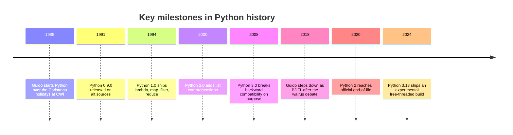

You have finished the working parts of the course, you can write functions,
build classes, and reason about scope and generators. This page is different.
It is optional, and there is no code to run and no challenge to pass. It is here
for the curious reader who, having learned *how* Python works, now wants the
larger story of *why* it works that way.

Almost every design decision in Python has a person and a reason behind it. Once
you know them, the language stops feeling arbitrary.

## A holiday project

<Figure
  slug="python-basics-history-cutout"
  alt="A Dutch canal house in winter at dusk, warm light in one window revealing a desk with an early personal computer, snow falling"
/>

In late December 1989, a programmer named **Guido van Rossum** found himself
with a quiet week. His office at CWI, the Centrum Wiskunde & Informatica, a
national research institute in the Netherlands, was closed for the Christmas
holidays, and he was looking for a project to occupy the time. He had recently
worked on a teaching language called **ABC**, and while he admired its ideas, he
had a long list of things he would have done differently. So over that holiday
he began building a successor.

He needed a name. He was, at the time, reading the published scripts of *Monty
Python's Flying Circus*, the British comedy series, and he wanted something
"short, unique, and slightly mysterious." He called it **Python**. The snake
imagery came later, supplied by the community and by book publishers; the name
itself is a comedy reference, not a reptile one.

The first public release, **Python 0.9.0**, went out to the `alt.sources`
Usenet newsgroup in **February 1991**. It already had functions, exceptions, and
the core data types, lists, dictionaries, strings, that you have spent this
course learning. The language has grown enormously since, but its character was
set in that first holiday.

## The most divisive decision: whitespace as syntax

By the time Python appeared, nearly every mainstream language marked blocks of
code with explicit delimiters, curly braces `{ ... }` in C, JavaScript, and
Java, or keywords like `begin ... end` in Pascal. Guido made a different choice,
and it is the one that still defines how Python *looks*: blocks are marked by
**indentation itself**.

His reasoning was almost mischievously simple. Programmers already indent their
code to show structure to other humans. The indentation is right there, doing
its job for the reader, so why should the compiler ignore it and demand a
*second*, redundant set of braces? Let the indentation be the structure. The
consequence is that badly indented Python does not merely look messy; it refuses
to run. There is no "silently wrong" indentation, and there is no decades-long
argument about whether the opening brace goes on the same line or the next.

People feel strongly about this in both directions. Some find it liberating,
one whole category of style bikeshedding simply vanishes. Others miss the
explicit delimiters of C-like languages and find the reliance on invisible
characters unnerving. Either way, it is non-negotiable in Python, and it is the
single feature most likely to surprise a newcomer arriving from another
language.

## The tabs-versus-spaces war

Significant whitespace had a side effect Guido may not have fully anticipated:
it took an old, low-grade argument and poured gasoline on it. If whitespace is
*syntax*, then the choice between indenting with **tab characters** and
indenting with **spaces** is no longer purely cosmetic, it can change whether a
program even parses.

<Figure
  slug="python-python-history-most-divisive-decision-inline-cutout"
  alt="Two written cards, one held square by its indents alone and one held by brackets, the first standing unaided"
/>

The debate itself is older than Python, older than programming; it goes back to
typewriters and word processors, where a "tab" was a physical jump to the next
stop. In code, each side has a genuine point:

- **The case for tabs.** A tab is one character that each developer can *display*
  at whatever width they like, two spaces to fit more on screen, eight for
  easier reading. That flexibility is a real accessibility win: a developer with
  low vision can widen the indentation without touching the file. With spaces,
  everyone is locked to the same visual width.
- **The case for spaces.** A tab's width is unpredictable, so any alignment that
  depends on it breaks when the file moves between editors. Spaces render
  identically everywhere, every time. This is why PEP 8, and the formatters that
  enforce it, land on spaces.

The community settled the question for Python long ago. PEP 8 states it plainly:
"Spaces are the preferred indentation method," with tabs reserved only for
staying consistent with code that already uses them. **Four spaces** is the
answer. Python 3 even removed the old escape hatch: mix tabs and spaces in one
block and you get a hard `TabError`, where Python 2 would silently guess.

<Callout type="info" title="A debate famous enough to be a TV joke">
The tabs-versus-spaces argument is well-known enough that the HBO comedy
*Silicon Valley* built an entire relationship-ending fight around it: a
character cannot abide his partner using spaces. It is played for laughs, but
the writers were drawing on something real, this genuinely is the kind of thing
that can stall a code review. The lesson is the lesson of the Zen of Python:
pick the obvious convention (four spaces) and spend your energy on the actual
problem.
</Callout>

## The Zen, ABC, and "one obvious way"

Python's deeper personality comes straight from ABC, the teaching language Guido
worked on before it. ABC was designed to be learnable, readable, and forgiving,
and Python inherited those instincts. They were eventually distilled into *The
Zen of Python* (PEP 20), the 19 aphorisms by **Tim Peters** that you can still
print by running `import this`. Lines like "Readability counts" and "There
should be one, and preferably only one, obvious way to do it" are not
decoration; they are the criteria by which Python features are accepted or
rejected to this day.

## Python 2 to 3: the decade-long migration

In December 2008, Python 3.0 was released, and it deliberately **broke backward
compatibility**. This was a hard, controversial decision: existing Python 2 code
would not simply run on Python 3. But it allowed the language to fix a set of
long-standing warts all at once. The most visible changes:

- `print` became a *function*: `print("hi")`, where Python 2 wrote `print "hi"`
  as a statement.
- All strings became Unicode by default, with `bytes` as a separate type, a
  genuine relief for anyone who had ever wrangled non-English text.
- Integer division split in two: `/` always returns a float, and `//` does floor
  division. In Python 2, `5 / 2` quietly gave `2`.
- `range()`, `dict.keys()`, `map()`, and friends started returning lazy
  views/iterators instead of building whole lists.

<Figure
  slug="python-history-first-release-cutout"
  alt="A figure at a desktop computer in a snowy window bay, a parcel travelling along a wire to three other computers"
  caption="Python 0.9.0 went out to the alt.sources newsgroup in February 1991, built over one closed-office Christmas."
/>

The catch was migration. Because the break was real, the ecosystem took roughly
a decade to move. Libraries maintained dual Python 2/3 codebases, leaned on the
`six` compatibility library, or ran the `2to3` converter. The Python core team
eventually set a hard deadline, and on **January 1, 2020**, Python 2 reached
official end-of-life: no more security patches, no more fixes. Today there is no
reason to write new code in Python 2, and every example in this course assumes
Python 3.

## From BDFL to Steering Council

For most of its life, Python had an unusual form of government. Guido held the
half-joking title of **BDFL**, Benevolent Dictator For Life, meaning that on
the rare occasions the community could not reach consensus, he made the final
call. It worked for nearly three decades.

<Figure
  slug="python-python-history-tabs-versus-spaces-inline-cutout"
  alt="Two stacks of stepped cards, one stepped by wide notches and one by narrow, refusing to sit together"
/>

It ended over a small piece of syntax. **PEP 572** proposed the *walrus
operator* `:=`, which lets you assign a value as part of a larger expression.
The proposal was unusually contentious, and the strain of shepherding it through
a divided community was part of what led Guido to **step down as BDFL in July
2018**. In his place the community designed a new governance model: an elected
five-person **Steering Council**, chosen annually by the core developers, which
now makes the final decisions on Python Enhancement Proposals. Python had grown
too large for a single benevolent dictator, a sign of success more than
failure.

## CPython and its cousins

When people say "Python," they almost always mean **CPython**, the reference
implementation written in C. It is the one you have been running this whole
course. But it is not the only one:

- **PyPy** uses a just-in-time compiler and can run pure-Python code far faster.
- **Jython** runs on the Java Virtual Machine and can call Java libraries.
- **IronPython** targets the .NET runtime.
- **MicroPython** is a slim build for microcontrollers with kilobytes of memory.
- **WebAssembly builds** let CPython run directly inside a web browser, which is
  precisely how every code block in this course executes, with no install at all.

## The GIL: Python's longest-running debate

Finally, the design argument that has outlasted all the others. CPython has a
**Global Interpreter Lock**, the GIL, a single lock that ensures only one
thread runs Python bytecode at a time. The GIL makes CPython's memory management
simpler and single-threaded code faster, and for I/O-bound work (waiting on a
network or a disk) it rarely matters. But it has one famous consequence: spinning
up multiple threads will *not* speed up CPU-bound Python, because the threads
cannot truly run in parallel.

Removing the GIL has been discussed, attempted, and debated for decades; every
serious attempt traded away single-threaded speed, and so was rejected. The most
promising effort yet, led by **Sam Gross**, finally shipped as an experimental
**free-threaded build** in Python 3.13 (PEP 703). It is opt-in and still
maturing, but for the first time true multi-core Python looks plausible. It is a
space worth watching, and a fitting note to end on, because it shows that even
after 35 years, the most fundamental questions about Python are still being
worked out in the open.

## Test your knowledge

<MultipleChoice
  markdown={`What is the origin of the name "Python"?

- [o] Named after *Monty Python's Flying Circus*
  > Guido was a fan of the British comedy troupe and wanted a "short, unique, and slightly mysterious" name.
- Named after the Greek oracle at Delphi
  > That would be a different story entirely.
- It stands for "Portable Interpreted Typed High-level Object Notation"
  > Python is not an acronym.
- Named after the snake species
  > A common misconception. Guido was reading comedy scripts, not reptile books.`}
/>

<MultipleChoice
  markdown={`Which of the following is a breaking change introduced in Python 3?

- [o] \`print\` became a function instead of a statement
  > Python 2 used \`print "hi"\` while Python 3 requires \`print("hi")\`.
- Indentation became significant
  > Significant indentation has been a core feature of Python from the very beginning.
- List comprehensions were added
  > List comprehensions appeared in Python 2.0, back in the year 2000.
- The \`def\` keyword was introduced
  > \`def\` has been part of Python since version 0.9.0 in 1991.`}
/>

<MultipleChoice
  markdown={`What does the GIL (Global Interpreter Lock) do in CPython?

- It encrypts Python bytecode to prevent reverse engineering
  > The GIL has nothing to do with security or encryption.
- It compiles Python to a single global executable
  > The GIL is a runtime lock, not a compilation step.
- It locks the global namespace so variables cannot be reassigned
  > The GIL is about threads and bytecode execution, not variable assignment.
- [o] It allows only one thread to execute Python bytecode at a time
  > This is why threads do not speed up CPU-bound Python, and why removing the GIL has been debated for years.`}
/>

That is the story behind the syntax. If it left you wanting more, the *Next
Steps* page points to where the language is heading and what to learn next.
