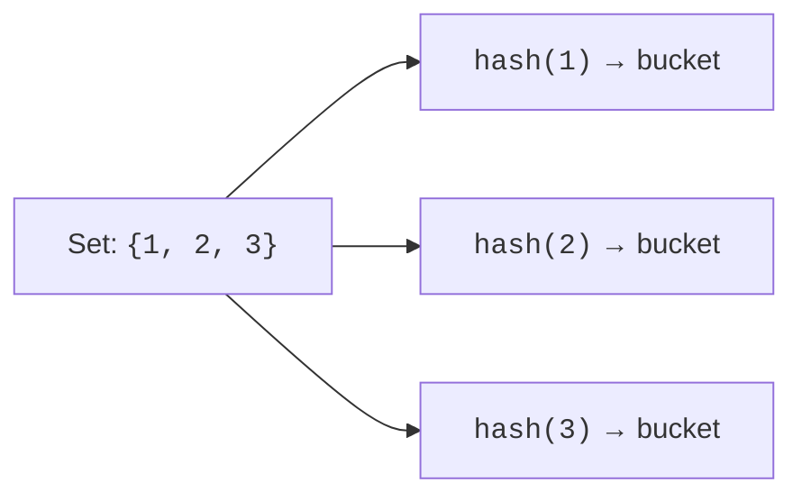
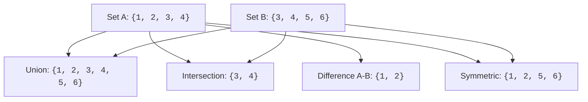

A `set` is an unordered collection of unique, hashable items. Membership testing is O(1) on average, which makes sets the right tool for deduplication, fast lookups, and mathematical set operations. In data work, sets are everywhere: removing duplicate IDs, checking if a user is in an allowed list, finding the intersection of two tag lists, filtering out stop words, and more.

<Figure
  slug="python-basics-sets-cutout"
  alt="Three overlapping translucent circles forming a Venn diagram, with shapes sorted into the unique and shared regions"
/>

Every snippet on this page runs in your browser, no setup required.

## How sets work

Like dicts, sets are implemented as **hash tables**. A set is essentially a dict with only keys (no values). This gives O(1) average-case membership testing, insertion, and deletion.

<Callout type="info">
Sets and dicts share the same underlying implementation: hash tables. A set is like a dict where you only care about the keys. This is why both require hashable elements/keys and both give O(1) average-case lookups.
</Callout>

## Creating sets

The literal syntax uses curly braces, but **without** colons.

<CodeBlock
  adapter="python"
  files={[
    {
      filename: "main.py",
      starterCode: `nums = {1, 2, 3}
print(nums)
`,
    },
  ]}
/>

<Callout type="warn" title="Empty set syntax">
`{}` is an **empty dict**, not an empty set. For an empty set, use `set()`.
</Callout>

<CodeBlock
  adapter="python"
  files={[
    {
      filename: "main.py",
      starterCode: `empty = set()
print(empty)
print(type(empty))

not_empty = {}
print(type(not_empty))
`,
    },
  ]}
/>

The `set()` constructor converts any iterable into a set, automatically deduplicating.

<CodeBlock
  adapter="python"
  files={[
    {
      filename: "main.py",
      starterCode: `unique = set([1, 2, 2, 3, 3, 3])
print(unique)
`,
    },
  ]}
/>

<CodeBlock
  adapter="python"
  files={[
    {
      filename: "main.py",
      starterCode: `chars = set("banana")
print(chars)
`,
    },
  ]}
/>

## Adding and removing

`.add` inserts a single item.

<CodeBlock
  adapter="python"
  files={[
    {
      filename: "main.py",
      starterCode: `s = {1, 2, 3}
s.add(4)
print(s)
`,
    },
  ]}
/>

Adding an item that already exists does nothing (sets are unique by definition).

<CodeBlock
  adapter="python"
  files={[
    {
      filename: "main.py",
      starterCode: `s = {1, 2, 3}
s.add(2)
print(s)
`,
    },
  ]}
/>

`.discard` removes an item without raising an error if it is missing.

<CodeBlock
  adapter="python"
  files={[
    {
      filename: "main.py",
      starterCode: `s = {1, 2, 3}
s.discard(2)
s.discard(99)
print(s)
`,
    },
  ]}
/>

`.remove` removes an item but **raises** `KeyError` if it is missing.

<CodeBlock
  adapter="python"
  files={[
    {
      filename: "main.py",
      starterCode: `s = {1, 2, 3}
s.remove(2)
try:
    s.remove(99)
except KeyError as e:
    print("KeyError:", e)
print(s)
`,
    },
  ]}
/>

`.pop` removes and returns an arbitrary element. The choice is unpredictable because sets are unordered.

<CodeBlock
  adapter="python"
  files={[
    {
      filename: "main.py",
      starterCode: `s = {1, 2, 3}
popped = s.pop()
print("popped:", popped)
print("remaining:", s)
`,
    },
  ]}
/>

## Set algebra

This is the killer feature: classic mathematical set operations are built in with both methods and operators.

| Operation | Operator | Method |
| --- | --- | --- |
| Union | `a \| b` | `a.union(b)` |
| Intersection | `a & b` | `a.intersection(b)` |
| Difference | `a - b` | `a.difference(b)` |
| Symmetric difference | `a ^ b` | `a.symmetric_difference(b)` |
| Subset | `a <= b` | `a.issubset(b)` |
| Superset | `a >= b` | `a.issuperset(b)` |
| Disjoint | n/a | `a.isdisjoint(b)` |

<CodeBlock
  adapter="python"
  files={[
    {
      filename: "main.py",
      starterCode: `a = {1, 2, 3, 4}
b = {3, 4, 5, 6}

print("union:        ", a | b)
print("intersection: ", a & b)
print("a - b:        ", a - b)
print("b - a:        ", b - a)
print("symmetric:    ", a ^ b)
`,
    },
  ]}
/>

<CodeBlock
  adapter="python"
  files={[
    {
      filename: "main.py",
      starterCode: `a = {1, 2, 3, 4}
print("subset?  ", {1, 2}.issubset(a))
print("superset?", a.issuperset({1, 2}))
print("disjoint?", a.isdisjoint({99}))
`,
    },
  ]}
/>

<Callout type="info" title="Real-world set operations">
In data analysis, you constantly ask questions like "which users visited both pages?" (intersection), "which tags are in dataset A but not B?" (difference), "which emails appear in any of these lists?" (union). Sets make these queries one-liners.
</Callout>

## Sets vs lists for lookup

This is where sets shine. Membership testing in a list is O(n); in a set it is O(1).

That gap compounds when the whole *operation* is a set operation. Intersecting
two collections with a nested loop compares every element against every
element; converting both to sets first does one pass each and then one lookup
per element, and the tables pay for themselves immediately:

<Chart slug="set-ops-vs-nested-loops" />

<CodeBlock
  adapter="python"
  files={[
    {
      filename: "main.py",
      starterCode: `import time

big_list = list(range(1_000_000))
big_set = set(big_list)

t0 = time.perf_counter()
result1 = 999_999 in big_list
t1 = time.perf_counter()
result2 = 999_999 in big_set
t2 = time.perf_counter()

print(f"list: {(t1 - t0) * 1000:.2f} ms")
print(f"set:  {(t2 - t1) * 1000:.4f} ms")
`,
    },
  ]}
/>

Rule of thumb: if you are checking membership more than once or twice, convert to a set first.

## Items must be hashable

Same rule as dict keys: ints, strings, tuples of hashables, and frozensets are fine; lists and dicts are not.

<CodeBlock
  adapter="python"
  files={[
    {
      filename: "main.py",
      starterCode: `good = {(1, 2), "hi", 42, frozenset({1, 2})}
print(good)
`,
    },
  ]}
/>

<CodeBlock
  adapter="python"
  files={[
    {
      filename: "main.py",
      starterCode: `try:
    bad = {[1, 2]}
except TypeError as e:
    print("TypeError:", e)
`,
    },
  ]}
/>

<Callout type="warn">
The requirement is **hashability**, not immutability. A tuple containing a mutable object (like a list) is itself unhashable, even though tuples are normally immutable.
</Callout>

<CodeBlock
  adapter="python"
  files={[
    {
      filename: "main.py",
      starterCode: `try:
    bad = {(1, [2, 3])}
except TypeError as e:
    print("TypeError:", e)
`,
    },
  ]}
/>

## `frozenset`

If you need an immutable, hashable set (for example to use as a dict key or another set's element), use `frozenset`.

<CodeBlock
  adapter="python"
  files={[
    {
      filename: "main.py",
      starterCode: `tags = frozenset({"python", "tutorial"})
lookup = {tags: "course-1"}
print(lookup[frozenset({"tutorial", "python"})])
`,
    },
  ]}
/>

<CodeBlock
  adapter="python"
  files={[
    {
      filename: "main.py",
      starterCode: `set_of_sets = {frozenset({1, 2}), frozenset({3, 4})}
print(set_of_sets)
`,
    },
  ]}
/>

## Challenges

<ChallengeCard
  adapter="python"
  title="Common interests"
  instructions={`Define \`common_interests(a, b)\` that takes two lists of interest strings and returns a **set** of the interests that appear in both, case-insensitive.`}
  files={[
    {
      filename: "main.py",
      starterCode: `def common_interests(a, b):
    # your code here
    return set()
`,
      solutionCode: `def common_interests(a, b):
    return {x.lower() for x in a} & {x.lower() for x in b}
`,
    },
  ]}
  tests={[
    {
      id: "basic",
      name: "Basic intersection",
      code: `assert common_interests(["Music", "Hiking"], ["hiking", "Travel"]) == {"hiking"}`,
    },
    {
      id: "none",
      name: "No overlap returns empty set",
      code: `assert common_interests(["a"], ["b"]) == set()`,
    },
    {
      id: "all",
      name: "All overlap",
      code: `assert common_interests(["A", "B"], ["a", "B"]) == {"a", "b"}`,
    },
  ]}
/>

<ChallengeCard
  adapter="python"
  title="Unique vowels"
  instructions={`Define \`unique_vowels(text)\` that returns the set of lowercase vowels (\`a\`, \`e\`, \`i\`, \`o\`, \`u\`) that appear in \`text\`, ignoring case.`}
  files={[
    {
      filename: "main.py",
      starterCode: `def unique_vowels(text):
    # your code here
    return set()
`,
      solutionCode: `def unique_vowels(text):
    return {c for c in text.lower() if c in "aeiou"}
`,
    },
  ]}
  tests={[
    {
      id: "basic",
      name: "Basic vowels",
      code: `assert unique_vowels("Hello World") == {"e", "o"}`,
    },
    {
      id: "all",
      name: "All vowels",
      code: `assert unique_vowels("AEIOUaeiou") == {"a", "e", "i", "o", "u"}`,
    },
    {
      id: "none",
      name: "Consonants only",
      code: `assert unique_vowels("rhythm") == set()`,
    },
  ]}
/>

<MultipleChoice
  markdown={`What does \`{1, 2, 3} & {2, 3, 4}\` evaluate to?

- \`{1, 2, 3, 4}\`
  > That would be the union (\`|\`), not intersection.
- \`{1}\`
  > That would be \`{1, 2, 3} - {2, 3, 4}\`.
- \`{1, 4}\`
  > That would be symmetric difference (\`^\`).
- [o] \`{2, 3}\`
  > \`&\` is set intersection, returning items in both.`}
/>

<MultipleChoice
  markdown={`Which of these creates an **empty set**?

- \`[]\`
  > That is an empty list.
- \`()\`
  > That is an empty tuple.
- [o] \`set()\`
  > \`set()\` is the only way to create an empty set.
- \`{}\`
  > That is an empty **dict**.`}
/>

<MultipleChoice
  markdown={`What is the time complexity of \`item in s\` where \`s\` is a set?

- O(log n)
  > Sets use hashing, not binary search.
- O(n)
  > That would be true for a list, not a set.
- O(n²)
  > Set lookup is much faster than quadratic.
- [o] O(1) average case
  > Sets use hash tables, giving O(1) average-case lookup.`}
/>

We have now seen every major collection. Next: how to direct flow through them with conditionals and loops.
