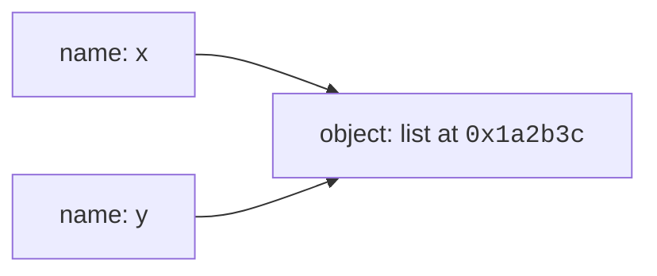

In Python, a **variable** is a name that references an object in memory. There's no `let`, `var`, or type declaration-assignment with `=` creates the binding. This simplicity is powerful, but it comes with subtleties you need to understand to avoid surprises.

<IllustrationPrompt id="python-basics-variables" />

Every snippet on this page runs in your browser-no setup required.

<CodeBlock
  adapter="python"
  files={[
    {
      filename: "main.py",
      starterCode: `age = 30
name = "Ada"
pi = 3.14159

print(name, "is", age, "years old. Pi is approximately", pi)
`,
    },
  ]}
/>

<svg
  viewBox="0 0 640 200"
  role="img"
  aria-label="Three yellow name tags hang by thin lines above two solid values, and two of the tags are tied to the same blue circle, Python variables are labels attached to values, not boxes that contain them"
  style={{ display: "block", width: "100%", maxWidth: "640px", height: "auto", margin: "2.5rem auto" }}
>
  <g stroke="var(--ds-gray-300)" strokeWidth="2" strokeLinecap="round">
    <line x1="128" y1="66" x2="172" y2="116" />
    <line x1="248" y1="66" x2="192" y2="116" />
    <line x1="438" y1="66" x2="404" y2="114" />
  </g>
  <g style={{ color: "var(--ds-yellow-500)" }} fill="currentColor">
    <rect x="90" y="40" width="76" height="24" rx="12" />
    <rect x="210" y="40" width="76" height="24" rx="12" />
    <rect x="400" y="40" width="76" height="24" rx="12" />
  </g>
  <g style={{ color: "var(--ds-blue-500)" }} fill="currentColor">
    <circle cx="180" cy="140" r="22" />
  </g>
  <g style={{ color: "var(--ds-green-500)" }} fill="currentColor">
    <rect x="380" y="118" width="48" height="48" rx="10" />
  </g>
</svg>

## Real-world context: Variables everywhere

Variables are the foundation of every program. In a web app, you might have `user_id`, `session_token`, and `request_data`. In a data pipeline, `rows`, `schema`, and `output_path`. In a game, `player_x`, `enemy_health`, and `score`. Names let you give meaning to values and reuse them throughout your code.

## Names are labels, not boxes

**This is the most important mental model for Python.** Variables are not containers that hold values-they're *labels* that point to objects in memory.



When you write `x = [1, 2, 3]`, Python creates a list object and binds the name `x` to it. If you then write `y = x`, you're binding a second name to the **same** list object.

<CodeBlock
  adapter="python"
  files={[
    {
      filename: "main.py",
      starterCode: `x = [1, 2, 3]
y = x
print(f"x is y: {x is y}")
`,
    },
  ]}
/>

Mutating the object through one name is visible through all names that reference it:

<CodeBlock
  adapter="python"
  files={[
    {
      filename: "main.py",
      starterCode: `x = [1, 2, 3]
y = x
y.append(4)
print("x:", x)
print("y:", y)
`,
    },
  ]}
/>

<Callout type="warn" title="Mutable default arguments gotcha">
This label-not-box model is why mutable defaults in function signatures are dangerous:

```python
def add_item(item, items=[]):
    items.append(item)
    return items
```

The empty list `[]` is created **once** when the function is defined, and every call that omits `items` will reference the same list object. We'll revisit this when we cover functions.
</Callout>

To create an independent copy of a list, use `.copy()` or the `list()` constructor:

<CodeBlock
  adapter="python"
  files={[
    {
      filename: "main.py",
      starterCode: `x = [1, 2, 3]
z = x.copy()
z.append(99)
print("x:", x)
print("z:", z)
print(f"Same object? {x is z}")
`,
    },
  ]}
/>

## Dynamic typing: freedom and footguns

Python names have no fixed type. You can rebind a name to a value of any type at any time.

<CodeBlock
  adapter="python"
  files={[
    {
      filename: "main.py",
      starterCode: `value = 42
print(type(value))
`,
    },
  ]}
/>

<CodeBlock
  adapter="python"
  files={[
    {
      filename: "main.py",
      starterCode: `value = 42
value = "now I'm a string"
print(type(value))
`,
    },
  ]}
/>

<CodeBlock
  adapter="python"
  files={[
    {
      filename: "main.py",
      starterCode: `value = 42
value = [1, 2, 3]
print(type(value))
`,
    },
  ]}
/>

This is convenient for rapid prototyping, but it means **typos in variable names are not caught until runtime**. In a statically typed language like Java or Go, `usre_id = 123` (instead of `user_id`) would be a compile error. In Python, it's just a new variable.

<Callout type="info" title="Type annotations: the best of both worlds">
Python 3.5+ supports optional type annotations:

```python
user_id: int = 123
name: str = "Ada"
```

These don't affect runtime behavior, but tools like `mypy` can check your code for type errors before you run it. In production codebases, type annotations are increasingly the norm-they catch bugs early and make code easier to understand.
</Callout>

## Naming rules and conventions

A valid Python identifier:

- Starts with a letter (including Unicode letters like `é`, `你`) or underscore `_`.
- Continues with letters, digits, or underscores.
- Is **case-sensitive**: `Score` and `score` are different names.
- Cannot be a [reserved keyword](https://docs.python.org/3/reference/lexical_analysis.html#keywords) like `if`, `class`, `def`, `return`, `pass`, `lambda`.

<CodeBlock
  adapter="python"
  files={[
    {
      filename: "main.py",
      starterCode: `import keyword

print("Reserved keywords:", keyword.kwlist)
`,
    },
  ]}
/>

### PEP 8 style conventions

[PEP 8](https://pep8.org/) is Python's style guide. Following it makes your code readable to other Python developers.

| Kind | Convention | Example |
| --- | --- | --- |
| Variable, function | `snake_case` | `user_count`, `fetch_data` |
| Constant | `UPPER_SNAKE_CASE` | `MAX_RETRIES`, `API_KEY` |
| Class | `PascalCase` | `HttpClient`, `UserProfile` |
| Module file | `snake_case.py` | `data_loader.py` |
| Private (by convention) | leading `_` | `_internal_cache` |

<Callout type="info" title="Why PEP 8?">
Consistency makes code easier to read. When every Python project uses `snake_case` for functions and `PascalCase` for classes, you can glance at `HttpClient()` and know it's a class, or at `fetch_data()` and know it's a function-without reading the definition.
</Callout>

## Multiple assignment patterns

Python supports several shorthand forms that make common patterns more concise.

<CodeBlock
  adapter="python"
  files={[
    {
      filename: "main.py",
      starterCode: `# Bind the same value to multiple names.
a = b = c = 0
print(a, b, c)
`,
    },
  ]}
/>

<CodeBlock
  adapter="python"
  files={[
    {
      filename: "main.py",
      starterCode: `# Unpack a sequence into multiple names.
x, y, z = [1, 2, 3]
print(x, y, z)
`,
    },
  ]}
/>

<CodeBlock
  adapter="python"
  files={[
    {
      filename: "main.py",
      starterCode: `# The Pythonic swap: no temporary variable needed.
x, y = 10, 20
x, y = y, x
print(x, y)
`,
    },
  ]}
/>

## Constants?

Python has no enforced `const` keyword. The convention is to use `ALL_CAPS` names and trust developers to leave them alone.

```python
MAX_RETRIES = 3
TIMEOUT_SECONDS = 30
API_BASE_URL = "https://api.example.com"
```

As of Python 3.8, the `typing.Final` annotation lets static type checkers enforce immutability:

```python
from typing import Final
MAX_RETRIES: Final[int] = 3
```

But at runtime, nothing stops reassignment. Python trusts you.

## Challenges

<ChallengeCard
  adapter="python"
  title="Swap two variables"
  instructions={`Without using a temporary variable, swap the values of \`a\` and \`b\` in a single line so that \`a\` becomes \`"banana"\` and \`b\` becomes \`"apple"\`.`}
  files={[
    {
      filename: "main.py",
      starterCode: `a = "apple"
b = "banana"

# Your single line of code here

print("a =", a)
print("b =", b)
`,
      solutionCode: `a = "apple"
b = "banana"
a, b = b, a
print("a =", a)
print("b =", b)
`,
    },
  ]}
  tests={[
    {
      id: "swap_correct",
      name: "Values are swapped",
      code: `assert a == "banana" and b == "apple"`,
    },
  ]}
/>

<ChallengeCard
  adapter="python"
  title="Valid identifier checker"
  instructions={`Write a function \`is_valid_identifier(name)\` that returns \`True\` if \`name\` is a valid Python identifier that is not a reserved keyword, and \`False\` otherwise. Use the \`str.isidentifier()\` method and the \`keyword\` module.`}
  files={[
    {
      filename: "main.py",
      starterCode: `import keyword


def is_valid_identifier(name):
    # Your code here
    return False


print(is_valid_identifier("user_count"))
print(is_valid_identifier("2nd_place"))
print(is_valid_identifier("class"))
`,
      solutionCode: `import keyword


def is_valid_identifier(name):
    return name.isidentifier() and not keyword.iskeyword(name)


print(is_valid_identifier("user_count"))
print(is_valid_identifier("2nd_place"))
print(is_valid_identifier("class"))
`,
    },
  ]}
  tests={[
    {
      id: "valid",
      name: "Accepts valid identifiers",
      code: `assert is_valid_identifier("user_count") is True
assert is_valid_identifier("_private") is True`,
    },
    {
      id: "starts_with_digit",
      name: "Rejects names starting with digit",
      code: `assert is_valid_identifier("2nd_place") is False`,
    },
    {
      id: "keyword",
      name: "Rejects reserved keywords",
      code: `assert is_valid_identifier("class") is False
assert is_valid_identifier("def") is False`,
    },
  ]}
/>

## Check your understanding

<MultipleChoice
  markdown={`What does this code print?

\`\`\`python
nums = [1, 2, 3]
also_nums = nums
also_nums.append(4)
print(nums)
\`\`\`

- \`[1, 2, 3]\`
  > Assignment binds \`also_nums\` to the same list object that \`nums\` references. Both names point to the same list in memory.
- [o] \`[1, 2, 3, 4]\`
  > \`nums\` and \`also_nums\` are two names for the same list. Mutating through one name is visible through the other.
- A \`NameError\`
  > No error, \`nums\` is defined before \`also_nums\` references it.
- \`[4]\`
  > \`append\` adds to the list; it doesn't replace it.`}
/>

<MultipleChoice
  markdown={`Which of the following is **not** a valid Python identifier?

- \`user_count\`
  > Valid. Starts with a letter, contains letters and underscores.
- \`_private\`
  > Valid. Leading underscores are allowed.
- [o] \`2nd_place\`
  > Identifiers cannot start with a digit.
- \`café\`
  > Valid. Python 3 allows Unicode letters in identifiers.`}
/>

<MultipleChoice
  markdown={`After this code runs, what is the value of \`x\`?

\`\`\`python
x = [10, 20]
y = x
y = y + [30]
\`\`\`

- \`[10, 20, 30, 30]\`
  > \`y + [30]\` creates a new list; it doesn't mutate the original.
- [o] \`[10, 20]\`
  > The line \`y = y + [30]\` creates a new list and rebinds \`y\` to it. The original list \`x\` references is unchanged.
- \`[10, 20, 30]\`
  > That's the value of \`y\` after the reassignment, not \`x\`.
- An error
  > No error-concatenating lists with \`+\` is perfectly legal.`}
/>

Next: a tour of Python's built-in data types.
