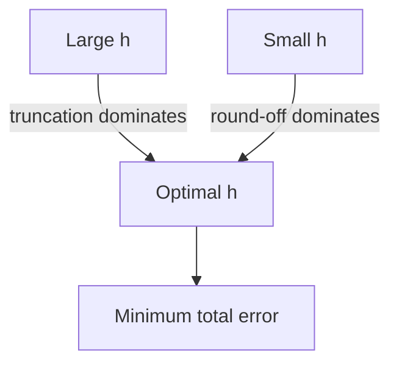

Most quantities a scientist wants to compute are *limits*, derivatives,
integrals, infinite series, fixed points. A computer can only afford
a *finite* version of a limit. Numerical analysis is largely the
study of how to choose that finite version so the answer is good
enough.

This page introduces the two flavors of error that show up in every
approximation method (**truncation error** from "stopping early" and
**round-off error** from finite precision), how they interact, and
how to think about the *order* of convergence of a method.

<Figure
  slug="scipy-approximation-error-cutout"
  alt="Two small error weights on a balance beam, one shrinking as the step size drops and one growing, meeting at a minimum"
/>

## Truncation vs round-off

Pick any approximation parameter $h$ that controls the
"resolution", a step size, the number of terms in a series, the
spacing of a grid. Then the total error of a method usually has
two contributions:

$$ E(h) \;=\; \underbrace{C \, h^p}_{\text{truncation}} \;+\; \underbrace{D / h^q}_{\text{round-off}} $$

- **Truncation error** dominates when $h$ is *large*. Use a smaller
  $h$ to fix it.
- **Round-off error** dominates when $h$ is *small*. Use a larger
  $h$ to fix it.

You cannot escape both at once. The minimum total error is the
**sweet spot**, and finding it is a recurring design problem.

The cleanest example is numerical differentiation, which we already
glimpsed in the floating-point chapter. Let us draw the full
picture.

<CodeBlock
  adapter="python"
  files={[
    {
      filename: "main.py",
      starterCode: `import numpy as np
import matplotlib.pyplot as plt

# Approximate f'(1) with f(x) = sin(x).  True derivative = cos(1) ≈ 0.5403
f, fp_true = np.sin, np.cos(1.0)
x0 = 1.0

hs = 10.0 ** np.arange(0, -17, -1)
errs_fwd = np.abs((f(x0 + hs) - f(x0)) / hs - fp_true)
errs_ctr = np.abs((f(x0 + hs) - f(x0 - hs)) / (2 * hs) - fp_true)

plt.loglog(hs, errs_fwd, "o-", label="forward diff, O(h)")
plt.loglog(hs, errs_ctr, "s-", label="centered diff, O(h²)")
plt.gca().invert_xaxis()
plt.xlabel("step size h")
plt.ylabel("|error|")
plt.title("Truncation + round-off tradeoff")
plt.legend()
plt.grid(True, which="both")
plt.show()
`,
    },
  ]}
/>

The curves form a "V". The left side of each V is *truncation*: a
straight slope of $1$ for the forward difference, $2$ for the
centered one. The right side is *round-off*: the errors grow as $h$
shrinks because we are dividing two nearly-equal floats by a
nearly-zero $h$. The bottom of the V is the best you can do.

Theoretical analysis says the sweet spots are roughly:

| Method | Truncation order | Optimal $h$ | Optimal error |
| --- | --- | --- | --- |
| Forward difference $\frac{f(x+h)-f(x)}{h}$ | $O(h)$ | $\sqrt{\epsilon}$ | $\sqrt{\epsilon} \approx 10^{-8}$ |
| Centered difference $\frac{f(x+h)-f(x-h)}{2h}$ | $O(h^2)$ | $\sqrt[3]{\epsilon}$ | $\epsilon^{2/3} \approx 10^{-11}$ |
| Richardson extrapolation | $O(h^4)$ and higher | larger | even smaller |

A higher-order method gives you more accuracy *and* lets you use a
larger $h$, a double win, paid for with a slightly more complex
update formula.

## Convergence and order

A numerical method **converges of order $p$** if its error shrinks
like $h^p$ as $h \to 0$. Higher $p$ means dramatically faster
convergence: halving $h$ for an order-1 method halves the error, but
halves an order-4 method's error by a factor of $16$.

We can *empirically measure* convergence order. Compute the error at
two step sizes $h_1$ and $h_2 = h_1 / 2$:

$$ p \approx \log_2 \frac{E(h_1)}{E(h_2)} $$

<CodeBlock
  adapter="python"
  files={[
    {
      filename: "main.py",
      starterCode: `import numpy as np

# Simpson's rule for ∫_0^1 e^x dx = e - 1
def simpson(f, a, b, n):
    n = (n // 2) * 2 + 2  # ensure even
    x = np.linspace(a, b, n + 1)
    y = f(x)
    return (
        (b - a) / (3 * n) * (y[0] + y[-1] + 4 * y[1:-1:2].sum() + 2 * y[2:-1:2].sum())
    )

f = np.exp
true = np.e - 1
print(f"{'n':>6}  {'error':>12}  {'order':>7}")
prev = None
for n in [8, 16, 32, 64, 128, 256, 512]:
    err = abs(simpson(f, 0, 1, n) - true)
    order = "" if prev is None else f"{np.log2(prev / err):.2f}"
    print(f"{n:6d}  {err:12.3e}  {order:>7}")
    prev = err
`,
    },
  ]}
/>

The third column hovers around $4$, because Simpson's rule is
$O(h^4)$. Doubling the number of intervals divides the error by
about $16$ until round-off finally takes over near $n \approx 512$.

## Convergence rate matters more than constants

The same argument the complexity curves make: a better rate overtakes a
better constant, and it does so sooner than intuition suggests.

<Chart slug="big-o-growth" />

A first-order method needs $10^6$ steps to gain $6$ digits of
accuracy. A fourth-order method needs only $30$. **Order beats
constants** for any problem accurate enough to matter.

| Method order | Error per step | Steps for ~15 digits |
| --- | --- | --- |
| 1 | halves | ~50 |
| 2 | $\div 4$ | ~25 |
| 4 | $\div 16$ | ~13 |
| 8 | $\div 256$ | ~6 |

This is why SciPy's `solve_ivp` defaults to `RK45` (a 4th–5th order
Runge–Kutta pair) rather than to plain Euler.

## Series acceleration: when convergence is slow

Some series converge mathematically but agonizingly slowly. The
Leibniz formula

$$ \frac{\pi}{4} \;=\; 1 - \frac{1}{3} + \frac{1}{5} - \frac{1}{7} + \cdots $$

needs $10^6$ terms to get $6$ digits right. That is wasteful when
**series acceleration** techniques can squeeze the same digits out
of a handful of terms.

<CodeBlock
  adapter="python"
  files={[
    {
      filename: "main.py",
      starterCode: `import numpy as np

# Partial sums of the Leibniz series for π/4
N = 30
terms = np.array([(-1) ** k / (2 * k + 1) for k in range(N)])
partial = np.cumsum(terms)
print("Plain partial sum (last 5):")
for s in partial[-5:]:
    print(f"  4*S = {4 * s:.10f}  error = {abs(4 * s - np.pi):.2e}")

# Euler's transformation: average consecutive partial sums
# (Repeated averaging accelerates alternating series convergence)
acc = partial.copy()
for _ in range(20):
    acc = 0.5 * (acc[:-1] + acc[1:])
print("\\nAfter 20 averaging passes:")
print(f"  4*S = {4 * acc[-1]:.10f}  error = {abs(4 * acc[-1] - np.pi):.2e}")
`,
    },
  ]}
/>

The plain partial sum after 30 terms is off by about $0.03$. The
*same 30 terms* fed into a repeated-average acceleration give
$\pi$ to ten digits. The numerical method is far more important
than the number of terms.

## Adaptive methods: choose $h$ at runtime

When the answer changes quickly in one region and slowly in another,
a fixed step size is wasteful. **Adaptive methods** estimate the
local error on each step and shrink or grow $h$ to keep the error
near a user-specified tolerance.

SciPy's `quad` (general 1-D integration) is adaptive by default.
Try integrating something with a sharp spike.

<CodeBlock
  adapter="python"
  files={[
    {
      filename: "main.py",
      starterCode: `import numpy as np
from scipy.integrate import quad, simpson

# A function with a sharp Lorentzian peak at x = 0
def f(x):
    return 1.0 / (1.0 + 1000 * x**2)

# Adaptive quadrature
value, err_est = quad(f, -1, 1)
print(f"Adaptive  ∫ f dx = {value:.10f}  (error ≈ {err_est:.2e})")

# Non-adaptive Simpson's rule needs many points to match
for n in [101, 1001, 10001]:
    xs = np.linspace(-1, 1, n)
    s = simpson(f(xs), x=xs)
    print(f"Simpson n={n:5d}  ∫ f dx = {s:.10f}  err = {abs(s - value):.2e}")
`,
    },
  ]}
/>

`quad` converges fast because it concentrates samples near the
spike. The uniform Simpson rule wastes most of its samples on the
flat regions. **Use adaptive methods unless you have a reason not
to.**

## A short challenge

<ChallengeCard
  adapter="python"
  title="Estimate convergence order"
  instructions={`Implement \`estimate_order(errors)\` that takes a list of errors produced at step sizes $h, h/2, h/4, \\dots$ and returns an estimate of the convergence order $p$ such that error $\\propto h^p$.

For consecutive errors $E_1, E_2$ at step sizes $h$ and $h/2$,
$p \\approx \\log_2(E_1 / E_2)$. Return the **mean** of those
estimates across consecutive pairs.`}
  files={[
    {
      filename: "main.py",
      starterCode: `import math

def estimate_order(errors):
    # TODO: average log2(E_i / E_{i+1}) across consecutive pairs
    return 0.0

# Quick check: O(h²) data
errs = [1e-2, 2.5e-3, 6.25e-4, 1.5625e-4]
print("Estimated order:", estimate_order(errs))  # ~2
`,
      solutionCode: `import math

def estimate_order(errors):
    ratios = []
    for a, b in zip(errors, errors[1:]):
        ratios.append(math.log2(a / b))
    return sum(ratios) / len(ratios)
`,
    },
  ]}
  tests={[
    {
      id: "order_2",
      name: "Detects order 2",
      code: `import math
errs = [1.0, 0.25, 0.0625, 0.015625]
assert math.isclose(estimate_order(errs), 2.0, abs_tol=1e-9)`,
    },
    {
      id: "order_4",
      name: "Detects order 4",
      code: `import math
errs = [1.0, 1/16, 1/256, 1/4096]
assert math.isclose(estimate_order(errs), 4.0, abs_tol=1e-9)`,
    },
    {
      id: "noisy",
      name: "Tolerates noisy data",
      code: `import math
errs = [1.0, 0.27, 0.063, 0.017]
est = estimate_order(errs)
assert 1.7 < est < 2.3, f"expected ~2, got {est}"`,
    },
  ]}
/>

## Check your understanding

<MultipleChoice
  markdown={`A finite-difference derivative shows error decreasing as $h$ shrinks until $h \\approx 10^\{-6\}$, after which the error starts to **grow**. What is happening?

- The numpy library is broken
  > A library bug would not produce the smooth, reproducible V-shaped error curve; it would be observed regardless of $h$ and would not follow the theoretical $O(h)$ decrease on the truncation side.
- The CPU is malfunctioning
  > CPU hardware does not produce this smooth, predictable V-shaped pattern; hardware faults produce unpredictable, non-reproducible errors rather than a systematic increase as $h$ shrinks.
- The function is non-differentiable
  > Non-differentiability would cause the error to plateau or behave irregularly, not to decrease and then grow in the characteristic V-shape seen here.
- [o] Truncation error is shrinking but round-off error is growing; below the optimal $h$, round-off dominates because $f(x+h) - f(x)$ loses most of its significant digits to cancellation
  > This is the classic "V-shaped" total-error curve: truncation falls as $h \\to 0$, round-off grows as $h \\to 0$, and the minimum sits at the crossover.

Recognizing this V-curve in a log–log plot is a key diagnostic skill for numerical work.`}
/>

<MultipleChoice
  markdown={`You have two numerical integrators. Method A has truncation error $O(h)$; method B has truncation error $O(h^4)$. To achieve the same accuracy that method B reaches with $32$ steps, roughly how many steps does method A need?

- About 128
  > $128$ is too small by many orders of magnitude; multiplying by 4 treats the order as a linear factor rather than an exponent.
- About 32
  > $32$ steps would only be enough if method A had the same fourth-order accuracy as method B; a first-order method needs many more steps to match the same error level.
- About $32 \\cdot 4 = 128$
  > Multiplying by 4 treats the order as a simple multiplier on step count; the correct relationship is exponential because the error scales as $h^p$.
- [o] About $32^4 \\approx 10^6$
  > Method A's error is $O(h)$ and method B's is $O(h^4)$. Matching B's error of $\\sim (1/32)^4$ requires $h \\sim (1/32)^4$, i.e. about $32^4 \\approx 10^6$ steps for method A.

Order of convergence dominates step count, which is why higher-order methods are almost always worth their extra per-step cost.`}
/>
