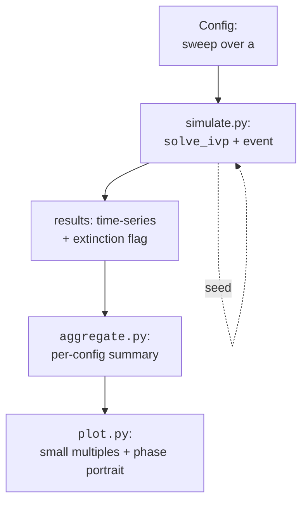

This capstone is a complete scientific computing project compressed
into a single page. We will:

- Build a multi-file simulation of a **Lotka–Volterra**
  predator–prey ecosystem
- Solve the differential equation with `solve_ivp()` and detect
  *extinction events*
- Run a **parameter sweep** over predation rates
- **Visualize** with small multiples and a phase portrait
- Quantify uncertainty by repeating with multiple seeds

By the end you will have used every skill from the course in a
single, coherent workflow.

<Figure
  slug="scipy-capstone-cutout"
  alt="A closed loop track on a platform with a predator figure and a prey figure chasing around it, a small phase-spiral panel beside it"
/>

## The model

A classic Lotka–Volterra system with logistic prey growth:

$$
\begin{aligned}
\dot x &= r\,x\,(1 - x/K) - a\,x\,y \\
\dot y &= e\,a\,x\,y - m\,y
\end{aligned}
$$

- $x$ = prey population (e.g. rabbits)
- $y$ = predator population (e.g. foxes)
- $r$ = prey intrinsic growth rate
- $K$ = prey carrying capacity
- $a$ = attack rate (how often predators catch prey)
- $e$ = conversion efficiency
- $m$ = predator mortality

## Pipeline overview

## The simulation module

<CodeBlock
  adapter="python"
  entryFilename="main.py"
  files={[
    {
      filename: "main.py",
      starterCode: `import numpy as np
import matplotlib.pyplot as plt
from simulate import run_one
from aggregate import summarize
from plot import small_multiples

# Parameter sweep over attack rate 'a' with 5 random seeds each
sweep = np.linspace(0.005, 0.04, 6)
seeds = [11, 22, 33, 44, 55]

all_runs = []
for a in sweep:
    for seed in seeds:
        all_runs.append(run_one(a=a, seed=seed))

summary = summarize(all_runs)
for row in summary:
    print(
        f"a = {row['a']:.4f}   "
        f"P(extinction) = {row['p_extinction']:.2f}   "
        f"⟨peak prey⟩ = {row['mean_peak_prey']:.1f}"
    )

small_multiples(all_runs, sweep)
plt.show()
`,
    },
    {
      filename: "simulate.py",
      starterCode: `import numpy as np
from scipy.integrate import solve_ivp

def make_rhs(r, K, a, e, m, sigma, rng, t_end, n_nodes=401):
    """Returns f(t, y) with a stochastic prey-growth perturbation.

    The noise is drawn ONCE, as a fixed path in time, and interpolated.
    That is not a stylistic choice. An adaptive solver requires f to be a
    deterministic function of (t, y): it estimates the local error by
    comparing two embedded formulas built from evaluations of f, and it
    reruns a step at a smaller h whenever that estimate is too big. Draw a
    fresh random number inside f and every evaluation disagrees with every
    other, so the solver reads noise as error, shrinks h, and reads the same
    noise again. The step size collapses and the run never ends. Freezing
    the path keeps the randomness (a seed still selects a realization) and
    gives the integrator something it can actually integrate.
    """
    t_nodes = np.linspace(0.0, t_end, n_nodes)
    xi = rng.standard_normal(n_nodes)

    def f(t, z):
        x, y = z
        noise = sigma * np.interp(t, t_nodes, xi)
        return [r * x * (1 - x / K) - a * x * y + noise * x, e * a * x * y - m * y]

    return f

def run_one(a, seed, r=1.0, K=200.0, e=0.1, m=0.4, sigma=0.02, t_end=200.0):
    rng = np.random.default_rng(seed)
    rhs = make_rhs(r, K, a, e, m, sigma, rng, t_end)

    # Event: predators go extinct (y drops below 0.5)
    def extinct(t, z):
        return z[1] - 0.5

    extinct.terminal = True
    extinct.direction = -1

    sol = solve_ivp(
        rhs,
        [0, t_end],
        y0=[40.0, 9.0],
        method="RK45",
        rtol=1e-7,
        atol=1e-9,
        events=extinct,
        dense_output=True,
        max_step=0.5,
    )

    t = np.linspace(0, sol.t[-1], 400)
    x, y = sol.sol(t)
    return {
        "a": a,
        "seed": seed,
        "t": t,
        "x": x,
        "y": y,
        "extinct": bool(sol.t_events[0].size),
        "t_extinct": float(sol.t_events[0][0]) if sol.t_events[0].size else None,
    }
`,
    },
    {
      filename: "aggregate.py",
      starterCode: `import numpy as np
from collections import defaultdict

def summarize(runs):
    """Group runs by parameter 'a' and compute summary stats."""
    groups = defaultdict(list)
    for r in runs:
        groups[r["a"]].append(r)

    out = []
    for a, group in sorted(groups.items()):
        ext = [r["extinct"] for r in group]
        peaks = [float(np.max(r["x"])) for r in group]
        out.append(
            {
                "a": a,
                "n": len(group),
                "p_extinction": np.mean(ext),
                "mean_peak_prey": np.mean(peaks),
            }
        )
    return out
`,
    },
    {
      filename: "plot.py",
      starterCode: `import numpy as np
import matplotlib.pyplot as plt

def small_multiples(runs, sweep):
    cols = len(sweep)
    fig, axes = plt.subplots(
        1,
        cols,
        figsize=(2.5 * cols, 3),
        sharex=True,
        sharey=True,
        constrained_layout=True,
    )
    for ax, a in zip(axes, sweep):
        for r in runs:
            if r["a"] != a:
                continue
            color = "tab:red" if r["extinct"] else "tab:blue"
            ax.plot(r["t"], r["x"], color=color, lw=0.8, alpha=0.7)
        ax.set_title(f"a = {a:.3f}", fontsize=10)
        ax.set_xlabel("time")
    axes[0].set_ylabel("prey x(t)")
    fig.suptitle("Prey trajectories (red = predator extinction)", y=1.02)
`,
    },
  ]}
/>

What this little project demonstrates:

- **Modeling.** Translating a biological story into a system of
  ODEs with parameters that have physical meaning.
- **Stable numerical integration.** Using `solve_ivp()` with
  `dense_output` and `max_step` to get smooth, controllable
  output.
- **Event detection.** Catching the extinction moment exactly.
- **Reproducible stochasticity.** A per-run `default_rng(seed)` so
  every replicate is exactly repeatable.
- **Parameter sweeps.** A clean loop over a grid of attack rates
  and seeds.
- **Aggregation.** Grouping replicates and computing summary
  statistics.
- **Visualization.** Small multiples that let your eye compare
  parameter regimes at a glance.

## A phase portrait

The classical way to look at a predator–prey system is in phase
space, predator on one axis, prey on the other. Closed orbits
mean sustained oscillations; spirals mean damped or growing
oscillations; runaway escape means extinction.

<CodeBlock
  adapter="python"
  files={[
    {
      filename: "main.py",
      starterCode: `import numpy as np
import matplotlib.pyplot as plt
from scipy.integrate import solve_ivp

def rhs(t, z, r=1.0, K=200.0, a=0.03, e=0.1, m=0.4):
    x, y = z
    return [r * x * (1 - x / K) - a * x * y, e * a * x * y - m * y]

# Several initial conditions
fig, ax = plt.subplots(figsize=(6, 5))
for x0 in [20, 60, 120, 180]:
    sol = solve_ivp(rhs, [0, 300], [x0, 5], dense_output=True, rtol=1e-8, atol=1e-10)
    t = np.linspace(0, 300, 4000)
    x, y = sol.sol(t)
    ax.plot(x, y, lw=0.7, label=f"x₀ = {x0}")

# Equilibrium point
x_eq = 0.4 / (0.1 * 0.03)
y_eq = 1.0 * (1 - x_eq / 200) / 0.03
ax.plot(x_eq, y_eq, "k*", ms=14, label="equilibrium")

ax.set_xlabel("prey x")
ax.set_ylabel("predator y")
ax.set_title("Lotka–Volterra phase portrait")
ax.legend()
plt.show()
`,
    },
  ]}
/>

Different starting populations spiral *into the same equilibrium*,
a behavior driven entirely by the prey's logistic carrying
capacity. Without that term the orbits would be perfect closed
loops (the classic Lotka–Volterra cycle).

## Quantifying sensitivity

A useful question: **how sensitive is extinction probability to
the attack rate $a$?** A small Monte Carlo over many seeds gives
us an answer with confidence bars.

<CodeBlock
  adapter="python"
  files={[
    {
      filename: "main.py",
      starterCode: `import numpy as np
from scipy.integrate import solve_ivp

def survives(a, seed):
    rng = np.random.default_rng(seed)
    # One frozen noise path per replicate, for the reason spelled out in
    # simulate.py: f has to be a deterministic function of (t, y) or the
    # adaptive step controller mistakes the randomness for its own error.
    t_nodes = np.linspace(0.0, 200.0, 401)
    xi = rng.standard_normal(t_nodes.size)

    def rhs(t, z, r=1.0, K=200.0, e=0.1, m=0.4, sigma=0.05):
        x, y = z
        noise = sigma * np.interp(t, t_nodes, xi)
        return [r * x * (1 - x / K) - a * x * y + noise * x, e * a * x * y - m * y]

    def extinct(t, z):
        return z[1] - 0.5

    extinct.terminal = True
    extinct.direction = -1

    sol = solve_ivp(
        rhs, [0, 200], [40, 9], rtol=1e-6, atol=1e-9, events=extinct, max_step=0.5
    )
    return 0 if sol.t_events[0].size else 1

# 20 replicates per a; estimate survival probability and 1-sigma error
for a in [0.005, 0.010, 0.015, 0.020, 0.030]:
    outcomes = np.array([survives(a, seed) for seed in range(20)])
    p = outcomes.mean()
    se = np.sqrt(p * (1 - p) / len(outcomes))
    print(f"a = {a:.3f}   survival = {p:.2f} ± {se:.2f}")
`,
    },
  ]}
/>

Predator survival *rises* with the attack rate, and it does not
rise gently: it is near zero up to $a = 0.015$, uncertain at
$a = 0.020$, and certain by $a = 0.030$. That is a threshold, and
the model tells you exactly where it should be. Predators grow
only while $e a x > m$, i.e. while prey exceed $m / (e a) = 4 / a$.
With a carrying capacity of $K = 200$ the prey can never supply
that until $4 / a < 200$, or $a > 0.02$. The Monte Carlo finds
the same number the algebra does, which is the check worth making
whenever a simulation and a closed form can both answer.

The interesting estimate is the one *at* the boundary. Only
$a = 0.020$ has a standard error worth printing, because only
there does the outcome depend on the noise rather than on the
parameters. This is the *output* of a real computational science
project: not just a number, but a number with an uncertainty, and
a reason the uncertainty is where it is.

## What you just used

A non-exhaustive list of techniques from this course that appear
in the capstone:

| Technique | Where |
| --- | --- |
| Vectorized NumPy | the entire RHS |
| Adaptive ODE integration | `solve_ivp()` with RK45 |
| Event detection | extinction at $y = 0.5$ |
| Reproducible randomness | `default_rng(seed)` per run |
| Multi-file project layout | `simulate / aggregate / plot` |
| Parameter sweep | nested loops over `a` and `seed` |
| Small-multiples visualization | `plot.small_multiples` |
| Monte Carlo uncertainty | survival probability ± SE |
| Phase-portrait analysis | predator–prey trajectories |

Scientific computing is rarely a single algorithm. It is a *pipeline*
of choices, each grounded in numerical understanding, glued
together by reproducible code.

## Check your understanding

<MultipleChoice
  markdown={`The capstone uses \`solve_ivp(..., events=extinct, dense_output=True, max_step=0.5)\`. Why \`max_step=0.5\` rather than letting the solver pick freely?

- It changes the order of the integrator
  > The order of an integrator (e.g. RK45 is 4th/5th order) is fixed by the method choice, not by \`max_step\`; the parameter only bounds the adaptive step size.
- It enables GPU acceleration
  > \`solve_ivp()\` runs on the CPU; no argument enables GPU execution.
- [o] An adaptive solver may take huge steps over slow dynamics and *miss* short-lived events; capping the step size forces the solver to evaluate the event function frequently enough to detect a fast extinction transient
  > The event detector only checks for a sign change *between* solver steps. If the predator crashes inside a single 5-second step, the event might be missed entirely. \`max_step\` bounds how aggressively the solver can grow its step, trading some performance for guaranteed event resolution.
- To slow down the simulation for visualization
  > Visualization speed is controlled by the plotting code, not by ODE solver parameters; \`max_step\` has no effect on how quickly results are displayed.

\`max_step\` is the underrated knob you reach for whenever events or sharp transients matter.`}
/>

<MultipleChoice
  markdown={`Why does the capstone summary report **both** \`mean_peak_prey\` and \`p_extinction\` per parameter setting, rather than just the population trajectory of one representative run?

- The CPU is faster that way
  > Computing aggregate statistics does not change CPU speed; the motivation is scientific validity, not performance.
- For aesthetic reasons
  > Aesthetic preference is not a scientific justification; the page makes clear that the dual reporting serves a statistical purpose.
- It is required by the language
  > Python imposes no requirement to report multiple statistics; the choice is driven by scientific methodology, not language rules.
- [o] A single trajectory hides stochastic variability. Aggregated quantities (means *and* probabilities) over many seeds report a property of the *parameter setting*, not of one lucky draw, and they come with quantifiable uncertainty
  > Reporting per-replicate aggregates is the difference between an anecdote and an experimental result. The probability of extinction over 20 seeds is a real quantity you can attach uncertainty bars to; one trajectory is a single sample from a distribution.

A computational experiment should always report aggregates and uncertainties, never a single representative run.`}
/>
