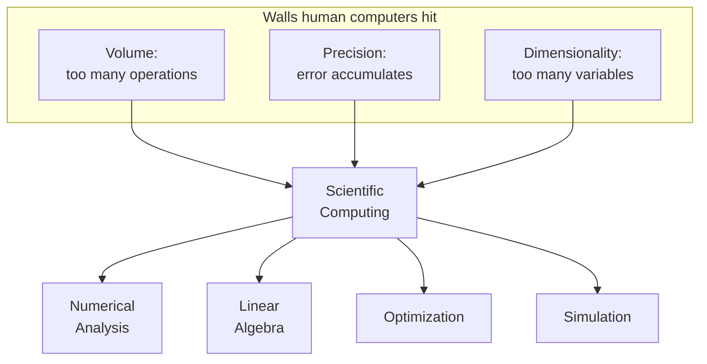
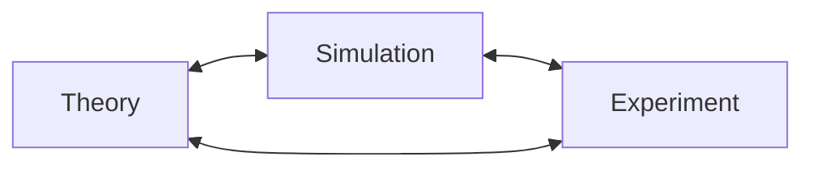

Before there were computers, there were **computers** — and they were
people. From the seventeenth century through the Second World War, a
"computer" was someone whose job was to grind through long arithmetic
by hand, for astronomy, navigation, ballistics, or engineering.
Teams of them — the women of the Harvard Observatory, the human
computers of the Army's Aberdeen Proving Ground — produced the
numerical infrastructure on which modern science was built.

This page is about the wall those human computers hit, and how, in a
single decade in the 1940s, the machines built to break through that
wall turned **simulation** into a new way of doing science. We will
run numerical code before the page is over.

<svg
  viewBox="0 0 640 210"
  role="img"
  aria-label="A small hand abacus dwarfed by a vast wall of faint dots stretching away to the right — the scale of calculation that outgrew human computers"
  style={{ display: "block", width: "100%", maxWidth: "640px", height: "auto", margin: "2.5rem auto" }}
>
  <g fill="currentColor">
    <rect x="60" y="60" width="140" height="100" rx="12" opacity="0.08" />
    <rect x="88" y="70" width="4" height="80" rx="2" opacity="0.2" />
    <rect x="128" y="70" width="4" height="80" rx="2" opacity="0.2" />
    <rect x="168" y="70" width="4" height="80" rx="2" opacity="0.2" />
  </g>
  <g style={{ color: "var(--ds-yellow-500)" }} fill="currentColor">
    <circle cx="90" cy="85" r="7" />
    <circle cx="90" cy="103" r="7" />
    <circle cx="130" cy="95" r="7" />
    <circle cx="130" cy="113" r="7" />
    <circle cx="130" cy="131" r="7" />
    <circle cx="170" cy="88" r="7" />
    <circle cx="170" cy="140" r="7" />
  </g>
  <g style={{ color: "var(--ds-blue-500)" }} fill="currentColor" opacity="0.3">
    <circle cx="300" cy="45" r="4" />
    <circle cx="348" cy="45" r="4" />
    <circle cx="396" cy="45" r="4" />
    <circle cx="444" cy="45" r="4" />
    <circle cx="492" cy="45" r="4" />
    <circle cx="540" cy="45" r="4" />
    <circle cx="588" cy="45" r="4" />
    <circle cx="300" cy="79" r="4" />
    <circle cx="348" cy="79" r="4" />
    <circle cx="396" cy="79" r="4" />
    <circle cx="444" cy="79" r="4" />
    <circle cx="492" cy="79" r="4" />
    <circle cx="540" cy="79" r="4" />
    <circle cx="588" cy="79" r="4" />
    <circle cx="300" cy="113" r="4" />
    <circle cx="348" cy="113" r="4" />
    <circle cx="396" cy="113" r="4" />
    <circle cx="444" cy="113" r="4" />
    <circle cx="492" cy="113" r="4" />
    <circle cx="540" cy="113" r="4" />
    <circle cx="588" cy="113" r="4" />
    <circle cx="300" cy="147" r="4" />
    <circle cx="348" cy="147" r="4" />
    <circle cx="396" cy="147" r="4" />
    <circle cx="444" cy="147" r="4" />
    <circle cx="492" cy="147" r="4" />
    <circle cx="540" cy="147" r="4" />
    <circle cx="588" cy="147" r="4" />
    <circle cx="300" cy="181" r="4" />
    <circle cx="348" cy="181" r="4" />
    <circle cx="396" cy="181" r="4" />
    <circle cx="444" cy="181" r="4" />
    <circle cx="492" cy="181" r="4" />
    <circle cx="540" cy="181" r="4" />
    <circle cx="588" cy="181" r="4" />
  </g>
</svg>

## A tiny problem that explodes

Consider one of the oldest problems in physics: predicting where the
planets will be a thousand years from now. Newton's laws describe one
planet orbiting the sun perfectly — but add a *third* gravitating
body and the equations no longer have a closed-form solution. The
only way forward is to *march* the system in tiny time steps:
evaluate the forces, update the velocities, update the positions,
repeat. Billions of times.

A human computer working ten hours a day might manage a few thousand
operations. Predicting Jupiter for a century needs **billions**. The
arithmetic is not hard. The volume is impossible.

Let us measure exactly how fast the work piles up.

<CodeBlock
  adapter="python"
  files={[
    {
      filename: "main.py",
      starterCode: `# How long would a human computer take to integrate
# the Earth-Moon-Sun system for one century?
#
# Assume 1-hour steps and ~200 arithmetic operations per step
# (forces, accelerations, position and velocity updates).

years = 100
steps_per_year = 24 * 365
ops_per_step = 200
ops_per_second_human = 1  # one operation per second is generous

total_ops = years * steps_per_year * ops_per_step
human_years = total_ops / ops_per_second_human / (365 * 24 * 3600)

print(f"Total arithmetic operations: {total_ops:,}")
print(f"Human-years required:        {human_years:,.1f}")
`,
    },
  ]}
/>

Nearly six human-years of nonstop arithmetic for a problem your
laptop solves in a fraction of a second. This gap — between what is
*mathematically defined* and what is *humanly computable* — is the
gap scientific computing exists to close.

## The three walls

Every problem human computers ran into falls into one of three
categories. Each is still a chapter of computational science.

- **Volume.** Some problems simply require more arithmetic than a
  human can ever perform. Planetary motion above is one; numerical
  weather prediction is another.
- **Precision.** Long calculations *accumulate error*. Carry seven
  digits through ten thousand operations and the last digits become
  noise. We will see that even 16-digit machines can lose every
  digit to a poorly written formula.
- **Dimensionality.** Many problems are not just long but
  *high-dimensional* — optimizing a function of two thousand
  variables needs an entirely different toolbox than optimizing one
  of two.

A small taste of the precision wall, because it is the most
surprising. The two expressions below are algebraically identical,
yet one collapses to nonsense for tiny $x$.

<CodeBlock
  adapter="python"
  files={[
    {
      filename: "main.py",
      initCode: `import math`,
      starterCode: `# Compute  (1 - cos(x)) / x**2  for tiny x.
# Mathematically this approaches 1/2 as x -> 0.

for k in range(1, 12):
    x = 10 ** (-k)
    naive = (1 - math.cos(x)) / x**2
    rewritten = 2 * math.sin(x / 2) ** 2 / x**2  # algebraically identical
    print(f"x=1e-{k:>2}  naive={naive:.10f}  rewritten={rewritten:.10f}")
`,
    },
  ]}
/>

The "naive" column drifts and then collapses to zero; the "rewritten"
column stays accurate. The math has not changed, only the *numerical
method*. This single phenomenon — **catastrophic cancellation**,
where subtracting two nearly equal numbers destroys precision — is
the reason numerical analysis is a discipline rather than a footnote.
We will name it properly in the foundations chapters.

## The third pillar: simulation

When the first electronic computers came online in the 1940s, they
did not merely speed up existing science. They invented a new way of
doing it. Theory and experiment had been the two pillars of science
since Galileo; a third pillar now appeared — **simulation**.

The machine that opened the door was **ENIAC**, unveiled at the
University of Pennsylvania in 1946. It performed about 5,000
additions per second — roughly a month of human-computer work every
second. Built to compute ballistics tables for the U.S. Army, its
first major job was instead a thermonuclear-weapons calculation for
Los Alamos, run by Stanley Frankel, Nicholas Metropolis, and Anthony
Turkevich. That run took weeks and produced a million numerical
results, and the vocabulary it forced into existence — *time
stepping*, *discretization*, *iteration* — is the vocabulary of this
entire course.

## Monte Carlo: the first great idea

In 1946, recovering from an illness, the mathematician **Stanislaw
Ulam** was playing solitaire and wondering what fraction of randomly
dealt hands could be won. The combinatorics were hopeless. Instead,
he realized, he could just *deal a lot of hands and count*. He
mentioned it to John von Neumann, who saw it could be applied to
neutron diffusion, and within weeks ENIAC was running the first
production code. They named it **Monte Carlo**, after the casino.

Monte Carlo is shockingly easy to demonstrate. Drop random darts at a
square, count how many land in the inscribed circle, and you have
estimated $\pi$.

<CodeBlock
  adapter="python"
  files={[
    {
      filename: "main.py",
      initCode: `import numpy as np`,
      starterCode: `# >>> CHANGE ME and re-run: try n = 10_000 then 10_000_000 <<<
n = 1_000_000

rng = np.random.default_rng(42)
x, y = rng.uniform(-1, 1, n), rng.uniform(-1, 1, n)
inside = (x**2 + y**2) <= 1
pi_estimate = 4 * inside.mean()

print(f"Estimate of pi from {n:,} samples: {pi_estimate:.6f}")
print(f"True value:                      {np.pi:.6f}")
`,
    },
  ]}
/>

Increase `n` and the estimate sharpens — but only as $1/\sqrt{n}$, so
a hundredfold more samples buys you just one more digit. That slow,
relentless convergence is *the* central law of Monte Carlo, and it is
the same whether the problem has two dimensions or two thousand. We
devote a whole chapter to it later.

## What the early years left us

The first decade of computational science handed down a remarkably
durable toolkit, and every item appears in this course:

- **Time stepping** — march a system forward in small increments.
- **Discretization** — replace continuous fields with grids.
- **Iteration** — solve hard problems by repeatedly applying easier
  ones.
- **Monte Carlo** — use random sampling to estimate integrals and
  rare events.
- **Stability analysis** — understand when a method amplifies error
  and when it doesn't.

None of these requires a supercomputer to learn. They all run
beautifully in the browser kernel powering this page. The next
chapter follows the *languages* that grew up around this toolkit —
FORTRAN, MATLAB, and finally Python — and why scientific Python won.

<Callout type="info" title="Want the longer history?">
We have kept this opener lean so we can start computing. The fuller
stories — the first computer weather forecast, the hardware ladder
from ENIAC to exascale, and the Nobel Prize awarded for *simulation
methods* — live in [Interesting
discussions](/courses/scientific-computing-python/interesting-discussions)
near the end of the course.
</Callout>

## Check your understanding

<MultipleChoice
  markdown={`Which of the following was **not** a category of "wall" that human computers ran into and that modern scientific computing was created to overcome?

- Volume — sheer number of arithmetic operations required
  > Volume is explicitly identified as the first wall: planetary simulation alone requires billions of operations a human computer could never complete.
- Precision — accumulated round-off in long calculations
  > Precision is explicitly the second wall: carrying only seven decimal digits through thousands of operations leaves only noise in the later digits.
- Dimensionality — problems with thousands of variables
  > Dimensionality is explicitly the third wall: optimizing a function of two thousand variables requires an entirely different toolbox.
- [o] Syntax — the absence of structured programming constructs
  > "Syntax" is a software-engineering concern, not a fundamental obstacle to scientific calculation. Human computers worked with mathematical notation, not programming languages. Volume, precision, and dimensionality are the three classical walls.

The three walls — volume, precision, and dimensionality — map directly onto the three pillars of numerical analysis: efficient algorithms, stable methods, and tractable high-dimensional optimization.`}
/>

<MultipleChoice
  markdown={`In the page's $(1 - \\cos x) / x^2$ example, both expressions are mathematically identical. Why does the naive version collapse to zero for tiny $x$?

- Python's \`math.cos\` is buggy for small arguments
  > \`math.cos\` is correctly implemented and accurate for small arguments; the problem is the subtraction \`1 - cos(x)\`, not \`cos\` itself.
- The CPU is rounding $x^2$ to zero
  > For tiny but nonzero $x$ (e.g. $10^{-6}$), $x^2 = 10^{-12}$ is well within double precision and is not rounded to zero; the issue is cancellation in $1 - \\cos(x)$, not underflow of $x^2$.
- [o] $1 - \\cos(x)$ subtracts two nearly equal numbers and loses almost all of its significant digits — *catastrophic cancellation*
  > For tiny $x$, $\\cos(x) \\approx 1$, so $1 - \\cos(x)$ is the difference of two floats that agree in almost every digit. Subtracting them keeps only the few digits where they *disagree*, mostly round-off noise. The rewritten form $2\\sin^2(x/2)$ avoids the subtraction.
- The random number generator introduced noise
  > No random numbers appear in this example; the collapse is a deterministic floating-point cancellation effect.

Two algebraically identical expressions can produce wildly different numerical answers. We will return to this idea many times.`}
/>
