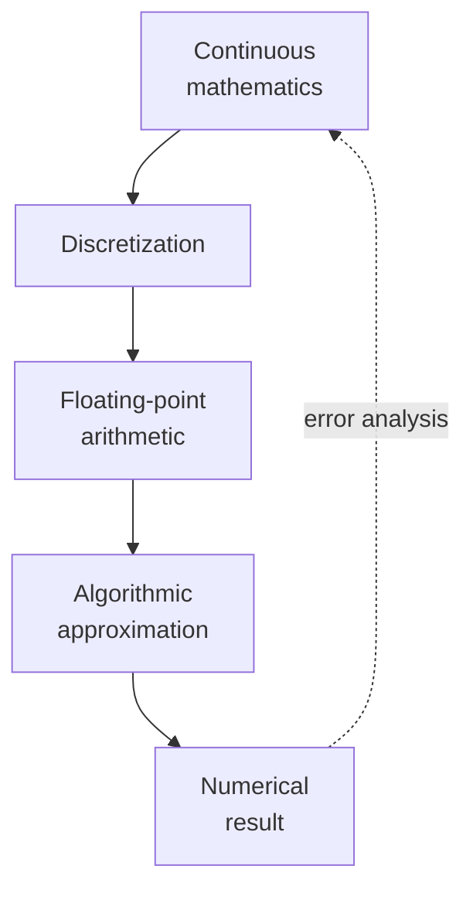
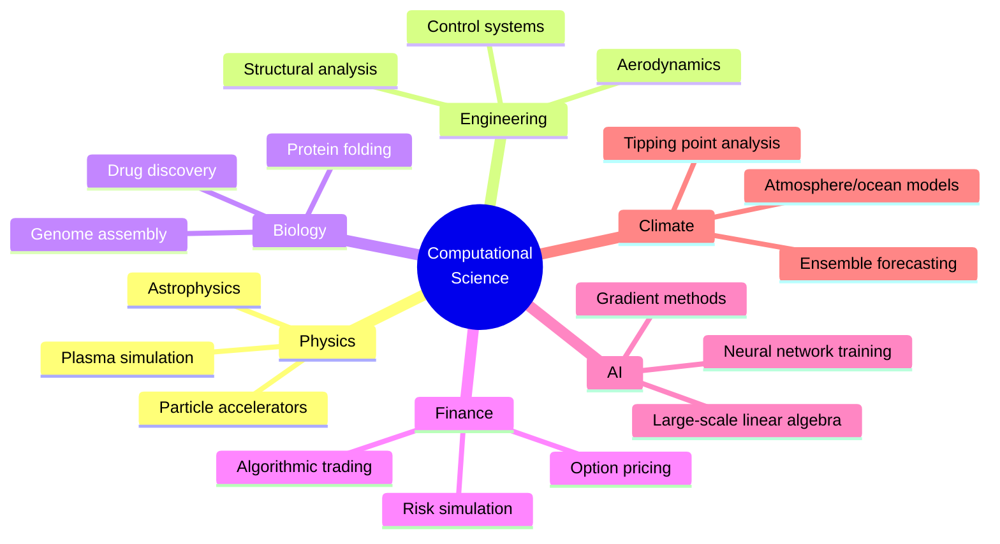

The two story chapters are behind us; this page is the bridge from
*history* into *practice*. It is the one genuinely philosophical page
of the course, and it earns its place because the mindset it builds
underlies everything that follows.

When a mathematician writes $\sin(x)$, they mean an exact, infinitely
precise function defined for every real number. When a Python program
writes `math.sin(x)`, it means an *approximation* of that function,
evaluated at a *finite* number of bits, with a *bounded* error. Those
two `sin`s do not behave the same way, and the gap between them is
where computational science lives.

This page introduces a *mindset*, the conviction that **every number
on a computer is slightly wrong**, and that doing science well means
making the wrongness controllable. The chapters that follow will make
each idea precise; here we just want to internalize the shape of the
problem.

<Figure
  slug="scipy-math-meets-computation-cutout"
  alt="A perfectly smooth continuous curve on one platform beside the same curve rebuilt from discrete stepped blocks"
/>

## Continuous mathematics, discrete machines

Three lossy steps separate mathematics from a number you can print.

<Figure
  slug="scipy-math-meets-computation-continuous-mathematics-discrete-inline-cutout"
  alt="A smooth curve laid over a staircase of small steps that approximates it"
  caption="Continuous mathematics has to be approximated by finite steps."
/>

1. **Discretization.** A continuous quantity, time, space, a wave,
   is replaced by samples on a finite grid.
2. **Floating-point arithmetic.** Each sample is stored in at most
   64 bits, so almost no real number is represented exactly.
3. **Algorithmic approximation.** An infinite series, a derivative,
   an integral is replaced by a finite procedure that converges
   "close enough."

Every chapter in the rest of this course is about understanding the
error introduced by one of these three steps and learning to control
it.

## How wrong is a floating-point number?

A 64-bit IEEE 754 double can represent about $1.8 \times 10^{308}$
distinct positive values, but it cannot represent any of them
exactly between most pairs. The spacing between representable
numbers near $1$ is about $\epsilon \approx 2.22 \times 10^{-16}$,
the famous *machine epsilon*. You will see this number again and
again.

<Figure
  slug="scipy-math-meets-computation-wrong-floating-point-inline-cutout"
  alt="A caliper measuring a tiny gap between a mark and where a block actually sits"
  caption="The stored number is close to the true one, and the gap is the error you carry."
/>

<CodeBlock
  adapter="python"
  files={[
    {
      filename: "main.py",
      starterCode: `import numpy as np
import sys

eps = sys.float_info.epsilon
print(f"Machine epsilon (float64): {eps:.3e}")

# The classic surprise:
a = 0.1 + 0.2
print(f"0.1 + 0.2 = {a!r}")  # not exactly 0.3
print(f"Is it 0.3? {a == 0.3}")

# A subtler surprise: associativity is *not* guaranteed
x = 1e16
print((x + 1) - x)  # 0.0
print(x + (1 - x))  # 1.0
`,
    },
  ]}
/>

In ordinary mathematics, $(x+1) - x$ always equals $1$. In
floating-point, it can equal $0$. **The associative property of
addition does not hold for floating-point numbers.** This single
fact has motivated entire research programs into numerical algorithm
design.

## The contract you sign with finite precision

When you start computing in floating point, you sign an implicit
contract:

> Every elementary operation $\circ$ produces the *correctly
> rounded* result: the true real-number answer, projected to the
> nearest representable float. The relative error of any single
> operation is at most $\epsilon/2$.

This sounds reassuring, and for a *single* operation it is. The
trouble is that long calculations chain millions of operations
together, and the errors interact.

Some interactions are benign:

- **Bounded growth.** If errors of size $\epsilon$ stay of size
  $O(\epsilon)$ after $N$ steps, we call the algorithm *stable*.

Some interactions are catastrophic:

- **Cancellation.** Subtracting two nearly equal numbers can erase
  most of their significant digits in a single step. We saw this
  in the very first chapter.
- **Amplification.** Some operations multiply error by a large
  factor (the *condition number*). A small input error becomes a
  huge output error.

There is a single number that captures how good your *data* needs to
be for a *problem* (not an algorithm, a *problem*) to be solvable at
all: the **condition number**. If a problem has a condition number of
$10^{18}$, then a relative input error of $\epsilon \approx 10^{-16}$
becomes a relative output error of $\epsilon \cdot 10^{18} = 100$,
utterly useless. No clever algorithm can fix this; the *problem*
itself is broken at 64-bit precision. We will meet condition numbers
properly, with runnable examples, in *Numerical Stability and
Conditioning*, for now, just hold onto the idea that some problems
amplify error and some do not, regardless of how you compute.

## Approximation: a finite version of an infinite idea

Almost every "function" in `math` or `numpy` is an approximation.
`math.sin(x)`? A polynomial of about degree 12. `math.exp(x)`?
Argument reduction plus a small Taylor expansion. `math.log(x)`?
A rational approximation of carefully chosen degree.

You can build your own from scratch. Here is a Taylor approximation
of $\sin$ around zero, a sequence of polynomials that converge to
$\sin$ as you add more terms.

<CodeBlock
  adapter="python"
  files={[
    {
      filename: "main.py",
      starterCode: `import math
import matplotlib.pyplot as plt
import numpy as np

def taylor_sin(x, n_terms):
    s, term = 0.0, x
    for k in range(n_terms):
        s += term
        term *= -x * x / ((2 * k + 2) * (2 * k + 3))
    return s

xs = np.linspace(-2 * np.pi, 2 * np.pi, 400)
true = np.sin(xs)

plt.figure(figsize=(9, 4))
plt.plot(xs, true, "k", lw=2, label="true sin(x)")
for n in [2, 4, 6, 10]:
    approx = [taylor_sin(x, n) for x in xs]
    plt.plot(xs, approx, label=f"Taylor, {n} terms")
plt.ylim(-2, 2)
plt.legend()
plt.xlabel("x")
plt.ylabel("sin(x)")
plt.title("Approximating sin(x) with finite Taylor sums")
plt.show()
`,
    },
  ]}
/>

Two lessons fall out of this picture:

- **Convergence is local.** The Taylor series for `sin` converges
  everywhere, but very slowly far from zero. Real libraries use
  *argument reduction* first (reducing $x$ to $[-\pi/4, \pi/4]$) and
  then a low-degree polynomial.
- **More terms is not always better.** Adding terms reduces
  *truncation error* but each additional addition contributes
  *round-off error*. There is always an optimum, and finding it is
  part of numerical analysis.

## The role of computational science in the modern world

Every node on that map runs on the same numerical primitives this
course teaches: floating-point arithmetic, array operations, matrix
factorizations, differential equation integration, optimization, Monte
Carlo sampling,
and reproducible workflows. The application domains look very
different from the outside; from the inside they share an
intellectual core that has barely changed in fifty years.

That core is what the rest of the course is about. From the next
page on, the story stops and the *practice* begins.

## Check your understanding

<MultipleChoice
  markdown={`Which of these is the **most accurate** characterization of how floating-point arithmetic differs from ordinary real-number arithmetic?

- Floating-point uses base 10 internally
  > IEEE 754 uses base 2 (binary) internally; base 10 is the decimal format and is a separate standard (IEEE 754-2008 decimal) that is almost never used in scientific computing.
- Floating-point can only represent integers
  > IEEE 754 floating-point can represent non-integer fractions (as binary fractions in the mantissa); representing only integers is the definition of an integer type, not a float.
- [o] Floating-point operations are individually correctly rounded, but compound operations are not associative and can suffer catastrophic cancellation, so algebraically equivalent expressions can produce different numerical answers
  > Each single op is as accurate as it can be in 53 bits of mantissa, but $(a+b)+c \\neq a+(b+c)$ in general. Two mathematically identical algorithms can produce wildly different numerical results.
- Floating-point arithmetic is slower
  > Floating-point arithmetic is in fact as fast as integer arithmetic on modern CPUs; the fundamental issue is precision and non-associativity, not speed.

This is *the* foundational fact of numerical computing.`}
/>

<MultipleChoice
  markdown={`The condition number $\\kappa(A)$ of a matrix tells you something fundamental about a problem. Which statement best captures what it tells you?

- It measures the symmetry of $A$
  > Symmetry is a structural property (whether $A = A^T$) that is unrelated to the condition number; a symmetric matrix can be well- or ill-conditioned.
- [o] It measures how much a relative input error gets amplified into a relative output error: a problem with $\\kappa = 10^k$ can lose up to $k$ digits of precision regardless of algorithm
  > The condition number is a property of the *problem*, not of the *algorithm*. It puts a fundamental ceiling on accuracy, no clever code can beat it.
- It measures how fast a solver will run
  > Runtime depends on the algorithm, matrix size, and hardware; the condition number measures accuracy potential, not computational speed.
- It measures memory usage
  > Memory usage for a dense $n \\times n$ matrix is $O(n^2)$ regardless of the condition number; the two quantities are unrelated.

When you see $\\kappa(A) = 10^\{15\}$ and you have $\\epsilon \\approx 10^\{-16\}$ of precision, you should expect to keep at most 1 digit of your answer.`}
/>
